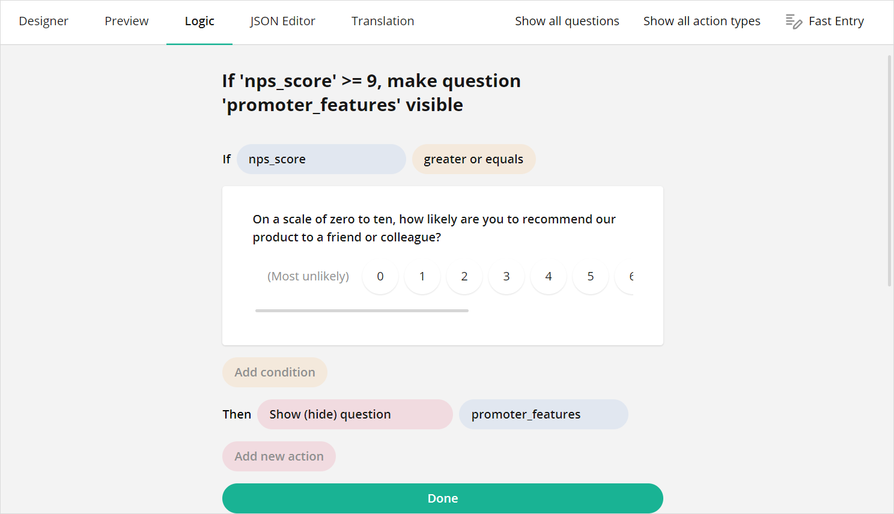
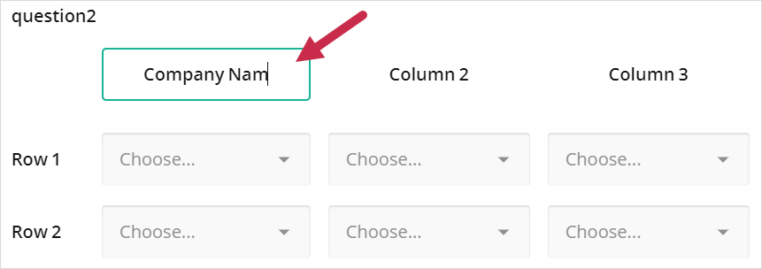
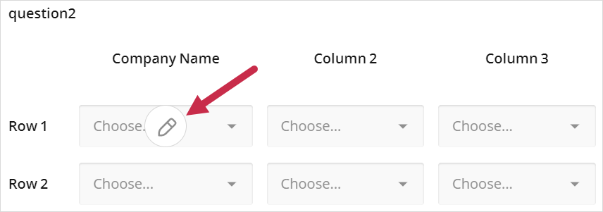
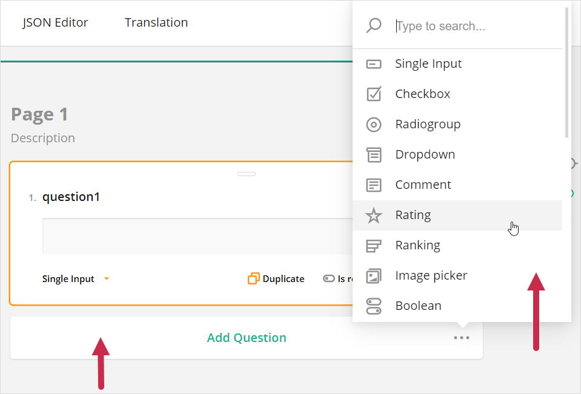
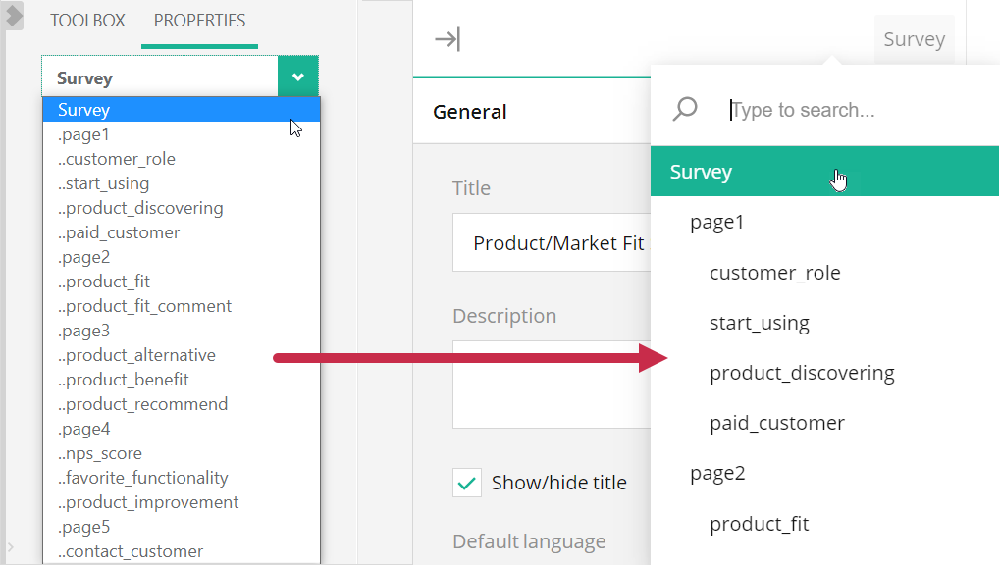
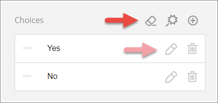

# SurveyJS Creator V2: What's new

Welcome to the major update of SurveyJS Creator. A lot of hard work has been done to release the Creator's new version - Creator V2. There are many benefits in this version that we hope you will like. Some of the key highlights include:  

- [KnockoutJS - complaints got heard](#knockout-complaints)
- [React version developed](#react-version)
- [Major changes in UX/UI](#ui-changes)
  - [Page navigation](#page-navigation)
  - [Action buttons](#action-buttons)
  - [Logic tab](#logic-tab)
  - [Adorners](#adorners)
  - [Element creation](#element-creation)
  - [Element selector](#element-selector)
  - [Toolbox and Property Grid](#toolbox-and-property-grid)
- [Technical changes](#technical-changes)
  - [Modifications made evolutionarily](#modifications-made-evolutionarily)
  - [Changes in SurveyJS Library](#changes-in-surveyjs-library)
  - [Benefits of using SurveyJS elements in Creator](#benefits)
- [Platforms and plans](#platforms-and-plans)

>**Note - Migrate with Ease:**  
Although we have rewritten almost all Creator code in V2, the most of your V1-related code should continue to work.   
If you'd like to learn how to migrate to the new V2 version, refer to [Creator V2 Migration Guide](https://surveyjs.io/Documentation/Survey-Creator?id=Migrate-from-V1-to-V2).  

## KnockoutJS - complaints got heard

From the very beginning of SurveyJS, we used [KnockoutJS](https://knockoutjs.com/) to implement the first version of Creator - Creator V1. And the use of this library was one of the biggest complaint we have received from Creator V1 customers.

### Problem: loss of popularity
[Knockout](https://knockoutjs.com/) is a tiny JavaScript MVVM framework that works great for many scenarios. We chosen it because it works perfectly with all popular web frameworks, it is small and lightweight, and so there was no reason to invent our own MVVM library. However, nowadays [Knockout](https://knockoutjs.com/) seems to lose the battle with the Angular, React and Vue frameworks. [Knockout](https://knockoutjs.com/) becomes a rare choice for JavaScript developers. 

### Problem: eval() function limitation
[Knockout](https://knockoutjs.com/) has limitations. And the biggest one is the use of the [eval()](https://developer.mozilla.org/en-US/docs/Web/JavaScript/Reference/Global_Objects/eval) function in its code. Although it is OK that [Knockout](https://knockoutjs.com/) runs eval() to process templates, it is still quite dangerous to have the `eval()` function in the production code. An incorrect use of the `eval()` by application developers may end up running malicious code on the user's machine. That is why companies usually minimize their security risks (by adding security checks integrated into their DevOps pipelines) and do not allow applications to use the `eval()` function at all. Such security concerns might prevent companies from using third-party JavaScript libraries which have `eval()` function calls inside them.

### Problem: a black box
Another issue with [Knockout](https://knockoutjs.com/) is that it makes SurveyJS Creator a black box for many of our customers who use other client frameworks to develop their applications. Although [Knockout](https://knockoutjs.com/) is still a JavaScript Library, it might not fit well to such JavaScript applications' life cycles.  
It appears that we should provide a better solution for [React](https://reactjs.org/), [Angular](https://angular.io/), and [Vue](https://vuejs.org/) developers.  

### Solution
At the current moment, with the release of SurveyJS Creator V2, we have **Creator for Knockout** and a new **Creator for React**. And we are going to develop versions for [Angular](https://angular.io/) and [Vue](https://vuejs.org/) in the near future.

## React version developed
We are releasing a new platform-specific version of Creator - **SurveyJS Creator for React**. In this version, SurveyJS Creator renders all its elements as React components. You can override the default render of our React components or introduce your own React components.

### Creator library goes React relying on the core Library's concept
We decided to implement the React version of SurveyJS Creator using the same concept that we realized earlier in our main SurveyJS Library. In SurveyJS Library, the main code that implements the Survey Model (we call this code part SurveyJS Core) was for a long time written in a platform-independent way and was separated from the code that renders survey elements in a platform-specific manner (for instance, by using [react components](https://github.com/surveyjs/survey-library/tree/master/src/react) in case of the React version).

We have applied absolutely the same approach in the SurveyJS Creator V2 library. As a result, we now have two code parts in the Creator library: a [platform-independent part](https://github.com/surveyjs/survey-creator/tree/master/packages/survey-creator-core) (Creator Core that implements the Creator's model) and a [React-specific render part](https://github.com/surveyjs/survey-creator/tree/master/packages/survey-creator-react). This solution has two main benefits: from now on we should never duplicate our efforts for every supported platform when we modify logic of the Creator model; and we now deliver our Creator as a React component that can be used as any other typical React component. Moreover, since our Creator for React internally uses our core SurveyJS Library for React, you receive an ability to programmatically integrate any required external React component into both libraries - the Library and the Creator.  
The following examples give practical illustrations of how to use a popular [React Select](https://react-select.com/home) component: [React-Select in SurveyJS Library](https://surveyjs.io/Examples/Library?id=custom-widget-react-select) and [React-Select in SurveyJS Creator](https://surveyjs.io/Examples/Survey-Creator?id=react-select). 

### Not a black box anymore
With V2, SurveyJS Creator for React is not anymore a black box for React developers. You can now override Creator elements and change their render and behavior. Refer to the [Override the Property Grid's React component](https://surveyjs.io/Examples/Survey-Creator?id=overridepropertygrid&platform=ReactjsV2) example to see how to add a new element on top of the Creator's Property Grid.

## Major changes in UX/UI
We have introduced a lot of changes in Creator V2. Actually, we have rewritten almost all code from scratch to make Creator's UI cleaner, more intuitive and adaptive.

### Page navigation improved
We have completely changed the way a user works with surveys that have multiple pages. Instead of displaying pages in horizontally oriented tabs, we now use a Microsoft Word inspired page layout (all pages, one by one) with a vertically oriented page navigator widget.

  
_Page navigator_

<!-- 

  

_Page navigator_

 
-->

 

### Action buttons arranged
Creator actions which are available in different tabs (Designer, Logic, etc.) and elements (such as pages, panels, or questions) are now displayed into one line. You have programmatic access to actions - they are in your full control.

  
_Action buttons_

### Logic tab redesigned
We've fully redesigned the Creator's Logic tab. A logical item can now be created and edited on the same screen.

  
_Editing of a logical item_

A user can filter logical items by questions (to show only items related to a particular question) or by a logical type. Such filtering is useful for complex surveys that have a lot of logical conditions defined.

  
_Filtering of logical items_

### Adorners concept enhanced
We've greatly modified element adorners displayed within pages, panels and questions. Adorners acquire a lot of new functionality.  

With new adorners, users can edit any string element in a survey by simply clicking on the element.

  
_Column title adorner_

Adorners allow users to setup column cell properties directly in the designer.

  
_Setting up column cell properties_

### Element creation made easier
In the designer, users can quickly add new survey elements (such as questions or panels) by clicking the "Add Question" button and by using an ellipses button.

  
_Adding a new question from the designer_

### Element selector modified
We have improved the appearance of the survey element selector. In addition, it now displays the filter box only if the element list contains more than a specific number of elements (ten by default).

  
_Element selector_

### Toolbox and Property Grid re-thought
We have completely modified the design of Creator's Toolbox and Property Grid composite elements. Now they look more user-friendly and better adapt themselves to different layouts.  The Translation tab's contents take improvement as well due to embedding the redesigned Property Grid.

## Technical changes
There are many technical changes that we introduce into our libraries with the release of SurveyJS Creator V2. 

### Modifications made evolutionarily
Going with Creator V2 does not require you to use any separate version of SurveyJS Library that is specifically dedicated to Creator V2. A remarkable notion is that both Creator versions - old (Creator V1) and new (Creator V2) - work with the same version of SurveyJS Library. 

Of course, the development of Creator V2 required us to introduce a lot of new functionality and performance improvements into SurveyJS Library. These changes are due to the fact that the most of UI elements in Creator V2 are SurveyJS Library elements. However, we tried to modify SurveyJS Library gradually, in an evolutional manner, instead of making dramatic revolutionary changes.

In Creator V1, we already used UI elements of SurveyJS Library but in just two places: within the Designer tab (on the design surface) and within the Test tab (where an instance of a survey widget is displayed for testing purposes).

In Creator V2, we have an improved situation. SurveyJS Library elements are now used in a more extensive way - almost everywhere within a Creator UI.

### Changes in SurveyJS Library
Some evolutionary changes in SurveyJS Library are listed below. 

#### Performance improved for multi-page surveys
Previously, SurveyJS Library could render up to 100 questions on one page with a good performance. However, when we started to implement support for Microsoft Word page layout in Creator V2 and tried to display all pages at once, we began to encounter performance issues. For instance, it was a problem to render 40 pages at once if each page contained 25 questions (a total of 1000 questions to render).  

Since we do have customers who develop complex surveys containing more that 1000 questions, we had to resolve such performance issues and reduce the render time (by keeping it below 1 second for large surveys).  

To improve performance, we introduced support for [lazy rendering](https://surveyjs.io/Examples/Library?id=survey-lazy&platform=Reactjs) in our SurveyJS Library. This feature forces a survey to render question skeletons for questions that are not visible on the screen. As a result, we dramatically optimized operation performance in the SurveyJS model.

#### New customizable render of UI elements 
Another big step forward is a change to the way we render element adorners on the Creator's design surface. 

In Creator V1, we used the [after render](https://surveyjs.io/Examples/Library?id=survey-lazy&platform=Reactjs) technique for this purpose. However, for Creator V2, we wanted to create a more effective and reliable solution instead of the necessity to modify DOM elements after their render, which actually looked more like a hack for us.

As a result, we have implemented an alternative render mechanism for SurveyJS Library elements. A developer can now register a new render for UI elements in SurveyJS Library and use a custom render code instead of the default one. This allows us to introduce better support for in-place editing within the Creator's designer. 
For example, to make all our survey strings editable in Creator V2, we just override the default string element rendering with a `DIV` that supports editable content. 

  
_Rating text adorner_

#### Creator elements as SurveyJS Library widgets
In Creator V2, many UI elements are represented by SurveyJS Library elements/widgets, in particular: the Toolbox, Property Grid, element selectors, tabs, a list of logic items in the Logic tab, a list of matrices in the Translation tab, etc. Such Library elements provide out-of-the-box support for better adaptivity and accessibility.  

  
_Toolbox adaptivity_

#### Property Grid rendered as a survey
When we started to write code for the Creator's new Property Grid, we realized that we were going to implement one more widget for data entering. But we already had a widget dedicated to entering data  - this is our SurveyJS by itself. We decided to add some missed functionality to our SurveyJS Library and turn all data-entry widgets in Creator V2 into Survey widgets.  

As a result, the Property Grid in Creator V2 is now a one-page survey (with turned-off page navigation) that contains several [expandable panels](https://surveyjs.io/Examples/Library?id=questiontype-panel). Every property editor is a survey question. To introduce a new or override an existing property editor, you just need to define a custom question JSON and optionally realize several functions that are called by survey events. 
For more details, refer to the [Add a custom property editor for a custom property](https://surveyjs.io/Examples/Survey-Creator?id=custompropertyeditor&platform=ReactjsV2#content-js) example.  
Note that while developing the Property Grid, we have additionally introduced a lot of small improvements in SurveyJS Library, such as [context actions](https://surveyjs.io/Examples/Library?id=survey-titleactions) in question titles and many others.

  
_Context actions in the choices property editor_

#### Logic tab specificities
A matrix form in the Logic tab is represented by a survey question of the dynamic matrix type. It uses a new [detail panel](https://surveyjs.io/Examples/Library?id=questiontype-matrixdynamic-detail) functionality. In the detail panel, we use two dynamic  panels: one to edit conditions and another - to edit logic actions.

<!-- 

  

_Displaying a detail panel in the Logic tab_

 
-->

#### Translation tab specificities
The Translation tab's content is rendered as a survey containing a dropdown matrix question with a column cell type set to comment.
To create a better layout within the Translation tab, we introduced a new auto grow/shrink functionality into the comment question type. A comment automatically changes the number of its rows (and so its height and the height of the entire row in a matrix) depending upon the content entered by a user.
<!-- 
(#image animated gif) 
-->

### Benefits of using SurveyJS elements in Creator
In V2, we are trying to implement Creator UI with the help of SurveyJS Library UI elements in all possible places. We keep the number of custom UI elements developed for Creator to a minimum. To give an example of a custom UI widget that was specifically designed and implemented for Creator V2, the page navigator can be taken.

The greatest benefit of using SurveyJS Library elements in the Creator UI is that you do not need to write their platform-specific render by yourself in Creator. In SurveyJS Library, we already render these elements for all supported platforms, and their render have been tested in thousands web applications of our clients.

Another benefit is that the SurveyJS Library now supports dozens of new scenarios out of the box due to the Creator-specific demands. The massive changes we are introducing into the SurveyJS Library make it more and more feature-rich and impressive in comparison with other competitive solutions.

## Platforms and plans
Currently, we support two platforms in Creator V2: [React](https://reactjs.org/) and [Knockout](https://knockoutjs.com/). If you develop a React application, use Creator for React. For all other platforms, use the Knockout version for the time being. We are working on an [Angular](https://angular.io/) version and we are going to introduce a [Vue](https://vuejs.org/) version later. As soon as we release these versions, you will be able to use them to replace the Knockout version in your Angular and Vue applications.

## How to get Creator V2
If you purchased a commercial license for the SurveyJS Creator or SurveyJS Pro within a year of the Creator V2 release, you can already start using Creator V2.  
If your subscription is over, you can continue to use the old version as long as you wish. To get our latest versions (including Creator V2), you will have to [renewal your subscription](https://surveyjs.io/Buy#surveyjs-updates).
