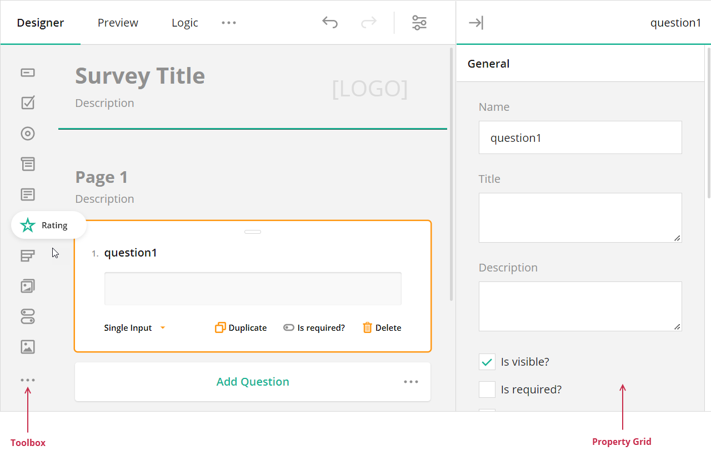
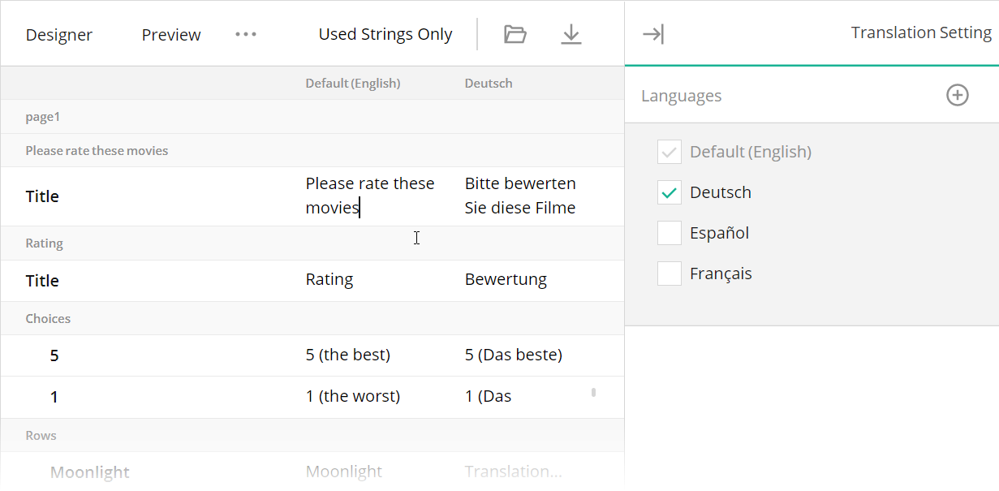
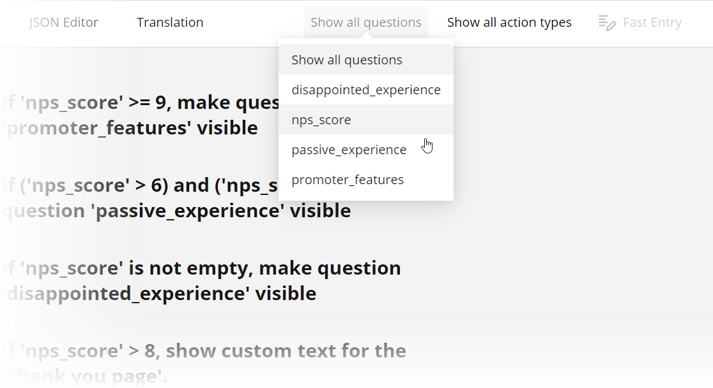

# What's New in Survey Creator V2

This help topic gives a detailed overview of UI, UX, and internal design changes that we introduced into the latest major update of the Survey Creator.

- [Knockout - we addressed your concerns](#knockout---we-addressed-your-concerns)
  - [Issue 1: Use of the `eval()` function](#issue-1-use-of-the-eval-function)
  - [Issue 2: Component as a black box](#issue-2-component-as-a-black-box)
  - [Issue 3: Knockout adoption decline](#issue-3-knockout-adoption-decline)
  - [Solution](#solution)
- [Native Survey Creator for React](#native-survey-creator-for-react)
- [Native Survey Creator for Angular](#native-survey-creator-for-angular)
- [Major UI/UX changes](#major-uiux-changes)
  - [New Toolbox and Property Grid design](#new-toolbox-and-property-grid-design)
  - [Action buttons](#action-buttons)
  - [Page navigation](#page-navigation)
  - [Adorners](#adorners)
  - [Survey element creation](#survey-element-creation)
  - [Survey element selector](#survey-element-selector)
  - [Translation tab](#translation-tab)
  - [Logic tab](#logic-tab)
  - [Preview survey on different devices](#preview-survey-on-different-devices)
- [Technical changes](#technical-changes)
  - [Survey Creator UI elements are surveys](#survey-creator-ui-elements-are-surveys)
  - [Lazy Rendering](#lazy-rendering)
  - [Alternative Rendering for Adorners](#alternative-rendering-for-adorners)
- [Native Survey Creator for Vue (Planned)](#native-survey-creator-for-vue-planned)
- [Migration to the New Survey Creator](#migration-to-the-new-survey-creator)

<a id="knockout-complaints"></a>

## Knockout - we addressed your concerns

Survey Creator V1 depended on [Knockout](https://knockoutjs.com/). This fact was one of the most frequent concerns we heard from our customers. Indeed, the dependency raised the following important issues. 

### Issue 1: Use of the `eval()` function

Knockout uses the [eval()](https://developer.mozilla.org/en-US/docs/Web/JavaScript/Reference/Global_Objects/eval) function to process templates. This fact opens a possibility of running malicious code on the user's machine if an application developer forgets to sanitize the template code. Such security risks might prevent companies from using Knockout and, therefore, SurveyJS.

### Issue 2: Component as a black box

Although Survey Creator for Knockout included a rich API, the component was perceived by Angular, Vue, and React developers as a black box that in many cases did not fit well into the application lifecycle. 

### Issue 3: Knockout adoption decline

Knockout enriches a pure JavaScript application with features like templates, declarative binding, and automatic UI updates. It was very popular when SurveyJS development started back in 2015. However, with the advent of more powerful front-end frameworks (Angular, Vue, React), Knockout popularity started to decline. Nowadays, JavaScript developers rarely use Knockout in new projects.

### Solution

The new Survey Creator introduces a native implementation for React and Angular (more on this below). An similar implementation for Vue is planned for future development. For those customers who still use Knockout in their applications, we also ship an updated Survey Creator for Knockout with new look and feel that matches the React version.

<a id="react-version"></a>

## Native Survey Creator for React

New Survey Creator for React is a composition of true React components. The native implementation became possible because we separated the platform-independent model code (now distributed as the [`survey-creator-core`](https://github.com/surveyjs/survey-creator/tree/master/packages/survey-creator-core) package) from the platform-specific rendering code (the [`survey-creator-react`](https://github.com/surveyjs/survey-creator/tree/master/packages/survey-creator-react) package). You can override the default rendering functions of our React components and integrate your own React components (view the [Override the Property Grid Component](https://surveyjs.io/Examples/Survey-Creator?id=overridepropertygrid&platform=ReactjsV2) example). We implemented the same concept in the SurveyJS Form Library earlier.

Most of the UI elements in the new Survey Creator (Property Grid, Translation and Logic Tabs, modal editors) are stylized surveys from our own SurveyJS Form Library for React. This feature allows you to integrate any 3rd-party React component into the SurveyJS Form Library and then reuse the same configuration to integrate the component into the Survey Creator. View examples that show how to integrate the [React Select](https://react-select.com/home) component [into a standalone survey](https://surveyjs.io/Examples/Library?id=custom-widget-react-select) or [into the Survey Creator](https://surveyjs.io/Examples/Survey-Creator?id=react-select).

## Native Survey Creator for Angular and Vue 3

In November 2022, we also introduced a native implementation of Survey Creator for Angular. A year later, in November 2023, Survey Creator for Vue 3 followed. Framework-specific rendering code is distributed as the [`survey-creator-angular`](https://github.com/surveyjs/survey-creator/tree/master/packages/survey-creator-angular) and [`survey-creator-vue`](https://github.com/surveyjs/survey-creator/tree/master/packages/survey-creator-vue) npm packages. They should be used along with the [`survey-creator-core`](https://github.com/surveyjs/survey-creator/tree/master/packages/survey-creator-core) package, which contains platform-independent code. Refer to the following tutorials to get started with the native Survey Creator implementations:

[Add Survey Creator to an Angular Application](https://surveyjs.io/survey-creator/documentation/get-started-angular (linkStyle))

[Add Survey Creator to a Vue 3 Application](https://surveyjs.io/survey-creator/documentation/get-started-vue#add-survey-creator-to-a-vue-3-application (linkStyle))

<a id="ui-changes"></a>

## Major UI/UX changes

We redesigned most parts of the Survey Creator to make its UI more adaptive and UX more intuitive. Refer to new feature descriptions in this section for details.

<a id="toolbox-and-property-grid"></a>

### New Toolbox and Property Grid design

Re-designed Toolbox and Property Grid look modern and adapt themselves to different layouts.



<a id="action-buttons"></a> 

### Action buttons

We now display action buttons within their corresponding questions (instead of above the questions). Programmatic access to the buttons is now possible.


If you click the button that changes the question type, you will see a drop-down list of all supported types. In Survey Creator V1, this list was limited to the types that were interchangeable with the current element type. With the full list, you can now add multiple default questions to the survey to specify their types afterwards.


If you switch between non-interchangeable question types, the question configuration may be lost. Use Undo and Redo buttons to roll back or reinstate the previous configuration. Alternatively, you can revert to old behavior. Use the following code to limit the list to interchangeable types only:

```js
SurveyCreator.settings.questionConvertMode = 1;
```

<a id="page-navigation"></a>

### Page navigation

Previously, users configured each survey page in an individual tab. In the new Survey Creator, pages are displayed one under another. To reach a certain page, users can scroll the design surface or select the page in the page navigator.


<a id="adorners"></a>

### Adorners

Adorners are design-surface controls for survey element manipulation. In the new Survey Creator, adorners allow users to edit text inline.


Adorners also implement the capability to change column cell properties directly in the designer.


<a id="element-creation"></a>

### Survey element creation

In the designer, users can click Add Question to quickly add new survey elements. The ellipsis button allows users to select the type of new questions.


<a id="element-selector"></a>

### Survey element selector

The survey element selector now displays the survey structure as a tree. In addition, users can use the search box to filter elements. The search box appears if the element list contains more than 10 items.


<a id="translation-tab"></a>

### Translation tab

Previously, the Translation tab had individually-designed layout and controls. In the new Survey Creator, this tab displays our own survey component with Matrix questions. In addition, the Translation tab now includes a Property Grid that allows users to select required languages.



<a id="logic-tab"></a>

### Logic tab

Users can now create and edit logic rules within the same view.


We also added the capability to filter rules by questions or action types. This capability is useful for surveys with complex logic.



<a id="test-tab"></a>

### Preview survey on different devices

We renamed the Test Survey tab to Preview and added a device selector that allows users to preview the created survey on most popular devices.


<a id="technical-changes"></a>

## Technical changes

### Survey Creator UI elements are surveys

In the new Survey Creator, we use our own SurveyJS Form Library to render most of the UI elements. The main benefit of this approach is that we didn't have to implement native rendering because the SurveyJS Form Library already supports it for all frameworks.

This new internal design also prompted us to extend the Library with new features used in the Survey Creator. For example, question titles can now contain [context actions](https://surveyjs.io/Examples/Library?id=survey-titleactions), and [Comment](https://surveyjs.io/Documentation/Library?id=questioncommentmodel) questions can [automatically grow or shrink](https://surveyjs.io/Documentation/Library?id=questioncommentmodel#autoGrow) the input field to accommodate the content.

Since Survey Creator UI elements are surveys, you can customize them as you would customize surveys. For example, the Property Grid is a one-page survey in which every property is a question. To introduce a new or override an existing property editor, you need to define a custom question JSON configuration and implement functions that survey events call internally.

[View Demo](https://surveyjs.io/survey-creator/examples/customize-property-editors/reactjs#content-code (linkStyle))

### Lazy Rendering

To improve performance on large multi-page surveys, we introduce support for Lazy Rendering to our SurveyJS Form Library. This feature allows the survey to render questions outside the viewport as skeletons instead of rendering them in full.

[View Demo](https://surveyjs.io/Examples/Library?id=survey-lazy (linkStyle))

### Alternative Rendering for Adorners

Previously, we used to render survey elements first, and only then added [adorners](https://surveyjs.io/Documentation/Survey-Creator?id=survey-customization#specify-adorner-availability). This wasn't a very effective solution because we modified the DOM twice. The new version only modifies the DOM once and adds adorners right away. This was made possible because the new Survey Creator allows you to register new element rendering functions that override the default functions. For example, to implement in-place text editing in the Designer, we render an element that supports editable content instead of the default string element.

<a id="platforms-and-plans"></a>

## Migration to the New Survey Creator

If you already have a [commercial license](https://surveyjs.io/Licenses#SurveyCreator) for the Survey Creator or a [SurveyJS Pro subscription](https://surveyjs.io/Home/Buy?#surveyjs-products), and you purchased them within a year of the new Survey Creator release, then you can migrate to the new version now without additional payment.

If your subscription has ended, you can continue using the old Survey Creator version as long as you wish. To upgrade to the latest SurveyJS releases that include the new Survey Creator, [renew your subscription](https://surveyjs.io/Buy#surveyjs-updates).

Refer to the following help topic for information on how to migrate from Survey Creator V1 to V2: [Migration from Survey Creator V1 to V2](https://surveyjs.io/Documentation/Survey-Creator?id=Migrate-from-V1-to-V2).