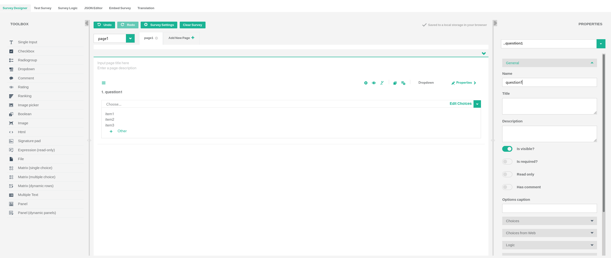
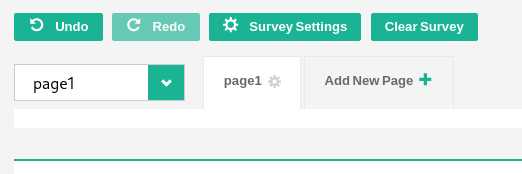
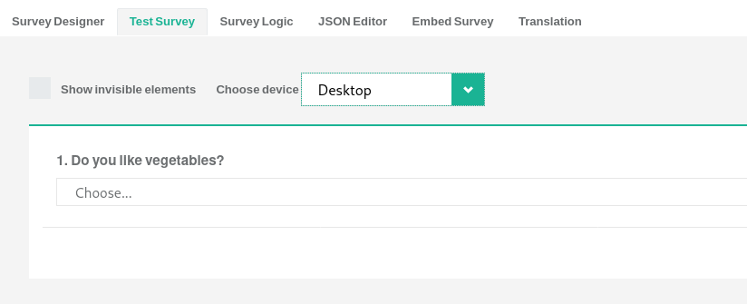
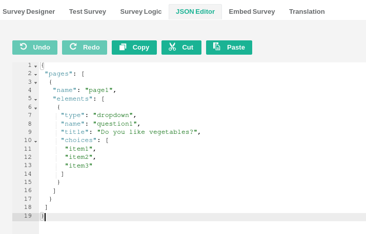
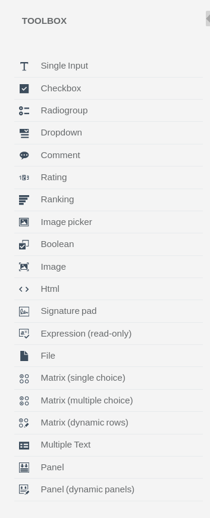

# SurveyJS Creator

This page has been prepared as a starting point for documentation aimed at end-users of SurveyJS.

## Basic Overview/Quick Start Guide

The SurveyJS [Survey Creator](https://surveyjs.io/create-survey) page contains the survey design area with the Toolbox to the left and the Properties window to the right.

Survey elements (such as questions or panels) can be dragged from the toolbox onto the main design page (questions area). Once these elements are in questions area, they can be modified, edited and reordered to suit the needs of a specific survey. You can add pages to your survey by clicking the drop down menu at the top left of the page.

Detailed properties for the overall survey and each individual element can be accessed and edited by clicking the `Properties` tab to the right of the page. Ordering and reordering of each survey element can be done by dragging the `hamburger` glyph (three horizontal lines) to the top left of each element.

Once you have designed your survey you can test it by clicking the `Test Survey` link at the top left of the page. There you will be able to choose the target device for your test (for example, if you are going to deliver the survey via iPad, choose `iPad` from the drop-down list).

If you need to develop the survey in more detail via the JSON file format, you can access an editor via the `JSON Editor` link at the top of the page.

## Adorners

Each toolbox item will have its own configuration panel once it is placed into the Survey Creator. This panel contains a set of ``adorners``. Using adorners, you will be able to move and re-order the item using the ``hamburger`` button (three horizontal lines), delete the item using the ``cross`` button, toggle the item's visibility using the ``eye`` button, ``duplicate`` the item, ``add`` the item to the toolbox, see the item's ``mode`` and edit the items ``properties``. You may also set the item's ``required`` status if the tool allows it.

## Individual Toolbox Elements

### Single Input

Single Input allows you to ask a simple question or request a non-predetermined input from a respondent. A single line is presented to the respondent for text input. There are no limits on the possible input so the respondent may enter any text and any amount of text.

### Checkbox

Checkbox allows for multiple questions or items to be asked of a respondent. The Checkbox question presents the survey respondent with a list of items with a checkbox next to each. Ticking the checkbox chooses that item. Multiple items can be checked and only those checked are recorded in the survey.

### Radiogroup

Radiogroup allows for multiple questions or items to be asked of a respondent. The respondent is presented with a list of items with a radio button next to each. Only one item may be selected from this list and only the selected item will be recorded in the survey.

### Dropdown 

A respondent is presented with a drop-down list of items. Only one of these items can be selected, and only the selected item will be recorded in the survey.

### Comment

The Comment survey element asks for a non-predetermined input from a respondent. A text box is presented to the respondent. There are no limits on the possible input so the respondent may enter any text and any amount of text.

### Rating

The Rating survey element asks a respondent to choose a number across the range presented. Only one value may be selected and only the selected value will be recorded in the survey.

### Ranking 

A respondent is presented with a list of items that can be rearranged according to rank or preference. The items are rearranged by dragging the items on the page. The final rank or order of all items is recorded in the survey.

### Image picker

A respondent is presented with a series of images. One of these images can be selected and only the value associated with that image will be recorded in the survey.

### Boolean

The Boolean survey element presents a respondent with a yes or no answer. The respondent's response will be recorded in the survey as `true` (yes) or `false` (no).

### Image

The Image survey element allows an image to be uploaded or linked into the survey. There is no associated value in relation to the survey.

### HTML

The HTML survey element enables HTML to be added to the survey allowing for diverse formatting for text, paragraphs and the inclusion of links and images. There is no associated value in relation to the survey.

### Signature Pad

The Signature Pad survey element allows respondent input to be directly drawn on screen in a pre-set box or area. This is typically used to obtain a signature from the respondent, however it could be used to obtain any hand-drawn input. The size of the box presented to the respondent may be changed by clicking on the `Properties` tab. The color of the pen and background can also be changed. The input from the respondent is recorded in the survey in the following file formats: JPEG, PNG or SVG. This file format may be changed in the `Properties` tab.

### Expression

The Expression survey element allows for data and calculations to be presented to a respondent. For example, this element provides functionality for adding up the scores of previous question responses, showing the current date and time for the participant. Configuration is available via the ``Properties`` tab; click ``General`` then edit the ``Expression`` text box. Examples are given:

- {question1}+{question2}
- ({price}\*{quantity})\*(100 - {discount})
- today()
- age()
- min()
- max()
- count()
- avg()
- iif()

### File

The File survey element presents a button to a respondent requesting that a file is uploaded. When the respondent presses the ``Choose File`` button, an upload file dialogue will launch within a web browser. Many details can be specified via the `Properties` tab such as maximum file size, multiple uploads, accepted file formats as well as preview area. The file(s) uploaded via the File element will be recorded/retained in the survey. File formats are restricted by a comma-separated list of file extensions including periods e.g.: `.jpg`,`.pdf`,`.png`. The uploaded file is recorded in the survey. **For security, it is important that you strictly specify the file formats that are allowed to be uploaded into the survey**.

### Matrix (Single Choice)

The Matrix (Single Choice) survey element allows for an array of radio buttons to be presented to a respondent in rows and columns. The amount of rows and columns can be adjusted, however only one item per row can be selected. Names of rows and columns can be edited via the `Properties` tab: Click `Columns` and then `Fast Entry` to type these in. The order that rows are presented to the respondent can be set to `random` or `initial` (the latter will sort rows alphabetically by the first letter). Only radio buttons that have been selected will be recorded in the survey.

### Matrix (Multiple Choice)

The Matrix (Multiple Choice) survey element presents a survey respondent with an array of columns and rows. Each cell of the array can be configured with a list of selectable items. These selectable items can be presented to the respondent through the following cell types:

- Dropdown
- Checkbox
- Radiogroup
- Single Input
- Comment
- Boolean
- Expression
- Rating

(Please see above for descriptions of these types of interaction)
Cell type can be changed via the `Properties` tab. The amount of columns and rows, the title of rows and the value of the selectable item can also be edited via the `Properties` tab. Click `Rows` and `Fast Entry` to name each row. Click `Choices` and `Fast Entry` to edit the item/value. To hide the name of each column, click `Layout` and uncheck `Show Header`. Click `Data` to set the `Default Value` for each cell and a `Correct Answer` if desired. The respondent makes a selection and this is recorded in the survey according to three values: Row, Column and Item/value. Only those selected are recorded in the survey.

### Matrix (Dynamic Rows)

The Matrix (Dynamic Rows) survey element contains the same functionality as the Matrix (Multiple Choice) element above, but adds a dynamic element that is controlled by a survey respondent. Respondents can ``add`` or ``remove rows`` according to their needs. Please see the overview for the Matrix (Multiple Choice) element above for more detail about configuring this element. 

### Multiple Text

The Multiple Text survey element allows for a respondent to input multiple single line inputs. See 'Single Input' above for a basic description. Multiple Text presents a stacked series of Single Input entries. The `Properties` tab allows for configuration of the default value of each field (is the text field empty or does it have pre-filled text?), the amount of columns used to display the text fields as well as the overall amount of text fields/items. Only the entries that have input from the respondent are recorded in the survey.

### Panel

The Panel survey element serves as a box or container that can include multiple questions and sub-panels.

### Panel (Dynamic Panels)

The Panel (Dynamic Panels) survey element allows you to create a template box or container that can include multiple questions and input types. This template is activated when a respondent actively clicks `Add New` in the survey. The respondent can activate any number of these templates by repeatedly clicking `Add New`.
