# End-User Documentation for Survey Creator

This document illustrates how to perform basic tasks in the Survey Creator component. The component's UI is organized in multiple tabs. Each section in this document describes an individual tab.

<map name="tabs-map">
    <area alt="Designer Tab" title="Designer Tab" href="#designer-tab" coords="10,67,140,135" shape="rect">
    <area alt="Preview Tab" title="Preview Tab" href="#preview-tab" coords="152,68,274,135" shape="rect">
    <area alt="Logic Tab" title="Logic Tab" href="#logic-tab" coords="282,68,392,135" shape="rect">
    <area alt="JSON Editor Tab" title="JSON Editor Tab" href="#json-editor-tab" coords="398,67,545,135" shape="rect">
    <area alt="Translation Tab" title="Translation Tab" href="#translation-tab" coords="561,68,713,136" shape="rect">
</map>

- [Designer Tab](#designer-tab)
  - [Question and Panel Types](#question-and-panel-types)
    - [Single Input](#single-input)
    - [Checkbox](#checkbox)
    - [Radiogroup](#radiogroup)
    - [Dropdown](#dropdown)
    - [Comment](#comment)
    - [Rating](#rating)
    - [Ranking](#ranking)
    - [Image Picker](#image-picker)
    - [Boolean](#boolean)
    - [Image](#image)
    - [HTML](#html)
    - [Signature Pad](#signature-pad)
    - [Expression](#expression)
    - [File](#file)
    - [Single-Choice Matrix](#single-choice-matrix)
    - [Multiple-Choice Matrix](#multiple-choice-matrix)
    - [Dynamic Matrix](#dynamic-matrix)
    - [Multiple Text](#multiple-text)
    - [Panel](#panel)
    - [Dynamic Panel](#dynamic-panel)
  - [Adorners](#adorners)
  - [How to: Add a question to the survey](#how-to-add-a-question-to-the-survey)
  - [How to: Add a page to the survey](#how-to-add-a-page-to-the-survey)
  - [How to: Change the question type](#how-to-change-the-question-type)
  - [How to: Clear the survey](#how-to-clear-the-survey)
- [Preview Tab](#preview-tab)
  - [How to: Re-run the preview](#how-to-re-run-the-preview)
  - [How to: Preview the survey on different devices](#how-to-preview-the-survey-on-different-devices)
- [Logic Tab](#logic-tab)
  - [How to: Add a new rule](#how-to-add-a-new-rule)
  - [How to: Edit a rule](#how-to-edit-a-rule)
  - [How to: Filter rules](#how-to-filter-rules)
- [JSON Editor Tab](#json-editor-tab)
- [Translation Tab](#translation-tab)
  - [How to: Add another language](#how-to-add-another-language)
  - [How to: Filter translation strings](#how-to-filter-translation-strings)
  - [How to: Import or export translation strings to CSV](#how-to-import-or-export-translation-strings-to-csv)

## Designer Tab

The Designer tab allows you to configure your survey. You can drag and drop questions and panels from the Toolbox onto the design surface and then use the Property Grid to change the question, panel, and survey settings.

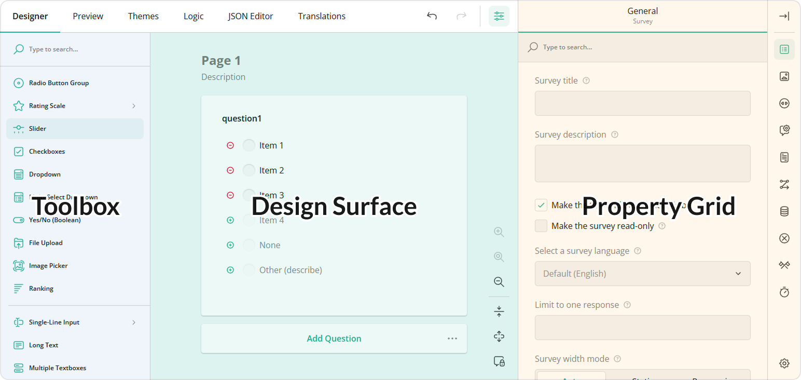

### Question and Panel Types

The Toolbox contains the question and panel types described below.

#### Single Input

Respondents enter their answer into a single-line text editor. Use the Single Input type for open-ended questions that require short answers.

See also:

- [Comment](#comment)
- [Multiple Text](#multiple-text)

#### Checkbox

Respondents click one or several checkboxes to select answers. Use the Checkbox type for questions that accept multiple answers.

#### Radiogroup

Respondents use radio buttons to select a single answer. Use the Radiogroup type for questions that can have multiple options but accept only one answer.

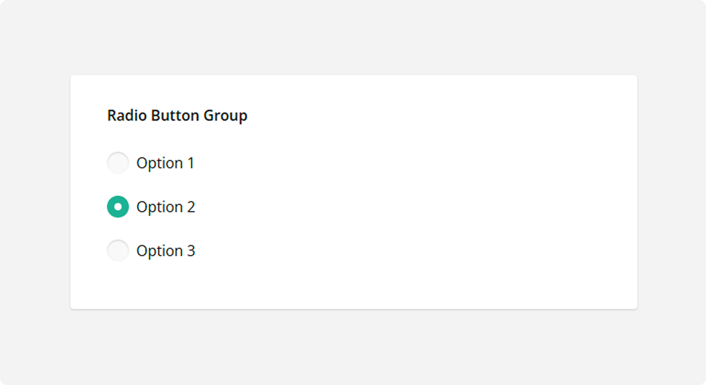

See also: [Dropdown](#dropdown)

#### Dropdown 

Respondents select a single answer from a drop-down list. Like [Radiogroup](#radiogroup), the Dropdown type can be used for questions that have multiple options but accept only one answer. However, the Dropdown UI can display more options while occupying less screen space.

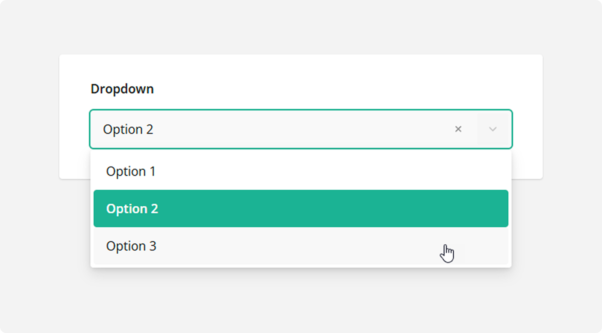

#### Comment

Respondents enter their lengthy answer into a resizable multi-line text area. Use the Comment type for open-ended questions that accept multi-line answers.

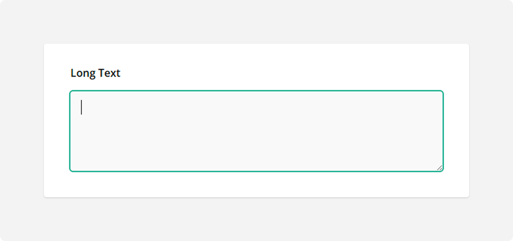

See also:

- [Single Input](#single-input)
- [Multiple Text](#multiple-text)

#### Rating

Respondents select one number within a range. Use the Rating type when you want respondents to enter a rating.

#### Ranking 

Respondents drag and drop items from a list to rearrange them according to rank or preference. Use the Ranking type for questions in which respondents must set the order of items.

#### Image Picker

Respondents select one or several images or videos from a series. A value associated with this image or video is saved to the survey results.

- How to: Associate values with images or videos          
Expand the **Choices** category and enter the values in the **Choices** table:

    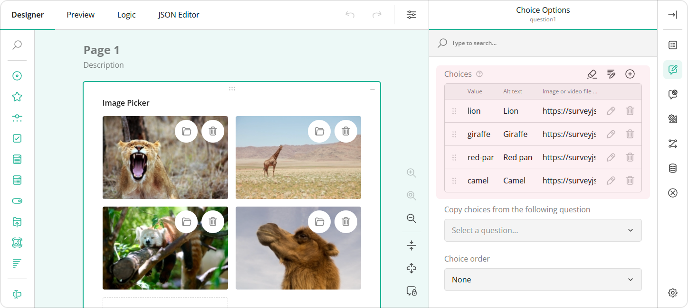

- How to: Enable multiple image or video selection           
Expand the **General** category and select **Allow multiple selection**:

    

#### Boolean

Respondents switch a Boolean editor to Yes or No. The response is saved in the survey results as `true` for Yes or `false` for No.

#### Image

Use the Image type to add an image or video to the survey. This type is used for presentation only and does not produce a value to be saved in the survey results.

#### HTML

Use the HTML type to format text as needed, include links, and insert media or other custom elements into the survey. This type is used for presentation only and does not produce a value to be saved in the survey results. Be aware that HTML content can be vulnerable to security breaches. Ensure that the links you insert lead to trusted resources.

#### Signature Pad

Respondents use mouse or touch gestures to draw their signature within the allocated input area. Use this type to obtain the respondent's signature or any hand-drawn input.

- How to: Resize the allocated area         
Expand the **General** category and change the **Width** and **Height** values:

    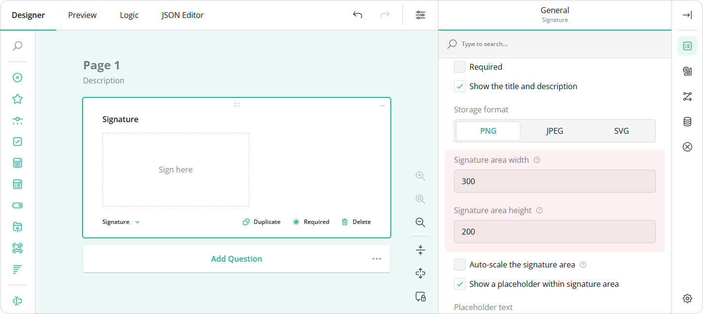

- How to: Change the image format        
The respondent's input is saved as a base64-encoded image in one of the following formats: PNG, JPEG, SVG. To select the desired format, use the **Image format** drop-down menu in the **General** category:

    

- How to: Change the pen color          
Expand the **General** category and select the desired color from the **Pen color** drop-down menu:

    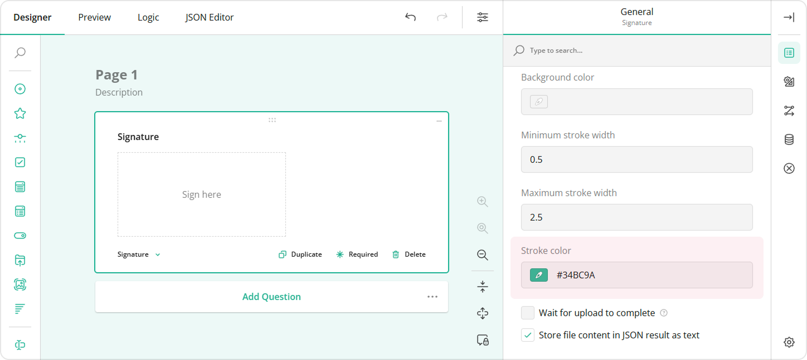

#### Expression

Use the Expression type to calculate values and present them to respondents. For example, you can sum up the scores of previous responses, display current date and time, or find an average value. The calculated value is saved in the survey results. In the following image, the Expression type concatenates the first and last names to display a full name:

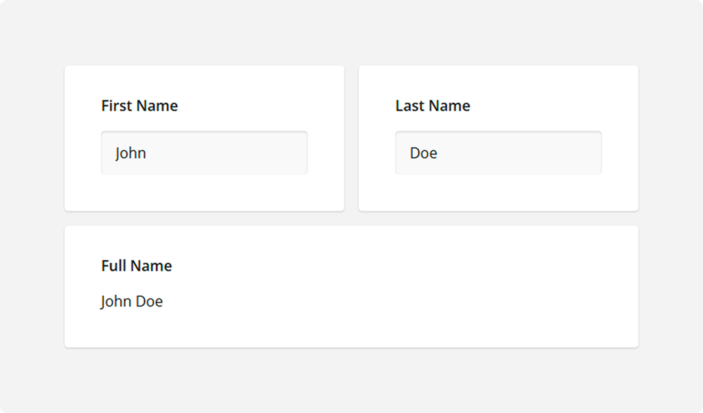

To specify an expression, enter it into the **Expression** field in the **General** category. Your expression can reference other survey questions (for example, `{question1} + {question2}`) or use built-in calculation functions. Refer to the following help topics for more information:

- [Boolean Expressions](https://surveyjs.io/Documentation/Library#boolean-expressions)
- [Built-In Functions](https://surveyjs.io/Documentation/Library#built-in-functions)

#### File

Use the File type to allow respondents to upload files. Respondents drag and drop one or several files onto the allocated area or select files in the browser's Upload File dialog window. The uploaded files are saved in the survey results as base64-encoded strings.

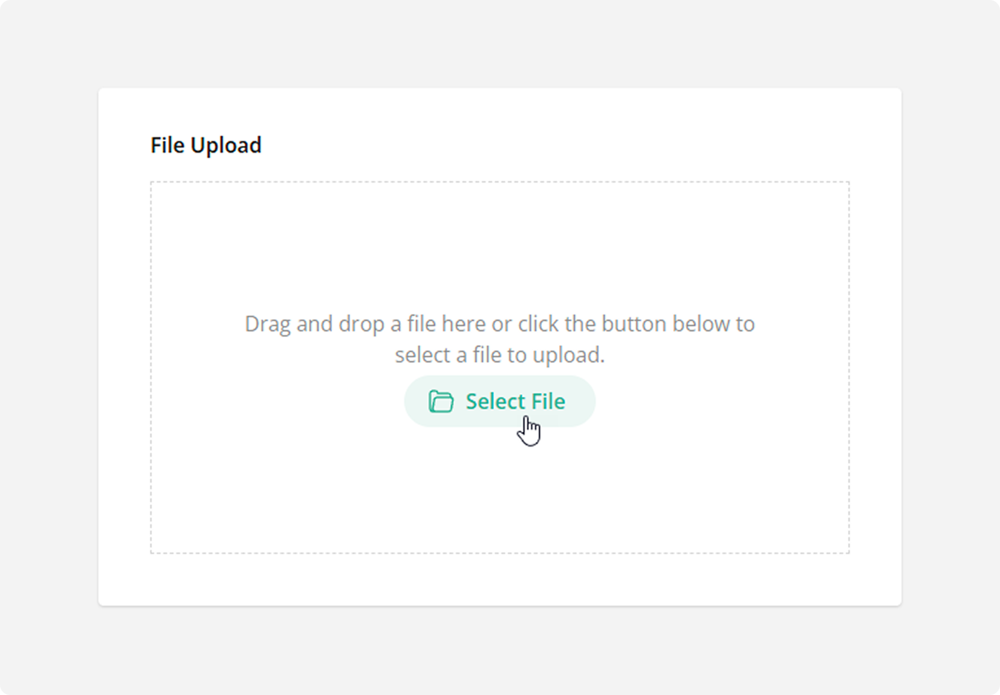

- How to: Restrict uploaded file types          
The File type is built upon the standard `<input type="file">` HTML element. To restrict file types, the standard element uses the <a href="https://www.w3schools.com/tags/att_input_accept.asp" target="_blank">`accept`</a> attribute. Enter its value into the **Accepted file types** field in the **General** category:

    

> Always restrict the allowed file types to prevent possible security vulnerabilities. 

- How to: Enable multiple file selection           
Expand the **General** category and select **Allow multiple files**:

    

#### Single-Choice Matrix

The Single-Choice Matrix type displays radio buttons in rows and columns. Respondents can select only one radio button in each row.

- How to: Add new rows          
Expand the **Rows** category and click **Add New**:

    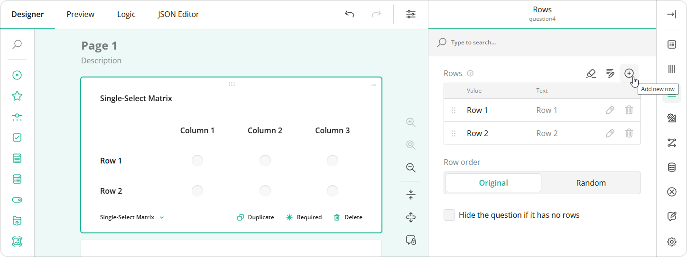

- How to: Randomize rows        
Expand the **Rows** category, find the **Row order** editor, and switch it to *Random*:

    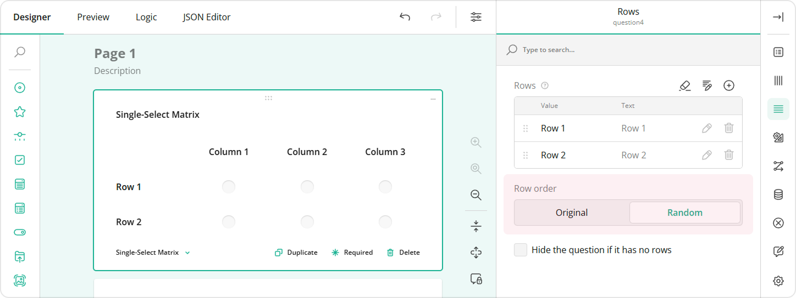

See also:

- [Multiple-Choice Matrix](#multiple-choice-matrix)
- [Dynamic Matrix](#dynamic-matrix)

#### Multiple-Choice Matrix

The Multiple-Choice Matrix type displays rows and columns. At their intersections, the matrix can display the following editors:

- [Dropdown](#dropdown)
- [Checkbox](#checkbox)
- [Radiogroup](#radiogroup)
- [Single Input](#single-input)
- [Comment](#comment)
- [Boolean](#boolean)
- [Expression](#expression)
- [Rating](#rating)

Respondents use these editors to select a desired value in each cell. The following image illustrates the Multiple-Choice Matrix type with the default Dropdown editors: 

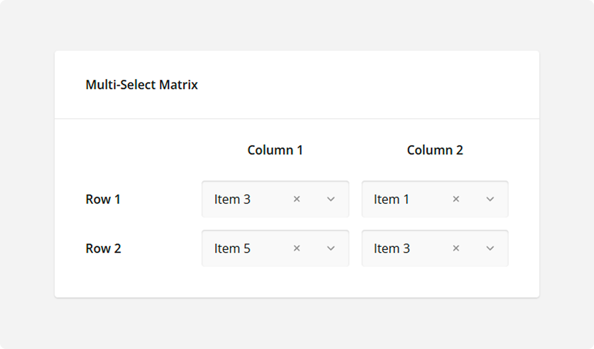

- How to: Change the editor type         
Expand the **General** category and select the desired editor type from the **Cell type** drop-down menu:

    

See also:

- [Single-Choice Matrix](#single-choice-matrix)
- [Dynamic Matrix](#dynamic-matrix)

#### Dynamic Matrix

The Dynamic Matrix type is similar to a [Multiple-Choice Matrix](#multiple-choice-matrix), but respondents can add and remove matrix rows.

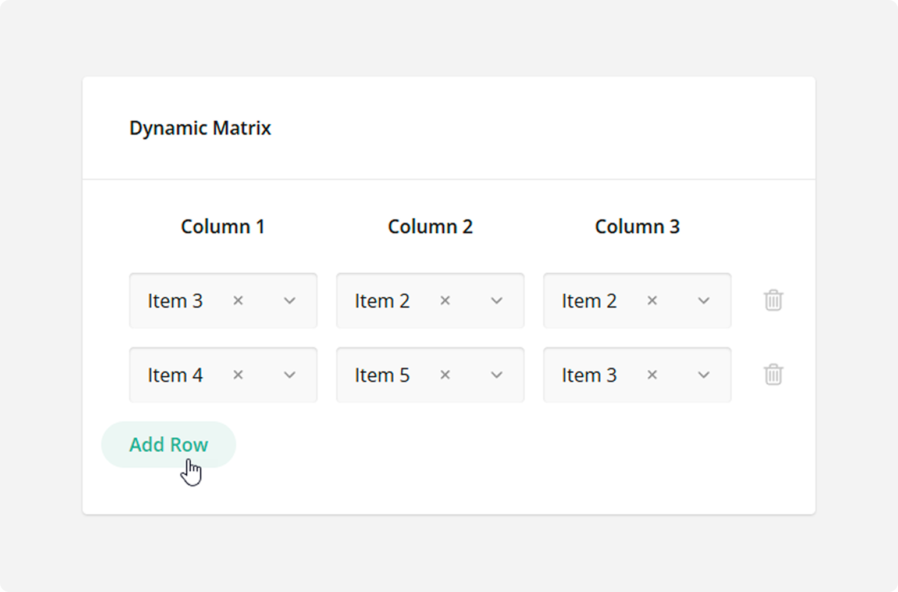

#### Multiple Text

Respondents enter their answers into multiple single-line text editors. Use the Multiple Text type for open-ended questions that require more than one short answer.

- How to: Specify default answers           
Expand the **Data** category and click **Set Default Answer** to open the Default Answer pop-up window. Enter the default answers into the text editors and click **Apply**:

    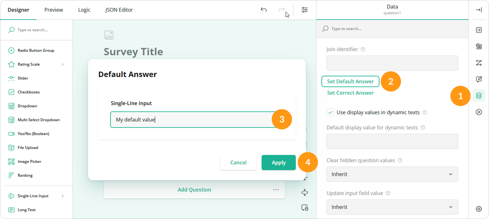

#### Panel

The Panel type is a container for other questions and panels. Use this type to group several questions or panels and control them all together.

#### Dynamic Panel

The Dynamic Panel type is a template panel that can contain multiple questions. Respondents can add and remove panels based on the template.

### Adorners

Adorners are design-surface controls for survey element manipulation. Use adorners to edit UI text in place, reorder choices, duplicate and delete elements, specify whether an answer is required, and perform other actions on survey elements. Settings that you specify using adorners are synchronized with settings in the Property Grid, and vice versa.

Each element type has an associated set of adorners. The following image highlights adorners for a [Dropdown](#dropdown) question:

### How to: Add a question to the survey

Drag and drop the desired question type from the Toolbox onto the design surface. Alternatively, you can click the **Add Question** button to add a [Single Input](#single-input) question. This button also displays an ellipsis icon that allows you to change the type of inserted questions.

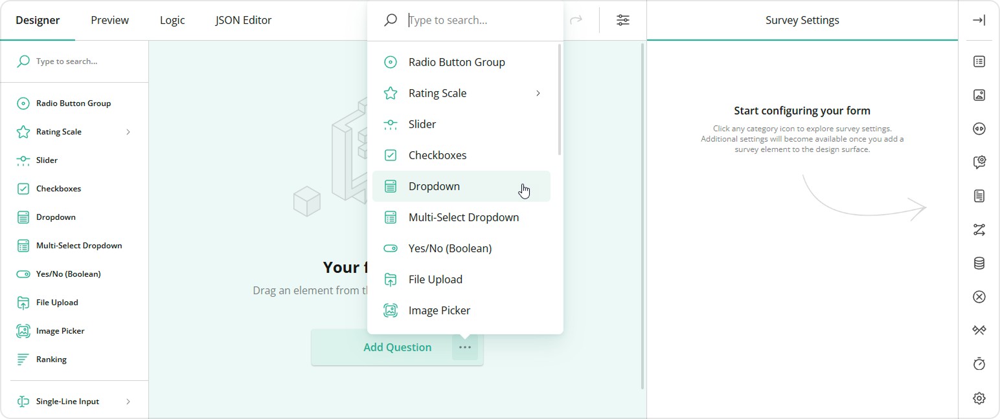

### How to: Add a page to the survey

In the Property Grid, select **Survey**, expand the **Pages** category, and click the **Add New** button in the **Pages** editor:

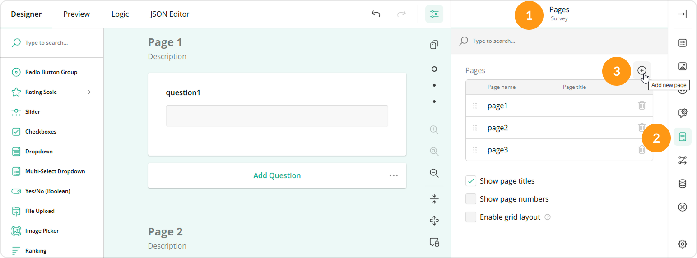

Alternatively, you can add a page on the design surface. The surface displays the skeleton of a new page at the bottom. To add a new page, you need to [add a question to it](#how-to-add-a-question-to-the-survey).

### How to: Change the question type

Use the element type selector in the question:

Some question types are non-interchangeable. For example, a [Dropdown](#dropdown) question supports choices, while [Single Input](#single-input) does not. If you switch the question type from Dropdown to Single Input, your choices will be lost. In this case, you can click the **Undo** button to reinstate the previous configuration:

### How to: Clear the survey

Click the **Clear Survey** button on the Toolbar:

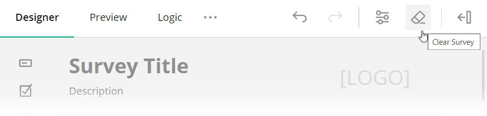

## Preview Tab

The Preview tab allows you to view and take the survey as a respondent.

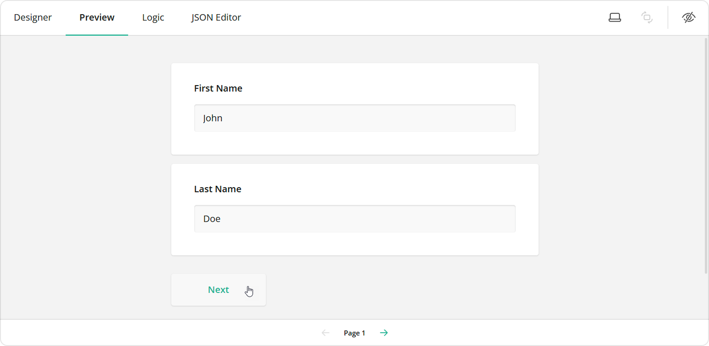

### How to: Re-run the preview

After you complete the survey, you can see the survey results in the table or JSON format. Click the Preview Survey Again button above the results to preview the survey again:

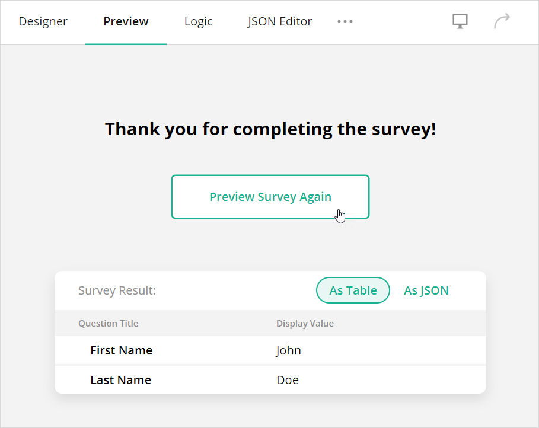

### How to: Preview the survey on different devices

Click the **Device** icon and select the desired device from the drop-down menu. You can also click the **Orientation** icon to switch between the landscape and portrait orientations:

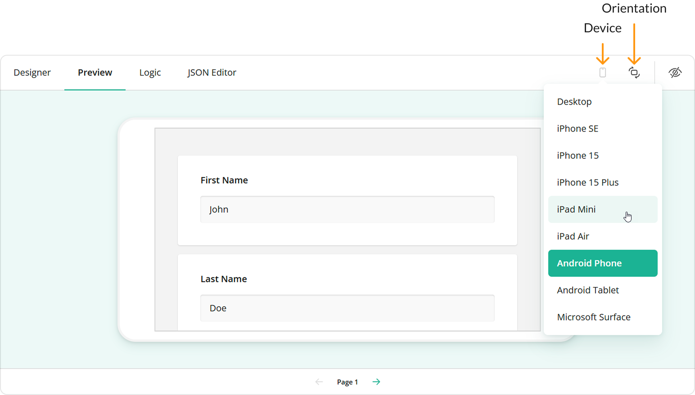

## Logic Tab

The Logic tab displays and allows you to edit logical rules that specify the survey flow.

### How to: Add a new rule

Click **Add New Rule** at the bottom of the Logic tab to display editors that allow you to specify conditions and select actions to perform when these conditions are met.

#### Specify conditions (if-clauses)       

Select a question whose answer should be checked and a logical operation from the corresponding drop-down menus. Then, specify the answer that applies the rule. Some logical operations do not need an answer (for example, Empty or Not empty).

If the rule needs more than one condition, click the **Add Condition** button. You can use the AND or OR logical operator to combine the new and previous conditions.

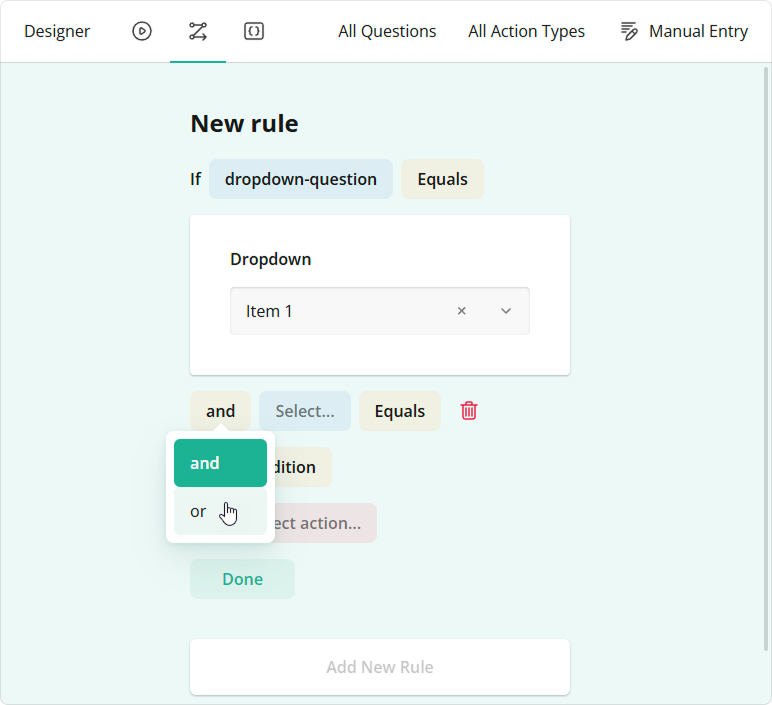

Conditions that you specify in the UI are converted to logical expressions. If you prefer to enter the expressions directly, click the **Manual Entry** button on the Toolbar.

#### Specify the action (then-clause)         

Select one of the following actions from the drop-down menu:

- Show (hide) page          
Makes the selected page visible. If you want to hide the page, invert the logic of your condition.

- Enable (disable) page         
Makes the selected page editable. If you want to make the page read-only, invert the logic of your condition.

- Show (hide) question          
Makes the selected question visible. If you want to hide the question, invert the logic of your condition.

- Enable (disable) question         
Makes the selected question editable. If you want to make the question read-only, invert the logic of your condition.

- Make question required            
Requires an answer for the selected question.

- Complete survey           
Completes the survey.

- Set answer            
Sets a specified answer to the selected question.

- Copy answer           
Copies the answer from the selected question to a target question.

- Skip to question          
Navigates the survey to the selected question.

- Run expression            
Runs a custom expression on the selected question.

- Set "Survey Complete" page markup         
Specifies custom HTML markup for the Survey Complete page.

### How to: Edit a rule

Click a rule to expand it and use UI elements to edit the rule. Click **Done** to save your changes.

### How to: Filter rules

Use the Question Filter to filter rules by a specific question. You can also use the Action Type Filter to view only rules for the selected action type:

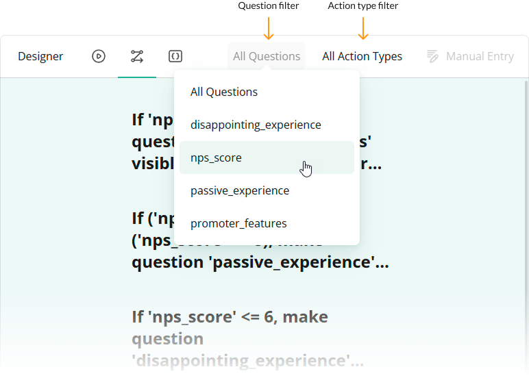

## JSON Editor Tab

The JSON Editor tab enables you to preview and edit the resulting survey configuration. In most cases, you do not need to modify the JSON object on this tab. Change survey settings in the Property Grid instead.

## Translation Tab

The Translation tab displays survey strings and allows you to translate them into different languages.

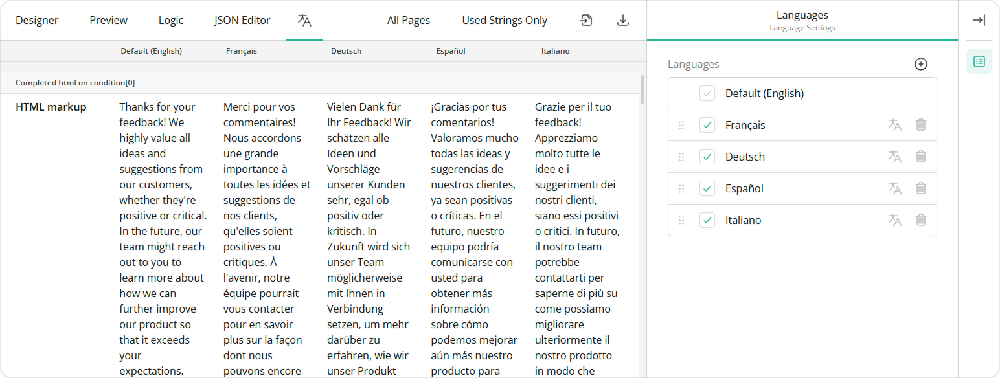

### How to: Add another language

In the Language Settings sidebar, click the **Add** icon and select the desired language from the pop-up menu:

### How to: Filter translation strings

Use the Page Filter to filter strings by a specific page. You can also use the Used Strings Filter to view only the strings that were changed:

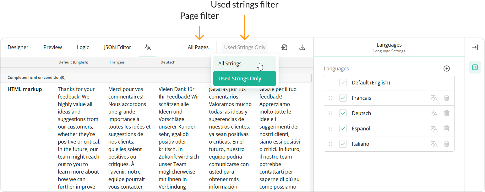

### How to: Import or export translation strings to CSV

Click the **Import to CSV** or **Export to CSV** button on the Toolbar:

