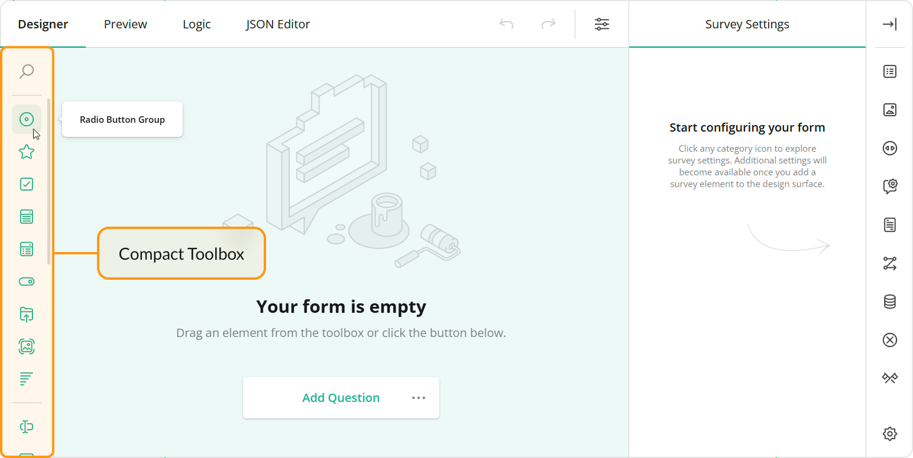

# Survey Creator / Form Builder Overview

If you want to use Survey Creator on your website with minimum customization, then we recommend you go to [Survey Creator examples](https://surveyjs.io/Examples/Survey-Creator/), click on "Edit in Plunker" button and copy the code into your web page. To get more information about integration, refer to a [Get Started](https://surveyjs.io/Documentation/Survey-Creator?id=get-started) help topic for your framework.

Please visit our [what's new page](https://surveyjs.io/WhatsNew) to see what we have added recently or what is coming soon.

If you want to get the most from our Survey Creator, then we hope that the following article helps you. You may read this document from the beginning to the end or just navigate to the topic you are interested in.

- [Supported Platforms and Examples](#supported-platforms-and-examples)
- [Localization](#localization)
  - [Localize Survey Creator UI](#localize-survey-creator-ui)
  - [Localize Survey Contents](#localize-survey-contents)
- [Customize the Toolbox](#customize-the-toolbox)
  - [Full and Compact Modes](#full-and-compact-modes)
  - [Limit Available Question and Panel Types](#limit-available-question-and-panel-types)
  - [Group Toolbox Items by Categories](#group-toolbox-items-by-categories)
  - [Customize Predefined Toolbox Items](#customize-predefined-toolbox-items)
  - [Add a Custom Toolbox Item](#add-a-custom-toolbox-item)
- [Hide Properties from the Property Grid](#hide-properties-from-the-property-grid)
- [Add Custom Properties to the Property Grid](#add-custom-properties-to-the-property-grid)
  - [Survey Element Property Settings](#survey-element-property-settings)
    - [`name`](#name)
    - [`type`](#type)
    - [`default`](#default)
    - [`displayName`](#displayname)
    - [`choices`](#choices)
    - [`isRequired`](#isrequired)
    - [`isSerializable`](#isserializable)
    - [`isLocalizable`](#islocalizable)
    - [`visible`](#visible)
    - [`visibleIf`](#visibleif)
    - [`visibleIndex`](#visibleindex)
    - [`readOnly`](#readonly)
    - [`category`](#category)
    - [`categoryIndex`](#categoryindex)
    - [`maxLength`](#maxlength)
    - [`minValue` and `maxValue`](#minvalue-and-maxvalue)
    - [`dependsOn`](#dependson)
    - [`onGetValue`](#ongetvalue)
    - [`onSetValue`](#onsetvalue)
- [Customize Survey Elements on Creation](#customize-survey-elements-on-creation)
- [Adorners](#adorners)
- [Access Survey Instances Within Survey Creator](#access-survey-instances-within-survey-creator)
  - [Design Mode Survey Instance](#design-mode-survey-instance)
  - [Preview Mode Survey Instance](#preview-mode-survey-instance)


<div id="platforms"></div>

## Supported Platforms and Examples

Survey Creator supports Knockout and React natively and allows you to integrate the Knockout version into Angular, jQuery, and Vue applications. Refer to the following articles to get started with Survey Creator in your frontend framework:

- [Angular](https://surveyjs.io/Documentation/Survey-Creator?id=get-started-angular)
- [Vue](https://surveyjs.io/Documentation/Survey-Creator?id=get-started-vue)
- [React](https://surveyjs.io/Documentation/Survey-Creator?id=get-started-react)
- [Knockout / jQuery](https://surveyjs.io/Documentation/Survey-Creator?id=get-started-knockout-jquery)

We also created several Quick Start GitHub repositories for different frontend frameworks to give you an easy start:

| Frontend Framework | GitHub Repository |
|---|---|
| Angular | [Angular CLI + SurveyJS Quick Start Boilerplate](https://github.com/surveyjs/surveyjs_angular_cli) |
| React | [React + SurveyJS Quick Start Boilerplate](https://github.com/surveyjs/surveyjs_react_quickstart) |
| Vue | [SurveyJS + VueJS Quick Start Boilerplate](https://github.com/surveyjs/surveyjs_vue_quickstart) |

In many use cases, Survey Creator communicates with a remote storage. Use the following GitHub repositories integrate Survey Creator with your backend framework:

| Backend Framework | GitHub Repository | Demo Site |
|---|---|---|
| PHP | [Sample PHP backend for SurveyJS library and Survey Creator](https://github.com/surveyjs/surveyjs-php) | [Run demo](https://surveyjs-php.herokuapp.com/) |
|  ASP.NET Core | [Sample .NET Core backend for SurveyJS library and Survey Creator](https://github.com/surveyjs/surveyjs-aspnet-mvc) | [Run demo](https://surveyjs-aspnet-mvc.azurewebsites.net/) |
| NodeJS | [Sample NodeJS backend for SurveyJS library and Survey Creator](https://github.com/surveyjs/surveyjs-nodejs) | [Run demo](https://surveyjs-nodejs.herokuapp.com/) |

We also created a plugin for WordPress. You can use it as is or modify it to integrate SurveyJS Library and Survey Creator into another CMS:

| Product Name | GitHub Repository | Plugin Site |
|---|---|---|
| WordPress | [Sources for SurveyJS WordPress plugin](https://github.com/surveyjs/surveyjs-wordpress) | [WordPress plugin](https://wordpress.org/plugins/surveyjs/) |

## Localization

### Localize Survey Creator UI

Survey Creator UI is translated to multiple languages. We ship translation strings as [dictionary files](https://github.com/surveyjs/survey-creator/tree/master/packages/survey-creator-core/src/localization). Localization engine that works with these files is implemented in a separate script/module. Reference this script in the `<head>` tag of your page or import this module in the component that renders Survey Creator:

```html
<script src="https://unpkg.com/survey-creator-core/survey-creator-core.i18n.min.js"></script>
```

```js
import "survey-creator-core/survey-creator-core.i18n";
```

The default language for UI elements is English. To change it, set the `currentLocale` property. For example, the following code translates Survey Creator UI to French:

```js
SurveyCreator.localization.currentLocale = "fr";

// In modular applications:
import { localization } from "survey-creator-core";
localization.currentLocale = "fr";
```

You can modify individual translation strings. Call the `getLocale(locale)` method to get an object with locale translations. Refer to any [dictionary file](https://github.com/surveyjs/survey-creator/tree/master/packages/survey-creator-core/src/localization) for information about the structure of this object. To modify a translation string, change the corresponding object property:

```js
// Get current locale translations
const translations = SurveyCreator.localization.getLocale("");
// In modular applications
const translations = localization.getLocale("");

// Change text for the `visible` property in Property Grid
translations.p.visible = "Is visible";
// Change text for the `visible` property in Modal Editor
translations.pe.visible = "Is element visible?";
// Change text for the `visible` property in JSON Editor
translations.ed.jsonEditor = "Edit As Text";
```

[View Localization example](https://surveyjs.io/Examples/Survey-Creator/?id=localization)

Translation dictionaries are supported by the community and may be incomplete. Feel free to add missing translations to existing dictionaries or create new dictionaries for other languages. You can use English as a base dictionary: copy the file, replace English translations in it, and submit a pull request with the resulting file to the [survey-creator](https://github.com/surveyjs/survey-creator) repository.

### Localize Survey Contents

If you want your users to create multi-language surveys, add the following script to the `<head>` tag of your page or import the following module in the component that renders Survey Creator:

```html
<script src="https://unpkg.com/survey-core/survey.i18n.min.js"></script>
```

```js
import "survey-core/survey.i18n";
```

This script/module allows Survey Creator users to select a default language different from English:


If you want to restrict the list of available languages, specify the `supportedLocales` array:

```js
Survey.surveyLocalization.supportedLocales = ["en", "de", "es", "fr"];

// In modular applications
import { surveyLocalization } from 'survey-core';
surveyLocalization.supportedLocales = ["en", "de", "es", "fr"];
```

Predefined survey texts are translated to the selected language automatically. SurveyJS Library takes translation strings from [community-supported dictionaries](https://github.com/surveyjs/survey-library/tree/master/src/localization). Custom texts (questions, choices, page titles, error messages) should be translated by Survey Creator users in the Translation tab. To display it, enable the [`showTranslationTab`](https://surveyjs.io/Documentation/Survey-Creator?id=surveycreator#showTranslationTab) property as shown below. Note that users can specify translation strings only for the languages that you list in the `supportedLocales` array.

```js
const creatorOptions = {
  showTranslationTab: true
};

const creator = new SurveyCreator.SurveyCreator(creatorOptions);

// In modular applications
import { SurveyCreator } from "survey-creator-knockout";
// or
import { SurveyCreator } from "survey-creator-react";
const creator = new SurveyCreator(creatorOptions);
```

[View Multiple Languages example](https://surveyjs.io/Examples/Survey-Creator/?id=multiplelanguages)

<div id="toolbox"></div>

## Customize the Toolbox

### Full and Compact Modes

Toolbox contains available question and panel types. Users can click questions and panels or drag and drop them onto the design surface to add them to the survey.


Toolbox supports full mode (illustrated above) and compact mode. In compact mode, element names are hidden. To see an individual element name, a user should move the mouse pointer over the element icon.



Toolbox switches between the modes automatically based on available width. Specify the [`forceCompact`](https://surveyjs.io/Documentation/Survey-Creator?id=questiontoolbox#forceCompact) property if you want the toolbox to always use a specific mode:

```js
// Compact mode
creator.toolbox.forceCompact = true;
// Full mode
creator.toolbox.forceCompact = false;
```

You can also use the [`isCompact`](https://surveyjs.io/Documentation/Survey-Creator?id=questiontoolbox#isCompact) property to find out whether the toolbox is currently in compact mode:

```js
console.log(creator.toolbox.isCompact);
```

<div id="toolbox-limit"></div>

### Limit Available Question and Panel Types

All available question and panel types are listed in the [`getType()`](https://surveyjs.io/Documentation/Library?id=Question#getType) method description. If you need to show only a part of these types, specify them in the Survey Creator's [`questionTypes`](https://surveyjs.io/Documentation/Survey-Creator?id=surveycreator#questionTypes) array:

```js
const creatorOptions = {
    questionTypes: ["text", "checkbox", "radiogroup", "dropdown"]
};

const creator = new SurveyCreator.SurveyCreator(creatorOptions);

// In modular applications
import { SurveyCreator } from "survey-creator-knockout";
// or
import { SurveyCreator } from "survey-creator-react";
const creator = new SurveyCreator(creatorOptions);
```

[View Toolbox Customization example](https://surveyjs.io/Examples/Survey-Creator?id=toolboxcustomization)

<div id="toolbox-categories"></div>

### Group Toolbox Items by Categories

> NOTE: Compact toolbox does not display categories.

To group toolbox items, call the [`changeCategories()`](https://surveyjs.io/Documentation/Survey-Creator?id=questiontoolbox#changeCategories) method. It accepts an array of objects with the following fields:

- `name`        
The name of the item that should be grouped. Refer to the [`getType()`](https://surveyjs.io/Documentation/Library?id=Question#getType) method description for a list of accepted values.

- `category`      
A category for this item.

The following code places the [Panel](https://surveyjs.io/Documentation/Library?id=panelmodel) and [Panel Dynamic](https://surveyjs.io/Documentation/Library?id=questionpaneldynamicmodel) types into the Panels category and the [Matrix](https://surveyjs.io/Documentation/Library?id=questionmatrixmodel), [Matrix Dropdown](https://surveyjs.io/Documentation/Library?id=questionmatrixdropdownmodel), and [Matrix Dynamic](https://surveyjs.io/Documentation/Library?id=questionmatrixdynamicmodel) types into the Matrices category:

```js
creator.toolbox.changeCategories([
    { name: "panel", category: "Panels" }, 
    { name: "paneldynamic", category: "Panels" }, 
    { name: "matrix", category: "Matrices" },
    { name: "matrixdropdown", category: "Matrices" },
    { name: "matrixdynamic", category: "Matrices" }
]);
```

[View Toolbox Categories example](https://surveyjs.io/Examples/Survey-Creator?id=toolboxcategories)

Ungrouped items fall into the General category. You can use [localization capabilities](#localize-survey-creator-ui) to change its caption. If your application does not employ modules, use the following code:

```html
<script src="https://unpkg.com/survey-creator-core/survey-creator-core.i18n.min.js"></script>
```

```js
const translations = SurveyCreator.localization.getLocale("");
translations.ed.toolboxGeneralCategory = "Common";
```

In modular applications, use the code below:

```js
import "survey-creator-core/survey-creator-core.i18n";
import { localization } from "survey-creator-core";
const translations = localization.getLocale("");
translations.ed.toolboxGeneralCategory = "Common";
```

The following properties control the behavior of categories:

- [`allowExpandMultipleCategories`](https://surveyjs.io/Documentation/Survey-Creator?id=questiontoolbox#allowExpandMultipleCategories)     
Allows more than one category to be in expanded state. If this property is `false`, when a user expands a category, other categories collapse.

- [`keepAllCategoriesExpanded`](https://surveyjs.io/Documentation/Survey-Creator?id=questiontoolbox#keepAllCategoriesExpanded)       
Expands all categories. Users cannot collapse them.

```js
creator.toolbox.allowExpandMultipleCategories = true;
creator.toolbox.keepAllCategoriesExpanded = false;
```

### Customize Predefined Toolbox Items

To customize a predefined toolbox item, pass its [type](https://surveyjs.io/Documentation/Library?id=Question#getType) as an argument to the [`getItemByName(itemName)`](https://surveyjs.io/Documentation/Survey-Creator?id=questiontoolbox#getItemByName) method. This method returns the item's configuration object. Change the [properties of this object](https://surveyjs.io/Documentation/Survey-Creator?id=iquestiontoolboxitem) to customize the toolbox item. For example, the following code uses the [`json`](https://surveyjs.io/Documentation/Survey-Creator?id=iquestiontoolboxitem#json) property to override predefined [choices](https://surveyjs.io/Documentation/Library?id=questiondropdownmodel#choices) for a [Dropdown](https://surveyjs.io/Documentation/Library?id=questiondropdownmodel) question:

```js
creator.toolbox
  .getItemByName("dropdown")
  .json
  .choices = [
    { text: "Option 1", value: 1 },
    { text: "Option 2", value: 2 },
    { text: "Option 3", value: 3 }
  ];
```

[View Toolbox Customization example](https://surveyjs.io/Examples/Survey-Creator?id=toolboxcustomization)

### Add a Custom Toolbox Item

If you want to extend the predefined toolbox item collection, call the `addItem(itemConfiguration, [index])` method to add a custom item. This method accepts the following arguments:

- `itemConfiguration`       
A [toolbox item configuration object](https://surveyjs.io/Documentation/Survey-Creator?id=iquestiontoolboxitem). The [`name`](https://surveyjs.io/Documentation/Survey-Creator?id=iquestiontoolboxitem#name), [`iconName`](https://surveyjs.io/Documentation/Survey-Creator?id=iquestiontoolboxitem#iconName), and [`json`](https://surveyjs.io/Documentation/Survey-Creator?id=iquestiontoolboxitem#json) properties are required. When you configure an object for the `json` property, refer to the API help section of your question type for a list of available properties. For example, if you configure a Dropdown question, refer to the [Dropdown API](https://surveyjs.io/Documentation/Library?id=questiondropdownmodel) help section.

- `index`       
The target index of the item. Use `0` to add the item at the first position, `1` to add it at the second position, and so on. Do not specify `index` if you want to display the item at the end.

The following code adds a custom item that allows users to select a country from a drop-down menu. Since the `index` argument is `0`, the toolbox displays the item at the beginning.

```js
creator.toolbox.addItem({
  name: "countries",
  iconName: "icon-dropdown",
  title: "Countries",
  json: {
    type: "dropdown",
    optionsCaption: "Select a country...",
    choicesByUrl: {
        url: "https://surveyjs.io/api/CountriesExample"
    }
  }
}, 0);
```

[View Toolbox Customization example](https://surveyjs.io/Examples/Survey-Creator?id=toolboxcustomization)

<!--

WE HAVEN'T COME UP WITH A VERSION FOR REACT YET

    <div id="toolbox-customwidgets"></div>

    ### Integrate 3rd-Party Components as Question Editors

    Survey Creator supports integration with the following 3rd-party components out of the box:

    %LIST%

    To enable the integration with one of these components, reference or import the [surveyjs-widgets](https://github.com/surveyjs/custom-widgets) library next to the 3rd-party component sources:

    ```html
    <script src="https://unpkg.com/surveyjs-widgets/surveyjs-widgets.min.js"></script>
    ```

    ```js
    import "survey-creator-core/survey-creator-core.i18n";
    ```

    If you did not find a desired component in the list above, refer to the following help topic for instructions on how to integrate any 3rd-party component into Survey Creator: [Create Custom Widget](https://surveyjs.io/Documentation/Survey-Creator?id=Create-Custom-Widget).
-->

<!--  

NEW SURVEY CREATOR DOESN'T HAVE THE ADD TO TOOLBOX ADORNER YET 

    <div id="toolbox-existing"></div>

    ### Save User-Defined Elements in the Toolbox

    By default, there is a “Add to Toolbox” button on an element (question/panel) in the designer. Your end-user may customize question/panel as he/she wants, add it into toolbox and then drop it on another page.

    You may go even further and persist the current Toolbox state, so the user may use these custom toolbox items for building other surveys.

    Let’s talk here about available options that you have.

    By default, a user may add only 3 elements from the designer. If there are already 3 custom/copied elements on the Toolbox, then on adding a new one, the first added element will be removed. To change the number of copied elements your user may have, you must set this property to the value you need:
    ```js
    creator.toolbox.copiedItemMaxCount = 10;
    ```
    To disable the ability of adding an element from designer into toolbox you will have to use **onElementAllowOperations** event. Here is the example:

    ```js
    creator.onElementAllowOperations.add(function(sender, options){
        options.allowAddToToolbox = false;
    });
    ```
    If you want to persist the copied items on the Toolbox for your end-user for another session or another survey, then you must use the copiedJsonText properties:

    ```js
    var savedItems = creator.toolbox.copiedJsonText; //save into localstorage or your database
    //....
    //Restored savedItems from localstorage or your database.
    creator.toolbox.copiedJsonText = savedItems;
    ```
-->

<div id="removeproperties"></div>

## Hide Properties from the Property Grid

If you do not want users to change a survey property, you can hide it from the Property Grid. Survey Creator allows you to hide an individual property or multiple properties at once.

To hide a single survey property, call the `getProperty(questionType, propertyName)` method on the `Survey.Serializer` object as follows:

```js
// Hide the `title` property for Boolean questions
Survey.Serializer.getProperty("boolean", "title").visible = false;

// In modular applications:
import { Serializer } from "survey-core";
Serializer.getProperty("boolean", "title").visible = false;
```

If you want to hide multiple properties, handle the Survey Creator's [`onShowingProperty`](https://surveyjs.io/Documentation/Survey-Creator?id=surveycreator#onShowingProperty) event. Its second parameter exposes the `canShow` Boolean property. Disable it for the properties you want to hide. The following example illustrates two cases: hide black-listed properties and keep only white-listed properties. This code hides the properties for [Panel](https://surveyjs.io/Documentation/Library?id=panelmodel) questions.

```js
const blackList = [ "visible", "isRequired" ];
// const whiteList = [ "title", "name" ];

creator.onShowingProperty.add(function (_, options) {
  if (options.obj.getType() == "panel") {
    // Hide properties found in `blackList`
    options.canShow = blackList.indexOf(options.property.name) < 0;

    // Hide all properties except those found in `whiteList`
    // options.canShow = whiteList.indexOf(options.property.name) > -1;
  }
});
```

<div id="addproperties"></div>

## Add Custom Properties to the Property Grid

Custom properties can be serialized and included in the survey JSON definition. To add a custom property, call the `addProperty(questionType, propertySettings)` method on the `Survey.Serializer` object. This method accepts the following arguments:

- `questionType`        
A string value that specifies the question type to which the property should be added. You can use a specific type (see the [getType](https://surveyjs.io/Documentation/Library?id=Question#getType) description) or one of the base types. In the latter case, the new property will be added to all question types that derive from the base type. Refer to the API of a specific question type for information on its inheritance chain. For example, the following image illustrates the inheritance chain of the [Text](https://surveyjs.io/Documentation/Library?id=questiontextmodel) question type:

  

- `propertySettings`      
Settings that configure the property's appearance and behavior. For information about these settings, refer to the [Survey Element Property Settings](#survey-element-property-settings) help section below.

[View Add Properties example](https://surveyjs.io/Examples/Survey-Creator/?id=addproperties)

### Survey Element Property Settings

#### `name`

A string value that specifies the property name. It is the only required property.

#### `type`

A string value that specifies the property type. Accepts one of the values described in the table below. Each type produces a different property editor.

| `type` | Property Editor | Description |
| ------ | --------------- | ----------- |
| `"string"` (default) | Text input | Use this type for short string values. |
| `"boolean"` | Checkbox | Use this type for Boolean values. |
| `"condition"` | Multi-line text input with an optional dialog window | Use this type for [Boolean expressions](https://surveyjs.io/Documentation/Library?id=LibraryOverview#conditions-expressions) similar to [`visibleIf`](https://surveyjs.io/Documentation/Library?id=Question#visibleIf) or [`enabledIf`](https://surveyjs.io/Documentation/Library?id=Question#enableIf). |
| `"expression"` | Multi-line text input with a hint icon | Use this type for [non-Boolean expressions](https://surveyjs.io/Documentation/Library?id=LibraryOverview#conditions-functions). |
| `"number"` | Text input | Use this type for numeric values. |
| `"text"` | Multi-line text input | Use this type for multi-line text values. |
| `"html"` | Multi-line text input | Use this type for HTML markup. |
| `"itemvalues"` | Customized text inputs for entering value-text pairs | Use this type for arrays of objects with the following structure: `{ value: any, text: string }`. For example, Dropdown, Checkbox, and Radiogroup questions use this type for the [`choices`](https://surveyjs.io/Documentation/Library?id=QuestionSelectBase#choices) property. |
| `"value"` | Button that opens a dialog window | The dialog window displays the survey element and allows users to set the element's default value. |

You can add the type to the `name` property after a colon character as a shortcut:

```js
Survey.Serializer.addProperty("question", 
  { name: "my-boolean-property", type: "boolean" }
  // ===== or =====
  { name: "my-boolean-property:boolean" }
);
```

#### `default`

A default value for the property. If not specified, `default` equals to `""` for string values, 0 for numbers, `false` for Boolean values. The default value is not serialized into survey JSON definition.

```js
Survey.Serializer.addProperty("dropdown", 
  { name: "my-string-property", default: "custom-default-value" }
);

Survey.Serializer.addProperty("checkbox", 
  { name: "my-numeric-property", type: "number", default: 100 }
);

Survey.Serializer.addProperty("question", 
  { name: "my-boolean-property", type: "boolean", default: true }
);
```
#### `displayName`

A string value that specifies a property caption. If not specified, the [`name`](#name) value is used instead.

```js
Survey.Serializer.addProperty("dropdown", 
  { name: "my-string-property", displayName: "Custom Caption" }
);
```

#### `choices`

An array of selection choices or a function that loads the choices from a web service. Applies only to text and numeric properties. If `choices` are specified, Survey Creator renders a drop-down menu as the property editor.

```js
// Define `choices` locally
Survey.Serializer.addProperty("question", {
  name: "my-string-property",
  choices: [ "option1", "option2", "option3" ],
  // If item captions should be different from item values:
  // choices: [
  //   { value: "option1", text: "Option 1" },
  //   { value: "option2", text: "Option 2" },
  //   { value: "option3", text: "Option 3" },
  // ],
  default: "option1"
});

// Load `choices` from a web service
Survey.Serializer.addProperty("survey", {
  name: "country",
  category: "general",
  choices: function (obj, choicesCallback) {
    const xhr = new XMLHttpRequest();
    xhr.open("GET", "https://surveyjs.io/api/CountriesExample");
    xhr.setRequestHeader( "Content-Type", "application/x-www-form-urlencoded");
    xhr.onload = function () {
      if (xhr.status === 200) {
        const response = JSON.parse(xhr.response);
        const result = [];
        // Make the property nullable
        result.push({ value: null });
        // Web service returns objects that we convert to the `{ value, text }` format
        // If your web service returns an array of strings, simply pass it to `choicesCallback`
        response.forEach(item => {
          result.push({ value: item.cioc, text: item.name });
        });
        choicesCallback(result);
      }
    };
    xhr.send();
  }
});
```

#### `isRequired`

A Boolean value that specifies whether the property must have a value. Defaults to `false`. You can add an exclamation mark before `name` as a shortcut for this setting:

```js
Survey.Serializer.addProperty("question", 
  { name: "my-boolean-property", type: "boolean", isRequired: true }
  // ===== or =====
  { name: "!my-boolean-property", type: "boolean" }
);
```

#### `isSerializable`

A Boolean value that specifies whether to include the property in the survey JSON definition. Defaults to `true`.

#### `isLocalizable`

A Boolean value that specifies whether users can translate the property value to different languages in the Translation tab. Applies only to text properties. Defaults to `false`.

```js
Survey.Serializer.addProperty("question", 
  { name: "my-text-property", type: "text", isLocalizable: true }
);
```

#### `visible`

A Boolean value that specifies whether the property is visible in the Property Grid. Defaults to `true`.

#### `visibleIf`

A function that specifies a condition based on which to show or hide the property. The function accepts the question or panel that a user configures as a parameter.

If the property visibility depends on another property, use the [`dependsOn`](#dependson) setting. You can use `visibleIf` in conjunction with `dependsOn` to impose more specific rules on property visibility. In this case, Survey Creator calls the `visibleIf` function only when one of the properties from the `dependsOn` array is changed.

In the following code, the `dateFormat` property depends on the `inputType` property and is visible only if `inputType` is set to one of date types:

```js
Survey.Serializer.addProperty("text", {
  name: "dateFormat",
  category: "general",
  visibleIndex: 7,
  dependsOn: ["inputType"],
  visibleIf: function (obj) {
    return (
      obj.inputType === "date" ||
      obj.inputType === "datetime" ||
      obj.inputType === "datetime-local"
    );
  }
});
```

#### `visibleIndex`

A number that specifies the property position within its [`category`](#category). Defaults to -1 (the last position).

```js
Survey.Serializer.addProperty("question", 
  // Display "my-string-property" at the top in the General category
  { name: "my-string-property", category: "general", visibleIndex: 0 }
);
```

#### `readOnly`

A Boolean value that specifies whether the property value is read-only. Defaults to `false`.

```js
Survey.Serializer.addProperty("question", 
  { name: "my-string-property", readOnly: true }
);
```

#### `category`

A string value that specifies a category in which to display the property. If `category` is not set, the property falls into the Others category. Categories are sorted according to [`categoryIndex`](#categoryindex) values.

The following table describes predefined categories:

| `category` | Element types that have the category | `visibleIndex` |
| ---------- | ------------------------------------ | -------------- |
| `"general"` | Question, Panel, Page, Survey | -1 |
| `"logic"` | Question, Panel, Page, Survey | 100 |
| `"layout"` | Question, Panel, Page | 200 |
| `"data"` | Question | 300 |
| `"validation"` | Question, Panel, Page | 400 |
| `"navigation"` | Survey | 100 |
| `"question"` | Survey | 200 |
| `"logic"` | Survey | 300 |
| `"data"` | Survey | 400 |
| `"validation"` | Survey | 500 |
| `"showOnCompleted"` | Survey | 600 |
| `"timer"` | Survey | 700 |
| `"columns"` | MatrixDropdownBase (Matrix Dropdown, Matrix Dynamic) | 10 |
| `"rows"` | MatrixDropdownBase (Matrix Dropdown, Matrix Dynamic) | 11 |
| `"choices"` | MatrixDropdownBase (Matrix Dropdown, Matrix Dynamic) | 12 |
| `"columns"` | Matrix | 10 |
| `"rows"` | Matrix | 11 |
| `"cells"` | Matrix | 12 |
| `"items"` | Multiple Text | 10 |
| `"rateValues"` | Rating | 10 |
| `"choices"` | SelectBase (Dropdown, Checkbox, Radiogroup) | 10 |
| `"choicesByUrl"` | SelectBase (Dropdown, Checkbox, Radiogroup) | 11 |

#### `categoryIndex`

A number that specifies a category position. If `categoryIndex` is not set, the category is added to the end. No category can be placed above General.

```js
Survey.Serializer.addProperty("question",
  // Display "Custom Category" after the General category
  { name: "my-string-property", category: "Custom Category", categoryIndex: 1 }
);
```

#### `maxLength`

A numeric value that specifies the maximum number of characters users can enter into the text input.

The following code limits the size of the question name, that user may enter, to 20.

```js
Survey.Serializer.addProperty("question",
  { name: "my-text-property", type: "text", maxLength: 280 }
);
```

#### `minValue` and `maxValue`

Numeric values that specify the minimum and maximum numbers users can enter into the editor.

```js
Survey.Serializer.addProperty("question",
  { name: "my-numeric-property", type: "number", minValue: 0, maxValue: 100 }
);
```

#### `dependsOn`

An array of property names upon which the current property depends. When one of the listed properties changes, the dependent property reevaluates the [`visibleIf`](#visibleif) and [`choices`](#choices) functions. This allows you to control the property visibility and fill choices conditionally.

The following code declares two custom properties. `dependent-property` fills `choices` depending on the `my-custom-property` value:

```js
Survey.Serializer.addProperty("question", {
  name: "my-custom-property",
  choices: ["Option 1", "Option 2", "Option 3"],
});

Survey.Serializer.addProperty("question", {
  name: "dependent-property",
  dependsOn: [ "my-custom-property" ],
  choices: function (obj) {
    const choices = [];
    const targetPropertyValue = !!obj ? obj["my-custom-property"] : null;
    // If `targetPropertyValue` is empty, return an empty array
    if (!targetPropertyValue) return choices;
    // Make the dependent property nullable
    choices.push({ value: null });
    // Populate `choices`
    choices.push(targetPropertyValue + ": Suboption 1");
    choices.push(targetPropertyValue + ": Suboption 2");
    choices.push(targetPropertyValue + ": Suboption 3");
    return choices;
  }
});
```

The following example shows how to load `choices` for the `country` property from a web service. They are reloaded each time a user changes the `region` value:

```js
Survey.Serializer.addProperty("survey", {
  name: "region",
  category: "Region",
  categoryIndex: 1,
  choices: ["Africa", "Americas", "Asia", "Europe", "Oceania"],
});

Survey.Serializer.addProperty("survey", {
  name: "country",
  category: "Region",
  dependsOn: [ "region" ],
  choices: function (obj, choicesCallback) {
    const xhr = new XMLHttpRequest();
    const url =
      !!obj && !!obj.region
        ? "https://surveyjs.io/api/CountriesExample?region=" + obj.region
        : "https://surveyjs.io/api/CountriesExample";
    xhr.open("GET", url);
    xhr.setRequestHeader("Content-Type","application/x-www-form-urlencoded");
    xhr.onload = function () {
      if (xhr.status === 200) {
        const response = JSON.parse(xhr.response);
        const result = [];
        // Make the property nullable
        res.push({ value: null });
        response.forEach(item => {
          result.push({ value: item.cioc, text: item.name });
        });
        choicesCallback(result);
      }
    };
    xhr.send();
  }
});
```

#### `onGetValue`

A function that you can use to adjust or exclude the property value from the survey JSON definition.

```js
// get title property returns a title with question number and so on "5) My super title.",
//but we want to serialize only a "pure" question title "My super title".
{ name: "title:text", onGetValue: function (obj: any) { return obj.titleValue; } }
// the function always returns null. It means that the library will never serialize the property in JSON.
{ name: "calcProperty", onGetValue: function (obj: any) { return null; } }
```
#### `onSetValue`

A function that you can use to perform actions when the property value is set, for example, update another property value.

> NOTE: Do not assign a value directly to an object property because this will trigger the `onSetValue` function again. Use the object's `setPropertyValue(propertyName, newValue)` method instead.

```js
{ 
    name: "myValue", 
    onSetValue: function (obj, value) {
        //Optionally do some checks, modify value if needed.
        //Set value directly
        obj.setPropertyValue("myValue", value);
        //Perform some actions, for example change other properties of the object
    }
}
```

<div id="modifynewobjects"></div>

## Customize Survey Elements on Creation

Survey Creator raises events when users add new elements to a survey. You can handle these events to customize the elements.

| Event name | Raised when |
| ---------- | ----------- |
| [onQuestionAdded](https://surveyjs.io/Documentation/Survey-Creator/?id=surveycreator#onQuestionAdded) | Raised when users add a question to the survey. |
| [onPanelAdded](https://surveyjs.io/Documentation/Survey-Creator/?id=surveycreator#onPanelAdded) | Raised when users add a panel to the survey. |
| [onPageAdded](https://surveyjs.io/Documentation/Survey-Creator/?id=surveycreator#onPageAdded) | Raised when users add a page to the survey. |
| [onMatrixColumnAdded](https://surveyjs.io/Documentation/Survey-Creator/?id=surveycreator#onMatrixColumnAdded) | Raised when users add a column to the [Matrix Dropdown](https://surveyjs.io/Documentation/Library?id=questionmatrixdropdownmodel) or [Matrix Dynamic](https://surveyjs.io/Documentation/Library?id=questionmatrixdynamicmodel) question. |
| [onItemValueAdded](https://surveyjs.io/Documentation/Survey-Creator?id=surveycreator#onItemValueAdded) | Raised when users add a new item value (column, row, choice) |

The code below shows how you can handle the `onQuestionAdded` event to customize the default question name:

```js
let questionNumbers = {};
creator.onQuestionAdded.add(function (_, options) {
  const question = options.question;
  const type = question.getType();
  if (!questionNumbers[type]) {
    questionNumbers[type] = 1;
  }
  const number = questionNumbers[type];
  // Set `name` in the following format: DropdownQuestion1, CheckboxQuestion6, etc.
  question.name = type[0].toUpperCase() + type.substring(1) + "Question" + number;
  questionNumbers[type] = number + 1;
});
```

<div id="adorners"></div>

## Adorners

Adorners are UI elements that allow Survey Creator users to manipulate survey elements. Adorners are added to survey elements on the design surface. Displayed adorners depend on the survey element type. The following image highlights adorners on a Dropdown question:


You can control the visibility of adorners using the `onElementAllowOperations` event. As the second parameter, the event handler accepts an object that exposes the following Boolean properties:

| Property | Description |
|--------- | ----------- |
| `allowAddToToolbox` | Shows or hides the adorner that saves the current survey element configuration in the toolbox |
| `allowChangeRequired` | Shows or hides the adorner that makes the question required |
| `allowChangeType` | Shows or hides the adorner that changes the survey element type |
| `allowCopy` | Shows or hides the adorner that duplicates the survey element |
| `allowDelete` | Shows or hides the adorner that deletes the survey element |
| `allowDragging` | Shows or hides the adorner that allows users to drag and drop survey elements |
| `allowEdit` | Shows or hides the adorners that allow users to edit survey element properties on the design surface. If you disable this property, users can edit survey element properties only in Property Grid. |

The following code shows how to hide the adorner that changes the question type for Dropdown questions:

```js
creator.onElementAllowOperations.add(function (_, options) {
  if (options.obj?.getType() === "dropdown") {
    options.allowChangeType = false;
  }
});
```
<!--
DEPENDS ON THE FOLLOWING ISSUE: https://github.com/surveyjs/survey-creator/issues/2843

You may register your own adorner or remove an existing adorner or remove all of them.

```js
//Register a new adorner
SurveyCreator.registerAdorner("adornerName", adornerInstance);
//Remove two existing adorners
SurveyCreator.removeAdorners(["adornerName1", "adornerName2"]);
//The removeAdorners function without parameters, will remove all adorners
SurveyCreator.removeAdorners();
```
-->

<div id="accesssurveys"></div>

## Access Survey Instances Within Survey Creator

Survey Creator contains different survey instances for design and preview modes. In design mode, survey elements have [adorners](#adorners). In preview mode, the survey is displayed as respondents will see it.

### Design Mode Survey Instance

To access the design mode survey instance, use the Survey Creator's [survey](https://surveyjs.io/Documentation/Survey-Creator?id=surveycreator#survey) property. You can do that at any point in your application. Use the [Survey API](https://surveyjs.io/Documentation/Library?id=surveymodel) to manipulate the survey instance. For example, the following code changes the survey [`title`](https://surveyjs.io/Documentation/Library?id=surveymodel#title):

```js
creator.survey.title = "My Survey";
```

Survey Creator may create a new design mode survey instance during the design process, for example, when the user switches from the JSON Editor tab back to Designer. To handle the survey recreation, use the [onDesignerSurveyCreated](https://surveyjs.io/Documentation/Survey-Creator/?id=surveyeditor#onDesignerSurveyCreated) event.

```js
creator.onDesignerSurveyCreated.add(function (_, options) {
  // Recreated survey instance is stored in the `options.survey` property
  console.log(options.survey);
})
```

### Preview Mode Survey Instance

The preview mode survey instance is recreated each time a user opens the Preview tab. To access this instance, handle the [onTestSurveyCreated](https://surveyjs.io/Documentation/Survey-Creator?id=surveyeditor#onTestSurveyCreated) event:

```js
creator.onTestSurveyCreated.add(function (_, options) {
  options.survey.title = "You started previewing the survey at: " + new Date().toLocaleTimeString();
});
```