# How to Create a Form that Repeats a Group of Fields for Each Selected Option

## About Bindings

In some cases, you may need to collect repeatable sets of data from respondents&mdash;for example, family members to include in an insurance policy, previous addresses, or test results. Survey Creator allows you to do this using the Dynamic Panel element.

A Dynamic Panel includes the main title (for example, *List the countries you've visited in the past 10 years*) and individual dynamic titles for each repeatable group of fields. Since you may not know how many entries a respondent needs to provide, a Dynamic Panel allows them to add entries as needed.

When configuring a Dynamic Panel, you can define fixed limits for the number of entries:

- **Initial number of entries** &ndash; the number shown when the respondent reaches the question (default: `0`)
- **Minimum number of entries** &ndash; the required minimum (default: `0`)
- **Maximum number of entries** &ndash; the allowed maximum (default: `100`)

However, in some cases, you may want the number of entries to be set dynamically&mdash;for example, based on selected choices in a multi-select question (such as a Multi-Select Dropdown or Checkboxes) or a numeric input from a Single-Line Input question. You can achieve this using the **Bindings** property. It connects the Dynamic Panel to another question and automatically adjusts the number of available entries based on the respondent's input.

This guide explains how to:

- [Bind a Dynamic Panel to a Multi-Select Dropdown](#how-to-repeat-form-fields-for-each-selected-option)
- [Bind a Dynamic Panel to a Numeric Input](#how-to-repeat-a-group-of-questions-based-on-a-numeric-input)  

## How to Repeat Form Fields for Each Selected Option

> In this example, we use a Multi-Select Dropdown (Tag Box) question. The same configuration applies to a Checkbox question.

<video src="images/eud-tag-box-to-dynamic-matrix.mp4" autoplay muted playsinline loop style="width: 100%"></video>

### Configure the Multi-Select Question

1. Add a **Multi-Select Dropdown** question to your form.  
2. Set a **Question name (ID)**, **Question title**, and, optionally, a **Question description**.

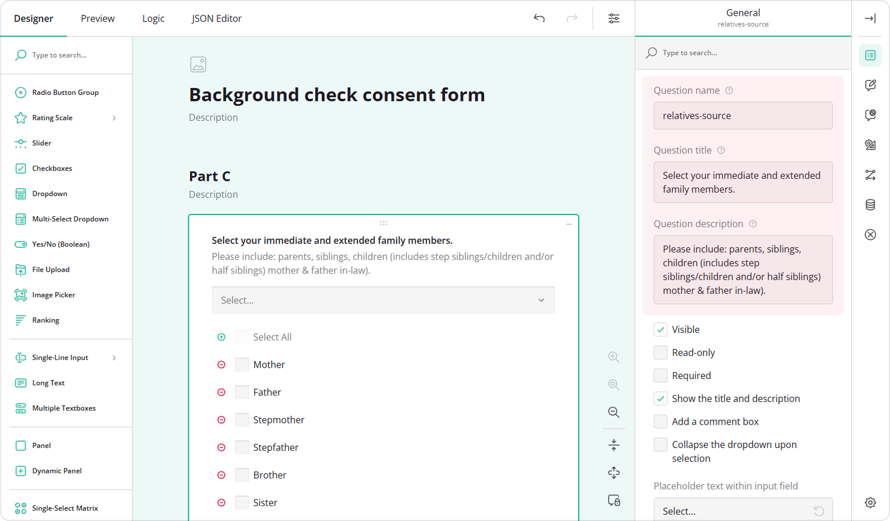

3. In the **Choice Options** category, locate the **Choices** table and click the **Pen** icon to enter the choices in bulk.  
4. Enter your choice options in the popup using the `choiceValue|choiceText` format.  
5. Click **Apply**.  

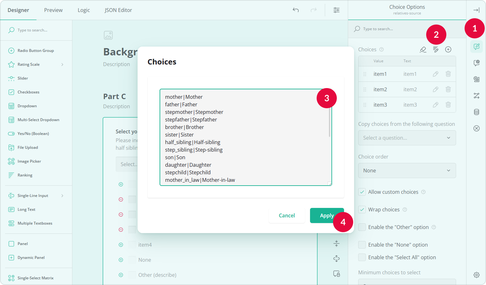

6. (Optional) Enable **Allow custom choices** if respondents should be able to create additional choice options that might be missing.  

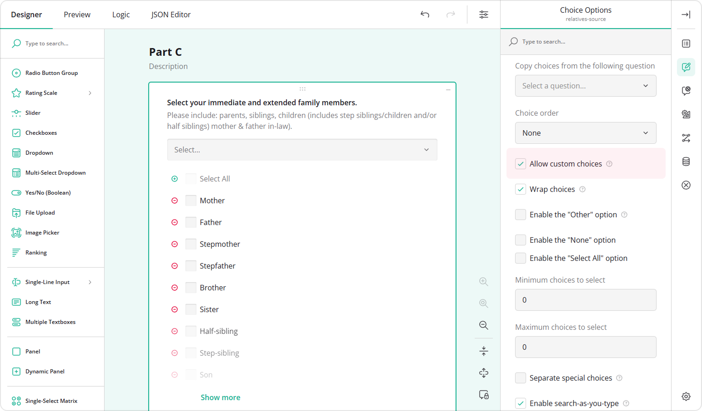

7. Go to the **Data** category and locate **Join identifier**.  
8. Enter a value that will connect this question with the Dynamic Panel (for example, `family`).

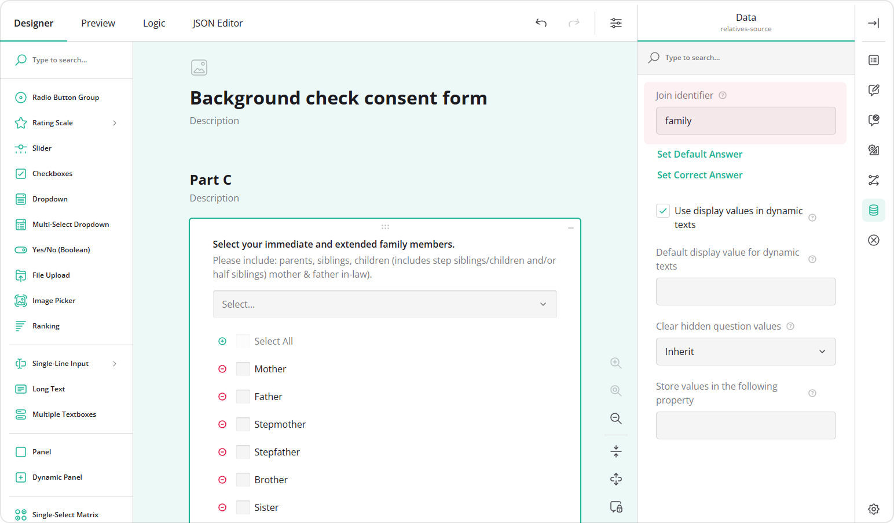

### Configure the Dynamic Panel

1. Add a **Dynamic Panel** question to your form.  
2. Set a **Panel name**, **Panel title**, and, optionally, a **Panel description**.  

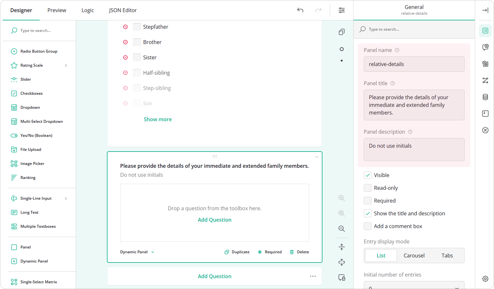

3. Add the questions you want to repeat inside the panel.  

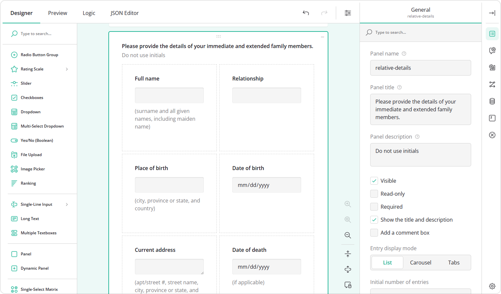

4. In the **General** category unselect the **Enable entry addition** and **Enable entry removal** properties. This ensures that respondents cannot manually remove or add new entries, and their number is controlled only by the bindings.
5. To create a dynamic title for each entry, locate the **Entry title pattern** property.
6. Enter a title pattern, for example: `Relative #{panelIndex}`. The `{panelIndex}` placeholder represents the entry's position among all entries. You can also use `{visiblePanelIndex}` to show the entry's position among *visible* entries, which is useful if the entries have dynamic visibility.

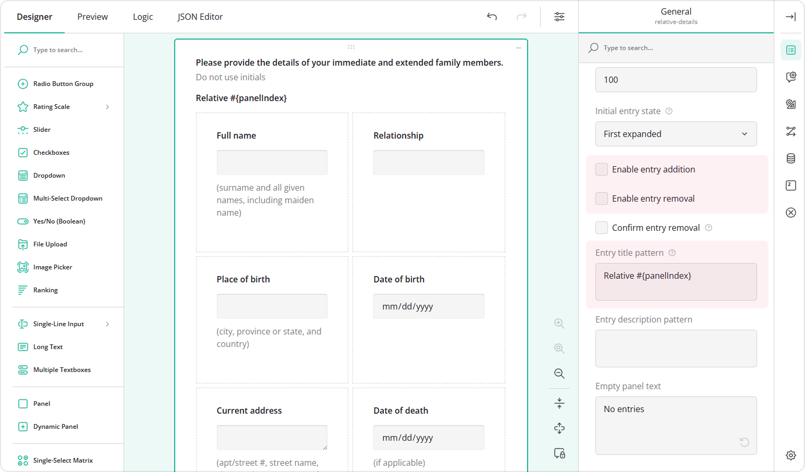

7. Go to the **Data** category and set the same **Join identifier** value you used earlier (i.e., `family`).

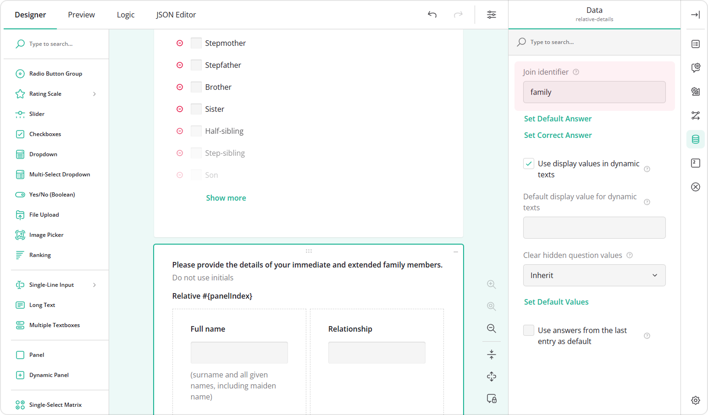

8. In the **Conditions** category, locate the **Bindings** property.  
9. Select the question whose selected choices should define the number of entries.  

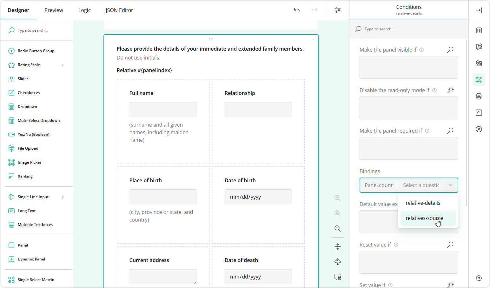

Preview the form and select items in the first question. The Dynamic Panel will automatically add corresponding entries.

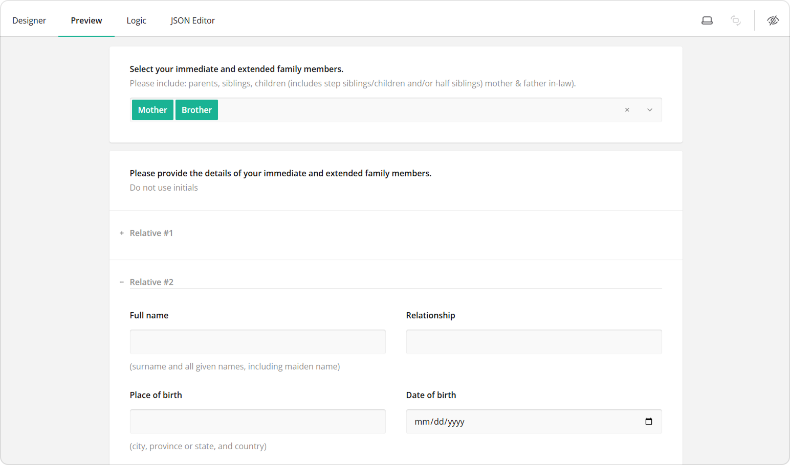

### Pipe Selected Values into Nested Questions of the Dynamic Panel

If a question inside the Dynamic Panel collects the same data as the multi-select question, you can automatically populate it using the selected values. To do this:

1. Select the **Multi-Select Dropdown** question.  
2. In the **Data** category, locate **Store values in the following property**.  
3. Enter a value name (for example, `selected-family-member`).  

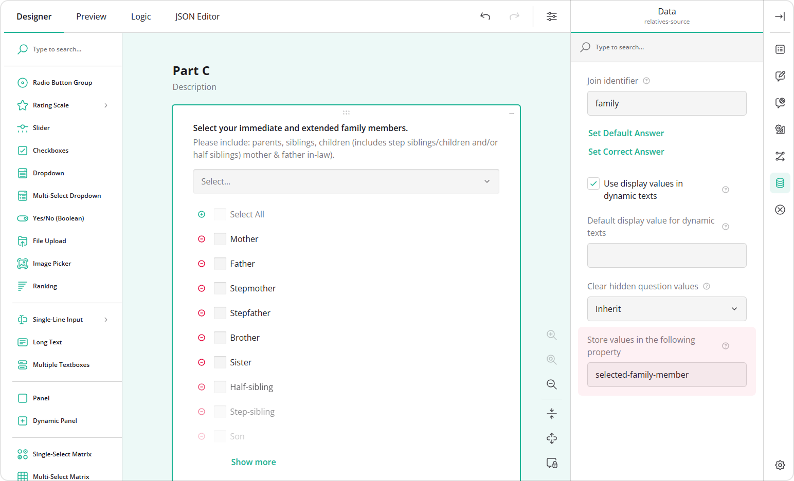

4. Select the question inside the Dynamic Panel that should receive the value.  
5. In the **Conditions** category, locate the **Default value expression** property.  
6. Enter the following expression: `displayValue('relatives-source', {panel.selected-family-member})`, where:
   - `displayValue()` is a function that returns the display text of a selected choice.
   - `relatives-source` is the **Question name** of the multi-select question.
   - `{panel.selected-family-member}` references the stored value within the panel.

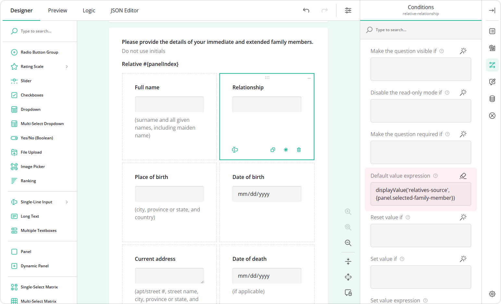

Now, when a respondent selects an option, a new panel entry is created and the corresponding field is filled in automatically.

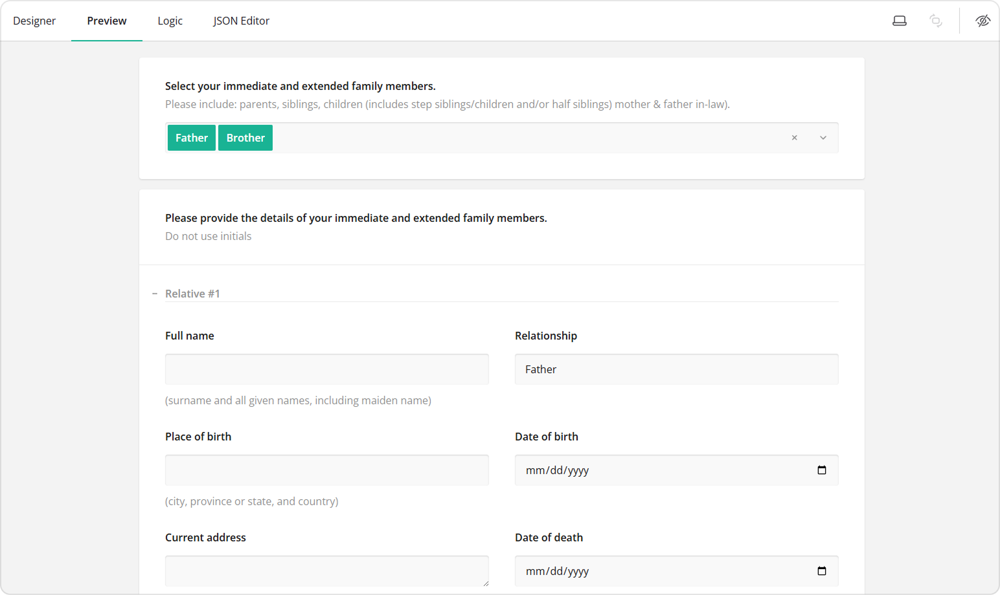

## How to Repeat a Group of Questions Based on a Numeric Input

To repeat a set of questions based on a number entered by a respondent in the previous question, follow these steps:

1. Add a **Single-Line Input** question to your form.
2. Set a **Question name (ID)**, **Question title**, and, optionally, a **Question description**.

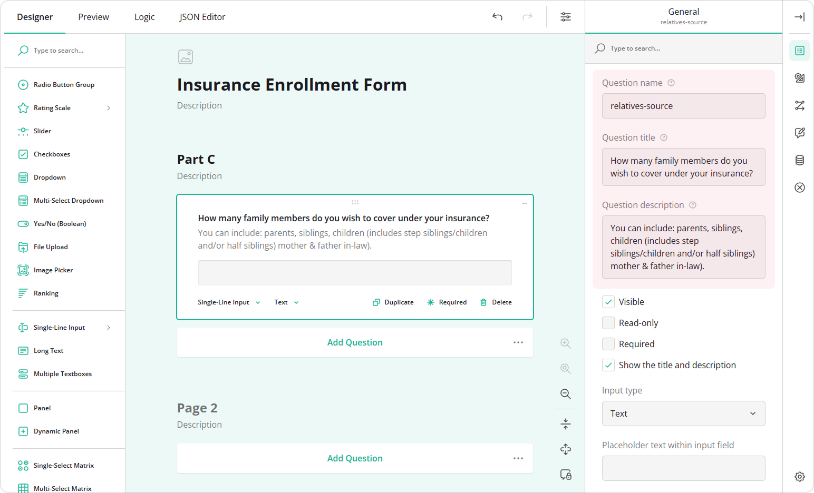

3. Set **Input type** to **Number**.  

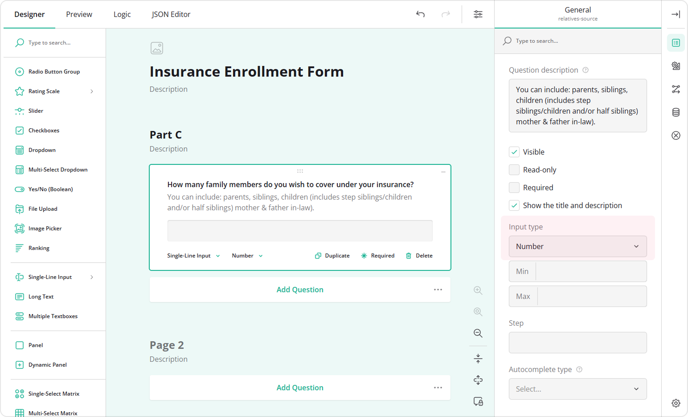

4. Repeat steps 1-6 from the [Configure the Dynamic Panel](#configure-the-dynamic-panel) section.
5. In the **Conditions** category, locate the **Bindings** property.
6. Select the **Question name** of the Single-Line Input whose value should define the number of entries&mdash;for example, `relative-source`.  

Preview the form and enter a number in the Single-Line Input field. The Dynamic Panel automatically creates that number of entries, so respondents see and complete exactly what is required.

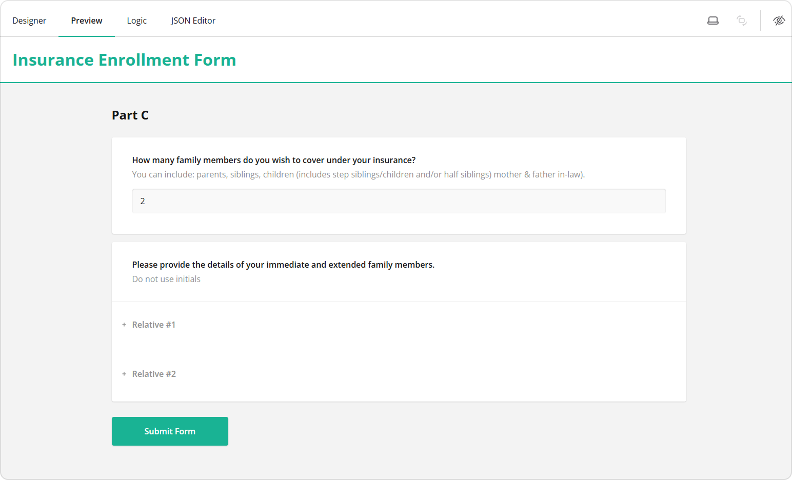

## See Also

- [How to Set and Format Dynamic Tab Titles in Dynamic Panel](/survey-creator/documentation/end-user-guide/dynamic-tab-title-format)
- [How to Pipe Selected Choices to a Dynamic Matrix](/survey-creator/documentation/end-user-guide/pipe-selected-choices-to-dynamic-matrix)
