# How to Carry Forward Responses

## About Carry Forward Responses

Carry Forward is a survey technique that takes selected responses from one question and copies them to a subsequent question. This method ensures that follow-up questions are directly relevant to the respondent's previous answers. You can use the feature for follow-up questions that require only the items selected from a previous question or, conversely, only the items that were not selected.

## Supported Question Types

Any multi-select question type from the list below can be used as both a source and a target question:

- [Checkboxes](https://surveyjs.io/form-library/examples/create-checkboxes-question-in-javascript/)
- [Dropdown](https://surveyjs.io/form-library/examples/create-dropdown-menu-in-javascript/)
- [Multi-Select Dropdown (Tag Box)](https://surveyjs.io/form-library/examples/how-to-create-multiselect-tag-box/)
- [Image Picker](https://surveyjs.io/form-library/examples/image-picker-question/)
- [Radio Button Group](https://surveyjs.io/form-library/examples/single-select-radio-button-group/)
- [Ranking](https://surveyjs.io/form-library/examples/add-ranking-question-to-form/)
  
## Types of Choices to Carry Forward

The **Which choice options to copy** property in the **Choice Options** category allows you to select what choices of a source question you want to use in the follow-up question:

- **All** &ndash; Copies all choice options from the selected source question.
- **Selected** &ndash; Dynamically copies only selected choice options.
- **Unselected** &ndash; Dynamically copies only unselected choice options.

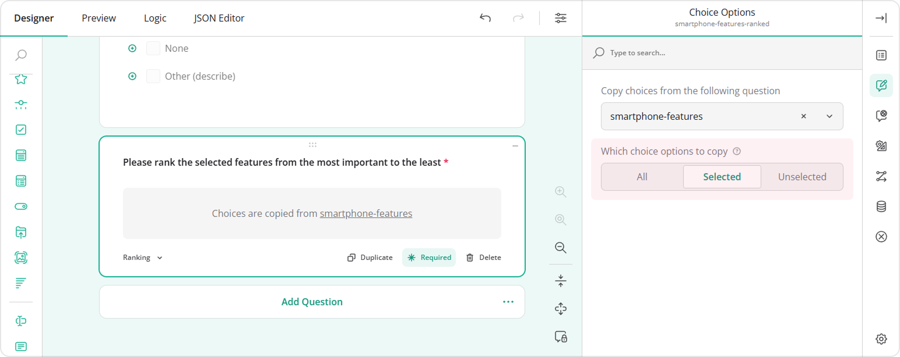

The **None** and **Other** choice options are passed by default if enabled in the source question.

## Limitations

When choosing the source and target question types for Carry Forward, take into account the following factors:

- Radio Button Group and Dropdown questions do not support multiple selections; they can pass only one selected choice. For this reason, it's recommended to use them as source questions only if unselected or all choices are required for the follow-up question.
- An Image Picker question passes selected, unselected, or all image/video files if the follow-up question is also an Image Picker type. Otherwise, it passes image/video captions. You can change the selection type&mdash;single or multiple&mdash;by using the **Allow multiple selection** checkbox in the **General** category.
 
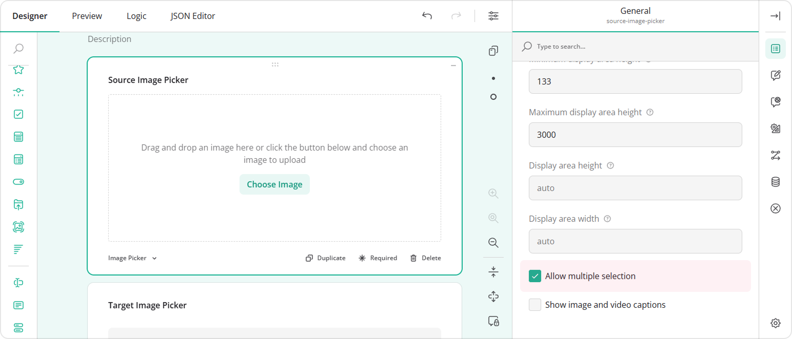

- A Ranking question can be used as a source of all choices only, unless the **Allow selective ranking** checkbox in the **General** category is selected.

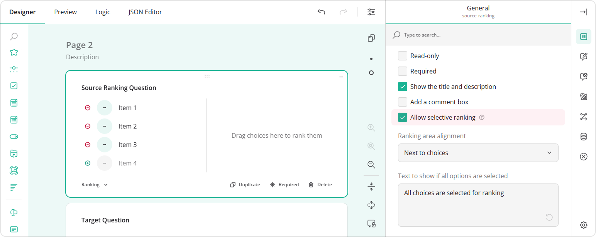

## Examples

### Carry Forward Selected Responses from a Tag Box to a Dropdown

1. Add a **Multi-Select Dropdown** question to the design surface.
2. Assign it a **Question name** (ID) and a user-friendly **Question title**.

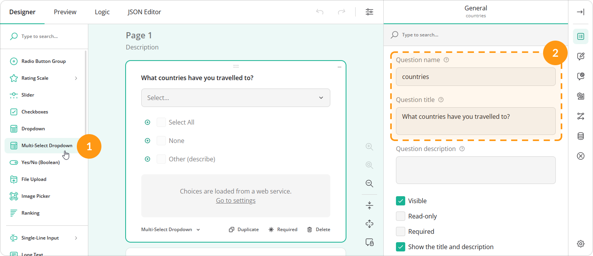

3. Under **Choice Options**, populate the Tag Box with choices.
4. Add a **Dropdown** question to the design surface.
5. Under **Choice Options**, locate the **Copy choices from the following question** setting and select a source question ID (**Question name** value) from the drop-down list of available questions.
6. Locate the **Which choice options to copy** setting and click **Selected**.

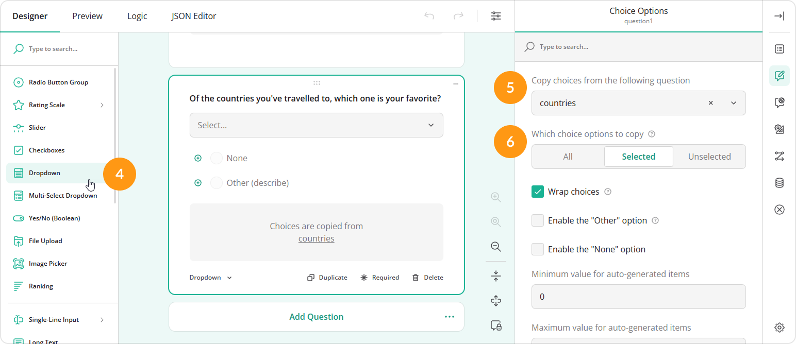

7. Switch to the **Preview** tab to test the configuration.

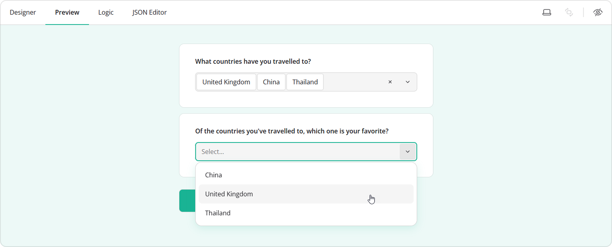

### Carry Forward Selected Responses from Checkboxes to a Radio Button Group

1. Add a **Checkboxes** question to the design surface.
2. Assign it a **Question name** (ID) and a user-friendly **Question title**.

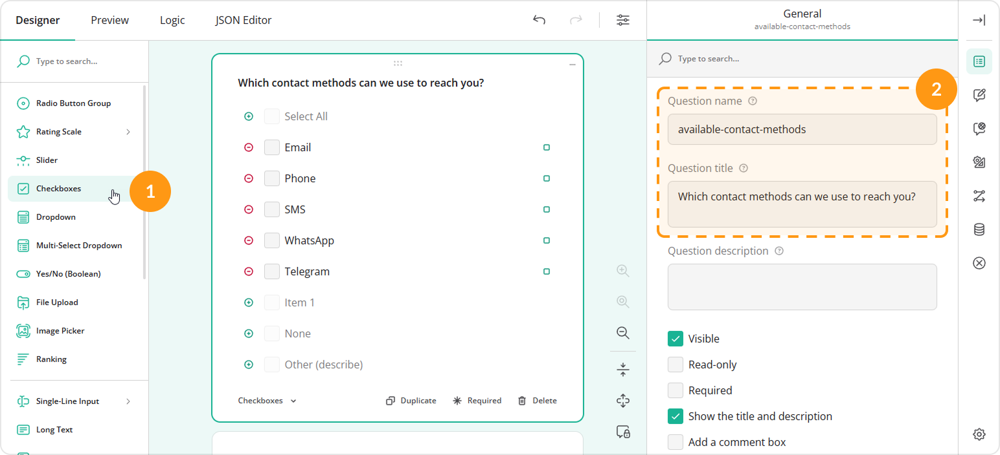

3. Under **Choice Options**, populate the Checkboxes question with choices.
4. To restrict the number of items a respondent can select, under **Choice Options**, locate the **Minimum choices to select** and **Maximum choices to select** settings and enter the required values.

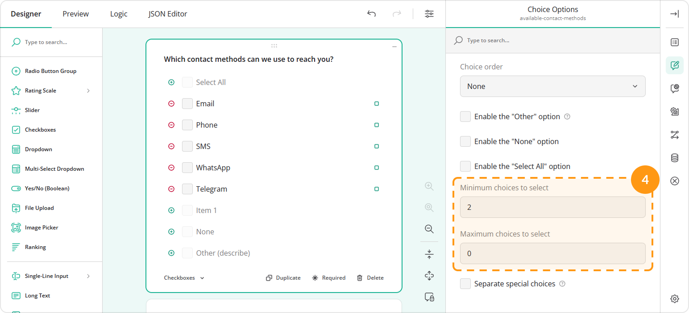

5. Add a **Radio Button Group** question to the design surface.
6. Under **Choice Options**, locate the **Copy choices from the following question** setting and select a source question ID (**Question name** value) from the drop-down list of available questions.
7. Locate the **Which choice options to copy** setting and click **Selected**.

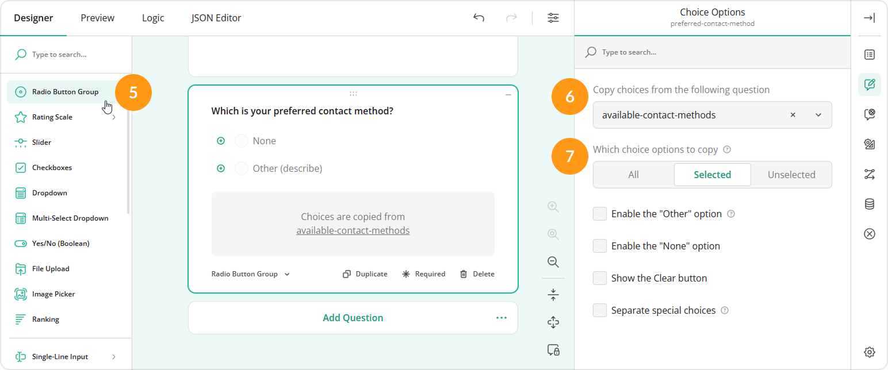

8. Switch to the **Preview** tab to test the configuration.

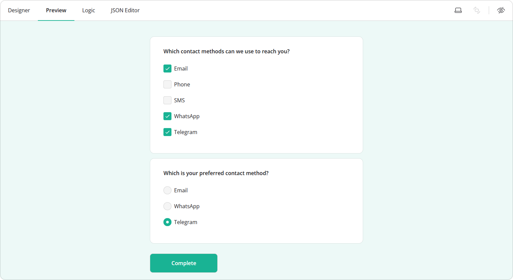

### Carry Forward Unselected Responses Between Radio Button Groups

1. Add a **Radio Button Group** question to the design surface.
2. Assign it a **Question name** (ID) and a user-friendly **Question title**.
3. Under **Choice Options**, populate the Radio Button Group with choices.
4. Add another **Radio Button Group** question to the design surface.
5. Under **Choice Options**, locate the **Copy choices from the following question** setting and select a source question ID (**Question name** value) from the drop-down list of available questions.
6. Locate the **Which choice options to copy** setting and click **Unselected**.

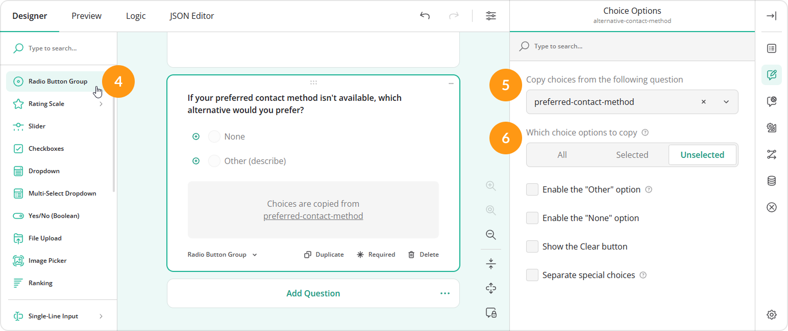

7. Switch to the **Preview** tab to test the configuration.

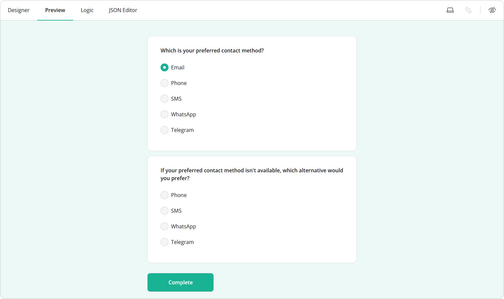

### Carry Forward Selected Responses from a Tag Box to a Ranking Question

1. Add a **Multi-Select Dropdown** question to the design surface.
2. Assign it a **Question name** (ID) and a user-friendly **Question title**.
3. Under **Choice Options**, populate the Tag Box with choices.
4. Optionally, specify the **Choice Options** > **Maximum choices to select** setting to limit the number of choices a respondent can select.

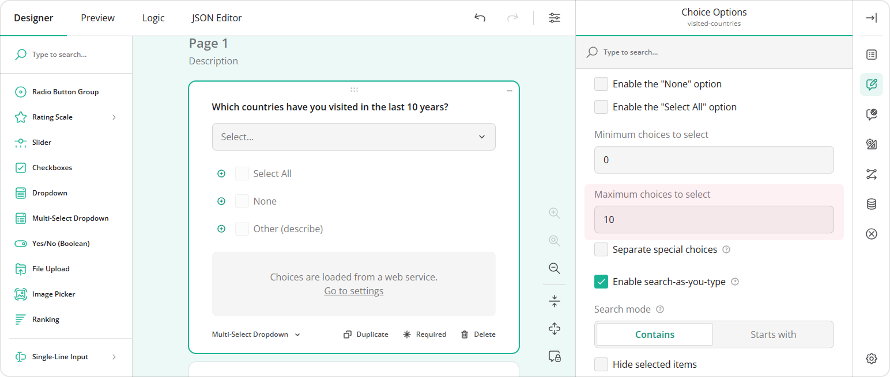

5. Add a **Ranking** question to the design surface.
6. Under **General**, select the **Allow selective ranking** checkbox.

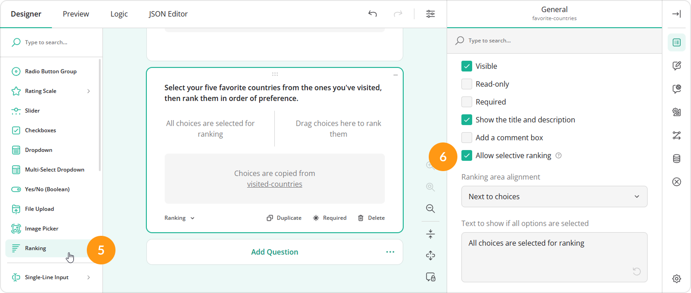

7. Under **Choice Options**, locate the **Copy choices from the following question** setting and select a source question ID (**Question name** value) from the drop-down list of available questions.
8. Locate the **Which choice options to copy** setting and click **Selected**.
9. Set a required value in the **Maximum choices to select** input field.

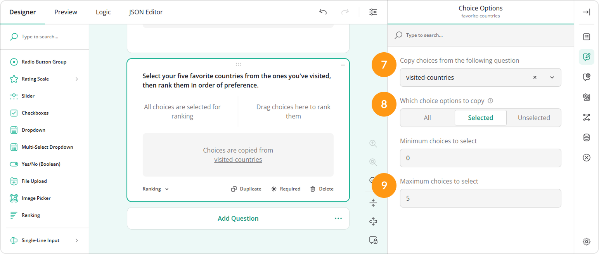

10. Switch to the **Preview** tab to test the configuration.

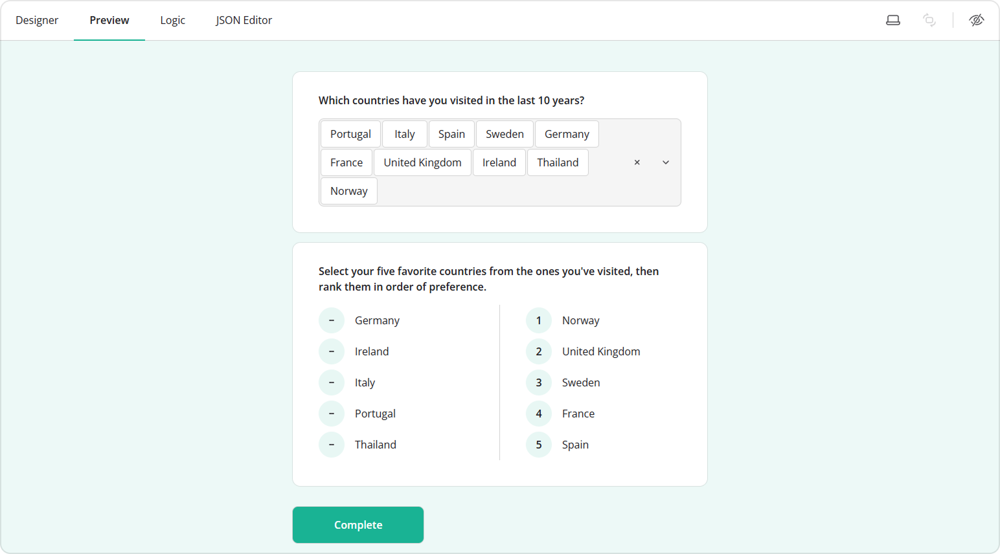
