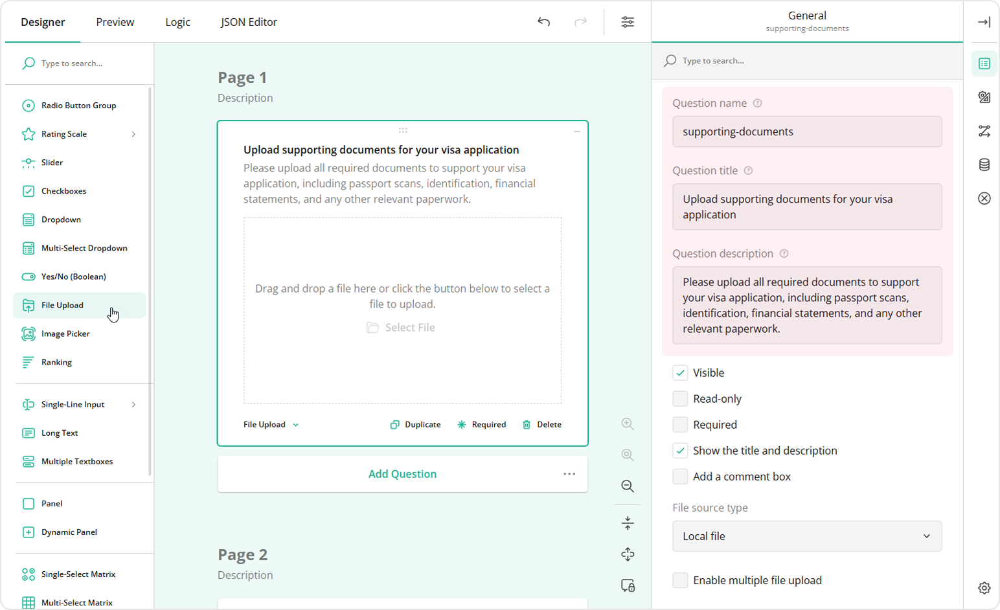
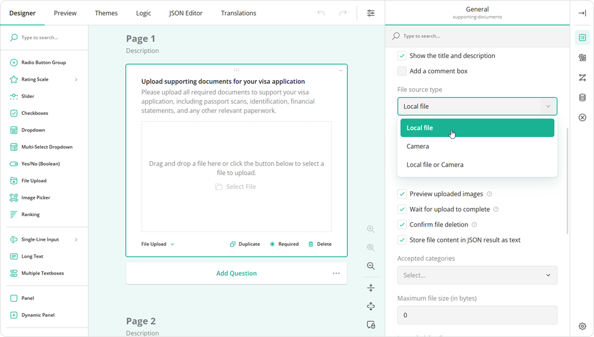
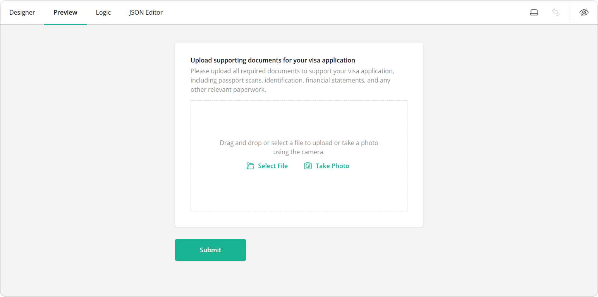
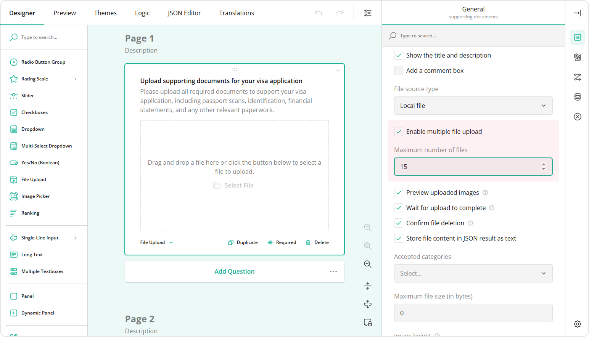
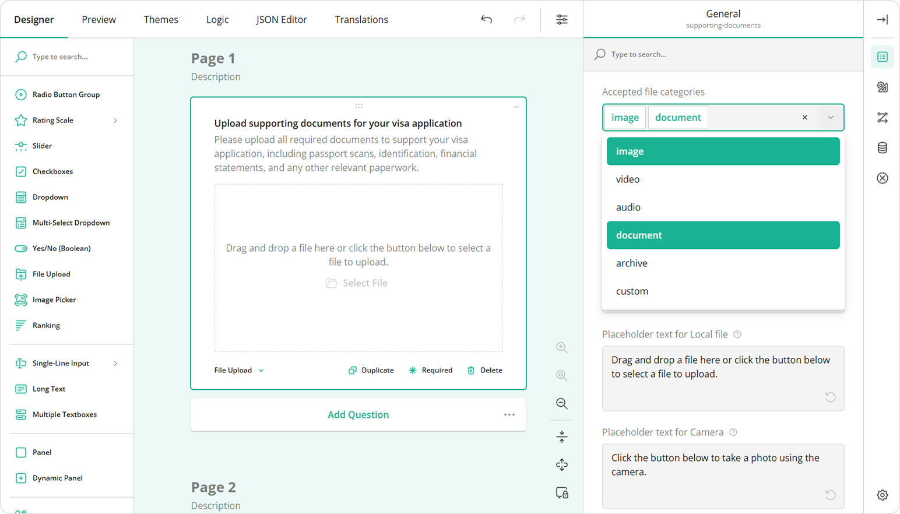
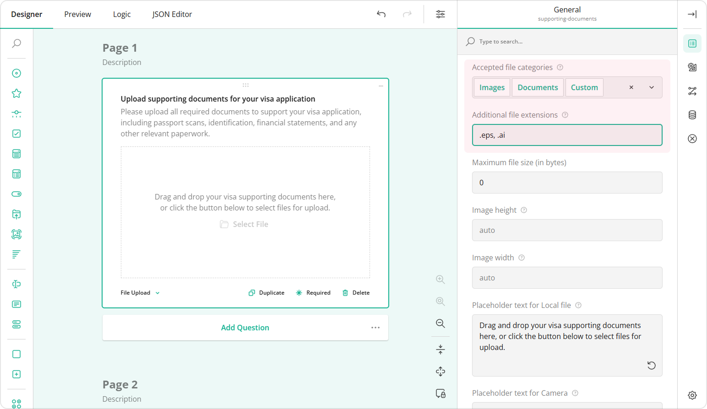
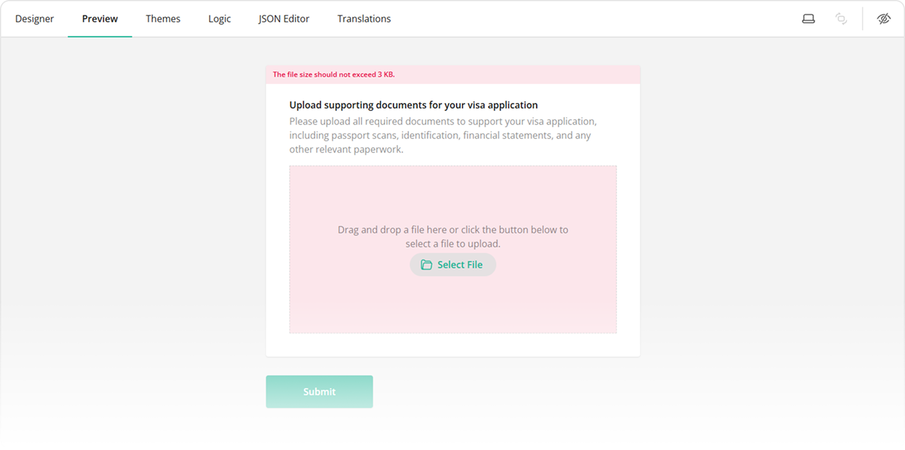
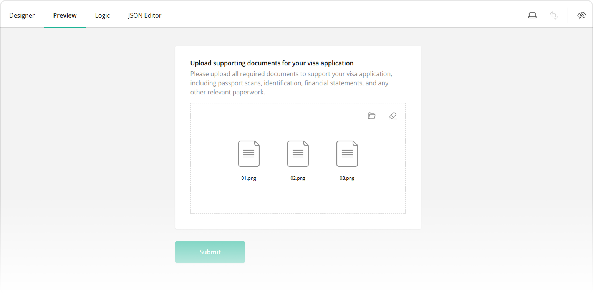
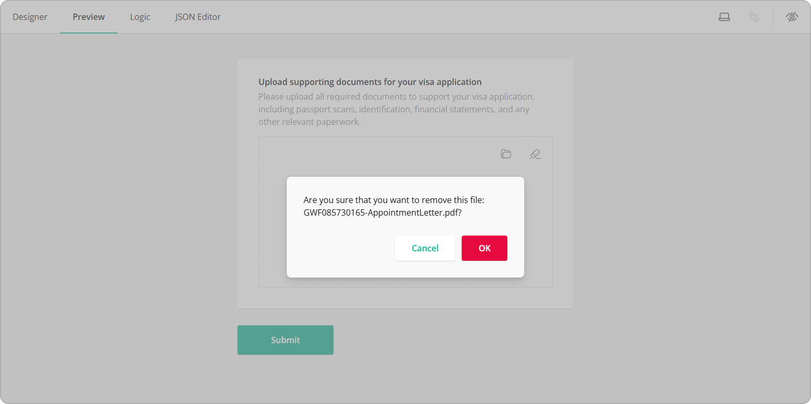

# How to Create a Form with File Upload

## About File Upload Questions

Adding a File Upload question to a form allows respondents to attach supporting files directly to the form. This keeps all collected data in one place and reduces the need to request files separately via email or other channels. Respondents can provide documents, images, or other file types as part of their response.

Unlike with many SaaS survey platforms such as Google Forms, when you use SurveyJS, you store data in your own database. Because of this architecture, **there are no storage limits from our side**, and you can allow your respondents to upload as many files as needed.

Our File Upload question comes with a wide range of customization options that let you control the file source, the number of files allowed, file types, file size limits, image display settings, and more. This guide explains all available file upload settings and how to configure them in a form.

## How to Add a File Upload Question to Your Form

### Add the File Upload Element

Drag the **File Upload** question to your form from the Toolbox and specify the **Question name, title and description** to let respondents know what type of files to upload.

### Select the File Source Type

File Upload supports the following source types:

- **Local file** - Uploads files from the respondent's device.
- **Camera** - Takes a photo or video directly from a device camera.
- **Local file or Camera** - Allows the respondent to use both options.

When the **Local file or Camera** option is enabled, the respondent sees two buttons that let them either activate their device camera or access their local files.

### Enable Multiple File Upload

Select the **Enable multiple file upload** checkbox if you want respondents to attach more than one file to your form. Optionally, set the **Maximum number of files** a respondent is allowed to upload. By default, this is 1000 items.

### Specify Accepted File Types

**Accepted file categories** defines which file type groups respondents are allowed to upload.

The table below shows specific file types included in each category.

| Category | Allowed File Types |
| ----- | ----- |
| Documents | .pdf, .doc, .docx, .ppt, .pptx, .txt, .xls, .xlsx, .rtf, .csv |
| Images | .jpg, .jpeg, .png, .gif, .bmp, .tiff, .svg |
| Videos | .mp4, .mov, .avi, .mpeg, .mpg, .wmv, .flv, .mkv, .webm |
| Audio | .mp3, .m4a, .wav, .ogg, .flac, .wma, .aac |
| Archives | .zip, .rar, .7z, .tar, .gz |

Even though the built-in categories cover the most popular file extensions, you can enter additional file types separated by commas (e.g., .epc, .ai) in the **Additional file extensions** field. Select **Custom** from **Accepted file categories** for this field to appear.

### Specify Maximum File Size

**Maximum file size (in bytes)** allows you to limit the total size of uploaded files. The table below shows common file size units converted into bytes.

| File Size | Bytes |
| ----- | ----- |
| 1 KB | 1,024 B |
| 1 MB | 1,048,576 B |
| 1 GB | 1,073,741,824 B |

When selected files exceed the allowed value, the respondent will be informed with a validation error message.

### Configure File Preview

**Preview uploaded images** enables or disables the preview of uploaded image files.

**Image height** and **Image width** specify the display height and width of uploaded images in the preview, as well as the actual height of images taken with the camera. When multiple file upload is disabled, the image's display height is constrained by the preview area; when multiple file upload is enabled, it's constrained by the thumbnail area instead.

### Other Settings

- **Wait for upload to complete**\
Prevents respondents from proceeding to the next page or submitting the form without waiting for all uploaded files to finish loading. We recommend keeping this setting enabled to prevent unintended data loss.

- **Store file content in JSON result as text**\
When this option is enabled, all uploaded files, including images, are stored in the survey results JSON schema as Base64 URLs. If you are collecting large images, which could significantly increase the size of the result JSON object, we recommend uploading images directly to your server and only saving image links in the survey results. Refer to this [demo guide](https://surveyjs.io/survey-creator/examples/file-upload/documentation) to learn more.

- **Confirm file deletion**\
Displays a confirmation popup when a user removes an uploaded file.

