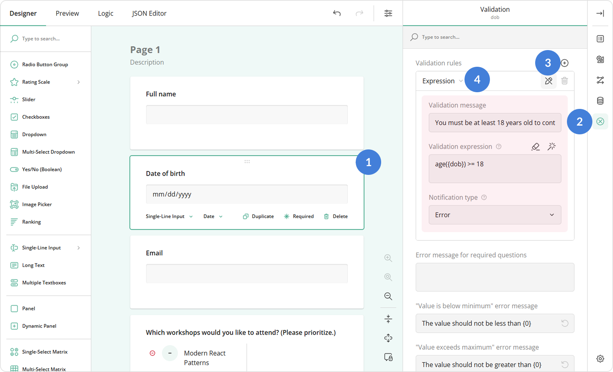

# How to Use Data Validation in Your Forms

## About Data Validation

Data validation ensures that the information people enter into your form is correct, useful, and complete. Without validation, users could enter anything&mdash;too many characters, wrong formats, empty values, etc. Validation checks user input against specific rules before the form accepts it.  

For example, data validation can make sure that text does not exceed a required length, an email address complies with the format, a number falls within a certain range (like ages between 18 and 65), or at least a certain number of options are selected.  

Because of this, validation is widely used in almost every form. In this guide, we will show how you can create validation rules using validators and built-in validation properties supported by individual input types.

## What Are Validators

A validator is a rule that checks a user's answer against a condition. If the answer doesn't meet the condition, the form displays a notification message. Validators can block form submission or simply warn or inform the user, depending on the type of notification you choose.

Survey Creator supports the following validator types:  

| Type | Description |
|---|---|
| Text | Ensures the entered text length is within a minimum and maximum character range. |
| Number | Ensures the answer is a number and checks if it falls between a minimum and maximum value. |
| Email | Ensures the answer is a valid email address. |
| Answer&nbsp;Count | Ensures a user selects no fewer than the minimum number of choices and no more than the maximum number. Applies to multi-choice questions. |
| Regex | Ensures the entered value matches a regular expression you define. |
| Expression | Checks that a logical expression evaluates to `true`. If not, validation fails and the question displays a notification message. |

## Validator Notification Types

Starting from **v2.3.8**, all validators allow you to choose the type of notification shown when validation fails:  

- **Error** - Blocks form submission until the problem is fixed (red).
- **Warning** - Lets users continue but shows a caution message (orange).
- **Informational** - Provides a helpful note that doesn't stop submission (blue).

If you create multiple validation rules of different types for the same question, the form will first display error messages when triggered. Once the user corrects their input, a warning message will appear, and so on.

By default, validation runs when a user moves to a different page. In a single-page form, this means warning and informational messages may go unnoticed, as they don't prevent users from proceeding to another page or submitting the form. For this reason, **we recommend running validation immediately after a user enters their answer**. To enable this in your form, follow these steps:

1. Switch to the survey level settings.
2. Under **Validation**, locate the **Run validation** property.
3. Select **After an answer has changed**.

## Supported Validators by Question Type

| Validator | Supported Question Types |
|-----------|---------------------------|
| Text | Single-Line Input, Long Text |
| Numeric | Single-Line Input with **Input type** set to **Number** |
| Email | Single-Line Input with **Input type** set to **Email** |
| Answer&nbsp;Count | Checkboxes, Multi-Select Dropdown, Image Picker, Ranking with **Allow selective ranking** enabled |
| Regex | Single-Line Input, Long Text |
| Expression | All question types, except File Upload, Panel, HTML, and Image |

## How to Use Each Validator

### Text Validation

The Text validator controls how long the input text can be. To create a text validation rule, follow these steps:

1. Select a Single-Line Input or Long Text question on the design surface.
2. Switch to the **Validation** category in the Property Grid.
3. In the **Validation rules** property, click the **Plus** icon to add a new rule.
4. Select **Text** from the validation type dropdown.
5. Configure the rule using these properties:
   - **Minimum length** - The fewest characters allowed.  
   - **Maximum length** - The most characters allowed.  
   - **Allow digits** - Uncheck to prevent numbers in the answer.  
   - **Validation message** - Custom message to display when limits are not respected.  

The Text validator checks input only *after* the user leaves the input field or attempts to move forward in the form (depending on the chosen validation mode). This means users can temporarily enter more characters than allowed. To *block* extra characters from being entered, use the **Maximum character limit** property instead. Both features prevent invalid input at submission, but they differ in how the form behaves while users are typing.

### Numeric Validation

Numeric validation lets you restrict input to a specific number range. To set up numeric validation, follow the steps below:

1. Select a Single-Line Input question on the design surface.
2. In the **General** category, open the **Input type** dropdown and select **Number**.
3. Switch to the **Validation** category in the Property Grid.
4. In the **Validation rules** property, click the **Plus** icon to add a new rule.
5. Select **Number** from the validation type dropdown.
6. Configure the rule using these properties:
    - **Minimum value** - The lowest number allowed.
    - **Maximum value** - The highest number allowed.
    - **Validation message** - Custom text to display when the value is outside the allowed range.

When Single-Line Input is set to type **Number**, its built-in **Min** and **Max** validation properties become available:

**Min** and **Max** provide a quick way to define the allowed range of values, but they always display the default error message. To show a custom message, use the **Number validator** instead.

You can use the **Min** and **Max** properties together with the **Number validator**. For example, you can set **Min** and **Max** to enforce valid numeric input, and then add a validation rule with the **Notification type** set to **Warning** to display a caution message without blocking form submission. In this setup, users must first correct invalid input; once it's valid, the warning appears if the rule conditions are still not met.

### Email Validation

Email validation ensures that users enter a properly formatted email address. To enable it, follow the steps below:

1. Select a Single-Line Input question on the design surface.
2. In the **General** category, open the **Input type** dropdown and select **Email**.

With this setup, the form field will display a default error message for invalid email addresses. To provide a custom message, do the following:

1. Switch to the **Validation** category in the Property Grid.
2. In the **Validation rules** property, click the **Plus** icon to add a new rule.
3. Select **Email** from the validation type dropdown.
4. Specify the **Validation message** property.

### Answer Count Validation

The Answer Count validator ensures that respondents select a number of options within the defined minimum and maximum. To configure it, follow these steps:

1. Select a multi-choice question (for example, Checkboxes) on the design surface.
2. Switch to the **Validation** category in the Property Grid.
3. In the **Validation rules** property, click the **Plus** icon to add a new rule.
4. Select **Answer count** from the validation type dropdown.
5. Configure the rule using these properties:
     - **Minimum count** - The minimum number of options a user must select.
     - **Maximum count** - The maximum number of options a user can select.
     - **Validation message** - Custom text to show if the user selects too few or too many options.

Alternatively, you can use the built-in **Minimum choices to select** and **Maximum choices to select** properties in the **Choices** category. The key differences are in behavior:

- When the minimum condition is not met, the form field displays an error message as shown below. If you set the condition using the **Minimum choices to select**, you cannot customize the error message. The **Answer Count validator** allows you to do it.
    
- When the maximum condition is reached, the **Maximum choices to select** property disables further selection (see the illustration below). The **Answer Count validator**, on the other hand, allows selections to exceed the maximum number and displays an error only when the user leaves the field or moves forward in the form.
    
- The **Minimum/Maximum choices to select** properties always produce an error, which requires correction and prevents the user from submitting the form. With the **Answer Count validator**, you can configure the notification type as a warning or informational note.

Choose the option that best fits your use case.

### Regex Validation

The Regex validator enforces a custom input pattern. To configure this validator, follow the steps below:

1. Select a Single-Line Input or Long Text question on the design surface.
2. Switch to the **Validation** category in the Property Grid.
3. In the **Validation rules** property, click the **Plus** icon to add a new rule.
4. Select **Regex** from the validation type dropdown.
5. Configure the rule using these properties:
     - **Regular expression** - A pattern that defines the allowed values.  
     - **Case insensitive** - Select this if uppercase and lowercase letters should be treated as equivalent.  
     - **Validation message** - A message that explains the required value format to the user.

### Expression Validation

The Expression validator checks answers against a logical expression. Instead of defining what is invalid, you specify the condition that must be valid.

To configure this validator, follow the steps below:

1. Select a question on the design surface.
2. Switch to the **Validation** category in the Property Grid.
3. In the **Validation rules** property, click the **Plus** icon to add a new rule.
4. Select **Expression** from the validation type dropdown.
5. Configure the rule using these properties:
     - **Validation expression** - A Boolean expression that must evaluate to `true` for the answer to be accepted. See the [Expression Syntax Guide](https://surveyjs.io/survey-creator/documentation/end-user-guide/expression-syntax) for examples, or click the **Magic wand** icon to build the expression using the GUI.
     - **Validation message** - The error text shown when the expression evaluates to `false`.

## See Also

- [How to Prevent Duplicate Form Submissions from the Same User](/survey-creator/documentation/end-user-guide/prevent-duplicate-forms-submissions)
- [How to Customize Validation Messages](/survey-creator/documentation/end-user-guide/customize-validation-messages)
