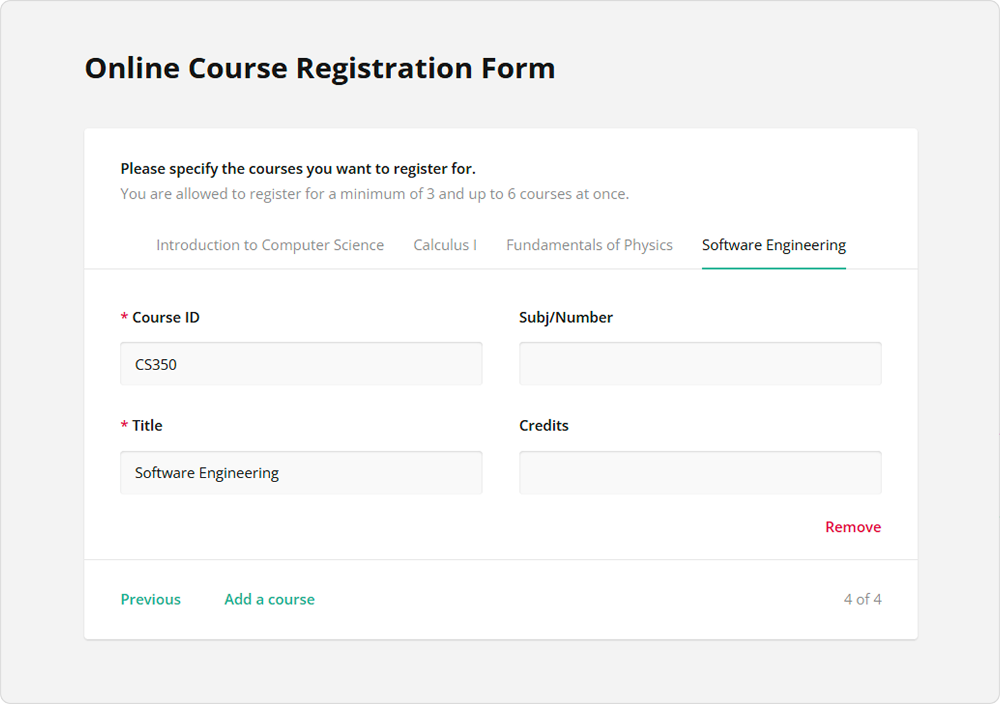
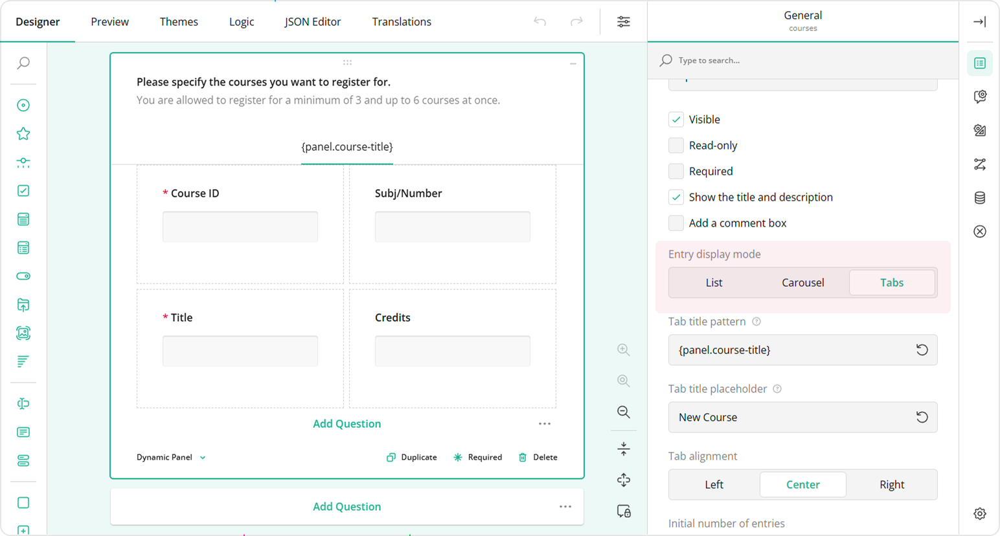
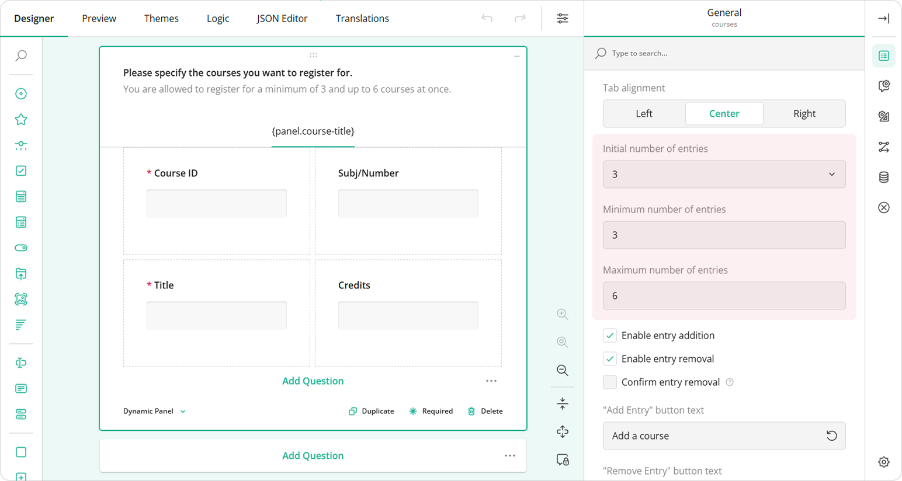
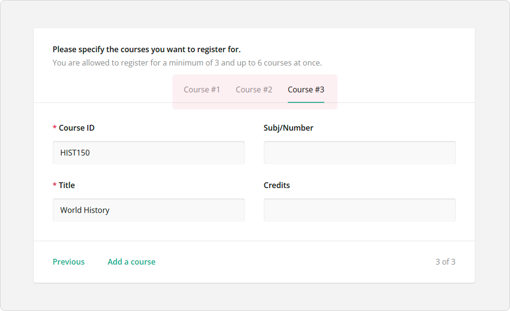
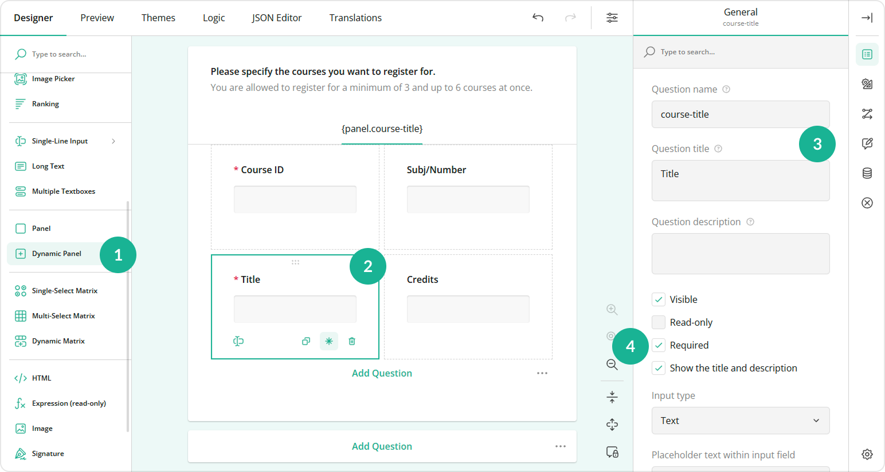
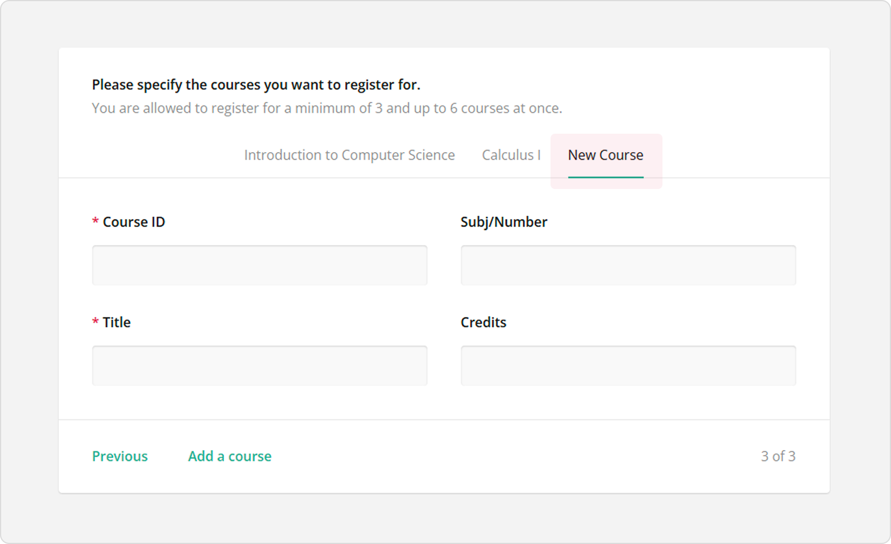
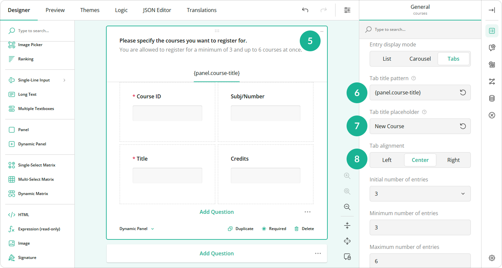

# How to Set and Format Dynamic Tab Titles in Dynamic Panel

## About Dynamic Panel

Dynamic Panel is a question type that allows you to create a set of grouped questions or form fields that a respondent can dynamically duplicate. When respondents are filling out a form, they see the initial group of fields within Dynamic Panel. If they need to add another set of responses, they click the "Add new" button which generates an additional group of fields identical to the first. They can add as many extra sets or fresh copies of these fields as needed to provide all necessary information. This question type is particularly useful in scenarios where the number of responses or entries cannot be predetermined.

Imagine a survey collecting data on projects that employees have worked on. Instead of having a fixed number of project fields, Dynamic Panel allows each employee to add as many project entries as necessary. Another example is a course registration form that collects data on courses a student wants to enroll on.

## Tab View

Dynamic Panel's **Entry display mode** property located under **General** allows you to choose how entries with nested fields are placed in relation to each other and how they are navigated by a respondent.

When the **Entry display mode** is set to **Tabs**, each entry is represented by a tab. Entries are navigated using tab titles. This mode allows respondents to easily switch to any entry by clicking on the corresponding tab title.

## Number of Entries

Dynamic Panel includes the following settings that allow you to manage the number of entries:

- Initial number of entries       
Specifies the number of entries that are initially displayed when the form is first loaded.

- Minimum number of entries           
Specifies the minimum number of entries that must be filled out. This setting ensures that at least a certain number of entries are collected before the form can be submitted.

- Maximum number of entries           
Specifies the maximum number of entries that can be added by the respondent. This setting restricts the total number of entries, preventing respondents from adding more than the specified limit.

## Tab Title

As mentioned earlier, dynamic entries are navigated using tab titles. The **Tab title pattern** property allows you to create a pattern for dynamically generated tab titles.

### Dynamic Entry Numbering

You can change the default entry title format by assigning each new entry a number. To do this, follow the steps below:

1. Add a **Dynamic Panel** to the design surface.
1. Under **General**, locate the **Entry display mode** property and set it to **Tabs**.
1. Locate the **Tab title pattern** field.
1. Enter `{panelIndex}`.

You can also add any text before or after the entry index. For example, if each entry represents a course, setting the **Tab title pattern** property to `Course #{panelIndex}` will result in entry titles look as follows:

### Dynamic Entry Title Pattern

It's easier for respondents to navigate through tabs if each tab is titled using a value they entered in one of the entry fields. For example, if they are listing places of employment, each tab title can be generated using the data entered into the "Employer name" field. Another example is using a "Course name" value to generate a tab title for each selected course.

To generate a dynamic entry title that uses a user's response to one of the entry fields, follow the steps below:

1. Add a **Dynamic Panel** to the design surface and populate it with questions.
2. Decide a response to which question you want to use as a dynamic entry title and click this question on the design surface.
3. Assign this question a **Question name** and a **Question title**.
4. Make the question **Required** to make sure it receives an answer.

    
5. Select the Dynamic Panel on the design surface.
6. Under **General**, find the **Tab title pattern** property and enter the following sample value: `{panel.course-title}`, where `course-title` is the **Question name** value of the source question for the dynamic title.
7. Set a static value for the **Tab title placeholder** property. This value will be used if the dynamic tab title pattern doesn't produce a meaningful result or if the source question has not yet been answered.

    
8. Optionally, align the tab title to the left, center, or right using the **Tab alignment** property.

    
