# How to Dynamically Set a Date Range Limit in a Date Picker

## About Date Picker

The **Date Picker** question allows respondents to select a date from a calendar in your survey or form. You can use it to collect birthdays, appointment dates, or any other date-related input. The Date Picker also supports validation rules and dynamic limits, which makes it easy to control the dates users can select.

In this guide, you will learn how to use the Date Picker field to validate date-related user input, restrict selectable dates, and define dynamic date ranges. The examples below show how to do the following:

- [Verify a respondent's age](#how-to-run-age-verification-in-a-form)
- [Limit date selection to past or future dates](#how-to-select-past-or-future-dates-only)
- [Prevent users from selecting specific days of the week](#how-to-validate-day-of-the-week)
- [Allow selection only within a predefined time window](#how-to-dynamically-set-date-range-limits-in-the-date-picker)

## How to Run Age Verification in a Form

If you want to make sure respondents meet a minimum age requirement (for example, 18+), you can add a validation rule to your Date input field using the `age()` function.

1. Hover over the **Single-Line Input** question in the Toolbox.
2. Select **Date** to add a Date Picker question to your form.

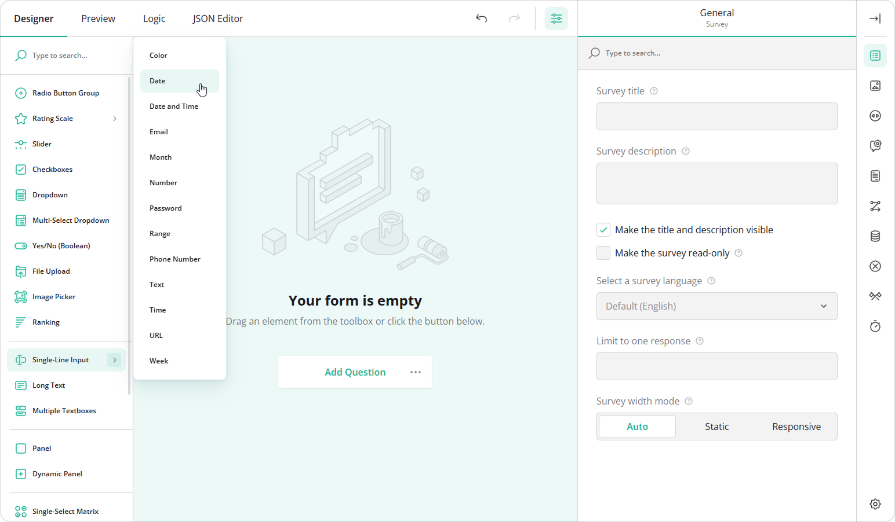

3. In the **General** category, assign the **Question name** (question ID) and a user-friendly **Question title** that will be visible to respondents.
4. Optionally, add a **Question description** and mark the question as **Required**.

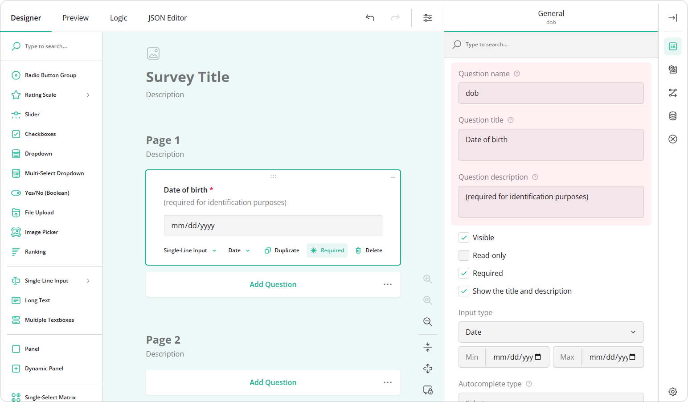

5. In the **Validation** category, locate **Validation rules**, and click **Add new rule**.

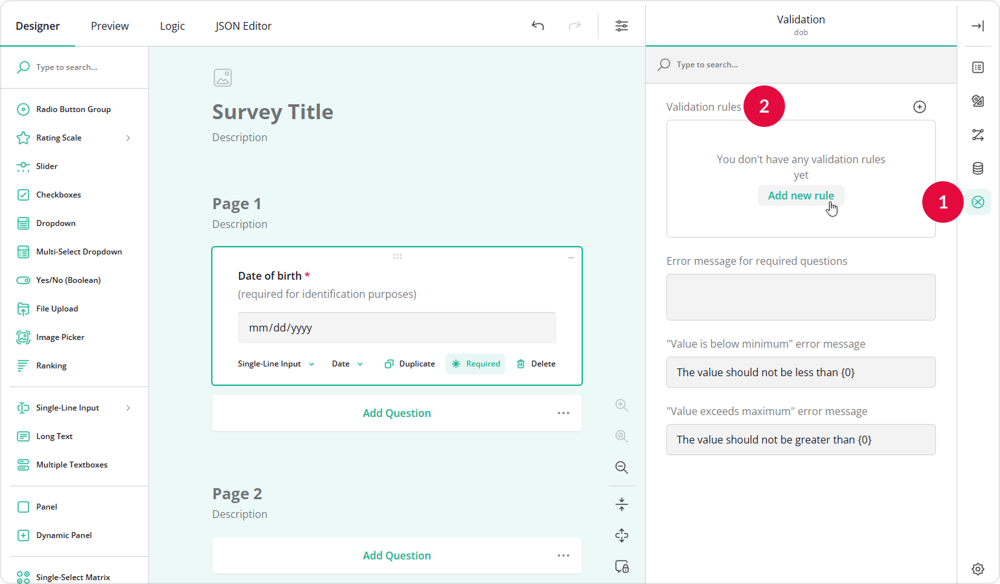

6. In the **Valid when** field, enter the following expression: `age() >= 18`. Here, `age()` is a built-in function that calculates the age based on the entered date of birth.
7. Enter a **Notification message** that will appear if the age requirement is not met.
8. Set the **Notification type**.

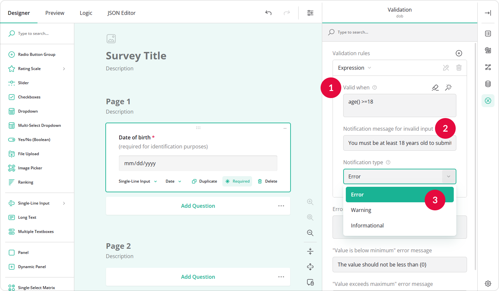

> The default **Notification type** is **Error**, which prevents form submission. You can also choose **Warning** or **Informational**. For more details, see [Validator Notification Types](https://surveyjs.io/survey-creator/documentation/end-user-guide/data-validation-in-forms#validator-notification-types).

By default, SurveyJS runs validation when the respondent moves to another page. To run validation immediately after a date is entered, follow these steps:

1. At the top of the Property Grid, select **Survey** to switch to the survey-level settings.
2. Under **Validation**, locate **Run validation**.
3. Select **After an answer has changed**.

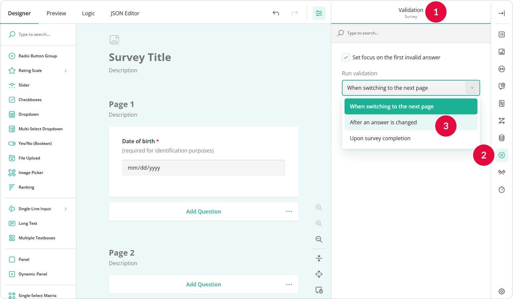

As a result, when a user enters their date of birth and moves to another field, their age is immediately calculated and validated against the threshold of 18.

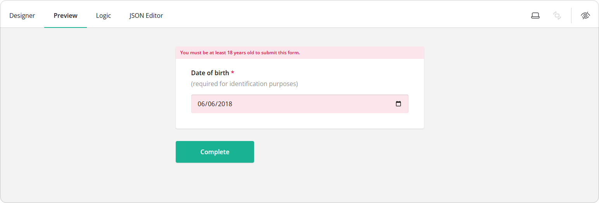

You can validate the age against any other value using the same `age()` function. For example, the expression `age() >= 14` allows only respondents who are at least 14 years old to submit the form.

## How to Select Past or Future Dates Only

Sometimes, you may want to restrict respondents to selecting only past or future dates in relation to the date they fill out the form. This is useful for birthday fields, booking forms, or scheduling events. The examples below show how to disable future and past dates.

### Disable Future Dates

To prevent respondents from selecting future dates:

1. Add a **Date** element to your form.
2. Assign the **Question name** and a **Question title**.

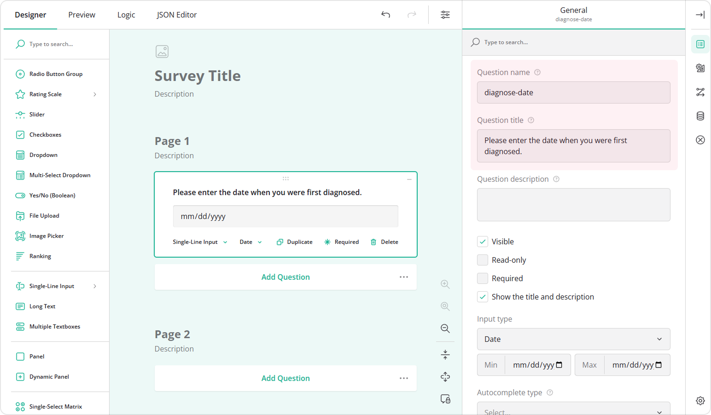

3. In the **Conditions** category, locate **Max value expression**.
4. Enter the following function: `currentDate().`

This disables all future dates, making the current date the maximum available for selection. The `currentDate()` function ensures the limit always reflects the current date, not a fixed one.

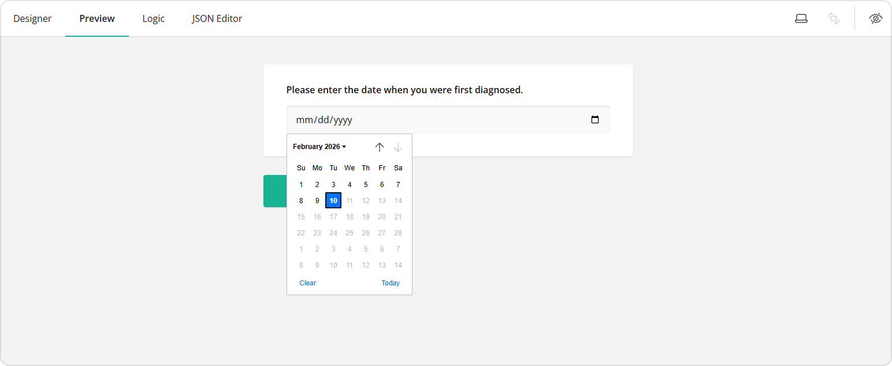

### Disable Past Dates

If you want to disable past dates and allow users to select only future dates (for example, appointment bookings), follow these steps:

1. Add a **Date** element to your form.
2. Assign the **Question name** and a **Question title**.
3. In the **Conditions** category, locate **Min value expression**.
4. Enter the following function: `currentDate()`. This will prevent respondents from selecting any past dates.

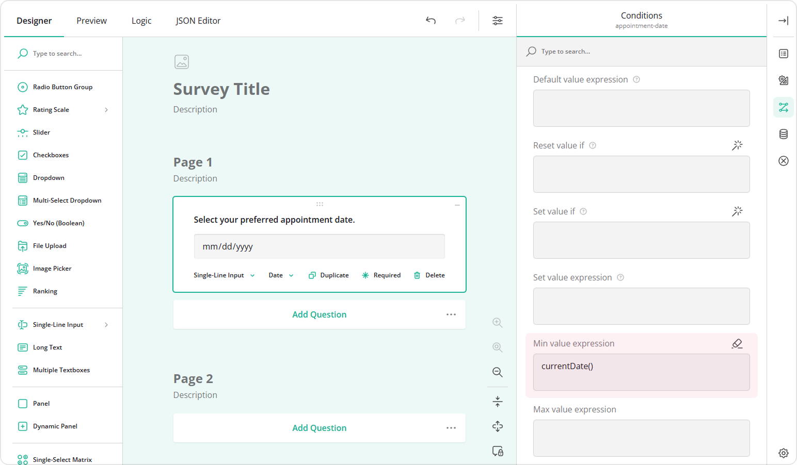

As a result, all dates before the current date will be disabled in the Date Picker.

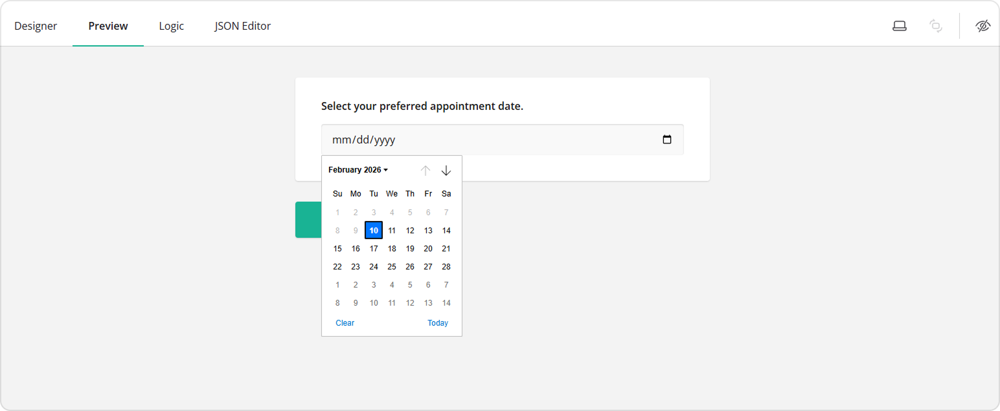

## How to Validate Day of the Week

In certain cases, such as appointment scheduling, you may want to ensure users cannot select specific days of the week (for example, weekends or days when a specialist is unavailable). You might also need to enforce a minimum lead time to prevent users from booking appointments too soon.

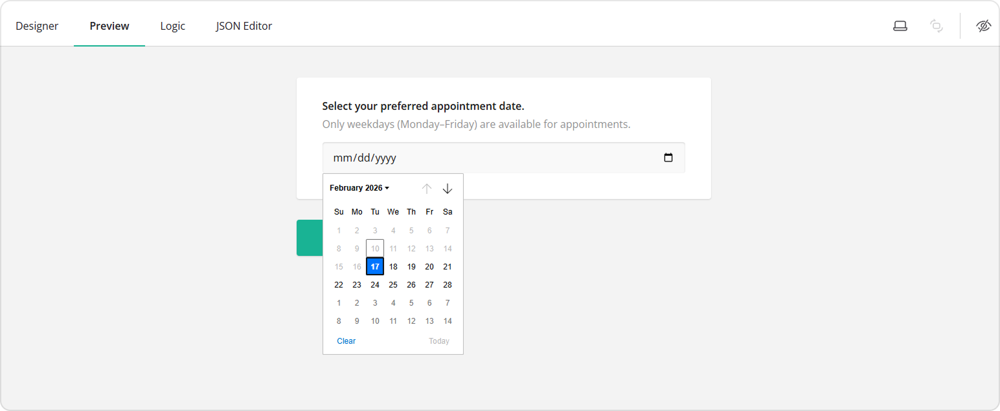

The steps below show how to disable selection of the nearest 7 days and display an error message if a respondent selects Saturday or Sunday for their appointment.

1. Repeat steps 1-4 from the [How to Run Age Verification in a Form](#how-to-run-age-verification-in-a-form) section.
2. In the **Conditions** category, locate **Min value expression**.
3. Enter: `today(7)`. This prevents selection of the nearest 7 days, including today.

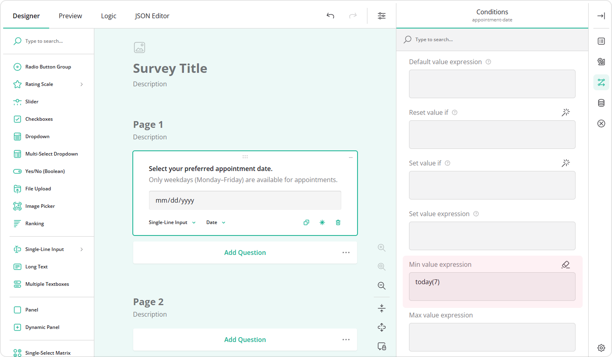

4. In the **Validation** category, click **Add new rule**.
5. In the **Valid when** field, enter: `weekday({appointment-date}) > 0 and weekday({appointment-date}) < 6`.
6. Enter a **Notification message** (for example: "Weekends are not available for appointments").
7. Keep the **Notification type** as is. This ensures the user cannot submit the form if they select Saturday or Sunday for their appointment.

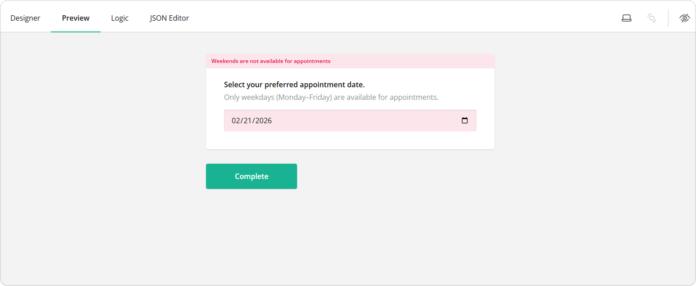

The `weekday()` function uses numbers for each day of the week:

| Day       | Number |
|-----------|--------|
| Sunday    | 0      |
| Monday    | 1      |
| Tuesday   | 2      |
| Wednesday | 3      |
| Thursday  | 4      |
| Friday    | 5      |
| Saturday  | 6      |

For example the expression `weekday({appointment-date}) != 3` prevents a respondent from booking Wednesdays. To learn more about comparison operators (e.g. `>=`, `!=`, etc.), see [Comparison Operators](https://surveyjs.io/survey-creator/documentation/end-user-guide/expression-syntax#comparison-operators).

## How to Dynamically Set Date Range Limits in the Date Picker

You can restrict the Date Picker to allow only a specific range of dates. For example, you might want respondents to select a date within 21 days starting from tomorrow.

1. Repeat steps 1-4 from the [How to Run Age Verification in a Form](#how-to-run-age-verification-in-a-form) section.
2. In the **Conditions** category:
   - For **Min value expression**, enter: `today(1)`. This makes tomorrow the earliest selectable date.
   - For **Max value expression**, enter: `today(22)`. This allows only the next 21 days (starting from tomorrow) to be selectable.

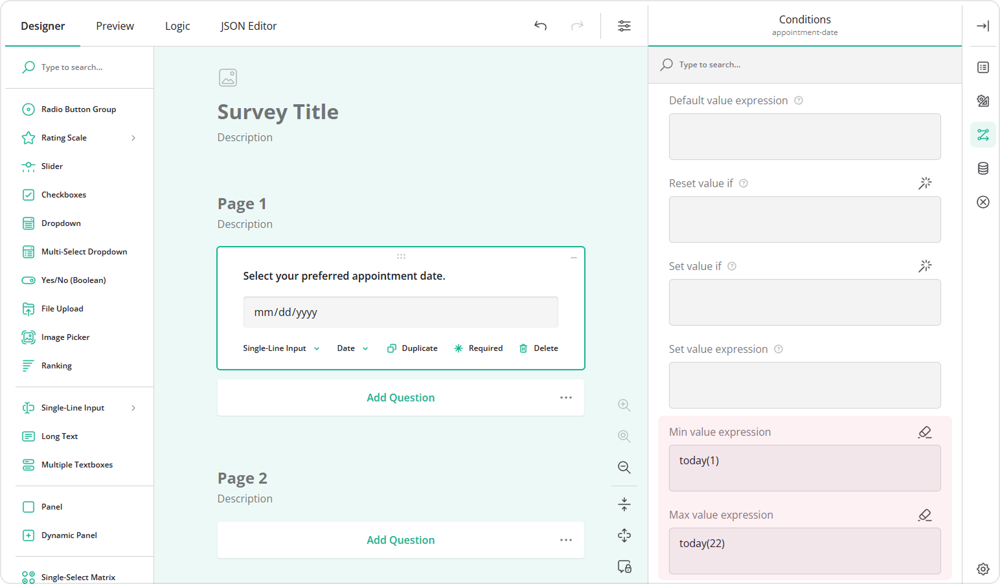

Now your Date Picker is limited to a dynamic date range, automatically updating each day.

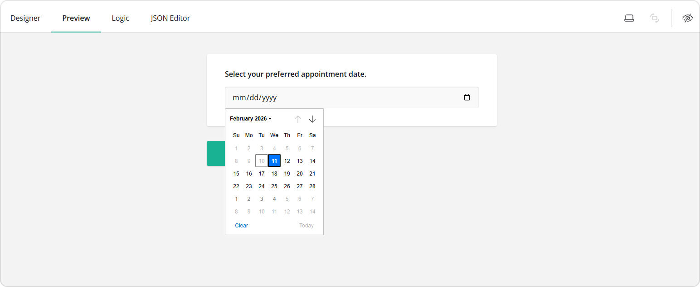

## See Also

- [How to Carry Forward Responses](/survey-creator/documentation/end-user-guide/how-to-calculate-duration-between-dates-within-form)
- [How to Format User Input for Single-Line Fields](/survey-creator/documentation/end-user-guide/how-to-format-user-input-for-single-line-fields)
- [How to Apply Input Masks to Single-Line Text Fields](/survey-creator/documentation/end-user-guide/how-to-apply-input-mask-to-text-fields)
