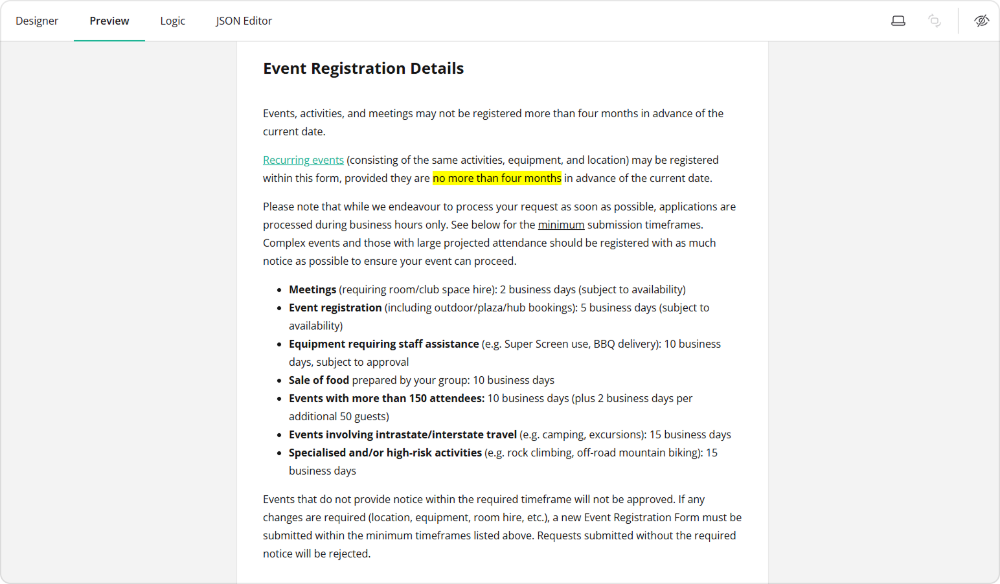
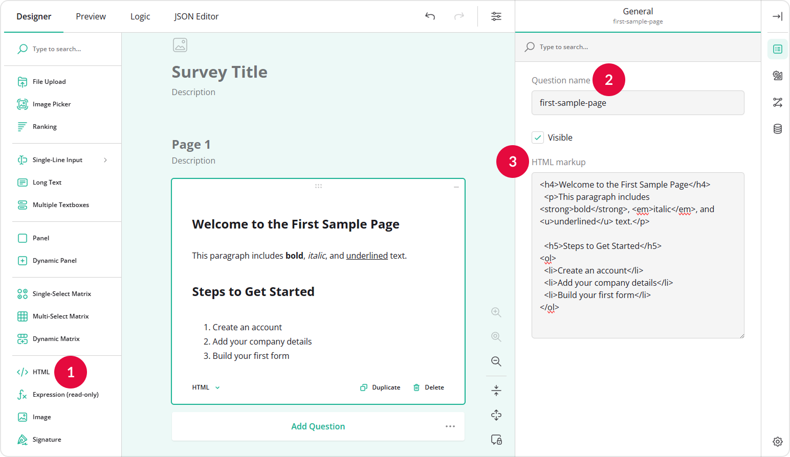
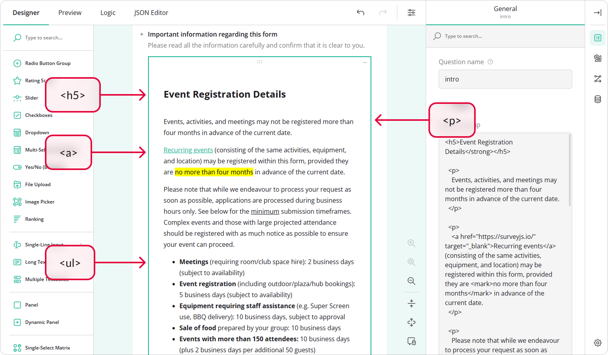
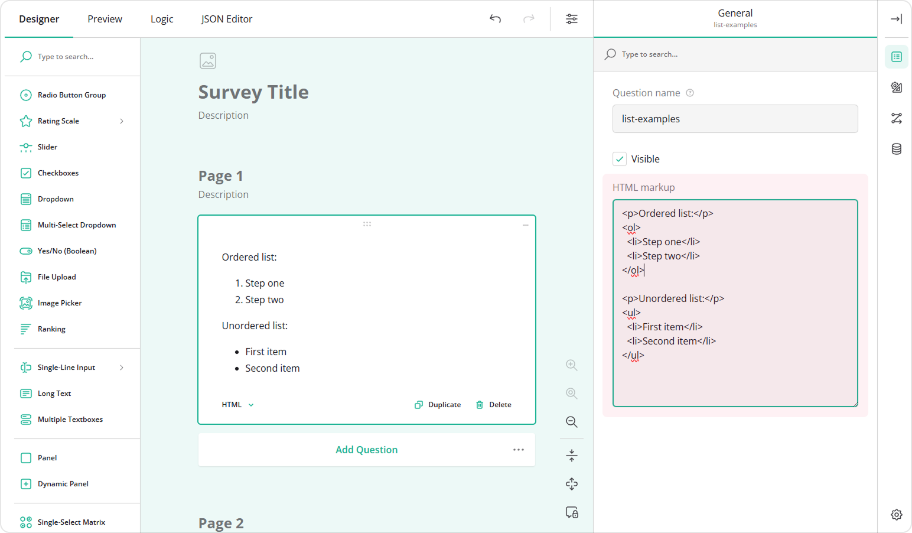
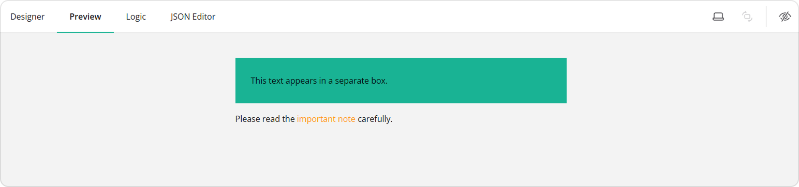
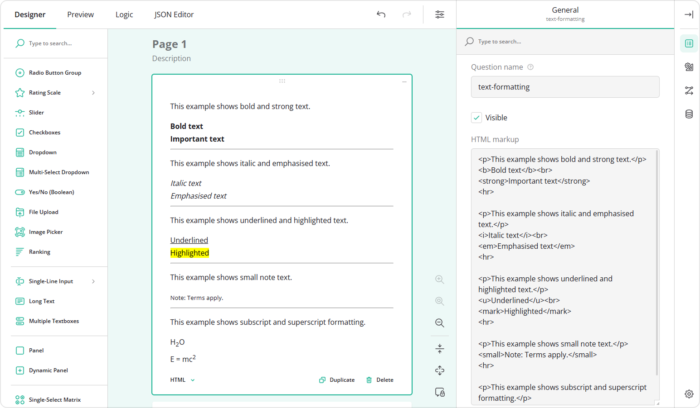

# How to Add Custom Survey Elements Using HTML 

## About Using HTML Markup

HTML markup is the system of tags and elements used to structure content on the web. HTML stands for <a href="https://developer.mozilla.org/en-US/docs/Web/HTML" target="_blank">HyperText Markup Language</a>, and it tells the browser how to display text, images, links, and other content. Survey Creator supports a dedicated input field called HTML that lets you display custom markup inside a survey. What it does:

- Displays formatted content, including links, images, custom text, etc.
- Does **not** collect responses
- Supports standard HTML markup syntax

The image below shows the introduction page of a custom event registration form designed using the built-in HTML field:



## How to Insert Custom HTML into a Form

To add custom HTML markup in your form, follow these steps:

1. Add an **HTML** input to your form.  
2. Assign a **Question name (ID)** to it.  
3. Enter your HTML markup in the **HTML markup** field.



## Tags and Elements

HTML uses **tags** to define elements. For example:

```html
<p>This is text.</p>
```

- `<p>` &ndash; Opening tag.
- `</p>` &ndash; Closing tag.
- `This is text.` &ndash; Element content.

Some tags are <a href="https://www.geeksforgeeks.org/html/what-are-self-closing-tags-in-html/" target="_blank">self-closing</a>, which means they do not require a separate closing tag:

```html
Line one<br>Line two
<hr>
```

- `br` &ndash; Inserts a line break within text.
- `hr` &ndash; Inserts a thematic break (typically rendered as a horizontal rule) between sections.

## Attributes

Attributes provide additional information about elements. For example:

```html
<a href="https://surveyjs.io/" target="_blank">Visit SurveyJS website</a>
```

- `href` &ndash; Specifies the URL the link points to.
- `target` &ndash; Determines where the linked document is opened. For example, `"_blank"` opens the link in a new browser tab.

```html

```
  
- `src` &ndash; Specifies the path or URL of the image file. 
- `alt` &ndash; Provides alternative text displayed if the image cannot be loaded and used by screen readers for accessibility.

## Common HTML Layout Tags

### Headings (h1–h6)

To structure content hierarchically, use the h1-h6 headings. `h1` is the largest heading, `h6` the smallest.

```html
<h1>Main Title</h1>
<h2>Subsection</h2>
```

### Paragraphs

For regular text blocks, use the `<p>` tag.

```html
<p>This is a paragraph.</p>
```

### Links

To create clickable links, use the `<a>` tag.

```html
<a href="https://surveyjs.io/" target="_blank">Visit SurveyJS website</a>
```



### Images

To display images, use the `` tag.

```html

```

### Lists

For unordered lists, use the `<ul>` tag:

```html
<ul>
  <li>First item</li>
  <li>Second item</li>
</ul>
```

For ordered lists, use the `<ol>` tag:

```html
<ol>
  <li>Step one</li>
  <li>Step two</li>
</ol>
```



### Div and Span

The `<div>` and `<span>` elements are generic containers used to structure and style content. They do not add semantic meaning but are essential for layout and formatting.

- `<div>` &ndash; A block-level container. It creates a section that starts on a new line and typically spans the full available width. Use it to group larger sections of content or create layout blocks.
- `<span>` &ndash; An inline container. It is used within a line of text to apply styles or target a specific portion of content without breaking the text flow.

```html
<div style="background: #19B394; padding: 30px;">
  This text appears in a separate box.
</div>
<p>
  Please read the <span style="color: #FF9814;">important note</span> carefully.
</p>
```



## Common HTML Text Formatting Tags

HTML includes a range of text-level elements that enhance readability and help emphasize key information. Some of these tags are purely visual, while others carry semantic meaning that improves accessibility and document structure.



### Bold and Strong Importance

- `<b>` &ndash; Renders text in bold without implying additional importance.
- `<strong>` &ndash; Indicates strong importance; browsers typically display it in bold.

```html
<b>Bold text</b>
<strong>Important text</strong>
```

Use `<strong>` for content that is semantically important. Use `<b>` to draw attention to text without conveying increased importance.

### Italic and Emphasis

- `<i>` &ndash; Displays text in italic without semantic emphasis. 
- `<em>` &ndash; Indicates emphasized text; browsers typically render it in italic.

```html
<i>Italic text</i>
<em>Emphasized text</em>
```

Use `<em>` when the emphasis affects the meaning of the sentence. Use `<i>` for stylistic purposes only.

### Underline and Highlight

- `<u>` &ndash; Underlines text.  
- `<mark>` &ndash; Highlights text to indicate relevance or reference.

```html
<u>Underlined</u>
<mark>Highlighted</mark>
```

### Small and Fine Print

- `<small>` &ndash; Displays text in a smaller font size, typically used for disclaimers or secondary information.

```html
<small>Note: Terms apply.</small>
```

### Subscript and Superscript

- `<sub>` &ndash; Subscript text.  
- `<sup>` &ndash; Superscript text.

```html
H<sub>2</sub>O
E = mc<sup>2</sup>
```

### Line Break and Horizontal Divider

- `<br>` &ndash; Inserts a line break.
- `<hr>` &ndash; Inserts a thematic break between sections (usually rendered as a horizontal rule).

```html
Line one<br>Line two
<hr>
```