# How to Create a Custom Thank You Page

## About Custom Thank You Page

A custom "Thank You" page is a page shown to respondents after they complete a survey. It allows you to provide a personalized message, summarize next steps, or share additional resources. Your "Thank You" page can include formatted text, lists, links, or any other content that helps you communicate effectively with your respondents.

## How to Create a Custom Thank You Page with HTML

To create a rich and well-styled "Thank You" page in Survey Creator, you can use custom HTML markup. To learn more about HTML markup syntax, refer to the following guide: [How to Add Custom Survey Elements Using HTML](https://surveyjs.io/survey-creator/documentation/end-user-guide/how-to-add-custom-survey-elements-with-html).

In the example below, we will create a page that addresses the respondent by name, explains what happens after they submit their response, and provides a link to additional resources.

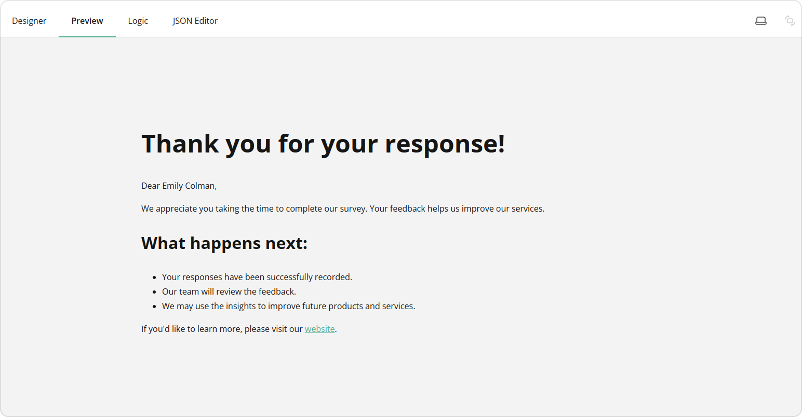

1. Add a **Single-Line Input** question to your form.
2. Assign a **Question name (ID)** to it.

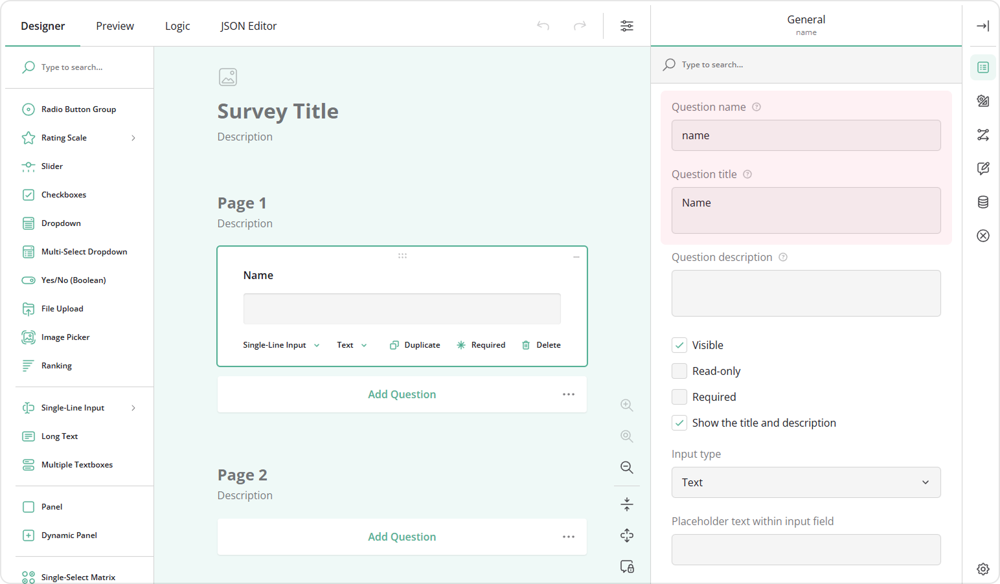

3. Add further questions to your form, for example, a **Rating Scale** question asking *"How would you rate your experience?"*

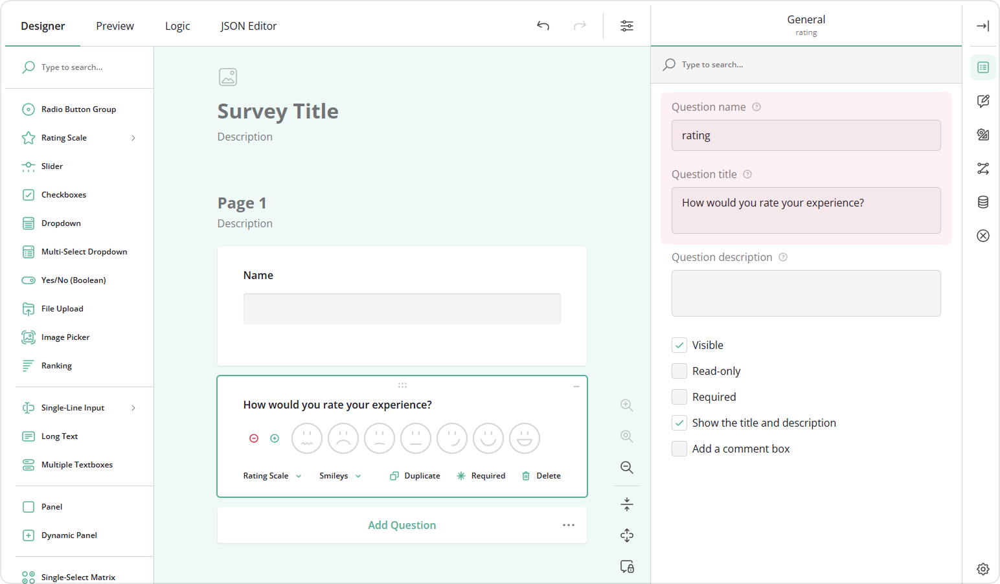

4. In the **"Thank You" Page** category, locate the **"Thank You" page markup** input field.
5. Enter custom markup, for example:

<details>
  <summary>View Code</summary>

```html
<div style="max-width: 1000px; width: 100%; padding 32px; margin: 0 auto; text-align: left;">
<h2>Thank you for your response!</h2>
    <p>Dear {name},</p>
    <p>We appreciate you taking the time to complete our survey. Your feedback helps us improve our services.</p>
    <h3>What happens next:</h3>
    <ul>
      <li>Your responses have been successfully recorded.</li>
      <li>Our team will review the feedback.</li>
      <li>We may use the insights to improve future products and services.</li>
    </ul>
    <p>
      If you'd like to learn more, please visit our
      <a href="https://surveyjs.io/">website</a>.
    </p>
</div>
```

</details>

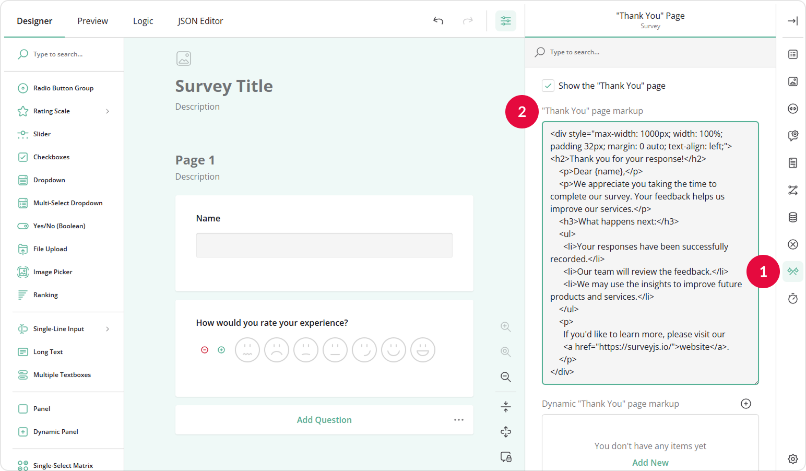

Here, `{name}` is the **Question name (ID)** of the `Name` question. By referencing the question ID in curly brackets, you can pipe and display the respondent's answer to that question in the HTML markup of the "Thank You" and "Welcome" pages, as well as in question titles and descriptions. To learn more about answer referencing, refer to the [Expression Syntax](https://surveyjs.io/survey-creator/documentation/end-user-guide/expression-syntax) guide.

## How to Create a Custom Thank You Page Based on User Response

You can create multiple "Thank You" pages and show them based on respondents' answers. For example, if a respondent rated your service poorly, you can provide a message about improvements. If they rated it highly, you can thank them for their recognition. 

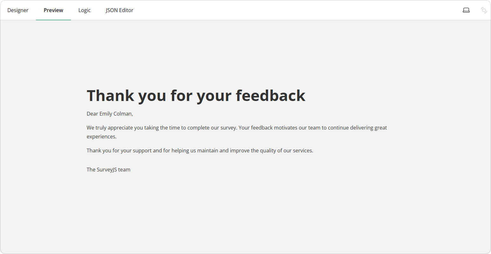

To create a dynamic "Thank You" page based on user response, follow these steps:

1. Repeat steps 1-3 from [the previous section](#how-to-create-a-custom-thank-you-page-with-html).
2. In the **"Thank You" Page** category, locate the **Dynamic "Thank You" page markup** setting.
3. Click **Add New** or the **Plus** icon.

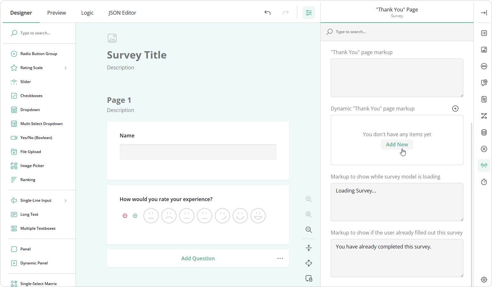

4. Click the **Magic Wand** icon to open a popup for configuring the conditional rule.
5. Select a **variable** and a **condition**.
6. Click **Apply**.

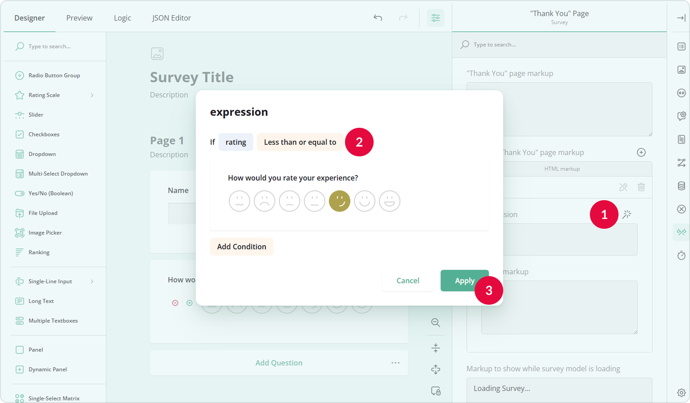

7. In the HTML markup field, add custom HTML that will be displayed to respondents whose answers meet the condition, for example:

<details>
  <summary>View Code</summary>

```html
<div style="max-width: 1000px; width: 100%; padding: 32px; margin: 0 auto; text-align: left;">
  <h2 style="margin-bottom: 16px;">Thank you for your feedback</h2>
    <p>Dear {name},</p>
    <p>
    We appreciate you taking the time to share your thoughts with us.
    Your feedback is very important and helps us understand where we can improve.
  </p>
    <p>
    Our team will carefully review your responses as we continue working
    to improve our services and provide a better experience.
  </p>
    <p>
    Thank you for helping us grow and improve.
  </p>
  <p style="margin-top: 32px;">
    The SurveyJS team
  </p>
</div>
```

</details>

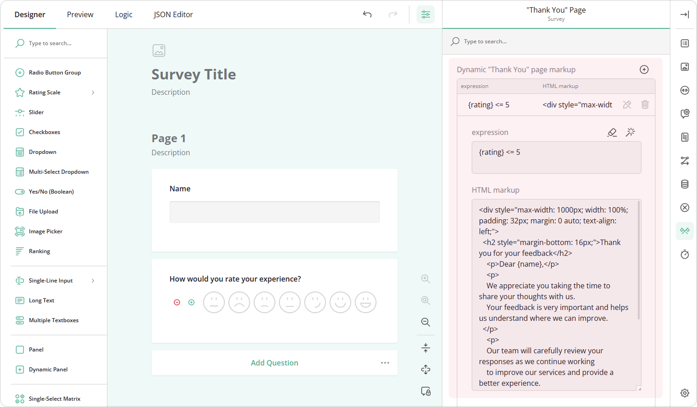

8. In the same way, you can create other versions of the "Thank You" page:

<details>
  <summary>View Code</summary>

```html
<div style="max-width: 1000px; width: 100%; padding: 32px; margin: 0 auto; text-align: left;">
  <h2 style="margin-bottom: 16px;">Thank you for your feedback</h2>
  <p>Dear {name},</p>
  <p>
    We truly appreciate you taking the time to complete our survey.
    Your feedback motivates our team to continue delivering great experiences.
  </p>
  <p>
    Thank you for your support and for helping us maintain and improve the quality of our services.
  </p>
  <p style="margin-top: 32px;">
    The SurveyJS team
  </p>
</div>
```

</details>

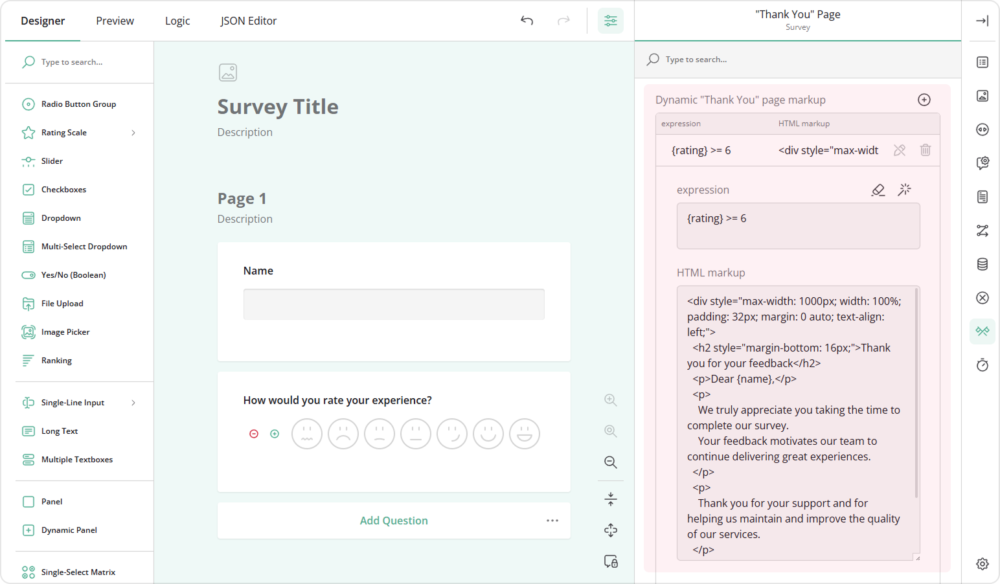

Now, if a respondent rates the experience 6 or 7, they will see the second version of the "Thank You" page. If the rating is 5 or lower, they will see the first version.

## How to Send Respondents to a Custom URL Upon Submission

In some cases, rather than showing users the "Thank You" page, you may wish to send them to an external URL after they submit the form. Redirecting respondents to an external website can be useful for guiding them to additional resources, promotional pages, or follow-up forms.

To send respondents to a custom URL, follow these steps:

1. Repeat steps 1-3 from [the first section](#how-to-create-a-custom-thank-you-page-with-html).
2. In the **"Thank You" Page** category, locate the **Redirect to an external link after submission** property.
3. Enter the URL where respondents should be redirected after submitting the form.

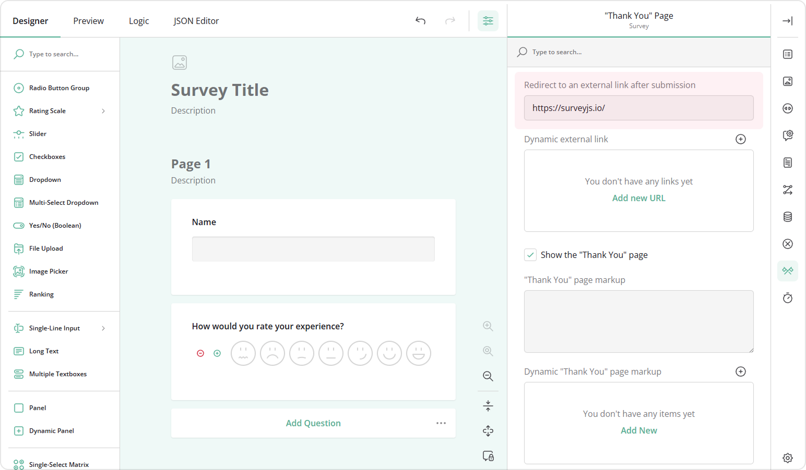

## How to Send Respondents to a Custom URL Dynamically

You can also set up rules to send respondents to different URLs based on their answers. To configure dynamic redirects, follow these steps:

1. Repeat steps 1-3 from [the first section](#how-to-create-a-custom-thank-you-page-with-html).
2. In the **"Thank You" Page** category, locate the **Dynamic external link** property.
3. Click **Add New** or the **Plus** icon to add a new conditional rule.
4. Click the **Magic Wand** icon to open a popup for configuring the conditional rule or enter a conditional expression manually, for example, `{rating} <= 5`.
5. Enter the URL to redirect respondents whose answers meet the condition.

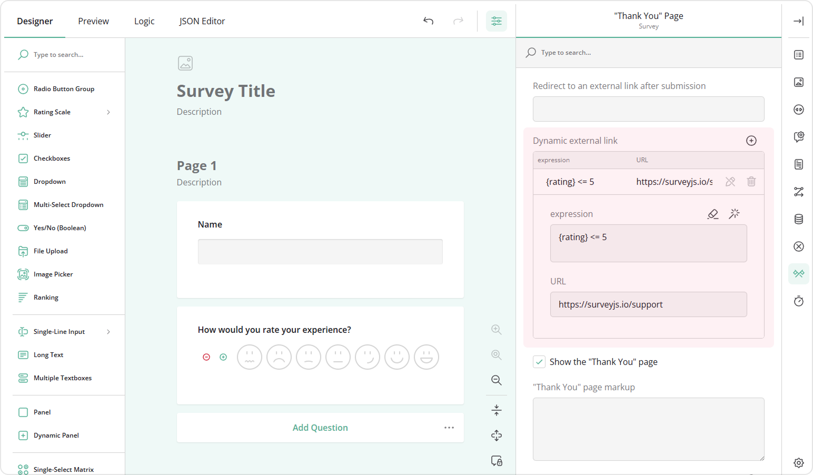

6. Repeat to create additional rules for other responses.

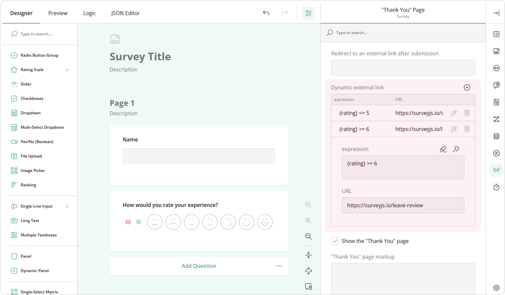

## See Also

- [How to Add Custom Survey Elements Using HTML](/survey-creator/documentation/end-user-guide/how-to-add-custom-survey-elements-with-html)
- [Create a Welcome Page in Your Form](/survey-creator/documentation/end-user-guide/how-to-create-welcome-page-in-form)
- [Expression Syntax](survey-creator/documentation/end-user-guide/expression-syntax)
