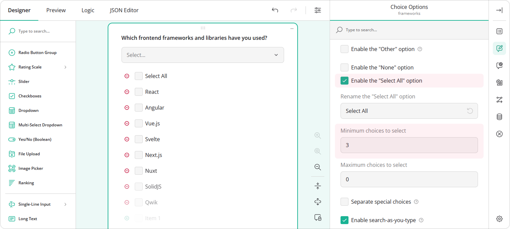
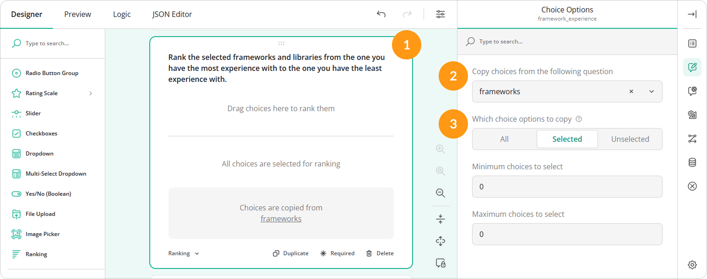
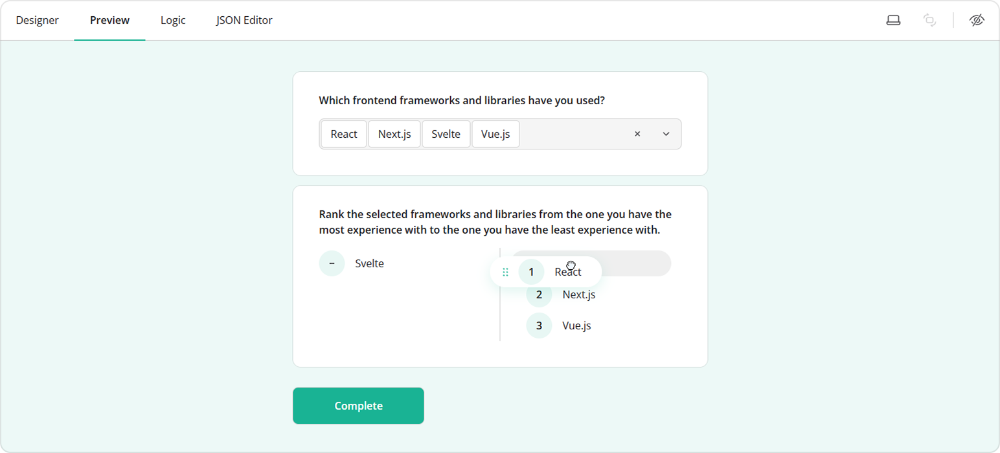
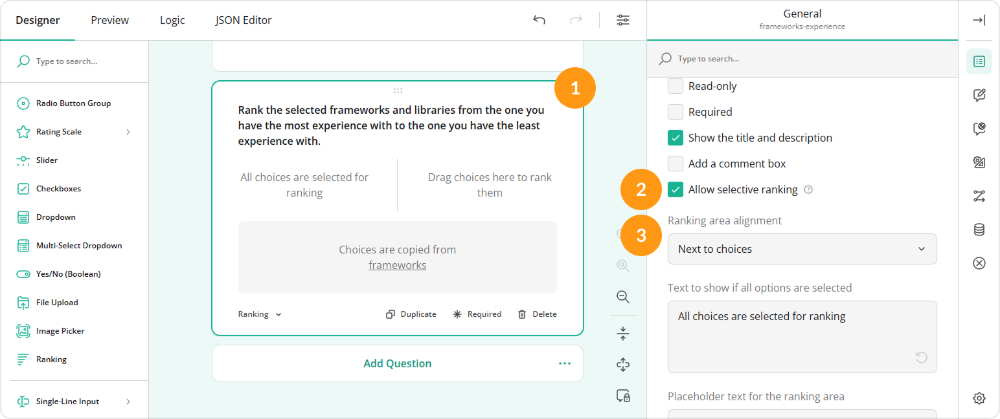

# How to Create a Transfer List and Rank Selected Items

## About Transfer List

A transfer list is a form component that allows users to transfer items or options between two question areas or columns. Typically, users can move list items by selecting or dragging them. SurveyJS Form Builder allows you to implement a transfer list that sources values from any multi-select question and copies them as choice options to another question. This guide shows how to transfer items from a Tag Box question to a Ranking question. 

## How to Configure the Source Question

To create a transfer list, you can use any question that supports selecting one or more choices, such as Checkboxes, Single-Select Dropdown, or Multi-Select Dropdown (Tag Box). The example below uses a Tag Box question with the ID `"frameworks"` that asks respondents to select the frontend frameworks and libraries they have used. The **Minimum choices to select** setting requires respondents to select a minimum number of options. **Enable the "Select All" option** adds a Select All item that allows respondents to select every option with a single click.

## How to Transfer Choices

To source selected values from one question and use them as another question's choices, follow these steps:

1. Select the question you want to populate with selected choices.
2. Under **Choice Options**, locate the **Copy choices from the following question** drop-down menu and select the ID of the source question.
3. Locate the **Which choice options to copy** property and set it to **Selected**.

In the example below, we transfer selected values from a question with an ID `"frameworks"` to a Ranking question.

## How to Rank Selected Choices

Once you define a value source and populate a new question with selected items, you can ask your respondents to rank them. By default, the Ranking question requires users to rank all available items. If you want to allow respondents to choose items for further ranking so that they can rank all or only part of the previously selected choices, enable selective ranking. With this setting, the Ranking question displays two areas: one for ranked and one for unranked items. To order items, respondents should first drag them from the unranked to the ranked area, as shown below.

To enable selective ranking, follow these steps:

1. Select a Ranking question.
2. Under its **General** settings, locate the **Allow selective ranking** checkbox and select it.
3. Optionally, you can change the position of the ranking area using the **Ranking area alignment** drop-down menu.

## Limitations

The following settings are unavailable for a question that displays transferred choices:

- **Choices**
- **Choice order**
- **Make the option visible if**
- **Make the option selectable if**