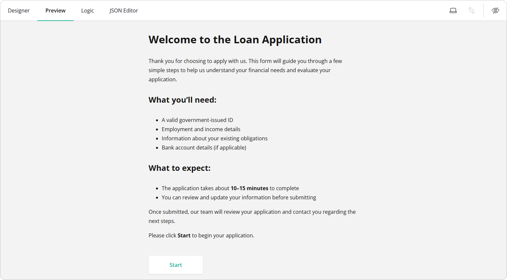
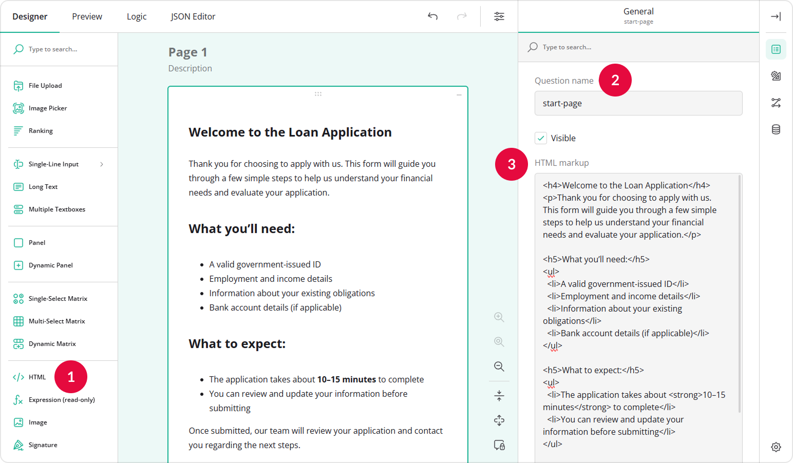
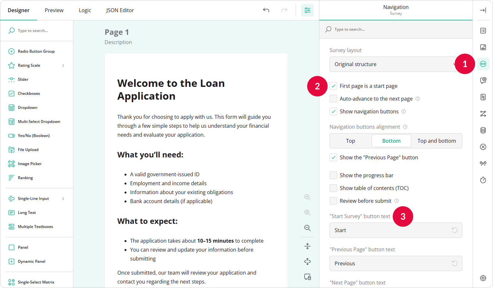
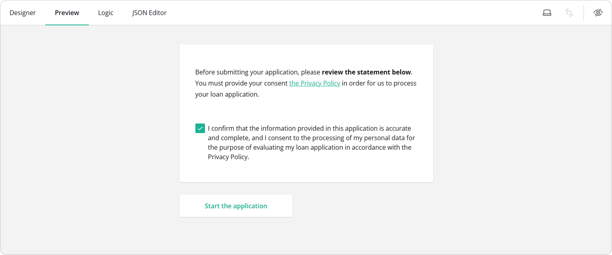
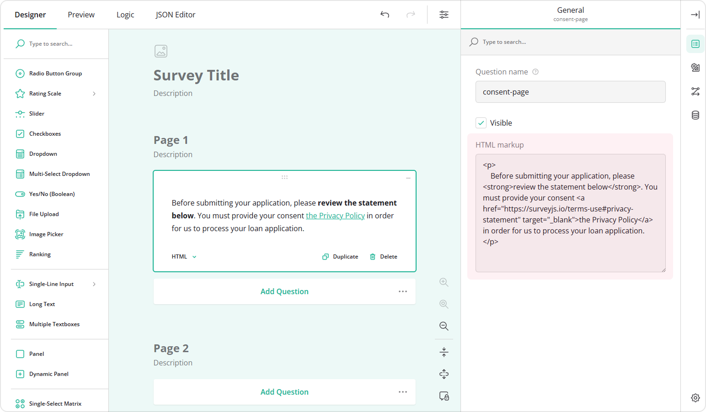
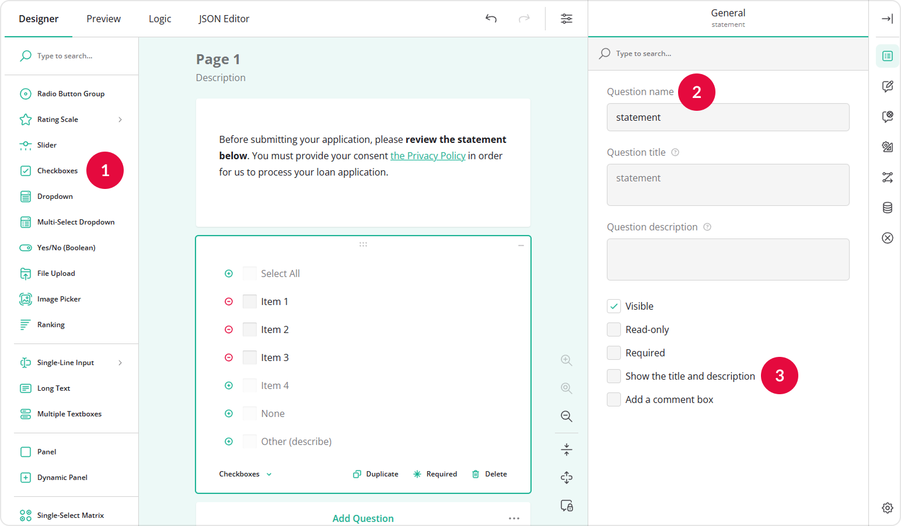
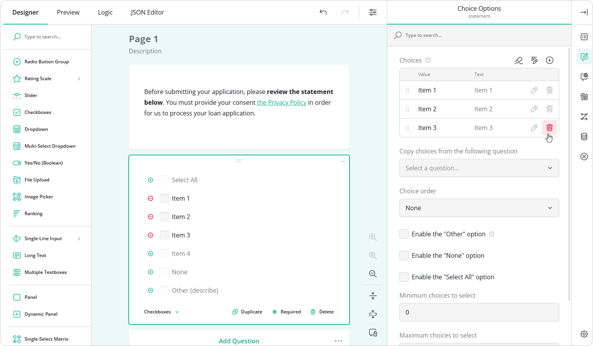
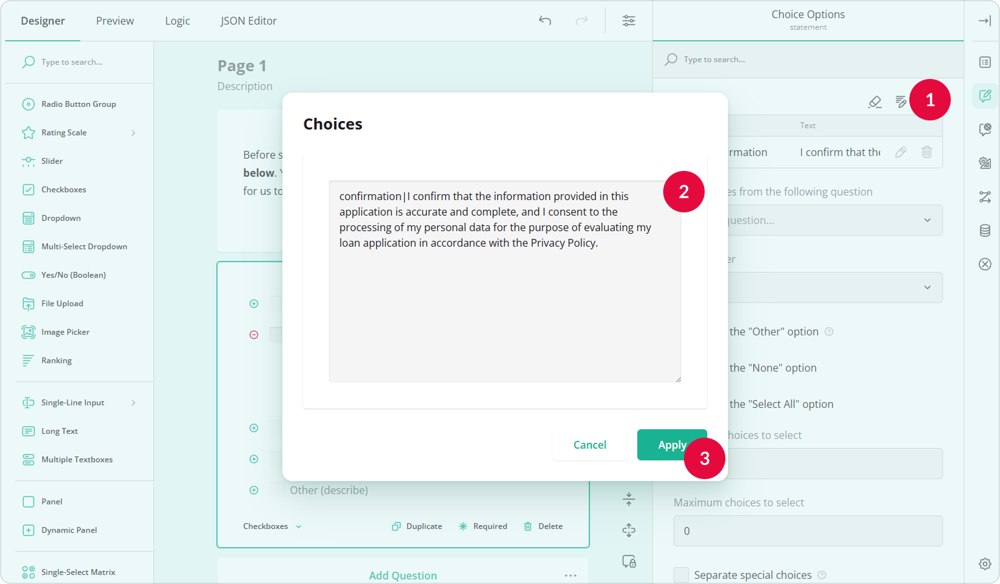
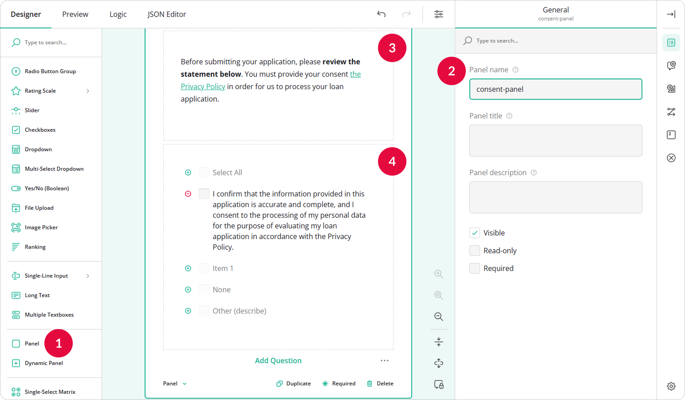

# Create a Welcome Page in Your Form

## About Welcome Page

A **Welcome page** (also known as a Start page) is the first screen respondents see before they begin filling out your form. It allows you to introduce the purpose of the survey, provide instructions, explain what information will be required, and set expectations about completion time.



A Welcome page is useful when you need to:

- Provide context about the form or organization
- Explain what respondents should prepare in advance
- Inform users how long the form will take
- Outline what happens after submission
- Collect consent before proceeding

Using a Start page helps respondents feel informed and prepared, which can improve completion rates and reduce confusion.

## Supported Question Types

You can add **any question type** to your Start page. However, the most common inputs used on a Welcome page are:

- **HTML** &ndash; to add formatted text, headings, lists, and links
- **Single-Line Input** &ndash; to collect basic information (for example, full name or age)
- **Checkboxes** &ndash; to collect consent or confirmation

In this guide, we will show how to use these input types to create a Welcome page in your form.

## How to Add a Welcome Page to Your Form

If you wish to provide context or instructions before respondents proceed with filling out the form, you can add custom formatted text using an **HTML** question.

To do this, follow these steps:

1. Add an **HTML** question to your form.
2. Assign a **Question name (ID)** to it.
3. Enter your HTML markup in the **HTML markup** field. For example:

``` html
<h4>Welcome to the Loan Application</h4>
<p>Thank you for choosing to apply with us. This form will guide you through a few simple steps to help us understand your financial needs and evaluate your application.</p>

<h5>What you’ll need:</h5>
<ul>
  <li>A valid government-issued ID</li>
  <li>Employment and income details</li>
  <li>Information about your existing obligations</li>
  <li>Bank account details (if applicable)</li>
</ul>

<h5>What to expect:</h5>
<ul>
  <li>The application takes about <strong>10–15 minutes</strong> to complete</li>
  <li>You can review and update your information before submitting</li>
</ul>

<p>Once submitted, our team will review your application and contact you regarding the next steps.</p>

<p>Please click <strong>Start</strong> to begin your application.</p>
```



4. At the top of the **Property Grid**, select **Survey** to switch to survey-level settings.
5. Under **Navigation**, locate and enable the **First page is a start page** setting.
6. Optionally, customize the **"Start Survey" button text**.



7. Add other pages to your form as needed.

Once the Welcome page is enabled, respondents will see it first and must click the Start button to proceed.

> To learn more about HTML markup syntax, refer to the following guide: [How to Add Custom Survey Elements Using HTML](https://surveyjs.io/survey-creator/documentation/end-user-guide/how-to-add-custom-survey-elements-with-html).

## How to Collect Consent from Respondents

You can also use the Welcome page to collect consent before respondents proceed to the form. In some cases, you may also need respondents to review a document (such as a Privacy Policy) before providing consent. You can insert a link to such a document in an **HTML** question.



To create a consent section with a Privacy Policy link, follow these steps:

1.  Add an **HTML** question to your form.
2.  Assign a **Question name (ID)** to it.
3.  Enter your consent note in the **HTML markup** field. For example:

``` html
<p>
  Before submitting your application, please <strong>review the statement below</strong>.
  You must provide your consent to our
  <a href="https://surveyjs.io/terms-use#privacy-statement" target="_blank">Privacy Policy</a>
  in order for us to process your loan application.
</p>
```



4.  Add a **Checkboxes** question to your form.
5.  Assign a **Question name (ID)** to it.
6.  In the **General** settings, clear the **Show the title and description** option to hide the question title.



7.  Switch to **Choice Options**.
8.  Remove extra choices and leave only one.



9.  Click the **Pen** icon to open the Choices configuration popup.
10. Assign the option using the `value|text` format. For example: 

```text
confirmation|I confirm that the information provided in this application is accurate and complete, and I consent to the processing of my personal data for the purpose of evaluating my loan application in accordance with the Privacy Policy.
```

11. Click **Apply**.



12. Optionally, place both questions inside a **Panel** element to make the layout more homogeneous.



13. Repeat steps 4-7 from the [previous section](#how-to-add-a-welcome-page-to-your-form) to make sure the page is configured as a **Start page**.

Now, respondents will see your introduction, review the policy, and confirm their consent before proceeding.

## See Also

- [How to Add Custom Survey Elements Using HTML](/survey-creator/documentation/end-user-guide/how-to-add-custom-survey-elements-with-html)
- [How to Create a Quiz or Assessment Test](/survey-creator/documentation/end-user-guide/how-to-create-quiz-or-assessment-test)
