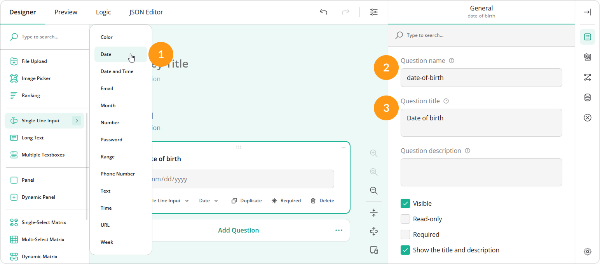
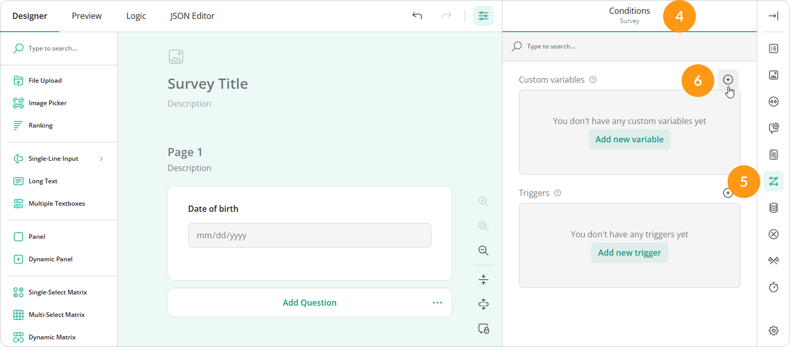
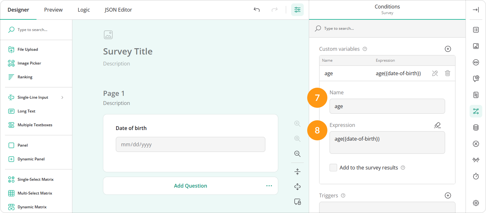
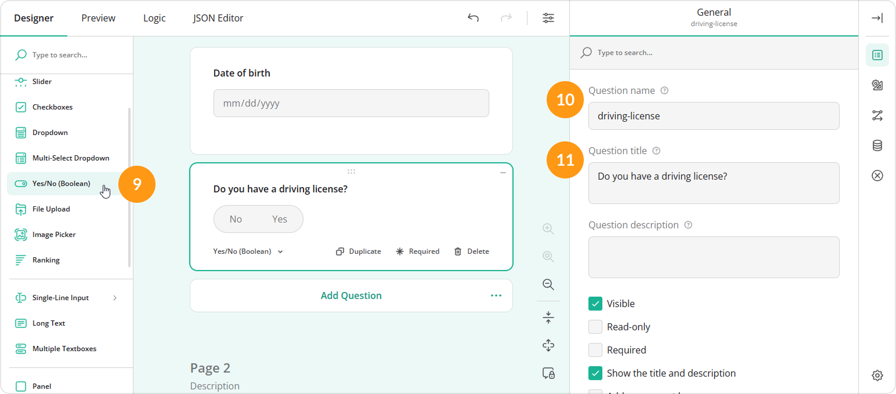
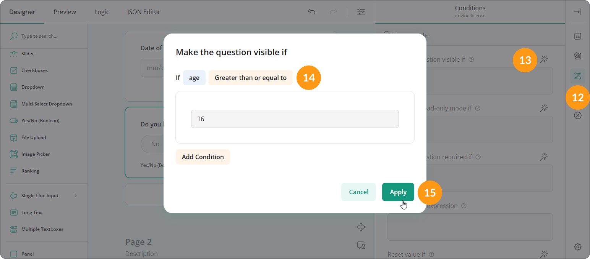
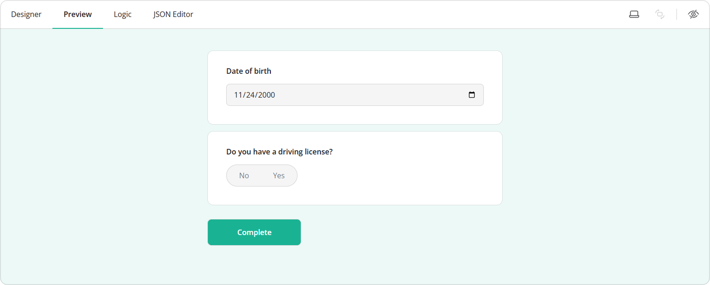
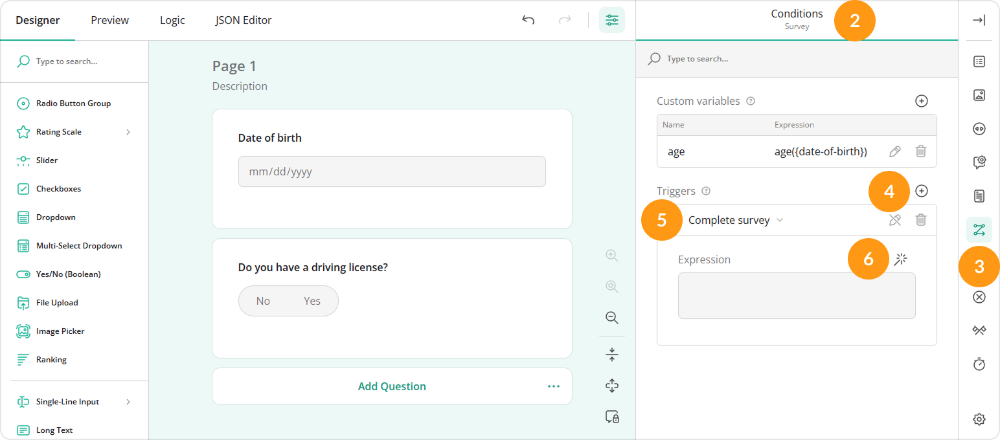
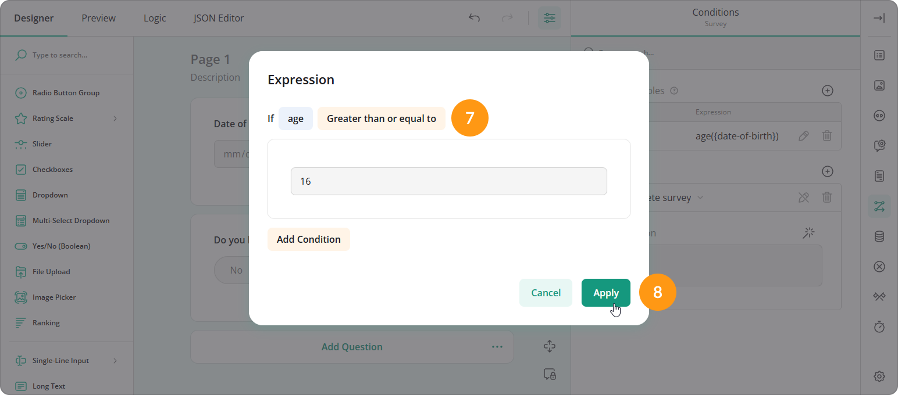

# How to Use Custom Variables in Form Calculations

## About Custom Variables

Custom variables act as intermediate or auxiliary variables used in form calculations. They enable you to perform various calculations in the background and access the resulting expression value using a unique custom variable name (ID). This value can then be used in conditional logic to control the behavior and visibility of other questions within the form.

A common use case for a custom variable is to calculate a respondent's age based on the date entered in a "Date of birth" field and then show or hide certain questions depending on the age value. Alternatively, you can use the custom variable in a survey completion trigger that will direct the respondent to the "Thank You" page if their calculated age falls below a specified threshold.

## How to Create a Visibility Rule Based on a Custom Variable Value

The steps below describe how to create a custom variable using the `age()` function and conditionally show a follow-up question depending on the calculated age value.

1. In the Toolbox area, hover over **Single-Line Input** and select **Date** from the list of available input types.
2. Enter a question ID in the **Question name** text box.
3. Enter a user-friendly value in the **Question title** text box. This value will be visible to respondents.

4. Switch to the survey-level settings at the top of the Property Grid.
5. Under **Conditions**, locate the **Custom variables** subsection.
6. Click the **Plus** icon or **Add new variable** button to create a new variable.

7. Enter a unique **Name** for the variable.
8. Enter the following sample value in the **Expression** field: `age({date-of-birth})`, where `date-of-birth` is the "Question name" value of the field in which a respondent enters their date of birth.

9. Add a dependent question to your form. In this example, we are using a **Yes/No (Boolean)** question.
10. Enter a question ID in the **Question name** text box.
11. Enter a user-friendly value in the **Question title** text box.

12. Under **Conditions**, locate the **Make the question visible if** property.
13. Click the **Magic wand** icon on the right of the property to open a pop-up dialog.
14. In the dialog, select the custom variable name assigned in step 7 and the condition that has to be met in order for the dependent question to be visible.
15. Enter the desired threshold value and click **Apply**.

Based on the configuration above, the "Do you have a driving license?" question will only be visible if a respondent's age is greater than or equals to 16.

To test the custom variable configuration, switch to the **Preview** tab and select or enter a value in the "Date of birth" question.

## How to Complete a Survey Based on a Custom Variable Value

The steps below describe how to create a trigger that will prompt a respondent to the "Thank you" page based on the age value calculated using a custom variable.

1. Complete steps 1-8 from the [previous section of the guide](#how-to-create-a-visibility-rule-based-on-a-custom-variable-value).
2. Switch to the survey-level settings at the top of the Property Grid.
3. Under **Conditions**, locate the **Triggers** subsection.
4. Click the **Plus** icon or **Add new trigger** button to create a new trigger.
5. Select **Complete survey** from the drop-down menu on the left.
6. Click the **Magic wand** icon on the right of the **Expression** property to open a pop-up dialog.

7. In the dialog, select the custom variable name and the condition that has to be met to trigger survey completion.
8. Enter the desired threshold value and click **Apply**.

Based on the configuration above, the survey completes automatically if a respondent's age is less than 16.

