# Loop and Merge with Multi-Select Dropdown and Dynamic Matrix

## About Loop and Merge

**Loop and Merge** allows you to repeat groups of follow-up questions for each option selected in a multi-select question (called "parent question" or "loop driver"). This feature is especially important for improving usability on mobile devices, because it allows users to focus on answering questions about one item at a time, without being overwhelmed by a long form.

## How Loop and Merge Works

The loop driving question determines the number of generated follow-up loops based on the number of items a user selects. It can be any multi-select question type, such as:

- Checkboxes
- Multi-Select Dropdown (Tag Box)

Each loop repeats a group of the same follow-up questions for each selected item. The loops can be created using one of the following question types:

- Dynamic Panel
- Dynamic Matrix
- Multi-Select Matrix
- Single-Select Matrix
- Composite questions (nested panels)

This guide demonstrates an example in which Loop and Merge is implemented using a **Multi-Select Dropdown (Tag Box)** as the loop driving question and a **Dynamic Matrix** for follow-up loops. This example lets users select multiple tools, such as Slack and Zoom, in the Tag Box question. For each selected tool, the survey will guide the users through a set of follow-up questions configured in the Dynamic Matrix row. Once the users finish answering for one tool, they continue to the next. After all follow-up questions are answered, the users can either get back to the loop driving question to select another tool and answer a series of follow-up questions about it, or move on to the rest of the survey.

<video src="images/Tagbox_Dynamic_Matrix_Loop.mp4" autoplay muted playsinline loop style="width: 100%"></video>

To get a better visual representation of the parent question and the loops, please refer to the image below. It shows the same questions we'll be using in this example, but with the Loop and Merge feature disabled, so that all input fields are visible at once. 

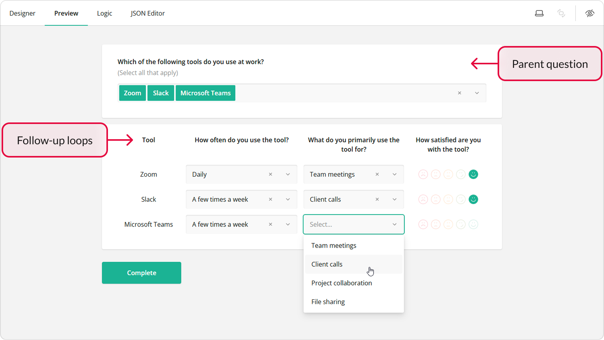

## Configuration

### Add a Multi-Select Dropdown for the Loop Driver

The loop driving question will contain various online tools, such as Slack and Zoom, that users can select. To configure this question, follow the instructions below:

1. Drag a **Multi-Select Dropdown** onto your form.
2. Give it a **name** (question ID) and a user-friendly **title** (e.g., "Which of the following tools do you use at work?").
3. Optionally, add a **description**.

   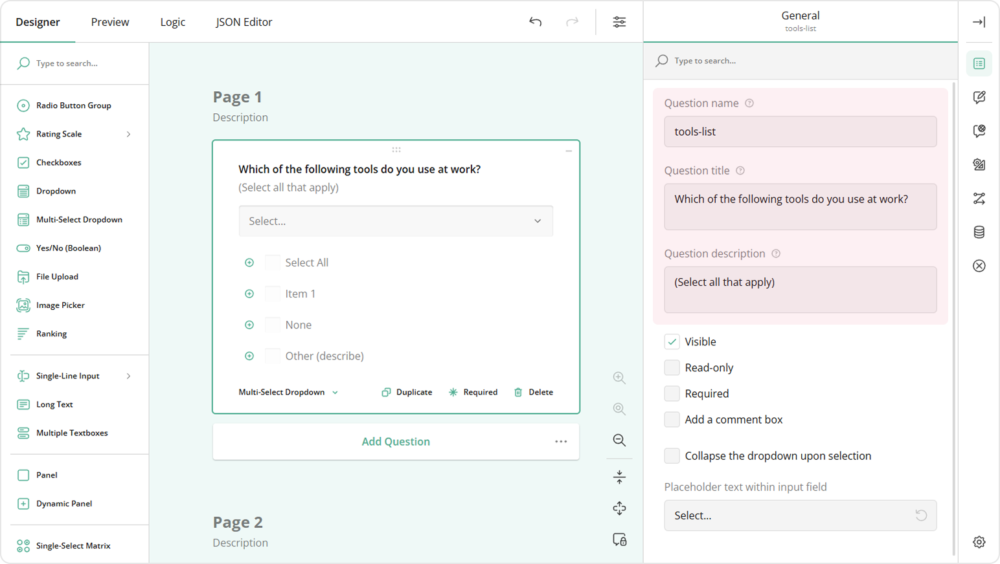
4. Under the **Choice Options** category, locate the **Choices** table.
5. Click the **Pen** icon to start editing.
6. Enter the choices in the popup and click **Apply**.

   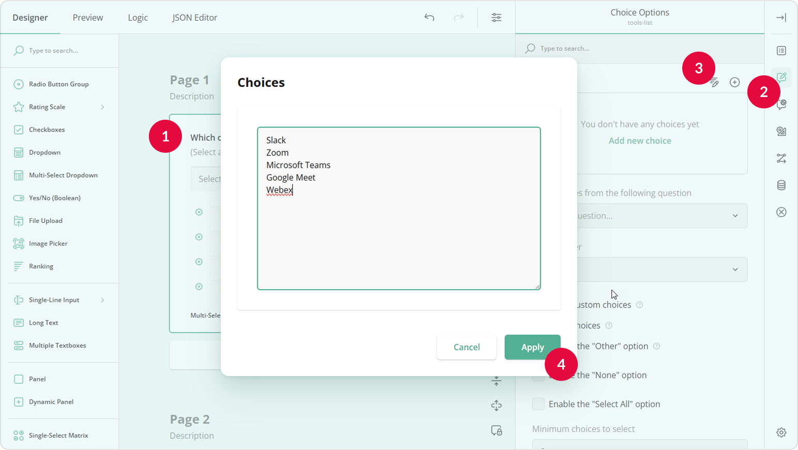

### Add a Dynamic Matrix for Follow-Up Loops

Follow-up loops contain questions configured as Dynamic Matrix columns. The number of loops is determined by the number of selected online tools. Follow these steps to configure the Dynamic Matrix for this use case:

1. Drag a **Dynamic Matrix** onto your form.
2. Give it a **name** and a user-friendly **title** (e.g., "Feedback overview"). This title will show on the overview page once all loops are complete.

   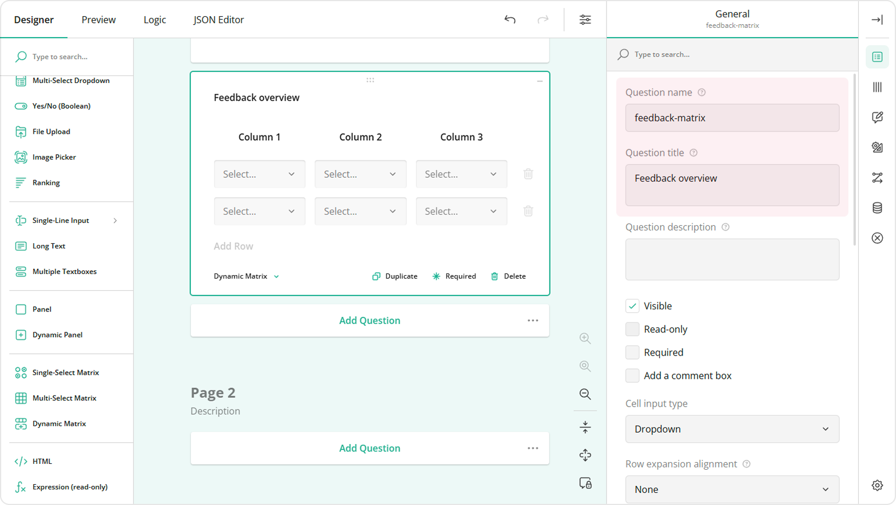
3. Under the **General** category, locate and unselect the **Enable row addition** and **Enable row removal** check boxes. Since the number of matrix rows will be equal to the number of selected options in the Tag box question, we need to disable the ability for users to add or delete rows.

   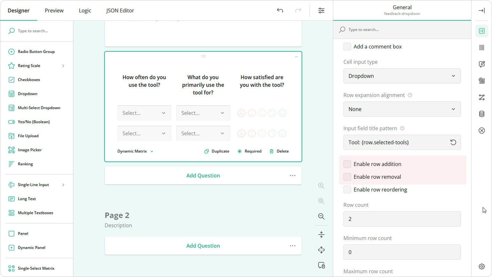
4. On the design surface, select a matrix column to access its settings.
5. Under **General**, set the **Cell input type** property to a required input type (e.g., Rating Scale).

   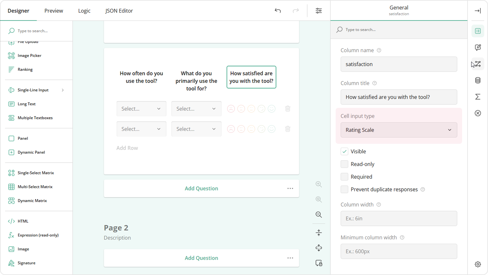
6. Configure the settings of the selected input type as needed.

   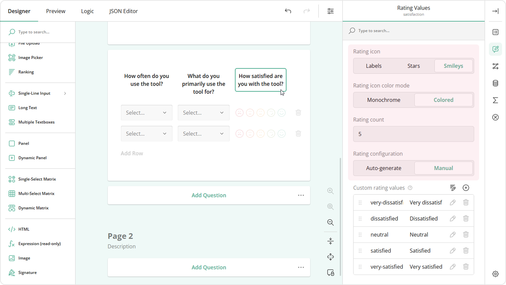
7. Repeat steps 4 to 6 for all matrix columns.

### Connect the Loop Driving Question to the Follow-up Loops

To make sure that values from the loop driving question and the follow-up loops are merged together, do the following:

1. Select the Multi-Select Dropdown.
2. Under the **Data** category, locate the **Join identifier** setting and enter a unique value (e.g., `products`). This value will be used later to link the Multi-Select Dropdown to the Dynamic Matrix.
3. Still under **Data**, locate the **Store values in the following property** editor and enter a key (e.g., `selected-tools`). This key will store selected values for use in the Dynamic Matrix row titles.

   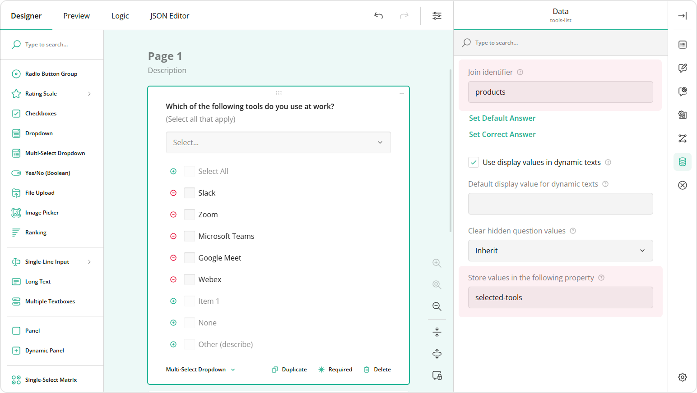
4. Select the Dynamic Matrix.
5. Under **Data**, locate the **Join identifier** property.
6. Enter the same value as you entered earlier in step 2, (e.g., `products`).

   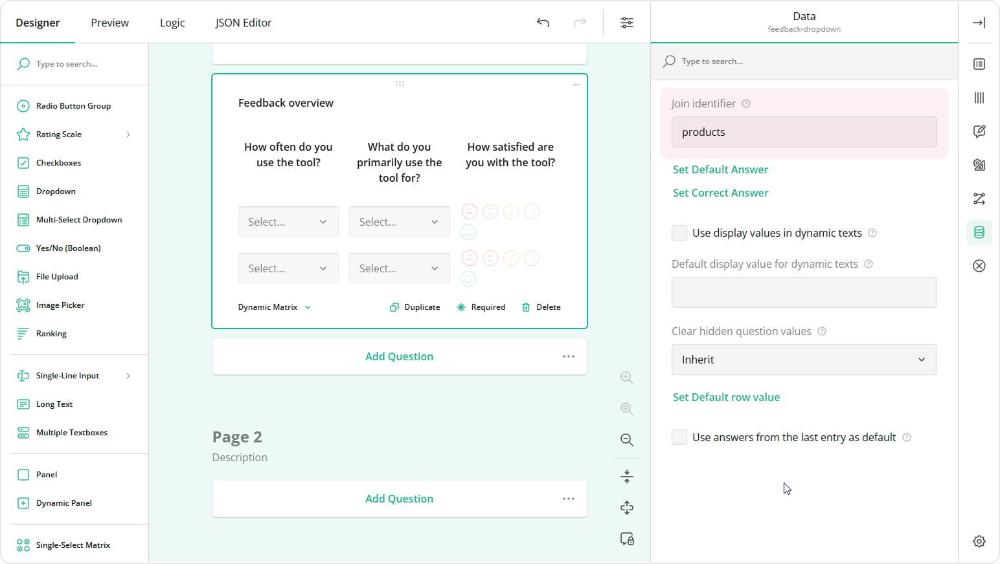

### Enable Loop and Merge

To configure your survey to display one question at a time, follow the steps below:

1. Go to the survey-level settings.
2. Under **Navigation**, locate the **Survey layout** property.
3. Set this property to **Show single input field per page**.

   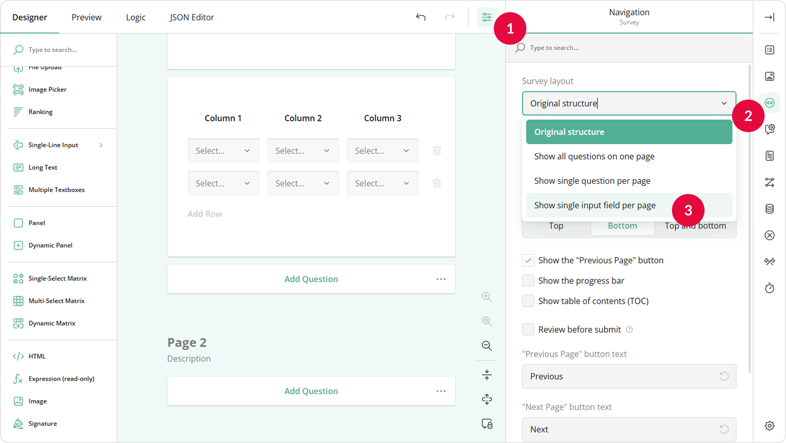

### Configure a Dynamic Title for Each Loop

To help users stay oriented, we'll dynamically display the selected tool name in the title of all follow-up questions using the **Input field title pattern** setting. This ensures users can clearly identify which tool each question refers to, even if they become distracted.

Follow the instructions below to specify a dynamic loop title:

1. Select the Dynamic Matrix.
2. Under **General**, locate the **Input field title pattern** setting.
3. Enter the following sample value: `Tool: {row.selected-tools}`. The value that follows `row.` must match the value you entered earlier in step 3 when you [connect the Multi-Select Dropdown with the Dynamic Matrix](#connect-the-loop-driving-question-with-the-follow-up-loops).

   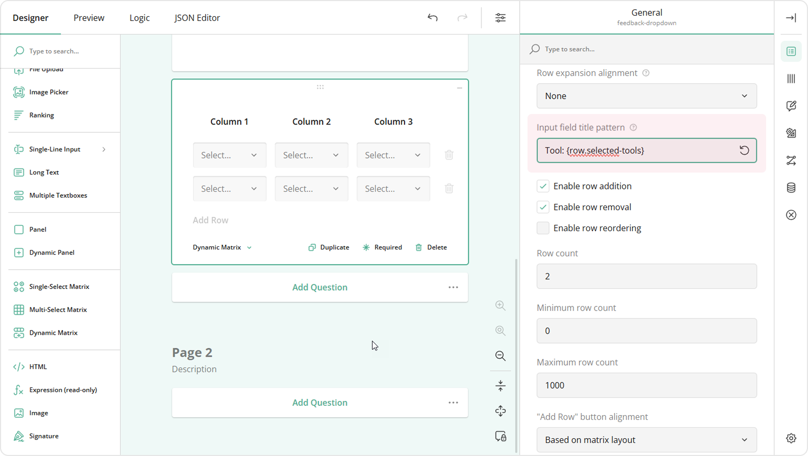

> If you are using a **Dynamic Panel**, use the `panel.` prefix to access the loop driving question (e.g., `{panel.selected-tools}`).

You've now seen how to implement Loop and Merge using a Multi-Select Dropdown and a Dynamic Matrix. This setup streamlines user experience by breaking complex forms into manageable, context-specific sections&mdash;especially helpful on mobile devices. For additional customization options, such as conditional logic, custom validation, or integration with other question types, explore [SurveyJS End-User Documentation](/survey-creator/documentation/end-user-guide/).