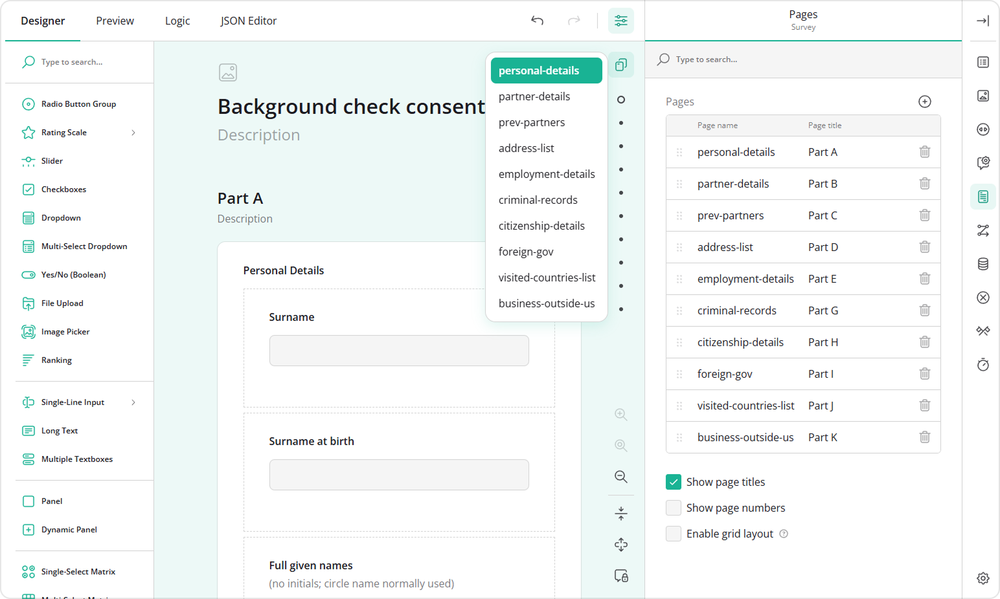
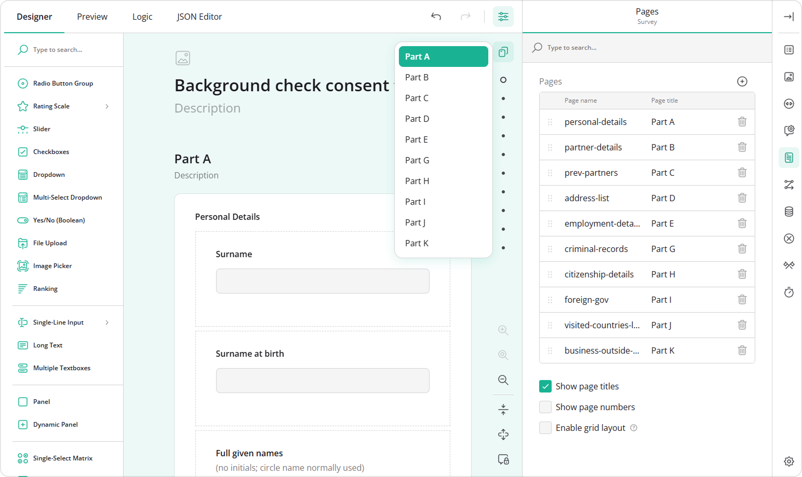
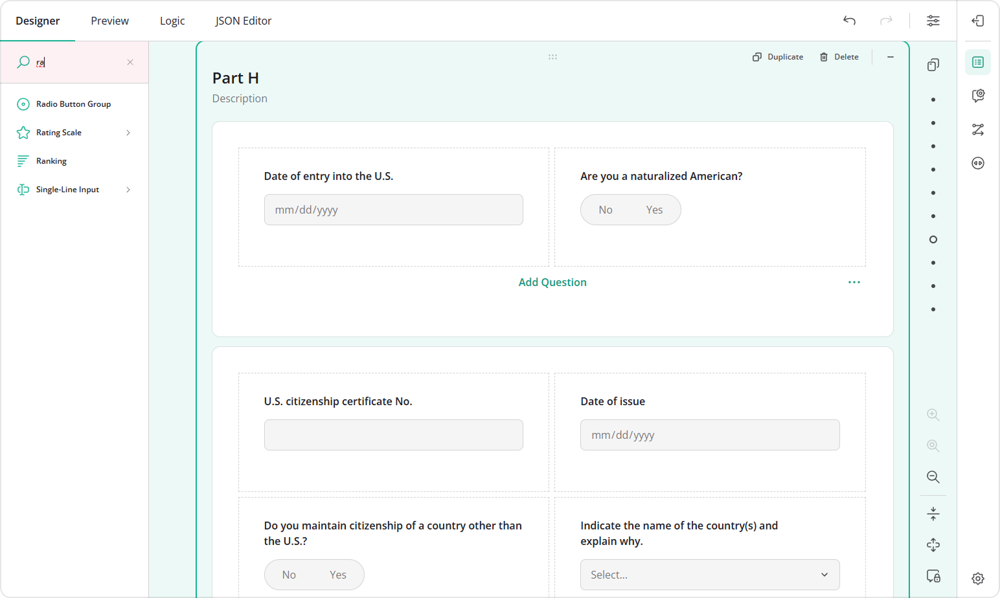
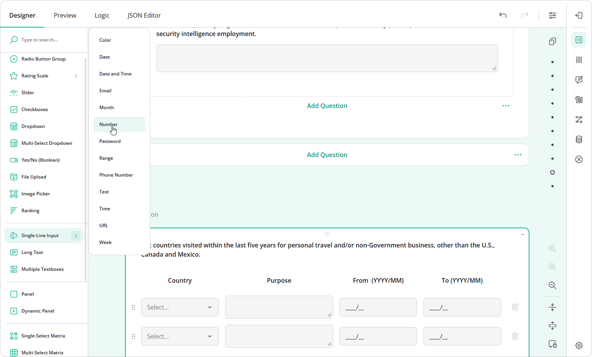

# How to Navigate a Long Form During Design

## Navigation Features

When you work with long forms that contain multiple pages, nested panels, or many questions, finding the right element and configuring it might become tricky. 

Survey Creator UI includes multiple features that help you navigate long and complex forms more efficiently:

- [Switch between pages using the Page Menu](#switch-between-pages-using-the-page-menu)
- [Find survey elements using the Survey Tree](#find-survey-elements-using-the-survey-tree)
- [Search for settings in the Property Grid](#search-for-settings-in-the-property-grid)
- [Find question types in the Toolbox](#find-question-types-in-the-toolbox)
- [Use toolbox subitems to add specific input types](#use-toolbox-subitems-to-add-specific-input-types)
- [Reduce visual clutter using Expand/Collapse controls](#collapse-and-expand-survey-elements)

Using these features together can significantly improve the form design experience, especially when working with large multi-page forms or surveys that contain deeply nested elements.

This guide describes these tools and explains how to use them during the design process.

## Switch Between Pages Using the Page Menu

When a form contains multiple pages, scrolling through the design surface to locate the required page can become time-consuming. To simplify navigation, Survey Creator includes a **Page Menu**, which lists all pages and lets you switch between them instantly.

To navigate to a page using the Page Menu:

1. In the top-right corner of the design surface, click the **two-page icon**.
2. Review the list of available pages.
3. Select the page you want to open.

The form scrolls to the selected page on the design surface, as shown in the video below.

<video src="images/eud-page-menu.mp4" autoplay muted playsinline loop style="width: 100%"></video>

By default, Survey Creator displays element names (IDs) in UI elements such as the Page Menu. For pages, those correspond to **Page name** property values. If page names are not descriptive, navigating large forms can become harder.

To improve usability, we recommend assigning meaningful page names or asking your developer to enable the [`useElementTitles`](/survey-creator/documentation/api-reference/icreatoroptions#useElementTitles) configuration option. When this option is enabled, Survey Creator displays element titles instead of element names across the interface, including the Page Menu, Survey Tree, and conditional logic dialogs. Refer to the [Modify New Question](/survey-creator/examples/dynamically-modify-newly-added-questions/) demo to see it in action.

## Find Survey Elements Using the Survey Tree

The **Survey Tree** displays the structure of your form and allows you to quickly navigate between survey elements. It supports search and scrolling, making it easier to work with large surveys. You can find it in the **Property Grid**, where it can be expanded whenever you need to locate a specific item.

To locate an element using the Survey Tree:

1. Click the category name at the top of the **Property Grid** to open the **Survey Tree**. 
2. Use one of the following methods:
   * Scroll through the form structure to locate the required element.
   * Enter the page, panel, or question name (ID) in the search field.
3. Select the required element to jump directly to it on the design surface, as shown in the video below.

<video src="images/eud-survey-tree.mp4" autoplay muted playsinline loop style="width: 100%"></video>

## Search for Settings in the Property Grid

Survey Creator includes a wide range of settings for questions, pages, panels, and other survey elements. To locate a specific setting quickly, use the **Property Grid search**. The search supports both user-friendly setting names and API property names.

To search for a setting:

1. Select a survey element.
2. In the **Property Grid**, focus the search field.
3. Enter a keyword.

For example:

* Search for **Error message alignment** to find the corresponding setting.
* Search for `errorLocation` if you know the API property name.

Matching settings are highlighted automatically, as shown in the video below.

<video src="images/eud-property-search.mp4" autoplay muted playsinline loop style="width: 100%"></video>

## Find Question Types in the Toolbox

The **Toolbox** contains all available question types. When a survey includes many built-in or [custom question types](/survey-creator/documentation/customize-question-types), locating the required one manually can be difficult. To simplify navigation, use the Toolbox search.

To find a question type:

1. Focus the search field in the Toolbox.
2. Enter the question type name.
3. Select the required item and drag it onto the design surface.

## Use Toolbox Subitems to Add Specific Input Types

Some question types include predefined variations. For example, **Single-Line Input** can be added as an email field, password input, phone number field, and more. Instead of adding a generic question and configuring it afterward, you can insert the required variation directly from the Toolbox.

To use Toolbox subitems:

1. Hover over a question type with a **right chevron** (>), which indicates that subitems are available.
2. Browse the available variations.
3. Select the required subitem or drag it onto the design surface.

Survey Creator automatically applies the corresponding configuration, reducing the number of setup steps.

## Collapse and Expand Survey Elements

Large forms often contain multiple pages, nested panels, and grouped questions, which can make it difficult to focus on a specific part of the survey. To simplify navigation and editing, Survey Creator allows you to collapse and expand individual questions, panels, and pages, or collapse and expand all survey elements at once. This functionality is particularly useful when reorganizing a survey, since collapsed elements take up less space and are easier to drag and reposition.

To collapse survey elements:

1. Use the **Collapse** button on an individual element to hide its contents.
2. Click **Collapse All** to collapse all elements in the form.
3. Expand only the sections you need to work with.

<video src="images/eud-collapse-to-drag.mp4" autoplay muted playsinline loop style="width: 100%"></video>
