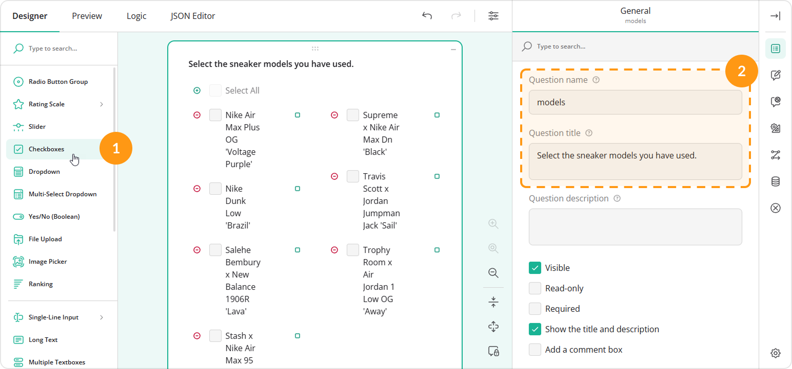
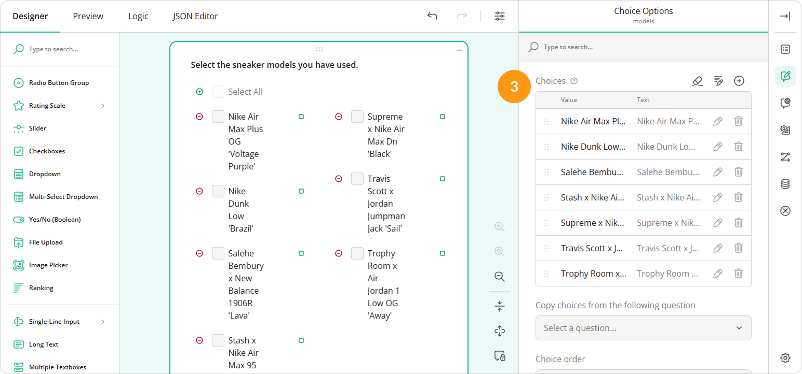
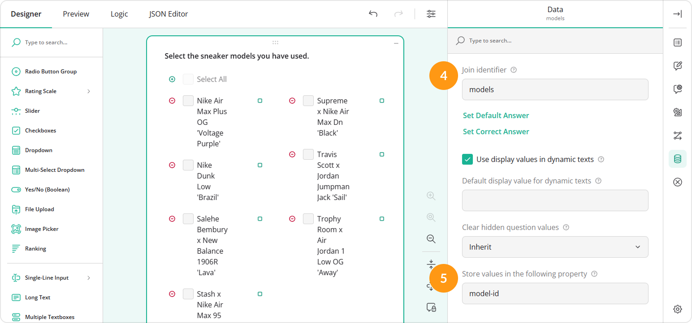
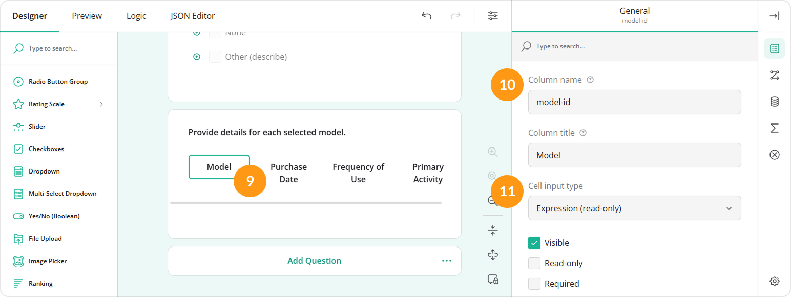

# How to Pipe Selected Choices to a Dynamic Matrix

## About Text Piping

Text piping is a feature used in forms and surveys to dynamically insert (or "pipe") specific information entered or selected by a user into subsequent questions, text fields, or the "Thank You" page. This allows you to create personalized and context-sensitive content and improve overall user experience by making the form or survey feel more tailored to the individual's responses.

This guide shows how to pipe selected choice options of a multi-select question to rows of a Dynamic Matrix.

<video src="images/eud-checkboxes-to-dynamic-matrix-rows.mp4" autoplay muted playsinline loop style="width: 100%"></video>

## Supported Source Question Types

You can use Checkboxes or Multi-Select Dropdown (Tag Box) as a question that provides choice options to the rows of a Dynamic Matrix. In the instructions below, we will be using a Checkboxes question. The same steps apply to a Multi-Select Dropdown as well.

## Configurations

In order to pipe selected choices to a Dynamic Matrix, follow these steps:

1. Add a **Checkboxes** question to the design surface.
2. Under **General**, assign a **Question name** and a user-friendly **Question title** to it.

3. Under **Choice Options**, populate the question with **Choices**.

4. Under **Data**, locate the **Join identifier** property and assign any unique value to it.
5. Locate the **Store values in the following property** field and enter another unique value into it.

6. Add a **Dynamic Matrix** to the design surface and specify its **Question name** and **Question title**.
7. Make the matrix visible only when at least one checkbox of the source question is selected.
   1. Under **Conditions**, locate the **Make the question visible if** property.
   2. Click the **Magic wand** icon on the right of the property. This action opens a popup with a GUI for setting up display logic.
   3. In the popup, select the source question ID (its "Question name" property value you assigned in step 2) and the **Not empty** condition from the drop-down menus.
   4. Click **Apply**.

8.  Under **Data**, locate the **Join identifier** property and set it to the same value you have used for this property of the Checkboxes question in step 4.
  

9. Select the matrix column to which you want to pipe selected choices. This action will display the settings of this column.
10. Under **General**, locate the **Column name** field and enter the value you used for the **Store values in the following property** field of the Checkboxes question in step 5.
11. Set the **Cell input type** to **Expression (read-only)**.

12. Configure the remaining matrix columns.
