# How to Set Default Answers to Questions

## About Default Answers

A **default answer** is a pre-filled, editable response that appears in a question when a form is shown to respondents. It can be specified as a static value or generated dynamically based on answers provided earlier in the form. Default answers can save time for respondents, reduce repetitive data entry, and help guide users toward the most common or recommended answer.

Default values are especially useful when:
- A question often has the same initial answer for most respondents
- You want to suggest a typical response while still allowing edits
- You want to reuse answers from previous questions to speed up form completion
- You want to suggest a dynamic response based on some of the answers provided earlier

If a respondent does not change a default value, it is automatically saved as their answer in the form results.

## Supported Question Types

Default values are supported by questions that allow respondents to **enter or select a value**, for example:

- Checkboxes
- Dropdown
- Boolean
- Single-Line Input
- Long Text
- Multiple Textboxes
- and other input-based question types

Questions that do **not** accept an answer value do not support default values, including:

- File Upload
- Image
- HTML
- Expression
- Ranking
- Signature

## How to Set a Static Default Answer to a Question

A static default answer does not change automatically based on other answers in the form. You can specify static default answers for close- and open-ended questions.

### Close-Ended Questions

To set a default answer for close-ended questions, follow the steps below. In this example, a **Dropdown** question is used, but the configuration is the same for all questions with an answer choice.

1. Add a **Dropdown** question to your form.
2. In the **General** category, assign the **Question name** (question ID) and a user-friendly **Question title** that will be visible to respondents.

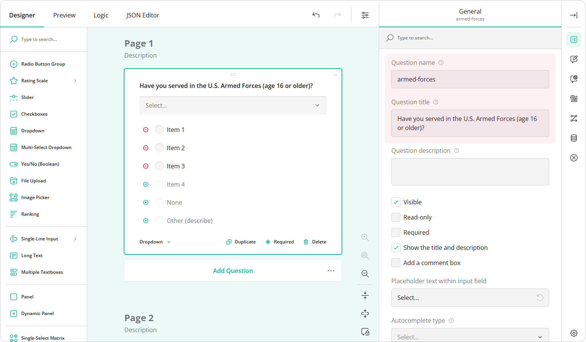

3. Switch to the **Choice Options** category.
4. Fill out the **Choices** table by specifying **Values** (choice IDs) and **Texts** (visible choice options).

Alternatively, you can add choices in bulk:

- Click the **Pen** icon.
- Paste the list of choices in the `value|text` format.
- Click **Apply**.

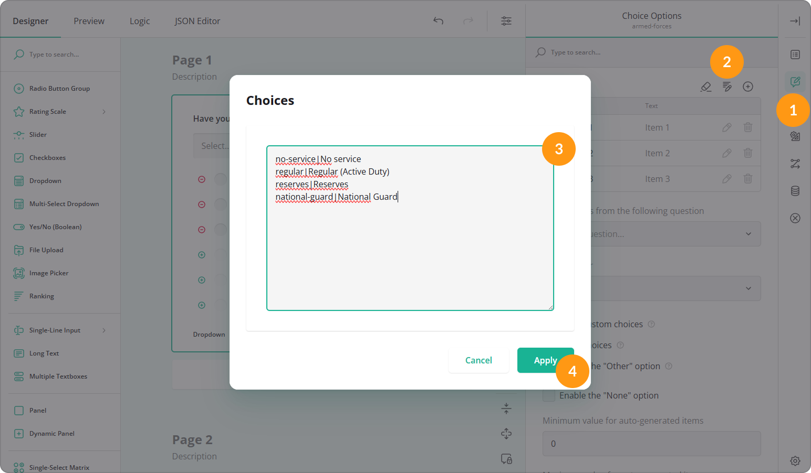

5. In the **Data** category, locate and click **Set Default Answer**.

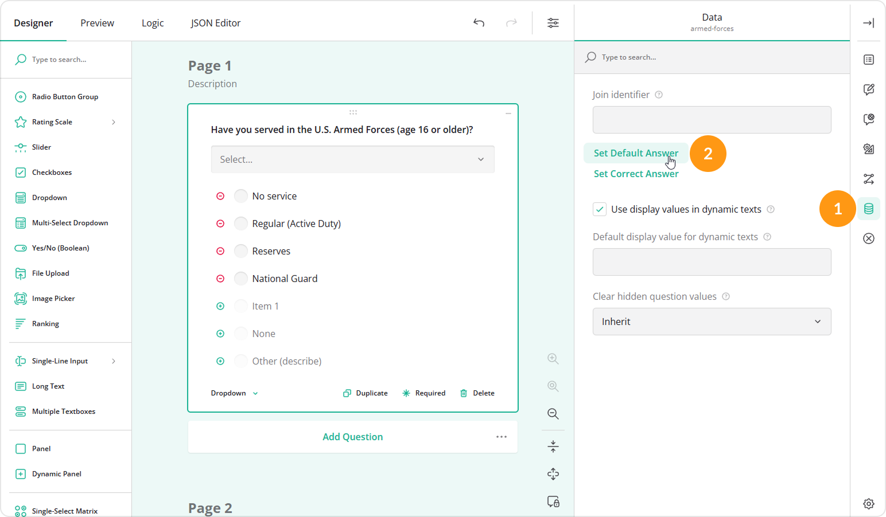

6. In the pop-up window, select the default answer and click **Apply**.

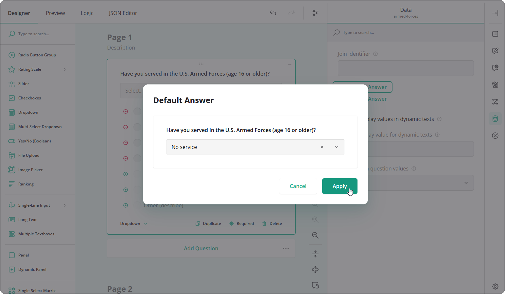

Once a default value is set, it is automatically displayed when the form is shown to respondents. They can replace the default value with another option or remove it to leave the field empty.

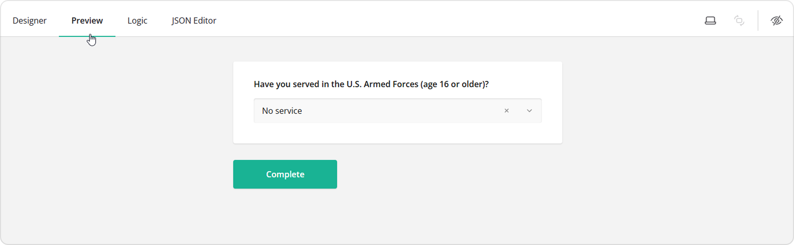

### Open-Ended Questions

For questions that require manual text entry, such as **Single-Line Input**, **Long Text**, or **Multiple Textboxes**, the default value configuration steps are the same. However, instead of selecting a value, you simply enter the default text in the question input field that appears when you click **Set Default Answer**.

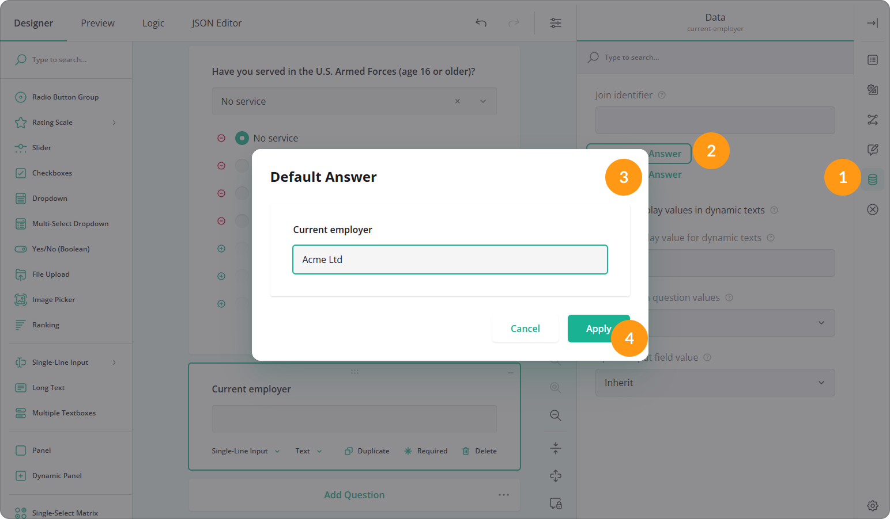

If a respondent does not modify the default text, it is saved as their answer in the form results.

## How to Set a Dynamic Default Answer to a Question

A dynamic default answer is calculated automatically based on a respondent's input in other form fields. You can pipe a value directly from another question or calculate the default value using a condition.

### Pipe a Default Answer from Another Question

Piping copies the answer from one or more source questions and uses it as the default value for another question. In the example below, the default value is created by combining answers from two different questions.

1. Add a source question to your survey.
2. In the **General** category, specify its **Question name** (for example, `branch`) and **Question title**.
3. Optionally, add another source question and specify its **Question name** (for example, `component`) and **Question title**.

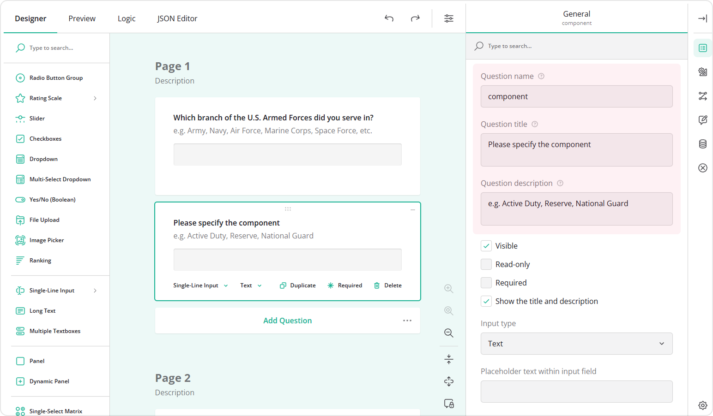

4. Add a third question that will receive the default value, and specify its **Question name** and **Question title**.
5. In the **Conditions** category, locate the **Default value expression** setting.
6. Enter the following expression: `{branch} + ' ' + {component}`

Here, `{branch}` and `{component}` are the **Question names** of the source questions, and ` + ' ' + ` inserts a space between the values. When a respondent enters values in the first two questions, those values are piped into the third question. Respondents can edit or replace the generated value if necessary.

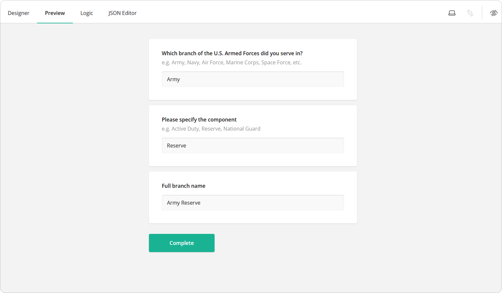

If the source question is close-ended, the piped value corresponds to the choice value rather than the display text. To insert the display text instead, use the `displayValue()` function in the **Default value expression** of the target question. For example, the following expression inserts the display text of a choice-based question named `armed-forces`: `displayValue('armed-forces')`.

### Calculate a Default Answer Using a Condition

You can also compute a dynamic default value based on a condition. In the example below, the default value is set to **"No"** if a respondent selects **"No service"**, and **"Yes"** for any other option.

1. Add a **Dropdown** or another choice-based question to your form.
2. Specify its **Question name** (for example, `armed-forces`) and **Question title**.
3. Fill out the **Choices** table by specifying **Values** (choice IDs) and **Texts** (visible choice options).

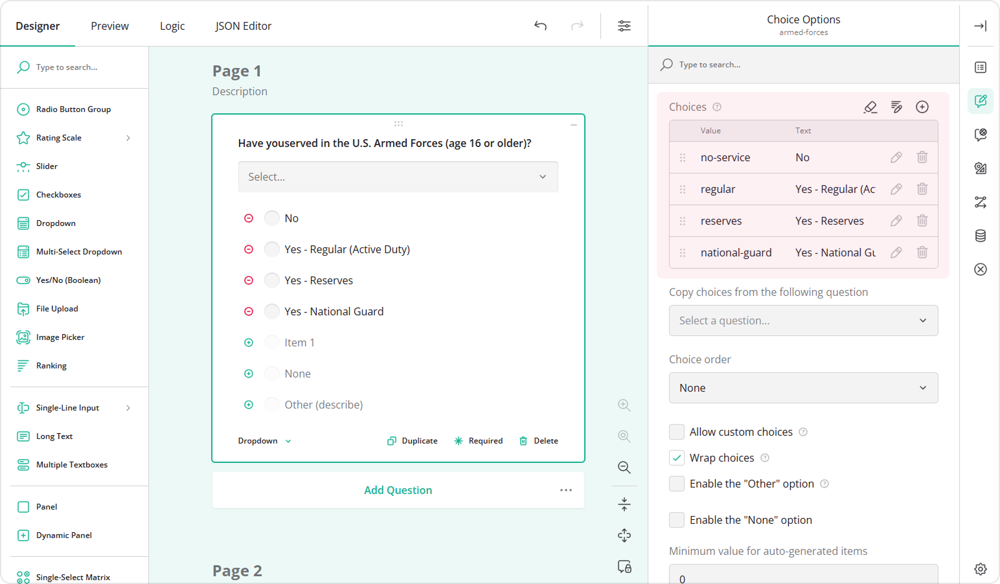

4. Add a **Radio Button Group** question that will receive the default value.
5. Fill out its **Choices** table with the appropriate **Values** and **Texts**.

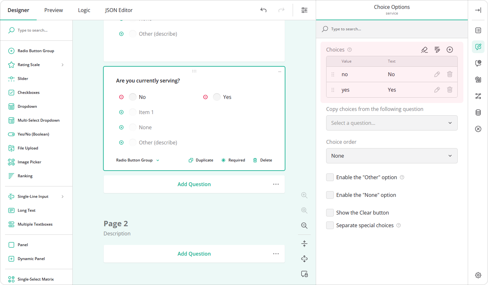

6. In the **Conditions** category, locate the **Default value expression** setting.
7. Enter the following expression: `iif({armed-forces} = 'no-service', 'no', 'yes')`, where `{armed-forces}` is the source question name, and `'no-service'` is the choice value that triggers the **"No"** default.
8. To prevent a default value from appearing before a selection is made, locate the **Set value if** setting.
9. Enter the following condition: `{armed-forces} notempty`. You can also click the magic wand button to build this condition visually.
10. Locate the **Reset value if** setting and enter the following condition: `{armed-forces} empty`. This configuration clears the default value if the respondent removes their selection from the source question.

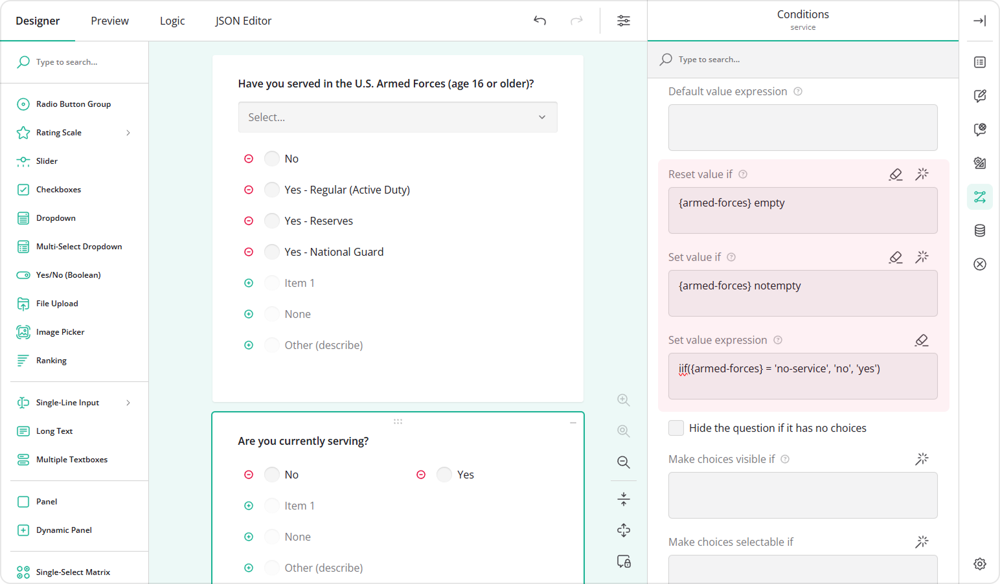

As a result, when a respondent selects any option other than "No service", the "Yes" option is selected by default. Respondents can override this value at any time by choosing a different option in the Radio Button Group question.

<video src="images/eud-defaultValueExpression.mp4" autoplay muted playsinline loop style="width: 100%"></video>

## See Also

- [How to Carry Forward Responses](/survey-creator/documentation/end-user-guide/carry-forward-responses)
- [How to Pipe Selected Choices to a Dynamic Matrix](/survey-creator/documentation/end-user-guide/pipe-selected-choices-to-dynamic-matrix)
