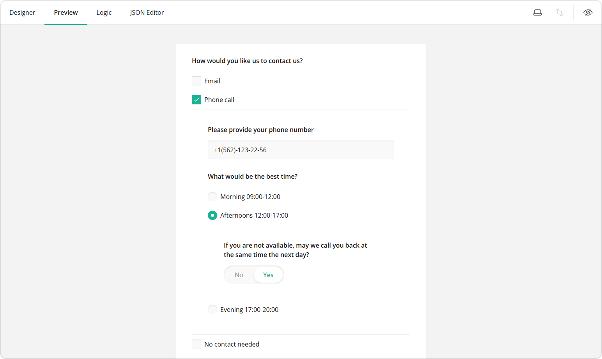
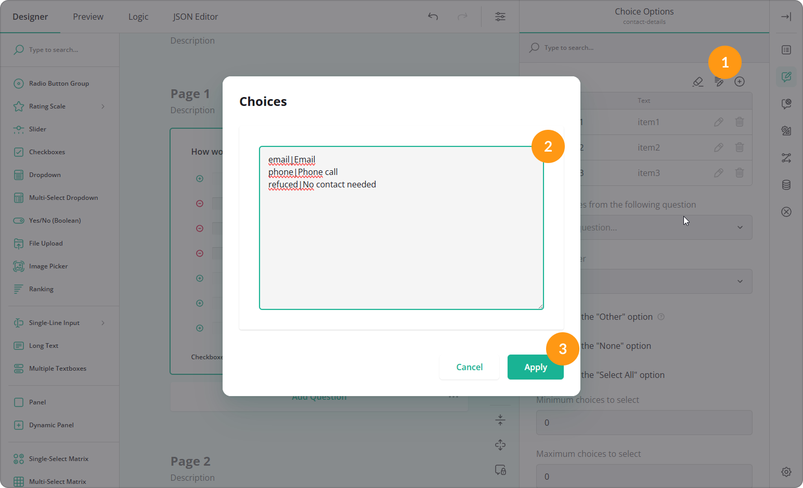
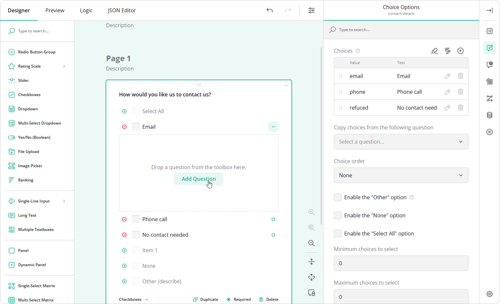
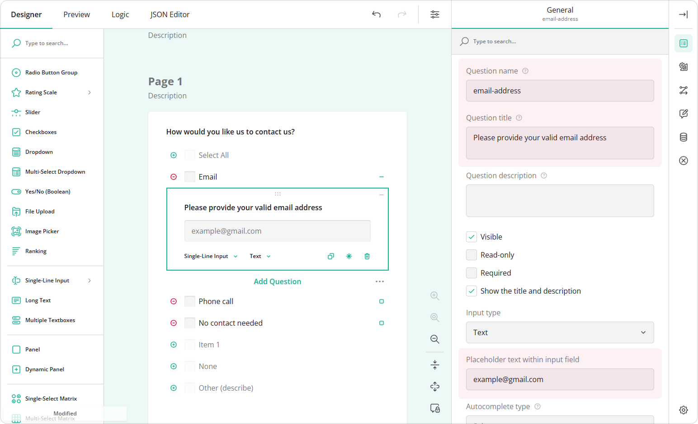
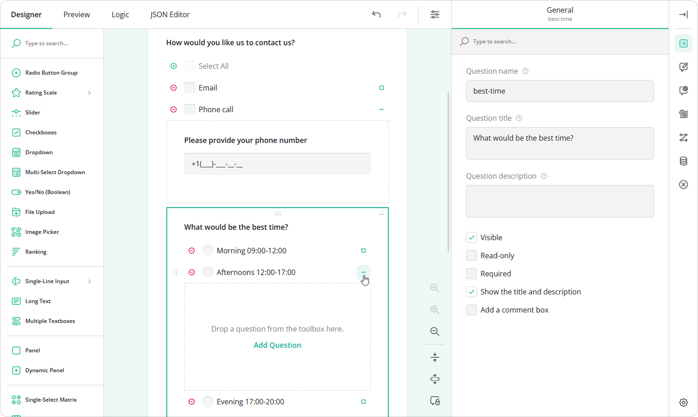
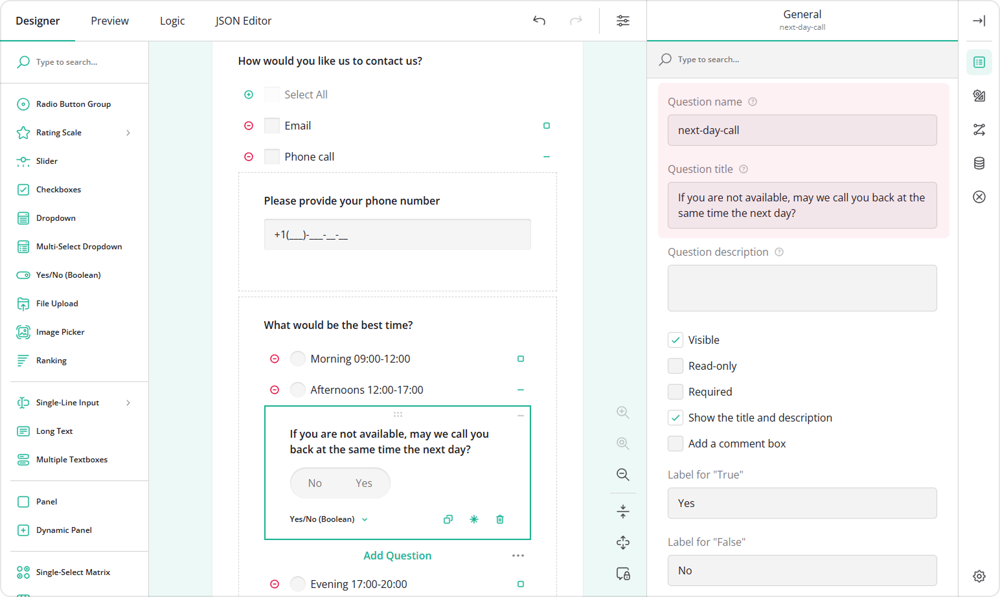
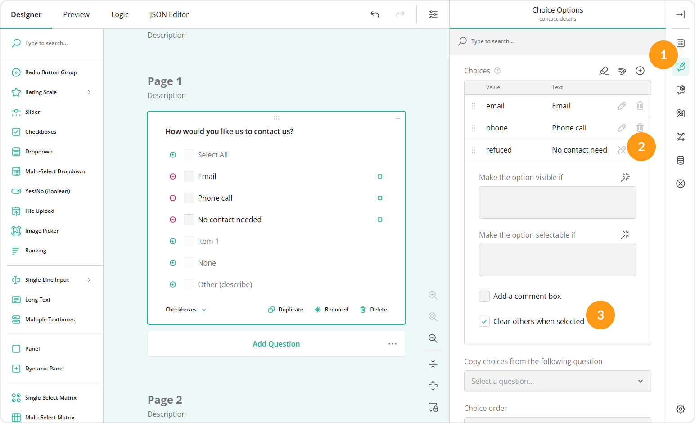

# Show Nested Follow-Up Questions Based on a Selected Choice Option

## About Nested Follow-Up Questions

SurveyJS allows you to add sub-questions directly under a selected choice option. When a respondent selects the option, the additional nested questions appear immediately below it to collect more detailed information.

Nested questions can be arranged in a cascading manner, where a follow-up question itself contains choice options that reveal further questions. This approach keeps forms compact and focused, as respondents only see questions that are relevant to their selections.

For respondents, this creates a clearer and less overwhelming experience. For form designers, it reduces the need to add multiple separate conditional questions and complex visibility rules. All related inputs stay within a single choice option, making forms easier to design, read, and maintain.

> By default, this functionality is disabled and must be enabled by your development team before it becomes available in the form builder interface. The instructions can be found in the [v2.3.12 release notes](https://surveyjs.io/stay-updated/release-notes/v2.3.12).

## Supported Question Types

Choice-based nested questions are supported by the following question types:

- Checkboxes  
  A question that allows respondents to select several options at once.  

- Radio Button Group  
  A question that allows respondents to select only one option.

You can choose either question type depending on whether multiple selections are required.

## Nesting Depth

Depending on your form requirements, multiple nesting levels can be enabled as needed. The maximum nesting depth is defined by your development team when the feature is enabled. If one level of nesting is configured, only first-level choice options can contain follow-up questions. If you request two levels of nesting, choice options within first-level nested questions can also contain their own follow-up questions.

## Create Choice Options with Nested Content

In this example, a Checkboxes question is used. The configuration steps are the same if you choose to use a Radio Button Group instead.

1. Add a **Checkboxes** question to your form.  
2. In the **General** category, assign the **Question name** (question ID) and a user-friendly **Question title** that will be visible to respondents.  

3. Switch to the **Choice Options** category.  
4. Fill out the **Choices** table by specifying **Values** (choice IDs) and **Texts** (visible choice options).

Alternatively, you can add choices in bulk:

* Click the **Pen** icon.  
* Paste the list of choices in the `value|text` format.  
* Click **Apply**.

5. On the design surface, click the square icon next to a choice option to expand its nested area.  
6. Click **Add Question**, or drag a question into the nested area to add a follow-up question.

7. Configure the nested question by assigning a name, title, and optionally a placeholder text.

8. Repeat steps 5 to 7 for other choice options that should display follow-up questions.  
9. To add the second nesting level, add a Checkboxes or Radio Button Group question as a first-level nested question.  
10. Click the square icon next to one of its choice options to expand the next nested area and add another follow-up question.
  

11. Configure the question at the second level of nesting.

## Enable Exclusive Selection

If a choice option is not compatible with other options (for example, "No contact needed"), you may want to prevent respondents from selecting it together with other choices. This helps avoid contradictory or unmeaningful data.

To make a choice option exclusive, follow these steps:

1. In the **Choices** table, locate the option you want to make exclusive.  
2. Click the **Pen** icon to open its extended settings.  
3. Enable **Clear others when selected**.  

> One of the choice options in this guide demonstrates phone number masking. To learn more, refer to the dedicated [How to Apply Input Masking](https://surveyjs.io/survey-creator/documentation/end-user-guide/how-to-apply-input-mask-to-text-fields) guide.
