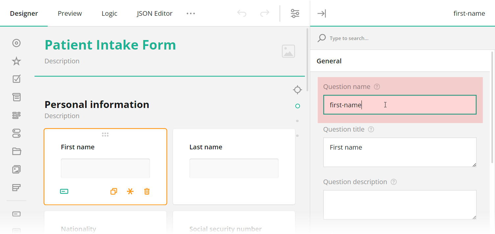
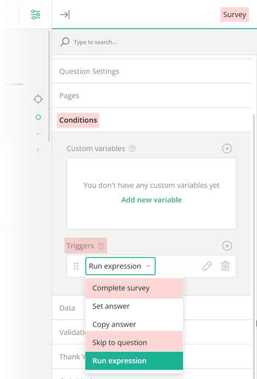
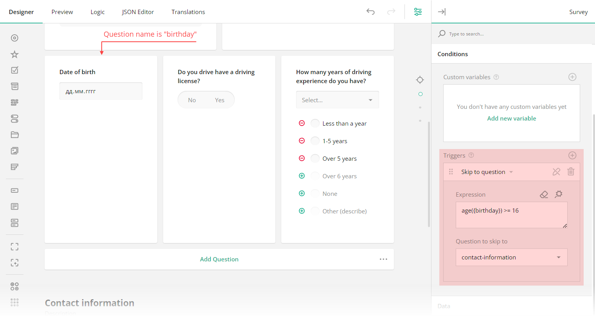
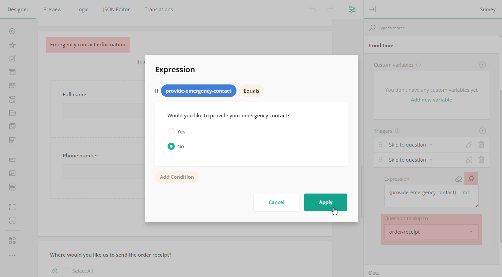
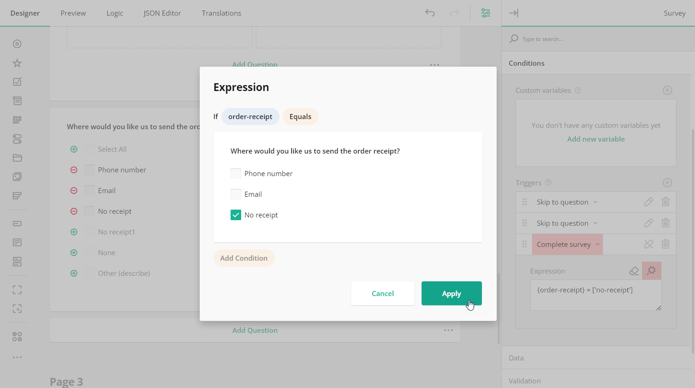
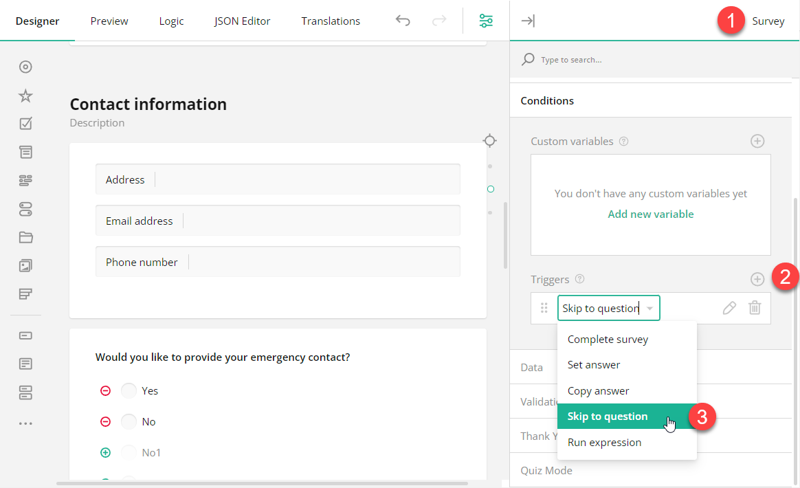
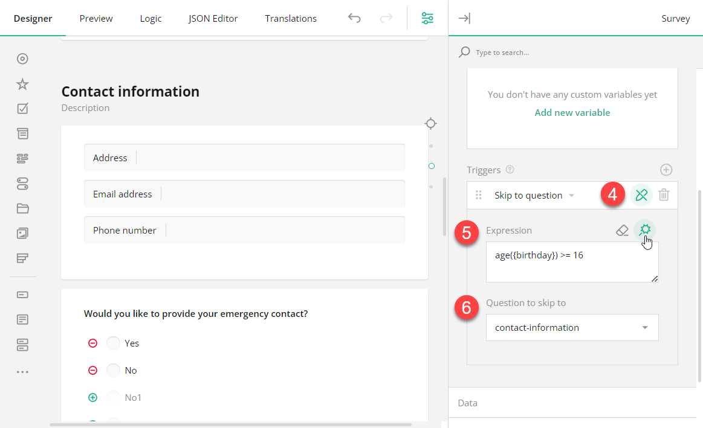
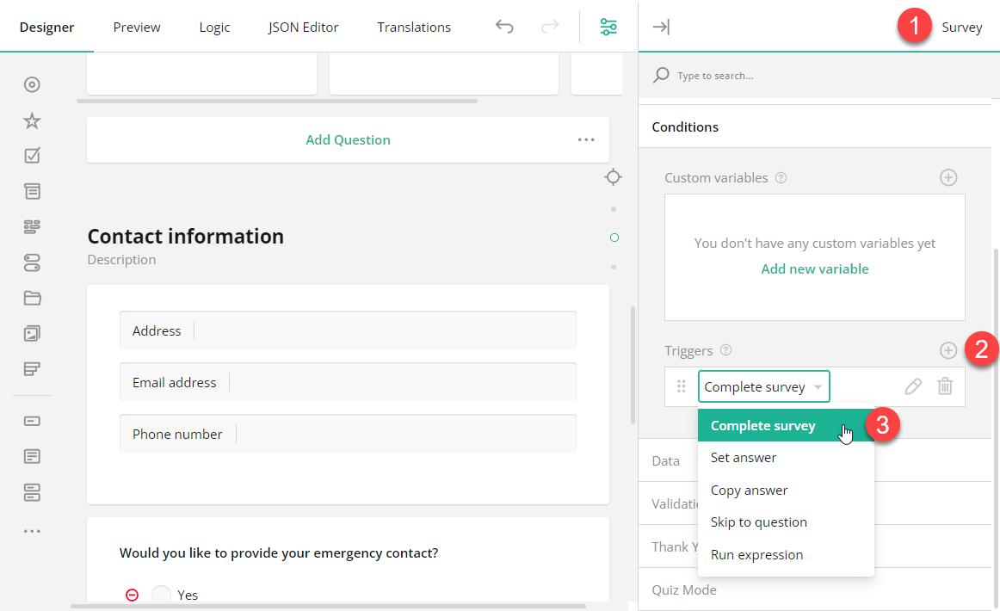

# Skip Logic

## About Skip Logic

Skip logic is a dynamic feature that allows you to control the flow of your forms based on respondents' answers. It ensures that your respondents are always prompted to answer the most relevant questions and complete surveys more quickly, providing a personalized survey experience.

## How It Works

### Question ID

Every input field added to your SurveyJS form is automatically assigned an ID. You can change this ID in the **General** settings of a question by entering a new value in the **Question name** property. This ID is not visible to respondents and is used in various form configurations, including skip logic setup.

If you choose to enter conditional rules and expressions manually, and they involve the value of a certain trigger question, use curly brackets to reference the question ID whose value you want to access, e.g., `{driving-license} = true`, where `driving-license` is the ID of the trigger question. Otherwise, use the graphical user interface (GUI) described below to set up your conditional logic without manual entry.

### Triggers

A trigger is an event or condition that is based on an expression. Once the expression evaluates to `true`, a trigger sets off an action. Such an action can optionally have a target question it affects. In SurveyJS Form Builder, two types of triggers allow you to set up skip logic in a form:

- **Skip to question** - Takes a respondent to a target question if a specified expression evaluates to `true`.
- **Complete survey** - Triggers survey completion if a specified expression evaluates to `true`. 

### Skip Logic Directions

Skip logic can be used to **send respondents both forward and backward in the survey**. By applying skip logic in reverse, participants can backtrack and provide answers to earlier sections or questions they initially left unanswered without navigating through the entire survey again.

### Skip Logic Destinations

Based on a respondent's answer to the current question, SurveyJS allows you to redirect them to the "Thank you" page or one of the following destinations:

- A specific question within the same section (in SurveyJS referred to as a panel).
- A specific question within the same page.
- A specific question within a different section on the same page.
- A specific question within a different section on a different page.
- The "Thank you" page.

## Skip Logic Examples

### Example #1

In the example below, we are using a built-in `age` function that calculates respondents' age at runtime based on the date they set in an input field with an ID `birthdate`. If a respondent's age is less than 16 years, the expression will evaluate to `true`, and the next two questions&mdash;"Do you have a driving license?" and "How many years of driving experience do you have?"&mdash;will be skipped. Such a respondent will then be prompted to the next page question with an ID `contact-information`.

### Example #2

In the next example, if a user replies "No" to the "Would you like to provide your emergency contact?" question, they are redirected to the question with an ID `order-receipt`, leaving out an entire question group with a title "Emergency contact information". The image below shows a drop-down menu with a selected target question and a GUI for building a conditional expression, which is activated by a click on the magic wand icon.

### Example #3

In the following example, we are using the "Complete survey" trigger. Once a conditional expression it's based on evaluates to `true` (i.e. a respondent replies "No receipt" to the "Where would you like us to send the order receipt?" question), it'll initiate survey completion. Such a respondent will then be prompted to submit the survey.

## How to Add Skip Logic

### Skip to Question

To redirect a respondent to a specific question in a form, follow the steps below:

1. At the top of the Property Grid, select **Survey** to switch to the survey-level settings.
2. Select the **Conditions** category.
3. Locate a subsection called **Triggers** and click the **Plus** icon to add a new trigger.
4. In the trigger drop-down menu, select **Skip to question**.

5. Click the **Pen** icon to expand the trigger settings.
6. Use one of the following ways to specify an expression that, when evaluates to `true`, will take a respondent to the target question (the destination you want to direct a respondent to).
   - Enter the expression in the **Expression** field.
   - Click the **Magic wand** icon to open a popup and build the expression using a GUI. Click **Apply** when you finish.
7. Select a target question using the drop-down menu of the **Question to skip to** property.

### Complete Survey

To automatically complete a survey based on a user response, follow the steps below::

1. At the top of the Property Grid, select **Survey** to switch to the survey-level settings.
2. Select the **Conditions** category.
3. Locate a subsection called **Triggers** and click the **Plus** icon to add a new trigger.
4. In the trigger drop-down menu, select **Complete survey**.

5. Click the **Pen** icon to expand the trigger settings.
6. Use one of the following ways to specify an expression that, when evaluates to `true`, will activate survey completion.
   - Enter the expression in the **Expression** field.
   - Click the **Magic wand** icon to open a popup and build the expression using a GUI. Click **Apply** when you finish.

## See Also

- [Display Logic](/survey-creator/documentation/end-user-guide/form-display-logic)
- [Branching Logic](/survey-creator/documentation/end-user-guide/branching-logic)