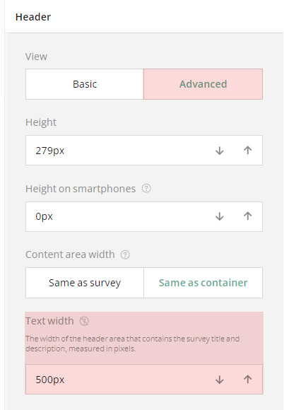
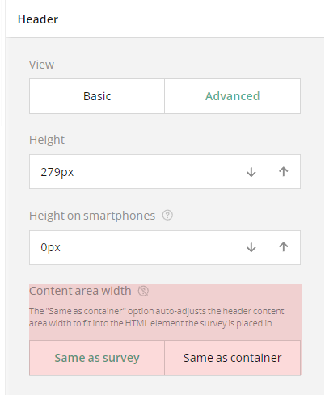
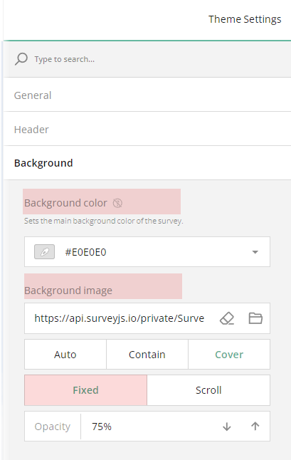

# How to Style Your Survey

## About Survey Theming

A well-designed survey not only looks professional but also makes it easier for respondents to interact with. Survey Creator offers a powerful Theme Editor&mdash;a fully integrated styling tool that simplifies survey customization and allows you to align its appearance with your specific brand style.

A theme in SurveyJS is a set of CSS variables that control the look and feel of all survey elements, including their colors, fonts, layout, and spacing. The Theme Editor provides a user-friendly interface where you can modify these variables without needing to write code. You can start with predefined themes and tailor them to meet your design requirements. Once customization is done, the Theme Editor generates a JSON file with all the theme settings. Your developers can save this file as a reusable custom theme that you can apply with one click to all or some of your surveys for a consistent and tailored appearance.

To customize the survey design, open the **Themes** tab in the Survey Creator.

## Choose and Apply a Theme

The Theme Editor comes with a collection of predefined themes that provide a great starting point for customizing your survey. Each theme supports dark mode and a more compact view without panels, which gives you a total of 40 different theme variations right out of the box.

To apply a new theme, locate the **Theme** drop-down menu under the **General** category and select a theme from this menu:

## Enable Dark Mode

Dark mode provides a smooth, modern appearance that's easier on the eyes, especially in low-light environments. To enable this mode, switch the Light/Dark toggle to **Dark**:

## Display Questions Without Question Boxes

In a typical survey, every element includes an input field and a question box&mdash;an area that frames the question content and separates it from the survey background. 

The Theme Editor allows you to remove the question boxes for the questions that are not nested within a panel, resulting in a lighter and more compact overall appearance.

To display questions without their individual question boxes, locate the **Question appearance** setting under the **General** category and toggle it to **Without Panels**:

> The form builder offers an element called a panel (or a section) that allows you to group several questions together. In this case, the **Question appearance** setting applies to the questions inside the panel, while the panel itself keeps its own borders:
> 
> 

## Style the Survey Header

The Theme Editor provides two levels of customization for your survey header. By default, you have access to basic settings that allow you to make minor adjustments to the logo, form title, and description. For more detailed styling options, you can enable the advanced mode that allows you to fine-tune the design of the survey header with greater precision.

### Add a Logo

To add and configure your company logo in the survey header, follow these steps:

1. Switch to the **Designer** tab.
2. Open the **Logo in the Survey Header** category.  
3. Locate the **Survey logo** property and paste a link to the image in the input field or click the **Folder** icon next to the property to upload a file.  
4. Optionally, resize the logo by entering the desired dimensions in CSS units (px, %, in, pt, etc.) in the **Logo width** and **Logo height** input fields.  
5. Select the **Logo fit** option:
   * **None** - Image maintains its original size.
   * **Contain** - Image is resized to fit while maintaining its aspect ratio.
   * **Cover** - Image fills the entire box while maintaining its aspect ratio.
   * **Fill** - Image is stretched to fill the box without maintaining its aspect ratio.   

6. Switch to the **Themes** tab.  
7. Open the **Header** category
8. Locate the **Logo alignment** property and use it to align the logo in the horizontal and vertical directions.

> Regardless of the position you set, the logo is always displayed on the right in the Designer tab.

### Survey Title and Description

If your survey includes a title and description, you can customize their fonts, colors, and layout using dedicated appearance properties.

#### Adjust Text Width

The survey title and description occupy a header area with a defined text width. To change it, open the **Header** category and adjust the **Text width** property:

#### Customize Fonts

To change the font settings for the survey title and description, follow these steps:

1. Under **Header**, locate the **Survey title font** and **Survey description font** sections.  
2. Select a **Font family** from the drop-down menu.  
3. Choose a **Font weight**&mdash;**Regular**, **Semi-bold**, **Bold**, or **Heavy**.  
4. Use the **Color** property to pick a color or enter an RGB, HEX, or HSL value.
5. Adjust the **Opacity** in percent using the control next to **Color**.  
6. Set the **Font size** in pixels.

#### Align Text

You can align the survey title and description both vertically and horizontally. Use the **Survey title alignment** and **Survey description alignment** properties available under **Header**.

### Customize the Header Area

To customize header area properties, follow these steps:

1. Ensure that the **View** toggle is set to **Advanced**.  
2. Set the header height for desktop devices using the **Height** property and for mobile devices using the **Height on smartphones** property.

> You can preview how your survey looks on different devices in the **Preview** tab by switching between available devices and screen orientations.

3. Locate the background settings within the **Header** category.
4. To change the color of the survey header, choose from the following **Background color** property options:
   * **None** - Removes the individual header color, making it the same as the form background.
   * **Accent** - Applies the accent color from the selected survey theme.
   * **Custom** - Allows you to set a custom background color using the color picker (in RGB, HSL, or HEX format).

In addition, you can style the header background by uploading an image:

1. Find the **Background image** properties.
2. Paste a link to an image in the input field or click the **Folder** icon next to the property to upload a file.  
3. To set the image display style, choose from the following display options:
   * **Cover** - Image fills the entire header area while maintaining its aspect ratio.  
   * **Stretch** - Image is stretched to fill the header box without maintaining its aspect ratio.  
   * **Contain** - Image is resized to fit within the header box while maintaining its aspect ratio.  
   * **Tile** - Image is repeated to fill the entire header area, maintaining its aspect ratio.
4. Set the transparency of the background image using the **Opacity** property.  
5. If you want the survey content to overlap with the header, check the **Overlap** checkbox in the header settings.

### Adjust the Header Content Area

Follow the steps below to modify the width of the survey header area that contains content (survey title, description, and logo):

1. Ensure that the **View** toggle is set to **Advanced**.
2. Locate the **Content area width** property and set the area width:
   * Keep the default option **Same as survey** if you prefer the header content to match the width of the survey itself (its content).
   * Select **Same as container** if you want the header content area to automatically adjust its width to match the space where your survey is displayed.

## Background Options

The background color of your survey helps set the overall tone and appearance, making your form more visually appealing. To set the survey background color, follow the steps below:

1. Under the **Background** category, locate the **Background color** property.
2. Specify the background color in one of the following ways:
   - Select a color from a drop-down menu or using a color picker.
   - Enter an RGB, HEX, or HSL color code.

In addition, you can style the survey background by uploading an image:

1. Under **Background**, find the **Background image** section.
2. Paste a link to an image in the input field or click the **Folder** icon to upload an image.
3. To set the image display style, choose from the following display options:
   * **Auto** - Image maintains its original size and aspect ratio. Tiling applies if the image is smaller than the survey container.
   * **Contain** - Image is resized to fit the container while maintaining its aspect ratio. Tiling applies if the image is smaller than the survey container
   * **Cover** - Image fills the entire container while maintaining its aspect ratio.
4. You can also lock the image in place by setting the **Image position** toggle to **Fixed**, so the background remains stationary as you scroll the survey. To make the background move along with the content, switch to **Scroll**.
5. Adjust the image's transparency using the **Opacity** property.

   

## See Also

[Customize the Survey Look](/survey-creator/documentation/end-user-guide/how-to-customize-survey-look (linkStyle))