# How to Sync a Range Slider with Input Fields

## About the Range Slider Question

A Range Slider allows users to select a range of values (e.g., a minimum and maximum price) using a slider track with two thumbs (handles). It can be paired with two input fields to let users manually enter the minimum and maximum values.

When the Range Slider and input fields are synchronized, they update each other's values in real time. For example, dragging the slider thumbs updates the values in the input fields, and typing in the input fields adjusts the slider positions.

In this tutorial, we will focus on configuring a Range Slider question and synchronizing its values with two input fields for manual entry. Additionally, we will explain how to sync a Single-Value Slider with a single input field.

<video src="images/Slider-EUG.mp4" autoplay muted playsinline loop style="width: 100%"></video>

## Sync a Range Slider with Input Fields

This section guides you through setting up a Range Slider and linking it to two Single-Line Input questions for manual value entry.

### Add a Range Slider Question

1. Drag a **Slider** question onto your form.
2. Under **General**, give it a **name** (question ID, e.g. `preferred-price`) and a user-friendly **title** (e.g., `What's your preferred price range for this product?`).
3. Optionally, add a **description** (e.g., `(in USD)`).

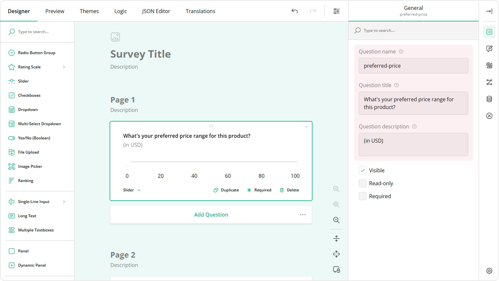

### Configure Range Slider Settings

1. Navigate to the **Slider Settings** category.
2. Set the **Slider type** property to **Range** to allow users to select a minimum and maximum value on the slider scale.
3. Adjust the scale limits using the **Min value** and **Max value** properties (e.g., `100` and `1000`).
4. Modify the **Step value** to `10` for increments such as `110`, `120`, etc.

   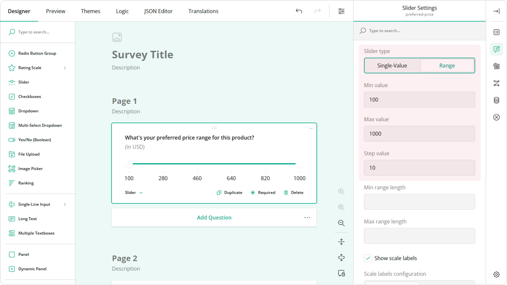
5. Adjust the **Number of auto-generated scale labels** (e.g. to `5`) for a cleaner look.
6. Optionally, customize the **Label format** and **Tooltip format**.

   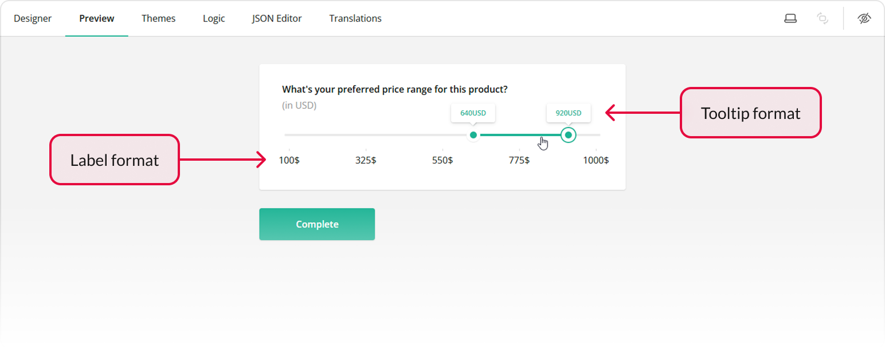
7. Enable **Show the Clear button** to allow users to clear their selection and start over.

   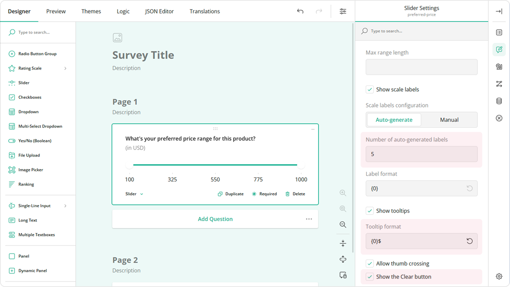
8. Limit the length of the selected range using the **Min range length** and **Max range length** settings. For example, if **Max range length** is set to `250`, users cannot select a range where the distance between the slider thumbs exceeds 250 units.

   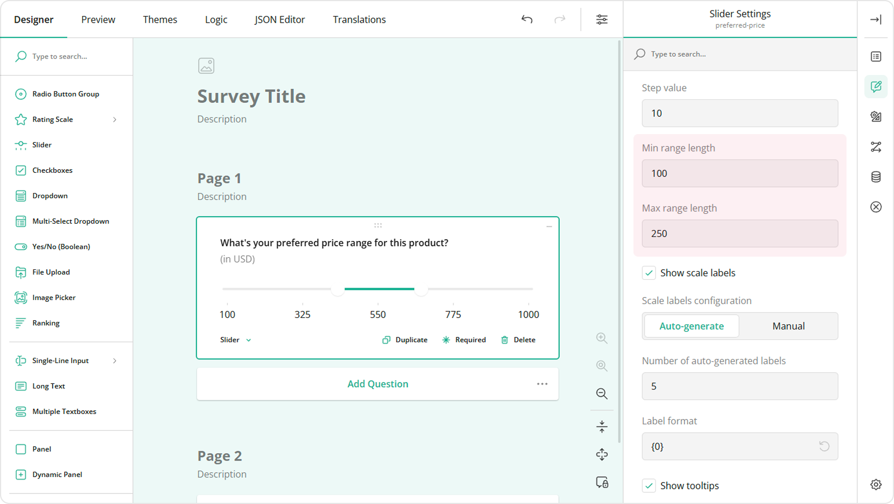
9. To set the initial positions of the slider thumbs, switch to the **Data** category and click the **Set Default Answer** button.
10. Drag the slider thumbs to the desired values (e.g., `500` and `750`) and click **Apply**.

   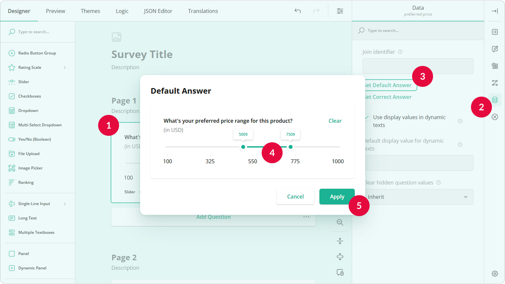

### Add an Input Field for the Minimum Value

1. Drag a **Single-Line Input** question onto your form.
2. Under **General**, give it a **name** (question ID), for example `min`.
3. Keep the **Input type** set to **Text**.
4. Set the **Placeholder within the input field** property to `From` to indicate the minimum value.

   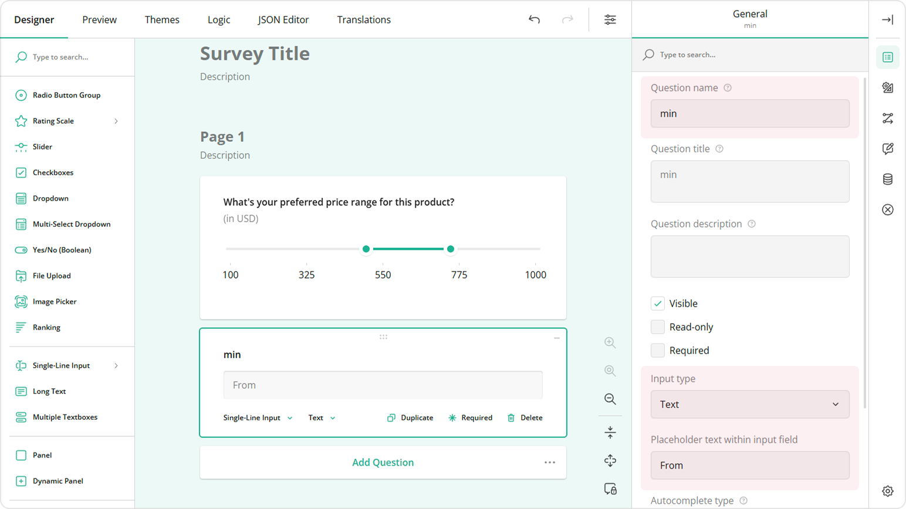
5. Under **Layout**, locate **Question title alignment** and set to **Hidden**.

   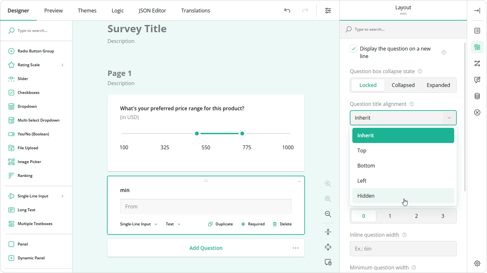
6. Switch to the **Input mask settings** category.
7. Select **Currency** as the input mask type.
8. Specify **Currency suffix** (e.g., `USD`).
9. Set **Minimum value** to `100` to match the Range Slider's **Min value** setting.
10. Set **Maximum value** to `900` (the difference between the values set for the Range Slider's **Max value** and **Min range length** settings).
11. Set **Value precision** to `0` to disable decimals.
12. Disable the **Allow negative values** setting.

   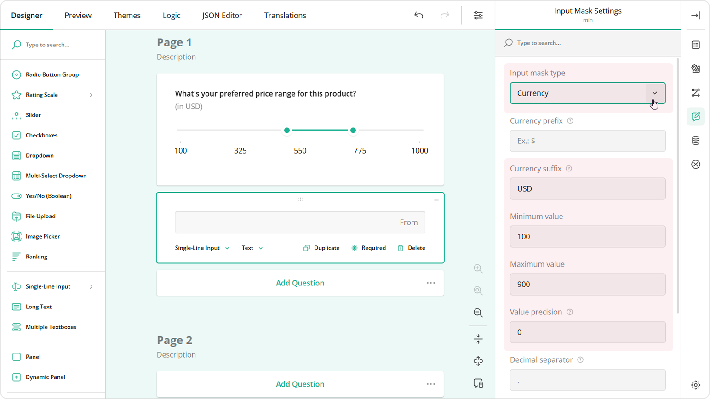   

### Add an Input Field for the Maximum Value

1. Duplicate the Single-Line Input question using the **Duplicate** button located on the question.
2. Place the new question to the right of the original one.
3. Assign a different name to it (e.g., `max`).
4. Update the **Placeholder within the input field** to `To`.
5. Under **Input mask settings** category, set **Minimum value** to `200` (since the Range Slider's starts at `100` and the **Min range length** property is set to `100`).
6. Set **Maximum value** to `1000` to match the Range Slider's **Max value** setting.

   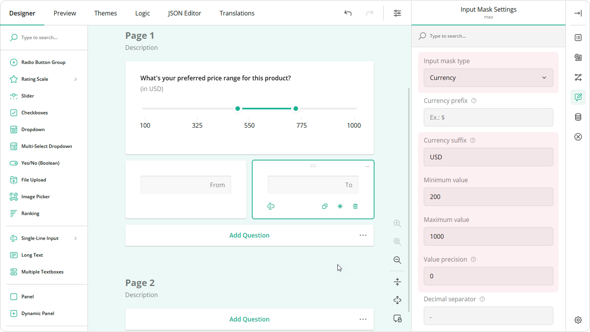

### Sync the Slider with the Input Fields

1. Select the Range Slider question.
2. Under **Conditions**, locate the **Set value expression** field.
3. Enter the expression `[{min}, {max}]`, where values in curly brackets are the names of the Single-Line Input questions. This expression links the Range Slider's minimum and maximum thumb positions to the values entered into the `min` and `max` input fields, respectively.

   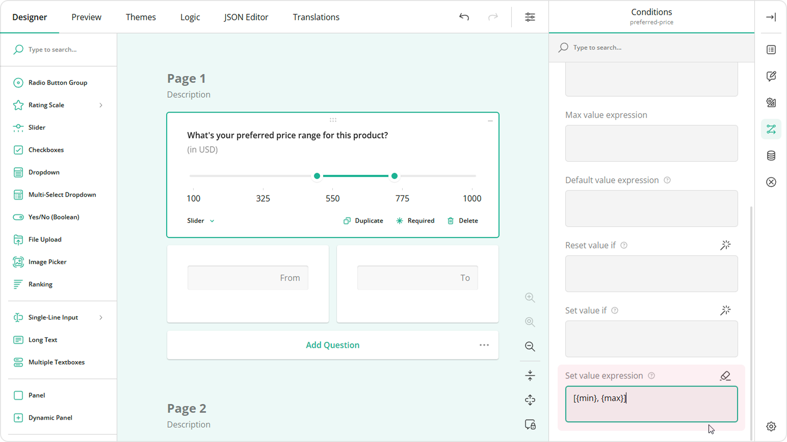
4. Select the `min` input field.
5. Go to the **Conditions** category.
6. In the **Set value expression** field, enter `{preferred-price[0]}`, where `preferred-price` is the name assigned to the Range Slider question in step 2. This expression syncs the Range Slider's minimum thumb position with the `min` input field.

   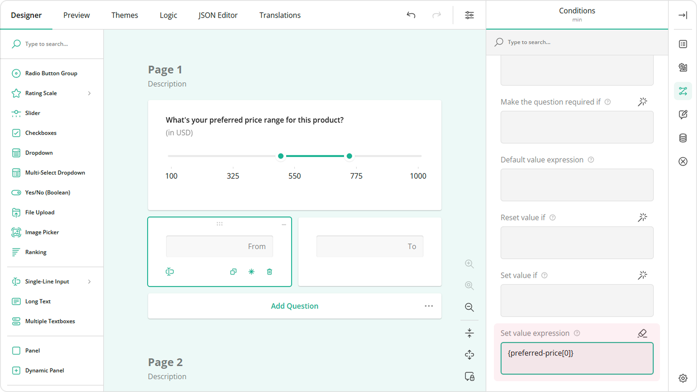
7. Select the `max` input field.
8. In the **Set value expression** field, enter `{preferred-price[1]}`, where `preferred-price` is the name assigned to the Range Slider question in step 2. This expression syncs the Range Slider's maximum thumb position with the `max` input field.

### Add Validation for Manually Entered Values

1. Select the Range Slider.
2. Go to the **Validation** category.
3. Click the **Plus** icon to add a new validation rule.
4. In the **Error message** field, enter the text you wish to show if the values users enter in either input field don't meet the requirements (e.g. `The distance between the two slider values must be between 100 and 250.`).
5. In the **Valid when** field, enter the following expression: `{max} empty or {min} empty or ({max} - {min} <= 250 and {max} - {min} >= 100)`, where values in curly brackets refer to the names of the Single-Line Input questions. This expression ensures that the length of the specified range stays within the allowed limits when the range is defined externally.

   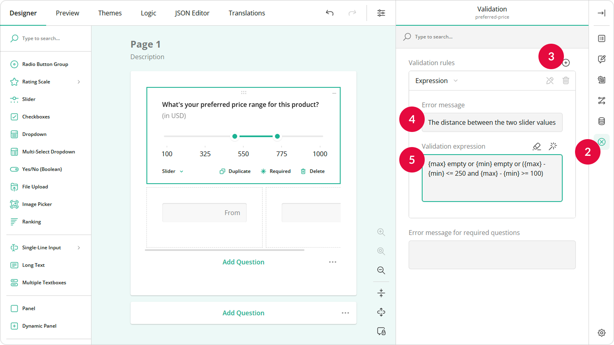
6. To ensure users are immediately informed of invalid values, enable immediate validation. Switch to the survey-level settings, open the **Validation** category, find the **Run validation** dropdown, and select the **After an answer is changed** option.

   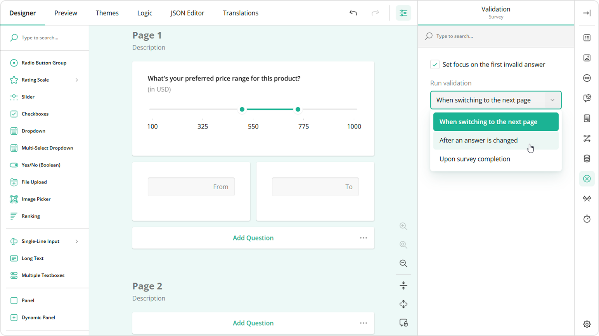

Now, if a user enters values that result in a range length less than 100 or greater than 250, the following error message will appear at the top of the Range Slider.

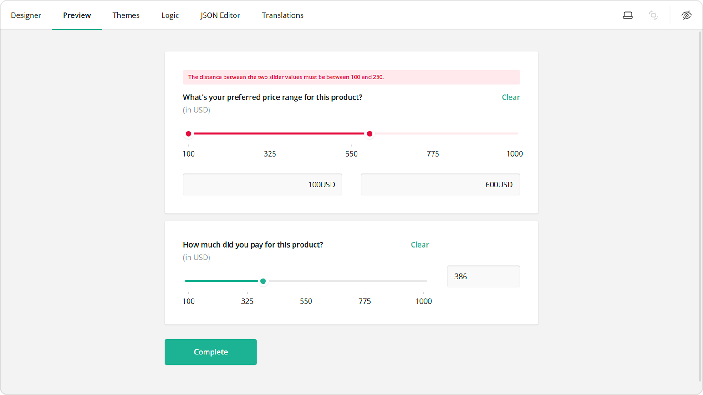

### Enable Real-Time Data Updates

1. While still on the survey-level settings, switch to the **Data** category.
2. Locate the **Update input field values** property and set it to **While typing** to ensure that input fields update dynamically as users type.

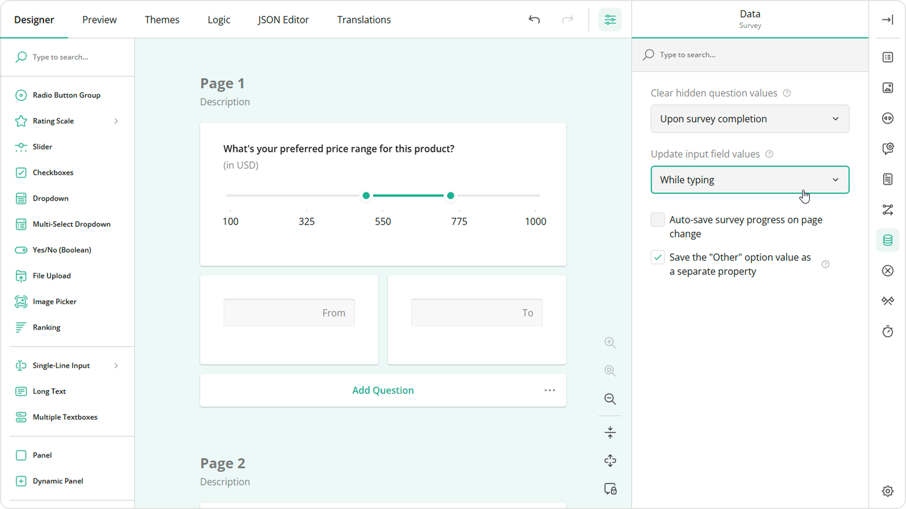

## Sync a Single-Value Slider with an Input Field

This section guides you through setting up a Single-Value Slider and linking it to a Single-Line Input question for manual value entry. To validate user input in the Single-Line Input field, we will configure the input format by setting the appropriate **input type** instead of applying an **input mask**. 

### Add a Single-Value Slider Question

1. Drag a **Slider** question onto your form.
2. Under **General**, give it a **name** (question ID, e.g. `amount-paid`) and a user-friendly **title** (e.g., `How much did you pay for this product?`).
3. Optionally, add a **description** (e.g., `(in USD)`).

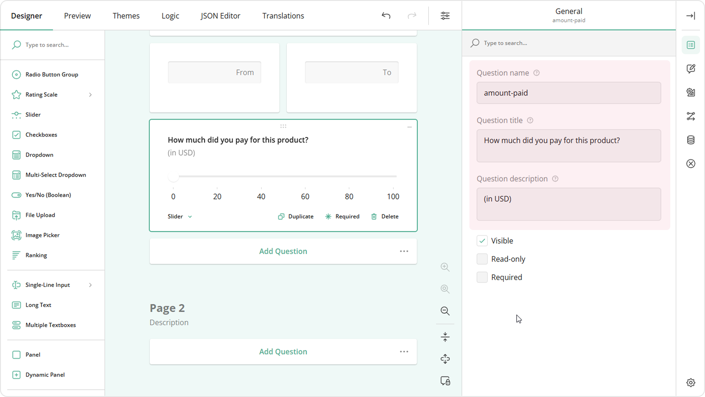

### Configure Single-Value Slider Settings

1. Navigate to the **Slider Settings** category.
2. Keep the **Slider type** property set to **Single-Value** to allow users to select just one value.
3. Repeat [Range Slider configuration settings](#configure-range-slider-settings).

### Add and Configure the Input Field for Manual Data Entry

1. Drag a **Single-Line Input** question onto your form.
2. Under **General**, give it a **name** (question ID), for example `amount-paid-input`.
3. Change the **Input type** to **Number**.
4. Set the **Min** and **Max** properties to `100` and `1000` respectively.
5. Set the **Step** property to `1`.

   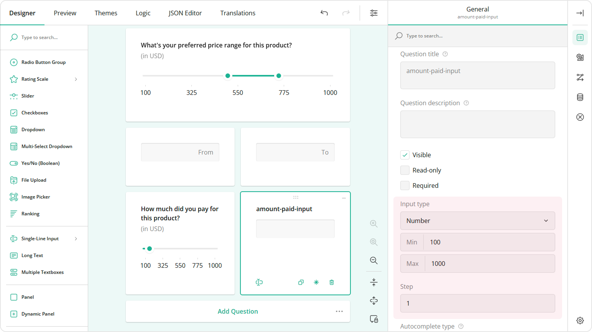
6. Under **Layout**, locate the **Minimum question width** property and set it to `200px`.
7. Locate the **Maximum question width** proeprty and set it to `20%`.

   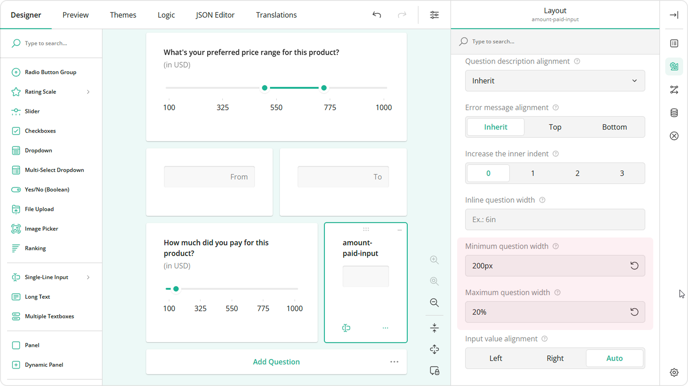
8. Go to the **Data** category, locate the **Join identifier** field, and enter the Single-Value Slider's name, i.e. `amount-paid`, to ensure that the slider's and the input field's values are synchronized.

   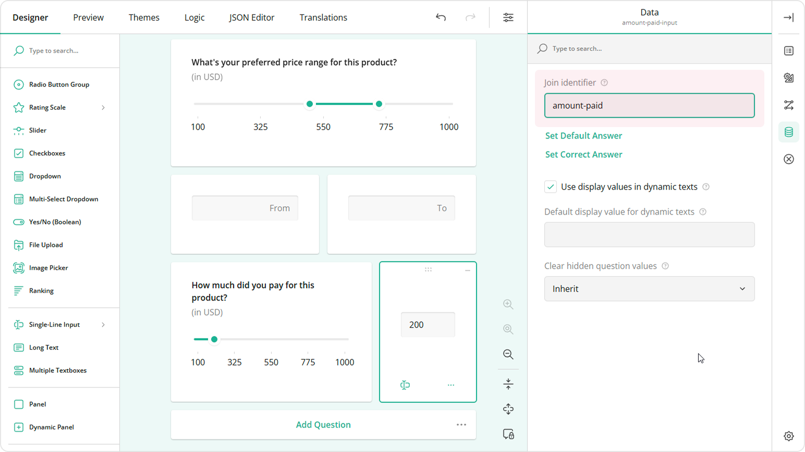

> To vertically align the Single-Value Slider track with the input field, replace the auto-generated title of the Single-Line Input with a space (due to technical limitations, it cannot be empty). Optionally, you can place both questions in a Panel element to make them look as a unified element.

After completing the steps above, your form will display a UI like the one illustrated in the image below:

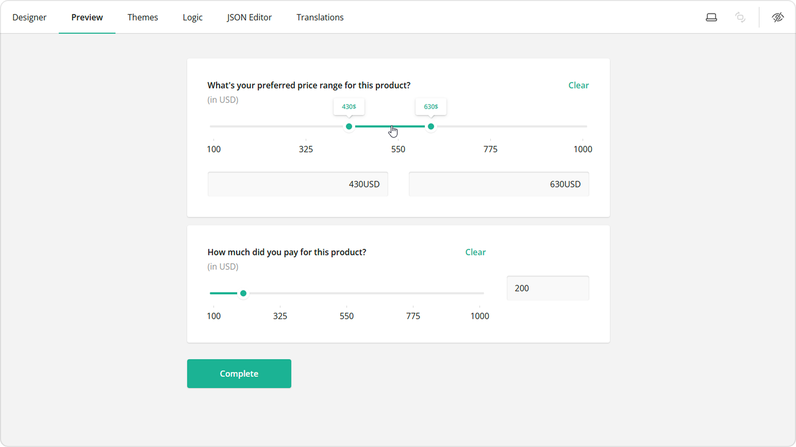
