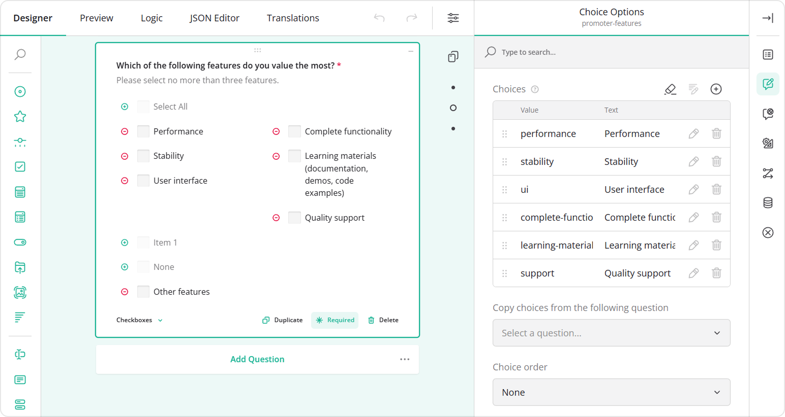
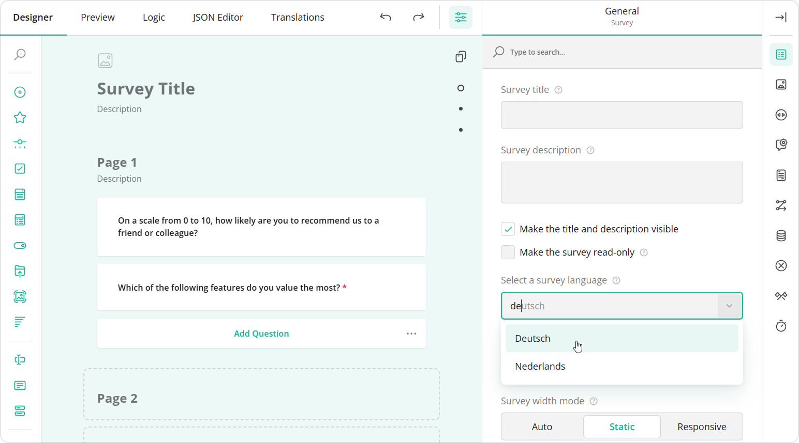
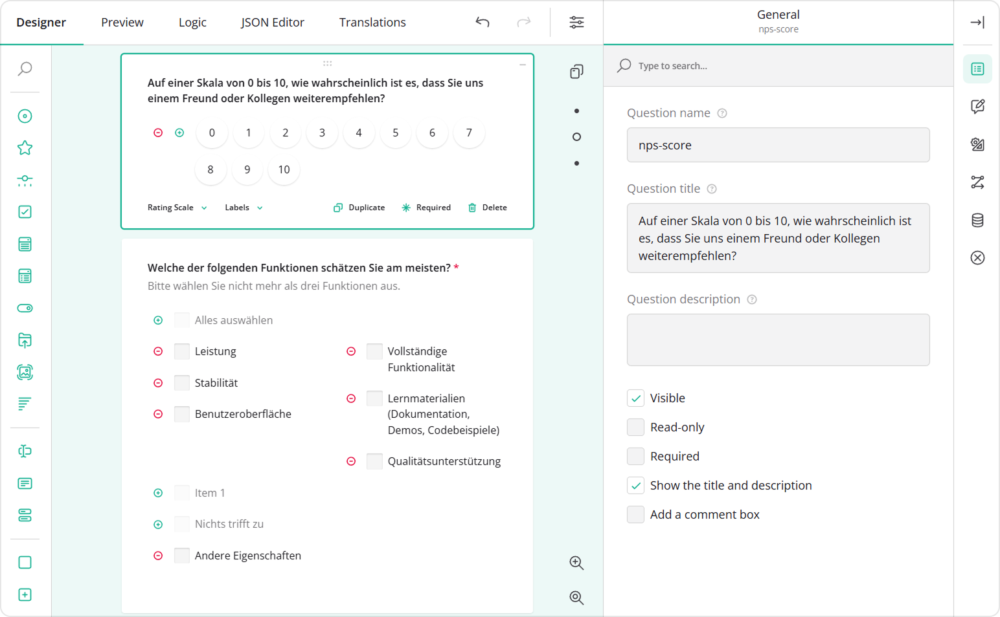
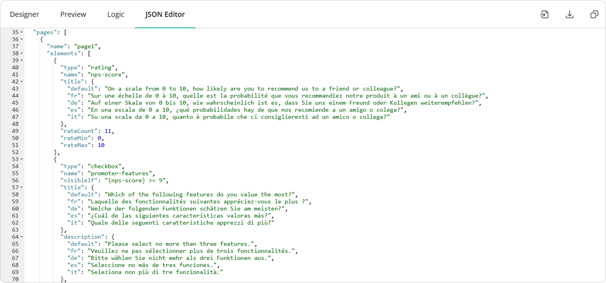

# Translate Forms in the Designer Tab

SurveyJS Form Builder includes built-in localization features that allow you to translate form content directly within the Designer tab. This approach is well suited for small or medium-sized surveys and for scenarios when you want to immediately preview how translated text appears within each survey element.

## About Survey Localization

Survey localization in SurveyJS consists of two distinct content types:

- Survey UI elements\
This includes built-in labels, messages, and controls provided by SurveyJS. For example, buttons like **Next**, **Previous**, and **Submit**, and validation messages such as "This question is required". These elements are translated automatically and appear in the selected language without any extra setup.

- Survey content\
This includes question titles, descriptions, placeholders, answer choices, and other custom texts. These must be translated manually by the form designer.

The Designer tab allows you to translate survey content directly on the design surface or through the Property Grid.

## Translate Your Form

### Configure the Form in the Default Language

Each form is first created in a default language. This language is used for all forms in your application unless you choose a different one. In most cases, the default language is English, and it appears as Default (English). If your application uses another main language, that language will be shown instead.

The default language also acts as a fallback: if some text hasn't been translated into another language yet, the survey will display the text from the default language.

To start translating your survey, first write all questions and texts in the default language. Add all the questions you need and set them up as required. Once that's done, you can translate all visible texts either directly on the design surface or in the Property Grid, including:

- Form title and description
- Question titles and descriptions  
- Choices
- Placeholders
- Validation messages, and other visible texts

### Translate the Form into Other Languages

To translate your form into additional languages, follow these steps:

1. Select the survey on the design surface or in the Property Grid.
2. In the **General** category, locate the **Select a survey language** dropdown.
3. Choose the target language (for example, Deutsch).

4. Translate all visible texts on the design surface or in the Property Grid.
5. Repeat steps 2&ndash;4 for each additional survey language you want to support.

All translations are stored directly in the resulting survey JSON schema.

## See Also

- [Translate Forms in the Translations Tab](/survey-creator/documentation/end-user-guide/translations-tab)