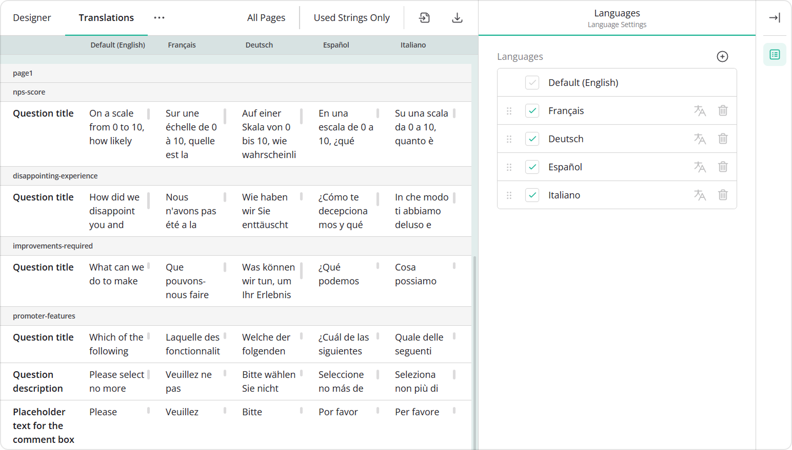
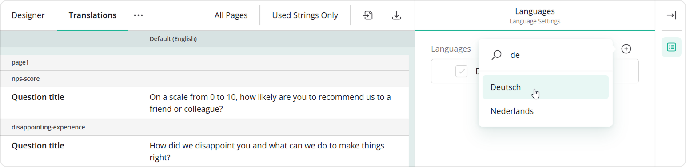
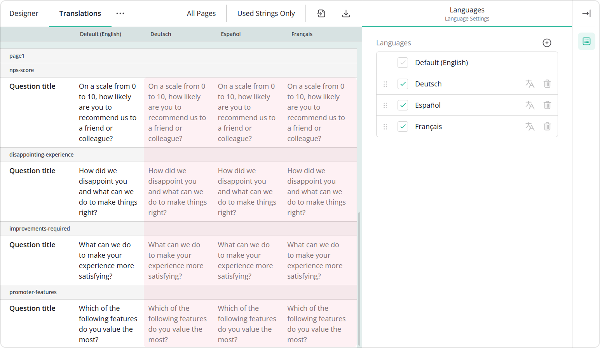
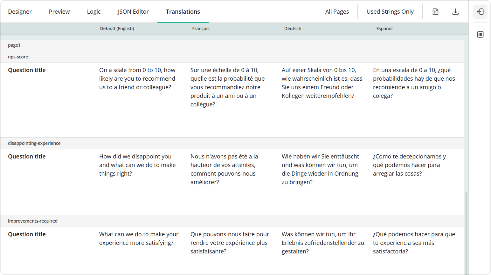
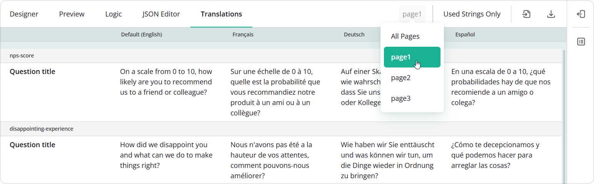
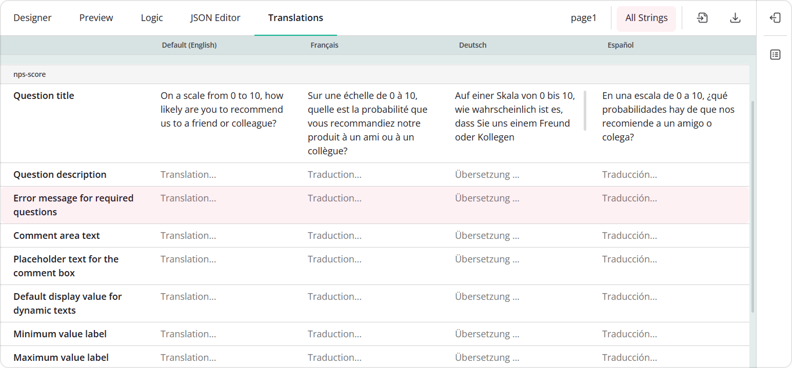
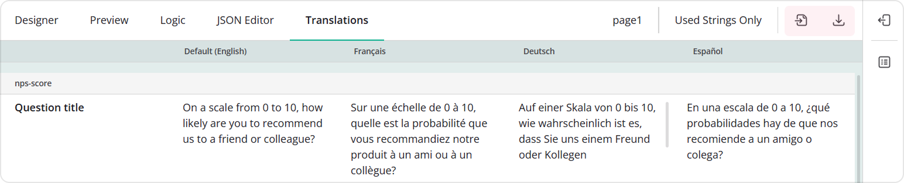
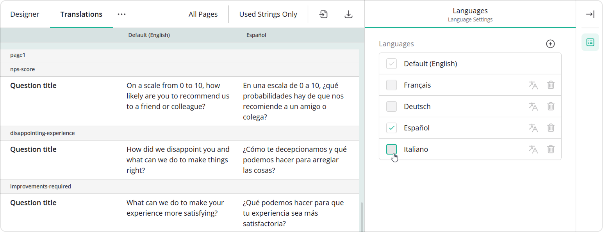
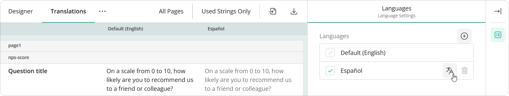
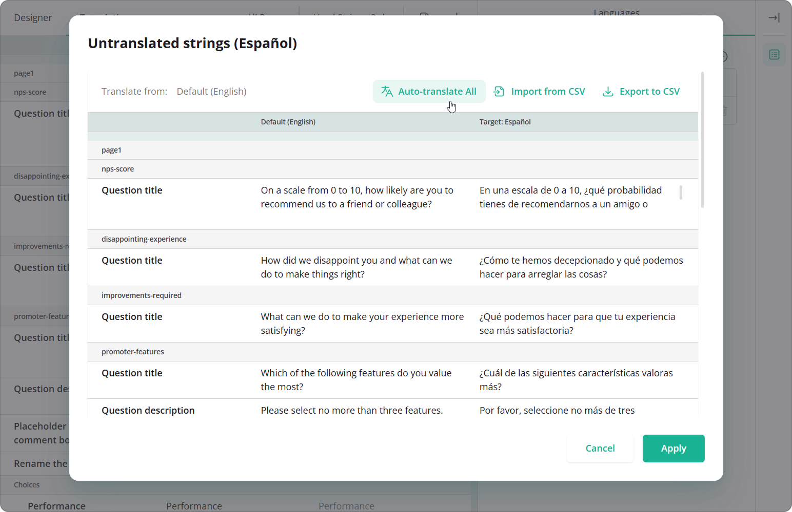

# Translate Forms in the Translations Tab

The Translations tab in SurveyJS Form Builder provides a structured, table-style view where you can translate your survey into multiple languages. This approach works particularly well for large surveys, for teams working on translations together, and for projects where it's helpful to manage all translations in one place.

## About Survey Localization

Survey localization in SurveyJS consists of two distinct content types:

- Survey UI elements\
This includes built-in labels, messages, and controls provided by SurveyJS. For example, buttons like **Next**, **Previous**, and **Submit**, and validation messages such as "This question is required". These elements are translated automatically and appear in the selected language without any extra setup.

- Survey content\
This includes question titles, descriptions, placeholders, answer choices, and other custom texts. These must be translated manually by the form designer.

The Translations tab displays all survey text in a table, where each row contains a survey element to translate and each column represents a different language.

## Configure the Form in the Default Language

Each form is first created in a default language. This language is used for all forms in your application unless you choose a different one. In most cases, the default language is English, and it appears as Default (English). If your application uses another main language, that language will be shown instead.

The default language also acts as a fallback: if some text hasn't been translated into another language yet, the survey will display the text from the default language.

To start translating your survey, first write all questions and texts in the default language. Add all the questions you need and set them up as required. Once that's done, you can translate all visible texts either directly on the design surface or in the Property Grid, including:

- Form title and description
- Question titles and descriptions  
- Choices
- Placeholders
- Validation messages, and other visible texts

## Translate the Form into Other Languages

### Add Languages to the Table

To start translating your form into additional languages, follow these steps: 

1. Open the Translations tab.
2. Click the **Add Language** icon in the right-side panel.
3. Select one or more target languages.

The first column in the table always shows the survey's default language, which is usually English. Each additional column shows another language you've chosen. Each row represents a survey element that can be translated.

Cells for newly added languages display fallback values&mdash;either texts from the default language or default SurveyJS strings (for example, standard validation messages).

### Enter Translations

You can type translations for each language directly into the table cells. All changes are saved automatically and become part of the survey JSON schema.

### Filter Translation Strings

By default, the translation table shows text for every page and element in the survey. To work on a specific page, just select it from the page menu at the top.

Initially, the table shows only your custom survey content (question titles, descriptions, answer choices). To translate SurveyJS interface text (for example, placeholders, button captions, or error messages), change the filter from **Used Strings Only** to **All Strings**.

### Import or Export Translation Strings to CSV

If your team is working on translations in different locations or offline, you can export the survey text to a CSV file and import translations from a CSV file as well.

Click **Export to CSV** to download all the survey text for translation, or click **Import from CSV** to upload translated text back into the survey.

### Hide Languages from the Grid

To reduce visual clutter and focus on specific languages, uncheck unwanted languages in the right-side panel. This hides the corresponding columns in the grid but does not remove translations from the survey JSON.

### Delete a Language from the Survey

To permanently remove translations for a specific language, click the **trash bin** icon next to the language name in the right-side panel and confirm the deletion.

If you need to restore a deleted language, switch to the Designer tab and click **Undo**.

### AI-Assisted Translation

> This feature must be configured by your development team.

AI-assisted translation allows you to generate translations automatically in just a few steps:

1. [Add a new language to the table](#add-languages-to-the-table).
2. Click **Auto-translate** next to the language name in the right-side panel to open the dialog.

3. In the dialog, click **Auto-translate All**. The generated translations appear in the table.

4. Click **Apply** to save the generated translations to your survey JSON schema. You can then review and make any changes directly in the table.
## See Also

- [Translate Forms in the Designer Tab](/survey-creator/documentation/end-user-guide/translate-forms-in-designer-tab)