# Survey Creator UI

This document illustrates how to perform basic tasks in the Survey Creator component. The component's UI is organized in multiple tabs. Each section in this document describes an individual tab.

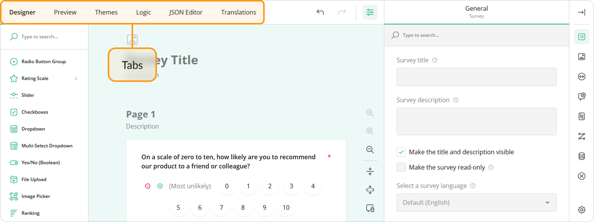

## Designer Tab

The Designer tab allows you to configure your survey. You can drag and drop questions and panels from the Toolbox onto the design surface and then use the Property Grid to change the question, panel, and survey settings.

### Question and Panel Types

The Toolbox contains the question and panel types described below.

#### Radio Button Group

Respondents use radio buttons to select a single answer. Use the Radio Button Group type for questions that can have multiple options but accept only one answer.

See also: [Dropdown](#dropdown)

#### Rating Scale

Respondents select one number within a range. Use the Rating Scale type when you want respondents to enter a rating.

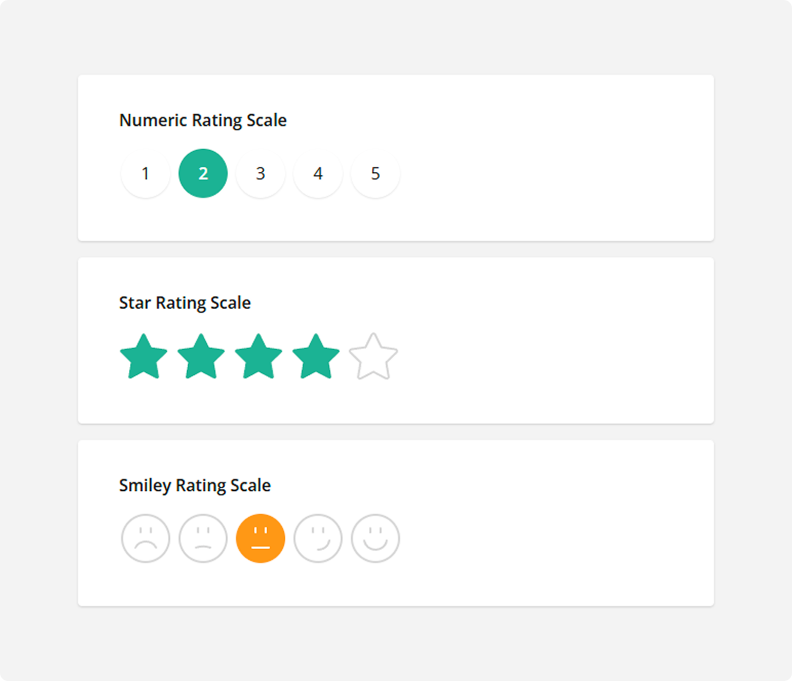

- How to: Use graphic symbols (stars, emojis) for rate values           
Switch to the **Rating Values** category and select a required **Rating icon**:
    
Alternatively, you can change the rate type using an adorner directly on the design surface:
    

#### Checkboxes

Respondents click one or several checkboxes to select answers. Use the Checkboxes type for questions that accept multiple answers.

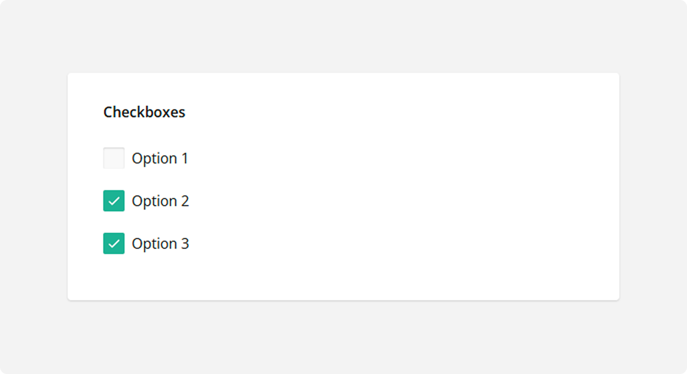

#### Dropdown 

Respondents select a single answer from a drop-down list. Like [Radio Button Group](#radio-button-group), the Dropdown type can be used for questions that have multiple options but accept only one answer. However, the Dropdown UI can display more options while occupying less screen space.

#### Multi-Select Dropdown

Respondents can select one or multiple answers from a drop-down list. Unlike a simple [Dropdown](#dropdown) question type, Multi-Select Dropdown allows respondents to select more than one answer.

#### Yes/No (Boolean)

Respondents switch a Boolean editor to Yes or No. The response is saved in the survey results as `true` for Yes or `false` for No.

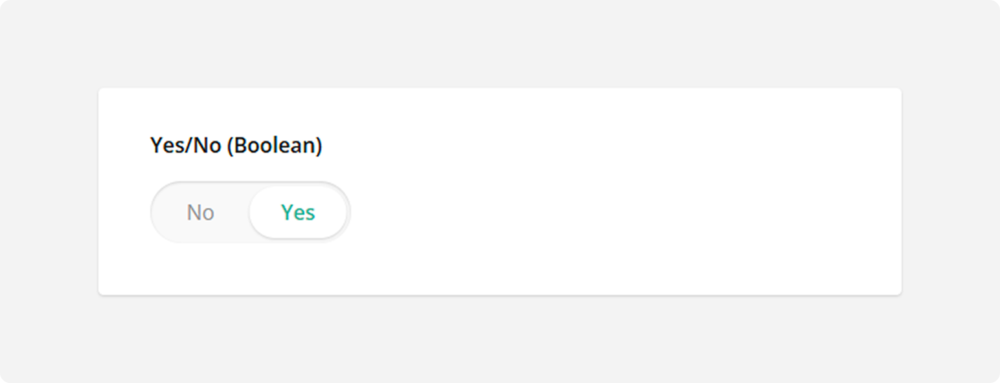

#### File Upload

Use the File Upload type to allow respondents to upload files. Respondents drag and drop one or several files onto the allocated area or select files in the browser's Upload File dialog window. The uploaded files are saved in the survey results as base64-encoded strings.

- How to: Restrict uploaded file types          
The File Upload type is built upon the standard `<input type="file">` HTML element. To restrict file types, the standard element uses the <a href="https://www.w3schools.com/tags/att_input_accept.asp" target="_blank">`accept`</a> attribute. Enter its value into the **Accepted file types** field in the **General** category:            
    

    > Always restrict the allowed file types to prevent possible security vulnerabilities. 

- How to: Enable multiple file selection           
Switch to the **General** category and select **Enable multiple file upload**:        
    

#### Image Picker

Respondents select one or several images or videos from a series. A value associated with this image or video is saved to the survey results.

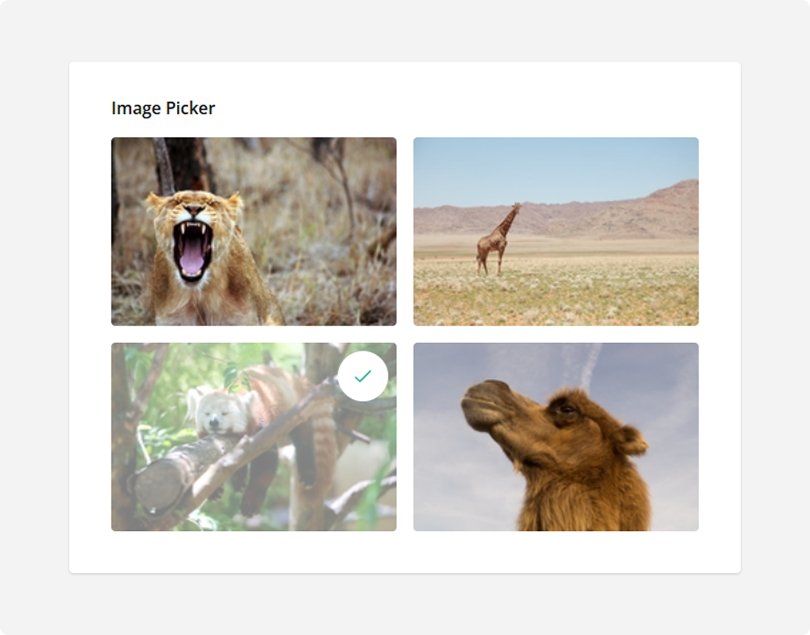

- How to: Associate values with images or videos          
Switch to the **Choices** category and enter the values in the **Choices** table:      
    

- How to: Enable multiple image or video selection           
Switch to the **General** category and select **Allow multiple selection**:            
    
    
#### Ranking 

Respondents drag and drop items from a list to rearrange them according to rank or preference. Use the Ranking type for questions in which respondents must set the order of items.

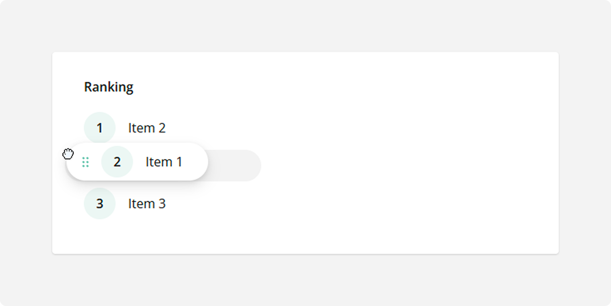

#### Single-Line Input

Respondents enter their textual, numeric, or date and time answers into a single-line editor. Use the Single-Line Input type for questions that require short answers.

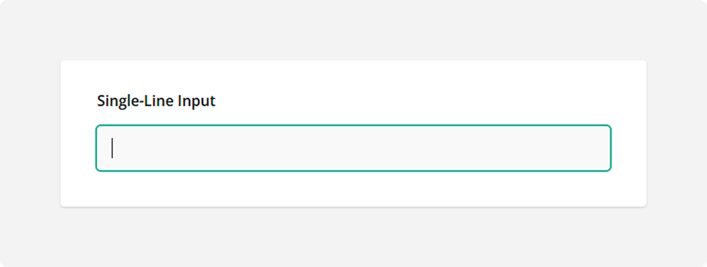

See also:

- [Long Text](#long-text)
- [Multiple Textboxes](#multiple-textboxes)

#### Long Text

Respondents enter their lengthy answer into a resizable multi-line text area. Use the Long Text type for open-ended questions that accept multi-line answers.

See also:

- [Single-Line Input](#single-line-input)
- [Multiple Textboxes](#multiple-textboxes)

#### Multiple Textboxes

Respondents enter their answers into multiple single-line text editors. Use the Multiple Textboxes type for open-ended questions that require more than one short answer.

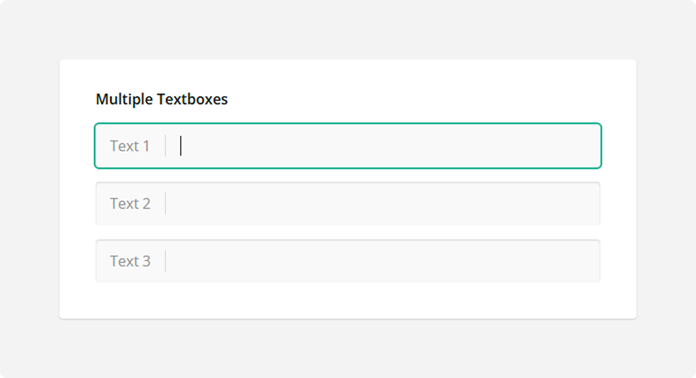

#### Panel

The Panel type is a container for other questions and panels. Use this type to group several questions or panels and control them all together.

#### Dynamic Panel

The Dynamic Panel type is a template panel that can contain multiple questions. Respondents can add and remove panel entries based on the template.

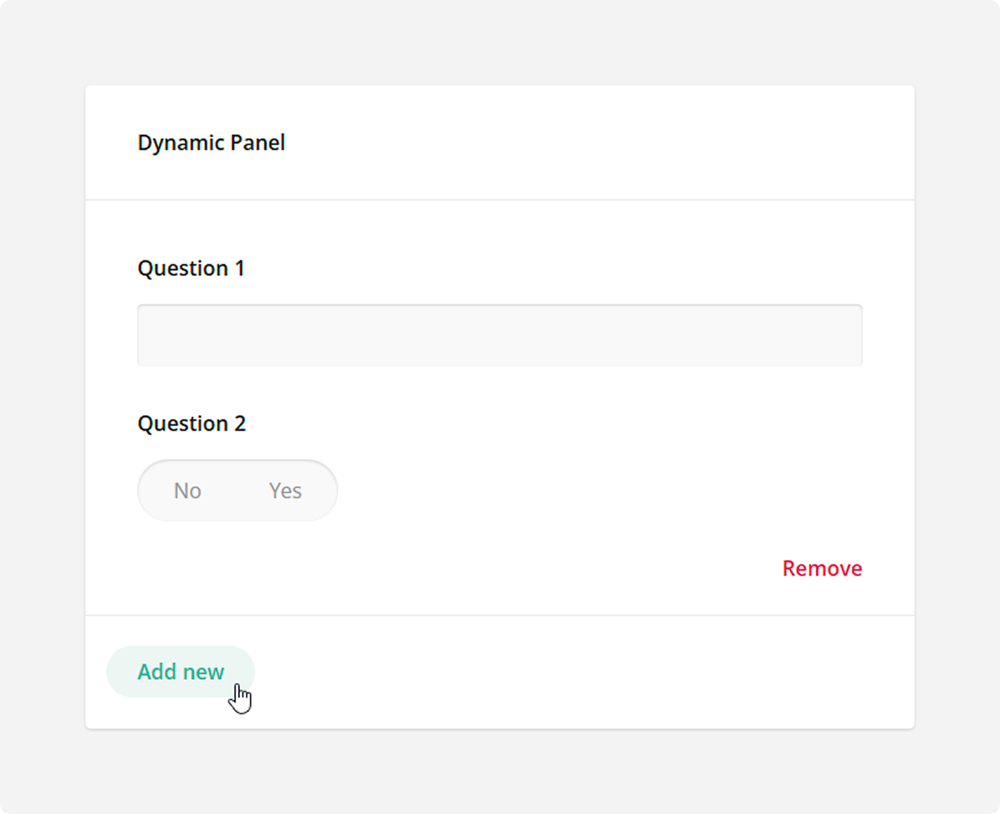

#### Single-Select Matrix

The Single-Select Matrix type displays radio buttons in rows and columns. Respondents can select only one radio button in each row.

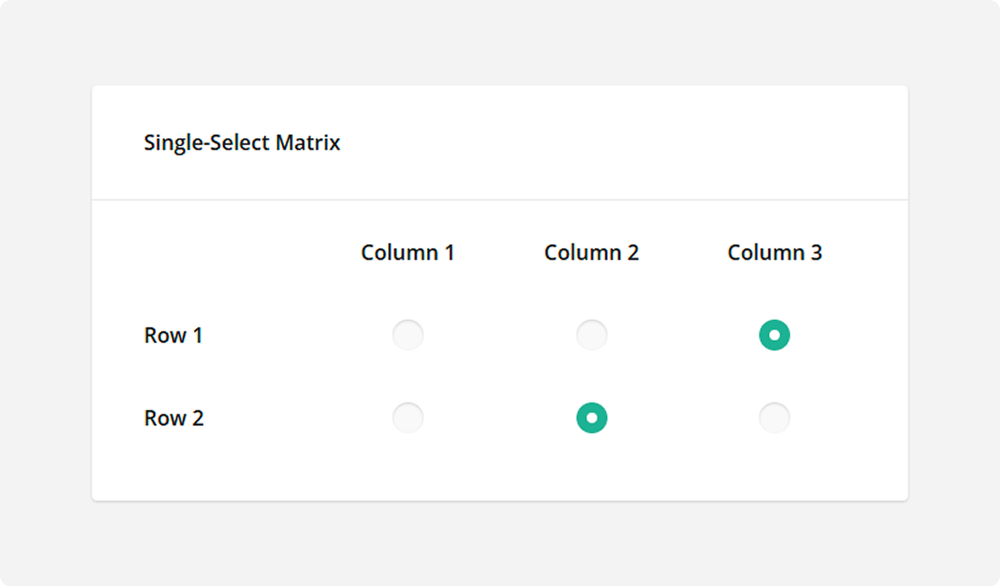

- How to: Add new rows          
Open the **Rows** category and click **Add new rows**:         
    

- How to: Randomize rows        
Open the **Rows** category, find the **Row order** editor, and switch it to *Random*:     
    

See also:

- [Multi-Select Matrix](#multi-select-matrix)
- [Dynamic Matrix](#dynamic-matrix)

#### Multi-Select Matrix

The Multi-Select Matrix type displays rows and columns. At their intersections, the matrix can display the following editors:

- [Dropdown](#dropdown)
- [Checkboxes](#checkboxes)
- [Radio Button Group](#radio-button-group)
- [Single-Line Input](#single-line-input)
- [Long Text](#long-text)
- [Yes/No (Boolean)](#yesno-boolean)
- [Expression](#expression)
- [Rating Scale](#rating-scale)

Respondents use these editors to select a desired value in each cell. The following image illustrates the Multi-Select Matrix type with the default Dropdown editors: 

- How to: Change the editor type         
Switch to the **General** category and select the desired editor type from the **Cell input type** drop-down menu:       
    

See also:

- [Single-Select Matrix](#single-select-matrix)
- [Dynamic Matrix](#dynamic-matrix)

#### Dynamic Matrix

The Dynamic Matrix type is similar to a [Multi-Select Matrix](#multi-select-matrix), but respondents can add and remove matrix rows.

#### HTML

Use the HTML type to format text as needed, include links, and insert media or other custom elements into the survey. This type is used for presentation only and does not produce a value to be saved in the survey results. Be aware that HTML content can be vulnerable to security breaches. Ensure that the links you insert lead to trusted resources.

#### Expression

Use the Expression type to calculate values and present them to respondents. For example, you can sum up the scores of previous responses, display current date and time, or find an average value. The calculated value is saved in the survey results. In the following image, the Expression type concatenates the first and last names to display a full name:

To specify an expression, enter it into the **Expression** field in the **General** category. Your expression can reference other survey questions (for example, `{question1} + {question2}`) or use built-in calculation functions. Refer to the following help topic for more information: [Expressions](https://surveyjs.io/form-library/documentation/design-survey/conditional-logic#expressions).

#### Image

Use the Image type to add an image or video to the survey. This type is used for presentation only and does not produce a value to be saved in the survey results.

#### Signature

Respondents use mouse or touch gestures to draw their signature within the allocated input area. Use this type to obtain the respondent's signature or any other hand-drawn input.

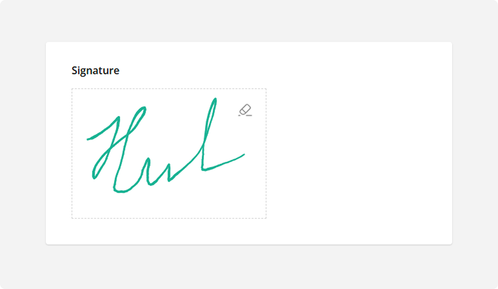

- How to: Resize the allocated area         
Switch to the **General** category and change the **Signature area width** and **Signature area height** values:     

- How to: Change the storage format        
The respondent's input is saved as a base64-encoded image in one of the following formats: PNG, JPEG, SVG. To select the desired format, use the **Storage format** editor in the **General** category:       

- How to: Change the pen color          
Switch to the **General** category and select the desired color from the **Stroke color** drop-down menu:

### Adorners

Adorners are design-surface controls for survey element manipulation. Use adorners to edit UI text in place, reorder choices, duplicate and delete elements, specify whether an answer is required, and perform other actions on survey elements. Settings that you specify using adorners are synchronized with settings in the Property Grid, and vice versa.

Each element type has an associated set of adorners. The following image highlights adorners for a [Dropdown](#dropdown) question:

### How to: Add a question to the survey

Drag and drop the desired question type from the Toolbox onto the design surface. Alternatively, you can click the **Add Question** button to add a [Single-Line Input](#single-line-input) question. This button also displays an ellipsis icon that allows you to change the type of inserted questions.

### How to: Specify default answers

Switch to the **Data** category and click **Set Default Answer** to open the Default Answer pop-up window. Enter or select the default answers and click **Apply**:

### How to: Add a page to the survey

In the Property Grid, select **Survey**, switch to the **Pages** category, and click the **Add new page** button in the **Pages** editor:

Alternatively, you can add a page on the design surface. The surface displays the skeleton of a new page at the bottom. To add a new page, you need to [add a question to it](#how-to-add-a-question-to-the-survey).

### How to: Change the question type

Use the element type selector in the question:

Some question types are non-interchangeable. For example, a [Dropdown](#dropdown) question supports choices, while [Single-Line Input](#single-line-input) does not. If you switch the question type from Dropdown to Single-Line Input, your choices will be lost. In this case, you can click the **Undo** button to reinstate the previous configuration:

## Preview Tab

The Preview tab allows you to view and take the survey as a respondent.

### How to: Re-run the preview

After you complete the survey, you can see the survey results in the table or JSON format. Click the Preview Survey Again button above the results to preview the survey again:

### How to: Preview the survey on different devices

Click the **Device** icon and select the desired device from the drop-down menu. You can also click the **Orientation** icon to switch between the landscape and portrait orientations:

## Themes Tab

The Themes tab enables you to customize the applied UI theme. You can change colors, sizes, fonts, shadow effects, and other survey appearance parameters in a user-friendly interface.

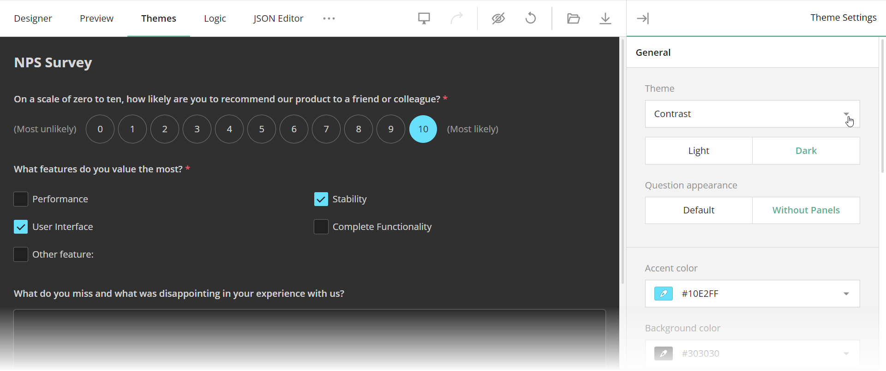

### How to: Save a Custom Theme

SurveyJS themes are JSON objects with CSS variables and other theme settings. Once you finish customization, click the Export button to download a JSON object with your custom theme.

If you already have a theme JSON file and want to continue theme customization, click the Import button and select the file to load into Survey Creator.

Other capabilities depend on features implemented by your development team. For instance, the following help topic describes how developers can save themes on a server and load them from it: [Save and Load Custom Themes](/survey-creator/documentation/theme-editor#save-and-load-custom-themes).

## Logic Tab

The Logic tab displays and allows you to edit logical rules that specify the survey flow.

### How to: Add a new rule

Click **Add New Rule** at the bottom of the Logic tab to display editors that allow you to specify conditions and select actions to perform when these conditions are met.

#### Specify conditions (if-clauses)       

Select a question whose answer should be checked and a logical operation from the corresponding drop-down menus. Then, specify the answer that applies the rule. Some logical operations do not need an answer (for example, Empty or Not empty).

If the rule needs more than one condition, click the **Add Condition** button. You can use the AND or OR logical operator to combine the new and previous conditions.

Conditions that you specify in the UI are converted to logical expressions. If you prefer to enter the expressions directly, click the **Manual Entry** button on the Toolbar.

#### Specify the action (then-clause)         

Select one of the following actions from the drop-down menu:

- Show (hide) page          
Makes the selected page visible. If you want to hide the page, invert the logic of your condition.

- Enable (disable) page         
Makes the selected page editable. If you want to make the page read-only, invert the logic of your condition.

- Show (hide) question          
Makes the selected question visible. If you want to hide the question, invert the logic of your condition.

- Enable (disable) question         
Makes the selected question editable. If you want to make the question read-only, invert the logic of your condition.

- Make question required            
Requires an answer for the selected question.

- Complete survey           
Completes the survey.

- Set answer            
Sets a specified answer to the selected question.

- Copy answer           
Copies the answer from the selected question to a target question.

- Skip to question          
Navigates the survey to the selected question.

- Run expression            
Runs a custom expression on the selected question.

- Set "Survey Complete" page markup         
Specifies custom HTML markup for the Survey Complete page.

### How to: Edit a rule

Click a rule to expand it and use UI elements to edit the rule. Click **Done** to save your changes.

### How to: Filter rules

Use the Question Filter to filter rules by a specific question. You can also use the Action Type Filter to view only rules for the selected action type:

## JSON Editor Tab

The JSON Editor tab enables you to preview and edit the resulting survey configuration. In most cases, you do not need to modify the JSON object on this tab. Change survey settings in the Property Grid instead.

## Translation Tab

The Translation tab displays survey strings and allows you to translate them into different languages.

### How to: Add another language

In the Language Settings sidebar, click the **Add** icon and select the desired language from the pop-up menu:

### How to: Filter translation strings

Use the Page Filter to filter strings by a specific page. You can also use the Used Strings Filter to view only the strings that were changed:

### How to: Import or export translation strings to CSV

Click the **Import to CSV** or **Export to CSV** button on the Toolbar:

