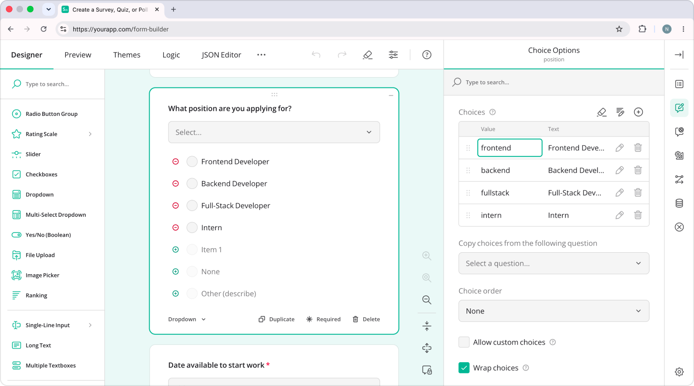

# Survey Creator Overview

Survey Creator is an embeddable drag-and-drop form builder for React, Angular, Vue, and plain JavaScript applications. It runs in the browser and generates SurveyJS JSON form definitions that describe form content, layout, validation, logic, navigation, and appearance. You can connect it to your own backend, database, authentication system, and deployment environment.



## How Survey Creator Works

The typical workflow is as follows:

1. Create a new SurveyJS JSON form definition or load an existing one.
2. Edit the form in Survey Creator.
3. Save the updated definition to your backend or database.
4. Render the form with [SurveyJS Form Library](/form-library/documentation/overview).
5. Store submitted responses in your own infrastructure.

Survey Creator can be adapted to different users and workflows. You can control which question types appear in the Toolbox, which settings are available in the Property Grid, which tabs and actions are visible, and which languages users can select.

Use the [UI Preset Editor](/survey-creator/documentation/ui-preset-editor) to configure these options visually and export them as a reusable JSON preset. To customize the appearance, you can apply a built-in theme, create a custom theme, or use [theme adapters for Bootstrap, Material UI, and shadcn/ui](/documentation/theme-adapters) to align Survey Creator with the visual language of the host application.

[Try Survey Creator](/create-survey (linkStyle))

## Key Features

### Visual Form Editing

- Drag-and-drop form editing
- Multi-page forms and form wizards
- Conditional visibility, branching, validation, and calculated values
- Dedicated Logic and JSON Editor tabs
- Form preview before publication

### Framework and Backend Integration

- Native packages for React, Angular, Vue, and plain JavaScript
- Framework-independent `survey-creator-core` package
- TypeScript support
- Integration with any backend, API, database, or authentication system
- [Backend examples for PHP, Node.js, and ASP.NET Core](/documentation/backend-integration#examples)

### JSON-Based Form Definitions

- Generate a JSON form definition as users edit a form
- Load existing definitions back into the editor
- Save, version, copy, and reuse form definitions
- Render completed forms with SurveyJS Form Library
- Use the same form definition across web forms, PDF generation, and analytics workflows

### UI and Appearance Customization

- Configure the Toolbox, Property Grid, tabs, actions, languages, and editor behavior
- Use the [UI Preset Editor](/survey-creator/documentation/ui-preset-editor) to create reusable JSON UI presets
- Customize form themes with the [Theme Editor](/survey-creator/documentation/theme-editor)
- Use [theme adapters](/themes/theme-adapters) for Bootstrap, Material UI, and shadcn/ui
- [Add custom question types and reusable components](/survey-creator/documentation/customize-question-types)
- Configure different UI presets for roles, tenants, or subscription plans

### Localization

- [Localize the Survey Creator UI](/survey-creator/documentation/survey-localization-translate-surveys-to-different-languages)
- Restrict the languages available to form authors
- Support right-to-left languages
- Create and manage multilingual forms

Explore [interactive demos](/survey-creator/examples/) that include editable source code for common Survey Creator configurations and customization scenarios.

## Installation

Choose the package for your framework to get started:

### React

```
npm install survey-creator-react
```
[Get Started with Survey Creator for React](/survey-creator/documentation/get-started-react (linkStyle))

### Angular

```
npm install survey-creator-angular
```
[Get Started with Survey Creator for Angular](/survey-creator/documentation/get-started-angular (linkStyle))

### Vue.js

```
npm install survey-creator-vue
```
[Get Started with Survey Creator for Vue.js](/survey-creator/documentation/get-started-vue (linkStyle))

### Plain JavaScript

```
npm install survey-creator-js
```
[Get Started with Survey Creator for Plain JavaScript](/survey-creator/documentation/get-started-html-css-javascript (linkStyle))

## Releases and Migration

Visit our [Major Updates](/stay-updated/major-updates/2025-2026) page and [Release Notes](/stay-updated/release-notes) for recent features, fixes, and package updates. 

For major-version upgrades, refer to the relevant migration guide:

- [Migrate from Survey Creator v1 to v2](/stay-updated/release-notes/v2.0.0#how-to-upgrade-to-surveyjs-v2.0)
- [Migrate from Survey Creator v2 to v3](/stay-updated/release-notes/v3.0.0#how-to-upgrade-to-surveyjs-v3.0)

## Licensing

SurveyJS Survey Creator requires a [commercial license](/licensing) for each software developer who works with the SurveyJS APIs or implements the integration. [SurveyJS Form Library](https://github.com/surveyjs/survey-library), which renders forms created with Survey Creator, is available under the MIT license.
