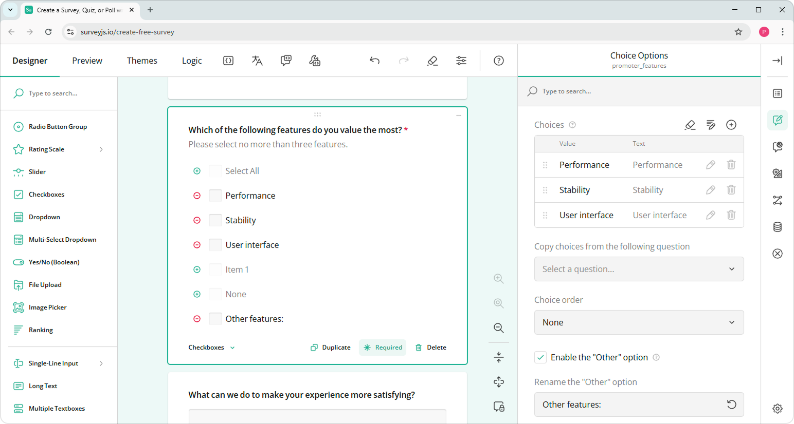

# Survey Creator / Form Builder Overview

Survey Creator / Form Builder is a visual designer that allows users to create surveys and forms. The designer produces a survey configuration in JSON format. This configuration can be later used by the [SurveyJS Form Library](/Documentation/Library) to display a survey or form in your application.

[Try Survey Creator / Form Builder](https://surveyjs.io/create-survey)

## Features

- Native support for React, Angular, Vue.js, and Vanilla JavaScript
- Integration of the Vanilla JS version into jQuery applications
- [CSS-based Theme Editor](https://surveyjs.io/survey-creator/documentation/theme-editor)
- TypeScript support
- [Community-supported UI localization to 25+ languages](https://surveyjs.io/Documentation/Survey-Creator?id=localization)
- [Integration with any backend framework](https://surveyjs.io/Documentation/Survey-Creator?id=integration-with-backend) (examples for PHP, NodeJS, and ASP.NET included)
- Survey JSON schemas can be stored in any database
- [Third-party component integration](https://surveyjs.io/Documentation/Survey-Creator?id=Create-Custom-Widget)

## Get Started

- [Angular](https://surveyjs.io/Documentation/Survey-Creator?id=get-started-angular)
- [Vue](https://surveyjs.io/Documentation/Survey-Creator?id=get-started-vue)
- [React](https://surveyjs.io/Documentation/Survey-Creator?id=get-started-react)
- [HTML/CSS/JavaScript](/survey-creator/documentation/get-started-html-css-javascript)

We also include over [40 demo examples](https://surveyjs.io/Examples/Survey-Creator) that allow you to edit and copy code.

## What's New

Visit our [What's New page](https://surveyjs.io/WhatsNew) for information on new features, recent bug fixes, and latest additions. If you want to migrate from the old version of Survey Creator, refer to the [Migration Guide](https://surveyjs.io/Documentation/Survey-Creator?id=Migrate-from-V1-to-V2).

## Licensing

Survey Creator is **not available for free commercial usage**. If you want to integrate it into your application, you must purchase a [commercial license](https://surveyjs.io/Licenses#SurveyCreator). However, you can use [online Survey Creator](https://surveyjs.io/create-survey) to produce JSON survey configurations and use them with SurveyJS in your application free of charge.
