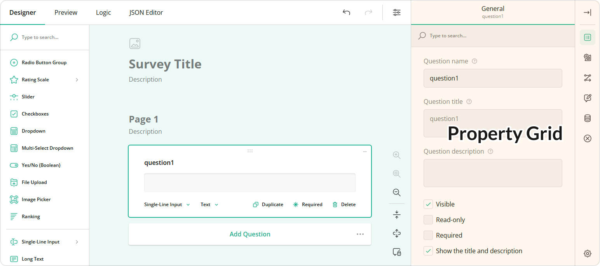
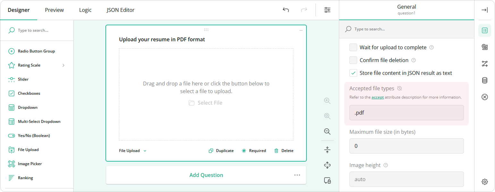

# Property Grid Customization

Property Grid displays the properties of a selected survey element and allows a user to change the property values. This help topic describes how you can modify the Property Grid contents.



## Hide Properties from the Property Grid

If you want to prevent users from accessing or modifying a certain survey element's property, you can hide it from the Property Grid. Survey Creator allows you to hide either an individual property or multiple properties at once.

To hide a single property, access it using the `Serializer`'s `getProperty(className, propertyName)` method and set its `visible` attribute to `false`:

```js
// Hide the `title` property for Boolean questions
Survey.Serializer.getProperty("boolean", "title").visible = false;

// In modular applications:
import { Serializer } from "survey-core";
Serializer.getProperty("boolean", "title").visible = false;
```

If you want to hide multiple properties, handle the Survey Creator's [`onPropertyShowing`](https://surveyjs.io/survey-creator/documentation/api-reference/survey-creator#onPropertyShowing) event. Its second parameter includes the `show` Boolean property. Disable it for the properties you want to hide. The following example illustrates two cases: hide black-listed properties and keep only white-listed properties. This code hides the properties for [Panel](https://surveyjs.io/Documentation/Library?id=panelmodel) questions.

```js
const blackList = [ "visible", "isRequired" ];
// const whiteList = [ "title", "name" ];

creator.onPropertyShowing.add((_, options) => {
  if (options.element.getType() === "panel") {
    // Hide properties found in `blackList`
    options.show = blackList.indexOf(options.property.name) === -1;

    // Hide all properties except those found in `whiteList`
    // options.show = whiteList.indexOf(options.property.name) > -1;
  }
});
```

[View Demo](https://surveyjs.io/survey-creator/examples/removeproperties/ (linkStyle))

## Override Default Property Values

You can specify a different default value for a property in Property Grid. To do this, call `Serializer`'s `getProperty(className, propertyName)` method and change the property's `defaultValue` setting:

```js
// Override the default value of the `eachRowRequired` property for Single-Select Matrix questions
Survey.Serializer.getProperty("matrix", "eachRowRequired").defaultValue = true;

// In modular applications:
import { Serializer } from "survey-core";
Serializer.getProperty("matrix", "eachRowRequired").defaultValue = true;
```

If you want to override the default value of a localizable property, do it using [localization capabilities](/form-library/documentation/survey-localization#override-individual-translations). In most cases, localizable properties are those that specify UI captions: [`completeText`](/form-library/documentation/api-reference/survey-data-model#completeText), [`pageNextText`](/form-library/documentation/api-reference/survey-data-model#pageNextText), [`pagePrevText`](/form-library/documentation/api-reference/survey-data-model#pagePrevText), etc.

```js
// Get English locale translations
const engLocale = Survey.getLocaleStrings("en");
// In modular applications
import { getLocaleStrings } from "survey-core";
const engLocale = getLocaleStrings("en");

engLocale.pagePrevText = "Back";
engLocale.pageNextText = "Forward";
engLocale.completeText = "Send";
```

## Add Help Texts to Property Editors

Property editors can display hints or tooltips that help survey authors specify correct property values. For example, the following image illustrates a hint for the [`acceptedTypes`](https://surveyjs.io/form-library/documentation/api-reference/file-model#acceptedTypes) property editor in a [File Upload](https://surveyjs.io/form-library/examples/file-upload/) question: 



Hints are stored in the `pehelp` object (stands for "property editor help") within [localization dictionaries](https://github.com/surveyjs/survey-creator/tree/90de47d2c9da49b06a7f97414026d70f7acf05c6/packages/survey-creator-core/src/localization). You can use [localization API](https://surveyjs.io/survey-creator/documentation/survey-localization-translate-surveys-to-different-languages#override-individual-translations) to specify or override help texts within this object. For instance, the code below specifies a hint for the [`title`](https://surveyjs.io/form-library/documentation/api-reference/question#title) property editor.

```js
// Get English translations
const translations = SurveyCreatorCore.getLocaleStrings("en");
// In modular applications
import { getLocaleStrings } from "survey-creator-core";
const translations = getLocaleStrings("en");

translations.pehelp.title = "A hint for the Title property editor";
```

You can specify different help texts for properties that belong to questions, pages, and the survey itself:

```js
translations.pehelp.survey = { 
  title: "A hint for the Title property editor of the survey"
};
translations.pehelp.page = { 
  title: "A hint for the Title property editor of all pages"
};
translations.pehelp.question = { 
  title: "A hint for the Title property editor of all questions"
};
```

You can also set specific help texts for properties that belong to a certain [question type](https://surveyjs.io/form-library/documentation/api-reference/question#getType):

```js
translations.pehelp.file = { 
  title: "A hint for the Title property editor in File Upload questions"
};
translations.pehelp.comment = { 
  title: "A hint for the Title property editor in Long Text questions"
};
```

## Add Custom Properties to the Property Grid

Survey Creator uses SurveyJS Form Library to render most of the UI elements. The main benefit of this approach is that Form Library supports native rendering all frameworks, and Survey Creator receives this functionality automatically. Another advantage is that you can customize Survey Creator UI elements as you would customize surveys. For example, Property Grid is a one-page survey in which every property is a question. To introduce a new or override an existing property editor, you need to define a custom question JSON configuration and implement functions that survey events call internally. Refer to the following help topic in the Form Library documentation for more information:

[Add Custom Properties](/form-library/documentation/customize-question-types/add-custom-properties-to-a-form (linkStyle))