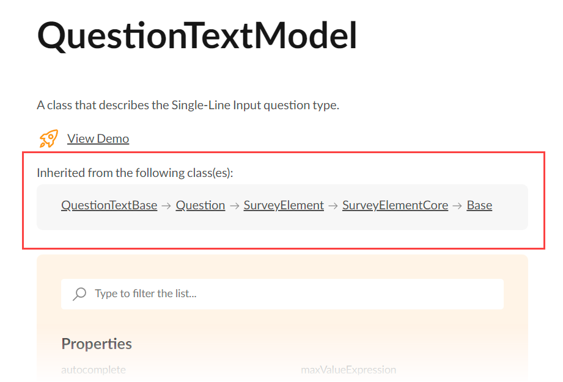

# Property Grid Customization

Property Grid displays the properties of a selected survey element and allows a user to change the property values. This help topic describes how you can modify the Property Grid contents.


## Hide Properties from the Property Grid

If you do not want users to change a survey property, you can hide it from the Property Grid. Survey Creator allows you to hide an individual property or multiple properties at once.

To hide a single survey property, call the `getProperty(questionType, propertyName)` method on the `Survey.Serializer` object as follows:

```js
// Hide the `title` property for Boolean questions
Survey.Serializer.getProperty("boolean", "title").visible = false;

// In modular applications:
import { Serializer } from "survey-core";
Serializer.getProperty("boolean", "title").visible = false;
```

If you want to hide multiple properties, handle the Survey Creator's [`onShowingProperty`](https://surveyjs.io/Documentation/Survey-Creator?id=surveycreator#onShowingProperty) event. Its second parameter exposes the `canShow` Boolean property. Disable it for the properties you want to hide. The following example illustrates two cases: hide black-listed properties and keep only white-listed properties. This code hides the properties for [Panel](https://surveyjs.io/Documentation/Library?id=panelmodel) questions.

```js
const blackList = [ "visible", "isRequired" ];
// const whiteList = [ "title", "name" ];

creator.onShowingProperty.add(function (_, options) {
  if (options.obj.getType() == "panel") {
    // Hide properties found in `blackList`
    options.canShow = blackList.indexOf(options.property.name) < 0;

    // Hide all properties except those found in `whiteList`
    // options.canShow = whiteList.indexOf(options.property.name) > -1;
  }
});
```

<div id="addproperties"></div>

[View Demo](https://surveyjs.io/survey-creator/examples/removeproperties/ (linkStyle))

## Override Default Property Values

You can specify a different default value for a property in Property Grid. To do this, call `Serializer`'s `getProperty(questionType, propertyName)` method and change the property's `defaultValue` setting:

```js
// Override the default value of the `isAllRowRequired` property for Single-Select Matrix questions
Survey.Serializer.getProperty("matrix", "isAllRowRequired").defaultValue = true;

// In modular applications:
import { Serializer } from "survey-core";
Serializer.getProperty("matrix", "isAllRowRequired").defaultValue = true;
```

## Add Custom Properties to the Property Grid

Custom properties can be serialized and included in the survey JSON schema. To add a custom property, call the `addProperty(questionType, propertySettings)` method on the `Survey.Serializer` object. This method accepts the following arguments:

- `questionType`        
A string value that specifies the question type to which the property should be added. You can use a specific type (see the [getType](https://surveyjs.io/Documentation/Library?id=Question#getType) description) or one of the base types. In the latter case, the new property is added to all question types derived from the base type. Refer to the API of a specific question type for information on its inheritance chain. For example, the following image illustrates the inheritance chain of the [Text](https://surveyjs.io/Documentation/Library?id=questiontextmodel) question type:

  

- `propertySettings`      
Settings that configure the property's appearance and behavior. For information about these settings, refer to the [Survey Element Property Settings](#survey-element-property-settings) help section below.

[View Demo](https://surveyjs.io/Examples/Survey-Creator/?id=addproperties (linkStyle))

### Survey Element Property Settings

#### `name`

A string value that specifies the property name. It is the only required property.

#### `type`

A string value that specifies the property type. Accepts one of the values described in the table below. Each type produces a different property editor.

| `type` | Property Editor | Description |
| ------ | --------------- | ----------- |
| `"string"` (default) | Text input | Use this type for short string values. |
| `"boolean"` | Checkbox | Use this type for Boolean values. |
| `"condition"` | Multi-line text input with an optional dialog window | Use this type for [Boolean expressions](https://surveyjs.io/Documentation/Library?id=design-survey-conditional-logic#conditional-visibility) similar to [`visibleIf`](https://surveyjs.io/Documentation/Library?id=Question#visibleIf) or [`enableIf`](https://surveyjs.io/Documentation/Library?id=Question#enableIf). |
| `"expression"` | Multi-line text input with a hint icon | Use this type for non-Boolean [expressions](https://surveyjs.io/Documentation/Library?id=design-survey-conditional-logic#expressions). |
| `"number"` | Text input | Use this type for numeric values. |
| `"text"` | Multi-line text input | Use this type for multi-line text values. |
| `"file"` | Text input with a button that opens a Select File dialog window | Use this type to allow respondents to select a file or enter a file URL. |
| `"color"` | Color picker | Use this type for color values. |
| `"html"` | Multi-line text input | Use this type for HTML markup. |
| `"itemvalues"` | Customized text inputs for entering value-text pairs | Use this type for arrays of objects with the following structure: `{ value: any, text: string }`. For example, Dropdown, Checkbox, and Radiogroup questions use this type for the [`choices`](https://surveyjs.io/Documentation/Library?id=QuestionSelectBase#choices) property. |
| `"value"` | Button that opens a dialog window  | The dialog window displays the survey element and allows users to set the element's default value. |
| `"multiplevalues"` | A group of checkboxes with a Select All checkbox | Use this type to allow respondents to select more than one predefined value. Requires a defined [`choices`](#choices) array. |

`type` can also accept custom values. In this case, you need to register a property editor for the custom type in the `PropertyGridEditorCollection` and specify a standard JSON object that the custom type should produce. For example, the following code configures a `"shortname"` property that has a custom `"shorttext"` type: 

```js
Survey.Serializer.addProperty("question", {
  name: "shortname",
  type: "shorttext",
  isRequired: true,
  category: "general",
  visibleIndex: 3
});

SurveyCreator.PropertyGridEditorCollection.register({
  // Returns `true` for a property with type "shorttext"
  fit: function (prop) {
    return prop.type === "shorttext";
  },
  // Returns a standard question JSON configuration for the property editor
  // (a text editor that is limited to 5 characters)
  getJSON: function (obj, prop, options) {
    return { type: "text", maxLength: 5 };
  }
});
```

[View Demo](https://surveyjs.io/Examples/Survey-Creator/?id=custompropertyeditor (linkStyle))

You can add the type to the `name` property after a colon character as a shortcut:

```js
Survey.Serializer.addProperty("question", 
  { name: "myBooleanProperty", type: "boolean" }
  // ===== or =====
  { name: "myBooleanProperty:boolean" }
);
```

#### `default`

A default value for the property. If not specified, `default` equals `""` for string values, 0 for numbers, and `false` for Boolean values. The default value is not serialized into a survey JSON schema.

```js
Survey.Serializer.addProperty("dropdown", 
  { name: "myStringProperty", default: "custom-default-value" }
);

Survey.Serializer.addProperty("checkbox", 
  { name: "myNumericProperty", type: "number", default: 100 }
);

Survey.Serializer.addProperty("question", 
  { name: "myBooleanProperty", type: "boolean", default: true }
);
```
#### `displayName`

A string value that specifies a property caption. If not specified, the [`name`](#name) value is used instead.

```js
Survey.Serializer.addProperty("dropdown", 
  { name: "myStringProperty", displayName: "Custom Caption" }
);
```

#### `choices`

An array of selection choices or a function that loads the choices from a web service. Applies only to text and numeric properties. If `choices` are specified, Survey Creator renders a drop-down menu as the property editor.

```js
// Define `choices` locally
Survey.Serializer.addProperty("question", {
  name: "myStringProperty",
  choices: [ "option1", "option2", "option3" ],
  // If item captions should be different from item values:
  // choices: [
  //   { value: "option1", text: "Option 1" },
  //   { value: "option2", text: "Option 2" },
  //   { value: "option3", text: "Option 3" },
  // ],
  default: "option1"
});

// Load `choices` from a web service
Survey.Serializer.addProperty("survey", {
  name: "country",
  category: "general",
  choices: function (obj, choicesCallback) {
    const xhr = new XMLHttpRequest();
    xhr.open("GET", "https://surveyjs.io/api/CountriesExample");
    xhr.setRequestHeader( "Content-Type", "application/x-www-form-urlencoded");
    xhr.onload = function () {
      if (xhr.status === 200) {
        const response = JSON.parse(xhr.response);
        const result = [];
        // Make the property nullable
        result.push({ value: null });
        // Web service returns objects that are converted to the `{ value, text }` format
        // If your web service returns an array of strings, pass this array to `choicesCallback`
        response.forEach(item => {
          result.push({ value: item.cioc, text: item.name });
        });
        choicesCallback(result);
      }
    };
    xhr.send();
  }
});
```

#### `isRequired`

A Boolean value that specifies whether the property must have a value. Defaults to `false`. You can add an exclamation mark before `name` as a shortcut for this setting:

```js
Survey.Serializer.addProperty("question", 
  { name: "myBooleanProperty", type: "boolean", isRequired: true }
  // ===== or =====
  { name: "!myBooleanProperty", type: "boolean" }
);
```

#### `isSerializable`

A Boolean value that specifies whether to include the property in the survey JSON schema. Defaults to `true`.

#### `isLocalizable`

A Boolean value that specifies whether users can translate the property value to different languages in the Translation tab. Applies only to text properties. Defaults to `false`.

```js
Survey.Serializer.addProperty("question", 
  { name: "myTextProperty", type: "text", isLocalizable: true }
);
```

#### `visible`

A Boolean value that specifies whether the property is visible in the Property Grid. Defaults to `true`.

#### `visibleIf`

A function that specifies a condition based on which to show or hide the property. The function accepts the question or panel that a user configures as a parameter.

If the property visibility depends on another property, use the [`dependsOn`](#dependson) setting. You can use `visibleIf` in conjunction with `dependsOn` to impose more specific rules on property visibility. In this case, Survey Creator calls the `visibleIf` function only when one of the properties from the `dependsOn` array is changed.

In the following code, the `dateFormat` property depends on the `inputType` property and is visible only if `inputType` is set to one of the date types:

```js
Survey.Serializer.addProperty("text", {
  name: "dateFormat",
  category: "general",
  visibleIndex: 7,
  dependsOn: ["inputType"],
  visibleIf: function (obj) {
    return (
      obj.inputType === "date" ||
      obj.inputType === "datetime" ||
      obj.inputType === "datetime-local"
    );
  }
});
```

[View Demo](https://surveyjs.io/survey-creator/examples/configure-property-dependencies/ (linkStyle))

#### `visibleIndex`

A number that specifies the property position within its [`category`](#category). Defaults to -1 (the last position).

```js
Survey.Serializer.addProperty("question", 
  // Display "myStringProperty" at the top in the General category
  { name: "myStringProperty", category: "general", visibleIndex: 0 }
);
```

#### `readOnly`

A Boolean value that specifies whether the property value is read-only. Defaults to `false`.

```js
Survey.Serializer.addProperty("question", 
  { name: "myStringProperty", readOnly: true }
);
```

#### `category`

A string value that specifies a category in which to display the property. If `category` is not set, the property falls into the Others category. Categories are sorted according to [`categoryIndex`](#categoryindex) values.

The following table describes predefined categories:

| `category`          | Element types that have the category                 | `categoryIndex` |
| ------------------- | ---------------------------------------------------- | --------------- |
| `"general"`         | Question, Panel, Page, Survey                        | -1              |
| `"logic"`           | Question, Panel, Page, Survey                        | 100             |
| `"layout"`          | Question, Panel, Page                                | 200             |
| `"data"`            | Question                                             | 300             |
| `"validation"`      | Question, Panel, Page                                | 400             |
| `"logo"`            | Survey                                               | 50              |
| `"navigation"`      | Survey                                               | 100             |
| `"question"`        | Survey                                               | 200             |
| `"logic"`           | Survey                                               | 300             |
| `"data"`            | Survey                                               | 400             |
| `"validation"`      | Survey                                               | 500             |
| `"showOnCompleted"` | Survey                                               | 600             |
| `"timer"`           | Survey                                               | 700             |
| `"columns"`         | MatrixDropdownBase (Matrix Dropdown, Matrix Dynamic) | 10              |
| `"rows"`            | MatrixDropdownBase (Matrix Dropdown, Matrix Dynamic) | 11              |
| `"choices"`         | MatrixDropdownBase (Matrix Dropdown, Matrix Dynamic) | 12              |
| `"columns"`         | Matrix                                               | 10              |
| `"rows"`            | Matrix                                               | 11              |
| `"cells"`           | Matrix                                               | 12              |
| `"items"`           | Multiple Text                                        | 10              |
| `"rateValues"`      | Rating                                               | 10              |
| `"choices"`         | SelectBase (Dropdown, Checkbox, Radiogroup)          | 10              |
| `"choicesByUrl"`    | SelectBase (Dropdown, Checkbox, Radiogroup)          | 11              |

#### `categoryIndex`

A number that specifies a category position. If `categoryIndex` is not set, the category is added to the end. No category can be placed above General.

```js
Survey.Serializer.addProperty("question",
  // Display "Custom Category" after the General category
  { name: "myStringProperty", category: "Custom Category", categoryIndex: 1 }
);
```

#### `maxLength`

A numeric value that specifies the maximum number of characters users can enter into the text input.

```js
Survey.Serializer.addProperty("question",
  { name: "myTextProperty", type: "text", maxLength: 280 }
);
```

#### `minValue` and `maxValue`

Numeric values that specify the minimum and maximum numbers users can enter into the editor.

```js
Survey.Serializer.addProperty("question",
  { name: "myNumericProperty", type: "number", minValue: 0, maxValue: 100 }
);
```

#### `dependsOn`

An array of property names upon which the current property depends. When one of the listed properties changes, the dependent property reevaluates the [`visibleIf`](#visibleif) and [`choices`](#choices) functions. This allows you to control the property visibility and fill choices conditionally.

The following code declares two custom properties. `dependent-property` fills `choices` depending on the `myCustomProperty` value:

```js
Survey.Serializer.addProperty("question", {
  name: "myCustomProperty",
  choices: ["Option 1", "Option 2", "Option 3"],
});

Survey.Serializer.addProperty("question", {
  name: "dependent-property",
  dependsOn: [ "myCustomProperty" ],
  choices: function (obj) {
    const choices = [];
    const targetPropertyValue = !!obj ? obj["myCustomProperty"] : null;
    // If `targetPropertyValue` is empty, return an empty array
    if (!targetPropertyValue) return choices;
    // Make the dependent property nullable
    choices.push({ value: null });
    // Populate `choices`
    choices.push(targetPropertyValue + ": Suboption 1");
    choices.push(targetPropertyValue + ": Suboption 2");
    choices.push(targetPropertyValue + ": Suboption 3");
    return choices;
  }
});
```

The following example shows how to load `choices` for the `country` property from a web service. They are reloaded each time a user changes the `region` value:

```js
Survey.Serializer.addProperty("survey", {
  name: "region",
  category: "Region",
  categoryIndex: 1,
  choices: ["Africa", "Americas", "Asia", "Europe", "Oceania"],
});

Survey.Serializer.addProperty("survey", {
  name: "country",
  category: "Region",
  dependsOn: [ "region" ],
  choices: function (obj, choicesCallback) {
    const xhr = new XMLHttpRequest();
    const url =
      !!obj && !!obj.region
        ? "https://surveyjs.io/api/CountriesExample?region=" + obj.region
        : "https://surveyjs.io/api/CountriesExample";
    xhr.open("GET", url);
    xhr.setRequestHeader("Content-Type","application/x-www-form-urlencoded");
    xhr.onload = function () {
      if (xhr.status === 200) {
        const response = JSON.parse(xhr.response);
        const result = [];
        // Make the property nullable
        result.push({ value: null });
        response.forEach(item => {
          result.push({ value: item.cioc, text: item.name });
        });
        choicesCallback(result);
      }
    };
    xhr.send();
  }
});
```

[View Demo](https://surveyjs.io/survey-creator/examples/configure-property-dependencies/ (linkStyle))

#### `overridingProperty`

The name of a property that overrides the current property.

```js
Survey.Serializer.addProperty("question", 
  { name: "myMasterProperty", type: "condition" }
  { name: "myDependentProperty", type: "boolean", overridingProperty: "myMasterProperty" }
);
```

If you specify `overridingProperty`, the Property Grid disables the current property and displays a jump link to the overriding property:


#### `onGetValue`

A function that you can use to adjust or exclude the property value from the survey JSON schema.

```js
Survey.Serializer.addProperty("question", {
  name: "calculated-property",
  onGetValue: function (surveyElement) {
    // Do not serialize the property to JSON
    return null;
  }
});
```
#### `onSetValue`

A function that you can use to perform actions when the property value is set (for example, update another property value).

> Do not assign a value directly to an object property because this will trigger the `onSetValue` function again. Use the object's `setPropertyValue(propertyName, newValue)` method instead.

```js
Survey.Serializer.addProperty("question", {
  name: "myStringProperty",
  onSetValue: function (surveyElement, value) {
    // You can perform required checks or modify the `value` here
    // ...
    // Set the `value`
    surveyElement.setPropertyValue("myStringProperty", value);
    // You can perform required actions after the `value` is set
    // ...
  }
});
```

#### `onExecuteExpression`

A function that is called when an expression is evaluated.

Define this function for custom properties of the `"condition"` or `"expression"` [`type`](#type). Within it, you can handle the expression evaluation result. For example, the following code adds a custom `showHeaderIf` property to the [Matrix](https://surveyjs.io/Examples/Library?id=questiontype-matrix) question type. This property shows or hides the matrix header based on a condition: the result of the condition evaluation is assigned to the question's [`showHeader`](https://surveyjs.io/Documentation/Library?id=questionmatrixmodel#showHeader) property.

```js
Survey.Serializer.addProperty("matrix", {
  name: "showHeaderIf",
  type: "condition",
  category: "logic",
  onExecuteExpression: (obj, res) => {
    obj.showHeader = res;
  }
});

// Usage
const surveyJson = {
  "elements": [{
    "type": "matrix",
    "showHeaderIf": "{question1} = 'item2'"
  }]
}
```

[View Demo](https://surveyjs.io/form-library/examples/condition-customproperty/ (linkStyle))