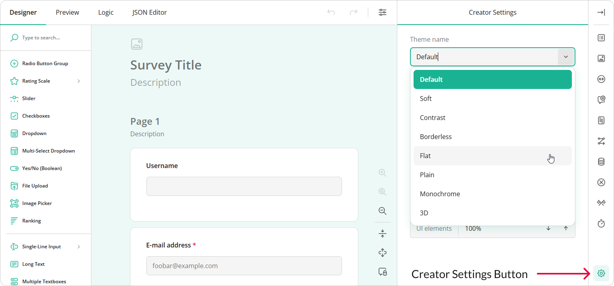

# Runtime UI Theming

Survey Creator supports appearance customization at runtime using UI themes that control colors, spacing, typography, and other visual properties of the UI. This help topic explains how to add predefined themes to Survey Creator, apply them programmatically, and persist user-made theme customizations at runtime.

## Add Predefined Themes to Survey Creator

Like other SurveyJS components, Survey Creator supports the same set of [predefined themes](/documentation/themes#predefined-themes).

By default, users can customize only the Default Light theme. To make other predefined themes available for customization, import an object with predefined theme configurations or reference a script with it and pass the object to the static `registerCreatorTheme()` method:

```js
// Modular applications
import SurveyTheme from "survey-core/themes";
import { registerCreatorTheme } from "survey-creator-core";

registerCreatorTheme(SurveyTheme);
```

```html
<!-- Classic script applications -->
<head>
  <!-- ... -->
  <script src="https://unpkg.com/survey-core/themes/index.min.js"></script>
  <!-- ... -->
</head>
<body>
  <script>
    SurveyCreatorCore.registerCreatorTheme(SurveyTheme);
  </script>
</body>
```

Run your application, open Survey Creator settings using the **gear** button in the bottom-right corner, and ensure that the predefined themes appear in the **Theme name** drop-down list.



If you want to register only specific predefined themes, use the following code:

<details>
    <summary>Modular applications</summary>

```js
import {
  DefaultLight,
  DefaultDark
} from "survey-core/themes";
import { registerCreatorTheme } from "survey-creator-core";

registerCreatorTheme(DefaultLight, DefaultDark);
```

</details>

<details>
    <summary>Classic script applications</summary>  

```html
<head>
  <!-- ... -->
  <script src="https://unpkg.com/survey-core/themes/default-light.min.js"></script>
  <script src="https://unpkg.com/survey-core/themes/default-dark.min.js"></script>
  <!-- ... -->
</head>
<body>
  <script>
    SurveyCreatorCore.registerCreatorTheme(
      SurveyTheme.DefaultLight,
      SurveyTheme.DefaultDark
    );
  </script>
</body>
```  

</details>

[View Demo](/survey-creator/examples/dynamic-ui-customization/ (linkStyle))

## Apply a Predefined Theme Programmatically

The Default Light theme is applied automatically when you include the `survey-core.css` stylesheet. All other themes are JSON objects that define CSS variable overrides for the Default Light theme.

To apply a different predefined theme, import or reference it and pass the theme object to the [`applyCreatorTheme(theme)`](/survey-creator/documentation/api-reference/survey-creator#applyCreatorTheme) method on a `SurveyCreatorModel` instance.

<details>
    <summary>Modular applications</summary>  

```js
// Option 1: Import an individual theme
import { DefaultDark } from "survey-core/themes";

const creatorOptions = { /* ... */ };
const creator = new SurveyCreatorModel(creatorOptions);

creator.applyCreatorTheme(DefaultDark);
```

```js
// Option 2: Import all themes
import SurveyTheme from "survey-core/themes";

const creatorOptions = { /* ... */ };
const creator = new SurveyCreatorModel(creatorOptions);

creator.applyCreatorTheme(SurveyTheme.DefaultDark);
```

</details>

<details>
    <summary>Classic script applications</summary>  

```html
<head>
  <!-- ... -->
  <!-- Option 1: Reference an individual theme -->
  <script src="https://unpkg.com/survey-core/themes/default-dark.min.js"></script>

  <!-- Option 2: Reference all themes -->
  <script src="https://unpkg.com/survey-core/themes/index.min.js"></script>
  <!-- ... -->
</head>
<body>
  <script>
    const creatorOptions = { /* ... */ };
    const creator = new SurveyCreator.SurveyCreator(creatorOptions);

    creator.applyCreatorTheme(SurveyTheme.DefaultDark);
  </script>
</body>
```

</details>

[View Demo](/survey-creator/examples/dynamic-ui-customization/ (linkStyle))

## Save and Restore User-Made Customizations

You can persist user-modified themes in `localStorage` and restore them when Survey Creator is reopened.

To access the current theme configuration, use the [`creatorTheme`](/survey-creator/documentation/api-reference/survey-creator#creatorTheme) property. Convert the theme object to string and save it to `localStorage`:

```js
const localStorageKey = "userSurveyCreatorTheme";

// Save a custom theme
const saveTheme = () => {
  const themeStr = JSON.stringify(creator.creatorTheme);
  localStorage.setItem(localStorageKey, themeStr);
};

// Restore a custom theme
const savedTheme = localStorage.getItem(localStorageKey);
if (savedTheme) {
  creator.applyCreatorTheme(JSON.parse(savedTheme));
}
```

A custom theme can be saved automatically when a user changes it. To implement this functionality, handle the [`onCreatorThemePropertyChanged`](/survey-creator/documentation/api-reference/survey-creator#onCreatorThemePropertyChanged) event:

```js
creator.onCreatorThemePropertyChanged.add(() => {
  const themeStr = JSON.stringify(creator.creatorTheme);
  localStorage.setItem(localStorageKey, themeStr);
});
```

As an alternative, users can save custom themes manually using a custom toolbar button. Refer to the following demo for an implementation example:

[Dynamic Appearance Customization](/survey-creator/examples/dynamic-ui-customization/ (linkStyle))

## Create a Custom Theme

If none of the predefined themes meet your requirements, you can create a custom theme and apply it to Survey Creator or make it available to users for further customization. To learn more, refer to the following demo:

[Add a Custom Survey Creator Theme](/survey-creator/examples/add-custom-theme/ (linkStyle))
