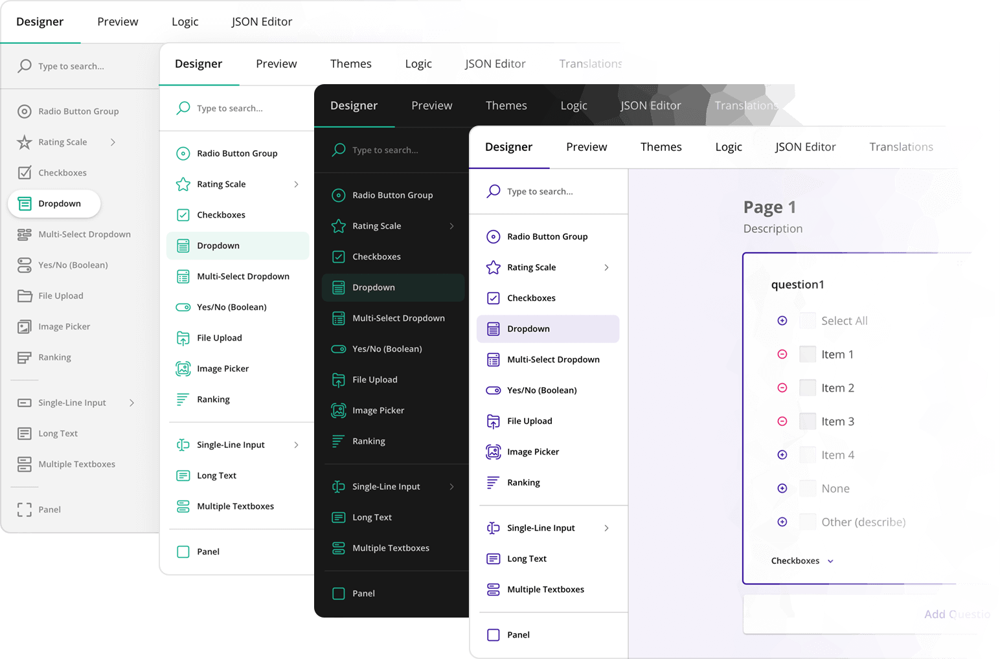
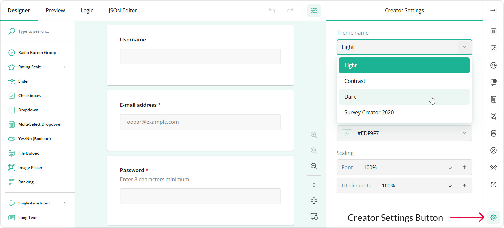

# Themes & Styles

Survey Creator supports appearance customization using UI themes that adjust the colors and sizes of the tool's UI elements. This help topic describes how to apply a predefined theme, create a custom theme, and give users the ability to modify a theme and persist these modifications. 

## Add Predefined Themes to Survey Creator

Survey Creator is shipped with four predefined themes:

- Light
- Dark
- Contrast
- Survey Creator 2020



By default, users can customize only the Light theme. To make other predefined themes available for customization, import an object with predefined theme configurations or reference a script with it and pass the object to the static `registerCreatorTheme()` method:

```js
// In modular applications:
import SurveyCreatorTheme from "survey-creator-core/themes";
import { registerCreatorTheme } from "survey-creator-core";

registerCreatorTheme(SurveyCreatorTheme);
```

```html
<!-- In classic script applications -->
<head>
    <!-- ... -->
    <script src="https://unpkg.com/survey-creator-core/themes/index.min.js"></script>
    <!-- ... -->
</head>
<body>
    <script>
        SurveyCreatorCore.registerCreatorTheme(SurveyCreatorTheme);
    </script>
</body>
```

Run your application, open Survey Creator settings using the **gear** button in the bottom right, and ensure that the predefined themes are added to the **Theme name** dropdown.



If you want to add only specific predefined themes, use the following code:

<details>
    <summary>Modular applications</summary>

```js
import {
    SC2020,
    DefaultDark,
    DefaultContrast
} from "survey-creator-core/themes";
import { registerCreatorTheme } from "survey-creator-core";

registerCreatorTheme(SC2020);
registerCreatorTheme(DefaultDark);
registerCreatorTheme(DefaultContrast);
```

</details>

<details>
    <summary>Classic script applications</summary>  

```html
<head>
    <!-- ... -->
    <script src="https://unpkg.com/survey-creator-core/themes/sc2020.min.js"></script>
    <script src="https://unpkg.com/survey-creator-core/themes/default-dark.min.js"></script>
    <script src="https://unpkg.com/survey-creator-core/themes/default-contrast.min.js"></script>
    <!-- ... -->
</head>
<body>
    <script>
        SurveyCreatorCore.registerCreatorTheme(
            SurveyCreatorTheme.SC2020,
            SurveyCreatorTheme.DefaultDark,
            SurveyCreatorTheme.DefaultContrast
        );
    </script>
</body>
```  

</details>

[View Demo](/survey-creator/examples/dynamic-ui-customization/ (linkStyle))

## Apply a Predefined Theme in Code

The Light theme is applied with the `survey-creator-core.css` style sheet. All other themes are defined as JSON objects that contain a unique theme identifier and a nested object with CSS variables that override the corresponding variables in the Light theme. To apply the Dark, Contrast, or Survey Creator 2020 theme, import or reference it and pass the theme JSON object to the [`applyCreatorTheme(theme)`](/survey-creator/documentation/api-reference/survey-creator#applyCreatorTheme) method on a `SurveyCreatorModel` instance:

<details>
    <summary>Modular applications</summary>  

```js
// Option 1: Import an individual theme
import { SC2020 } from "survey-creator-core/themes";
// import { DefaultDark } from "survey-creator-core/themes";
// import { DefaultContrast } from "survey-creator-core/themes";

const creatorOptions = { /* ... */ };
const creator = new SurveyCreatorModel(creatorOptions);
creator.applyCreatorTheme(SC2020);
```

```js
// Option 2: Import all themes
import SurveyCreatorTheme from "survey-creator-core/themes";

const creatorOptions = { /* ... */ };
const creator = new SurveyCreatorModel(creatorOptions);
creator.applyCreatorTheme(SurveyCreatorTheme.SC2020);
// creator.applyCreatorTheme(SurveyCreatorTheme.DefaultDark);
// creator.applyCreatorTheme(SurveyCreatorTheme.DefaultContrast);
```

</details>

<details>
    <summary>Classic script applications</summary>  

```html
<head>
    <!-- ... -->
    <!-- Option 1: Reference an individual theme -->
    <script src="https://unpkg.com/survey-creator-core/themes/sc2020.min.js"></script>
    <!-- <script src="https://unpkg.com/survey-creator-core/themes/default-dark.min.js"></script> -->
    <!-- <script src="https://unpkg.com/survey-creator-core/themes/default-contrast.min.js"></script> -->

    <!-- Option 2: Reference all themes -->
    <script src="https://unpkg.com/survey-creator-core/themes/index.min.js"></script>
    <!-- ... -->
</head>
<body>
    <script>
        const creatorOptions = { /* ... */ };
        const creator = new SurveyCreatorModel(creatorOptions);
        creator.applyCreatorTheme(SurveyCreatorTheme.SC2020);
        // creator.applyCreatorTheme(SurveyCreatorTheme.DefaultDark);
        // creator.applyCreatorTheme(SurveyCreatorTheme.DefaultContrast);
    </script>
</body>
```

</details>

[View Demo](/survey-creator/examples/dynamic-ui-customization/ (linkStyle))

## Save and Restore User-Made Customizations

You can save theme customizations made by a user in the browser's `localStorage` and restore them next time the user opens Survey Creator. To access the theme JSON object, use the `SurveyCreatorModel`'s [`creatorTheme`](/survey-creator/documentation/api-reference/survey-creator#creatorTheme) property. Convert this object to string and save the result to the `localStorage`.

```js
const localStorageKey = "userSurveyCreatorTheme";

// Save a custom theme
const saveTheme = () => {
    const themeStr = JSON.stringify(creator.creatorTheme);
    localStorage.setItem(localStorageKey, themeStr);
};

// Restore a custom theme
const savedTheme = localStorage.getItem(localStorageKey);
if (savedTheme) {
    creator.applyCreatorTheme(JSON.parse(savedTheme));
}
```

A custom theme can be saved automatically when a user changes it. To implement this functionality, handle the [`onCreatorThemePropertyChanged`](/survey-creator/documentation/api-reference/survey-creator#onCreatorThemePropertyChanged) event as follows:

```js
creator.onCreatorThemePropertyChanged.add(() => {
    const themeStr = JSON.stringify(creator.creatorTheme);
    localStorage.setItem(localStorageKey, themeStr);
});
```

As an alternative, users can save a custom theme by clicking a custom toolbar button. To implement this functionality, refer to the following demo:

[Dynamic Appearance Customization](/survey-creator/examples/dynamic-ui-customization/ (linkStyle))

## Create a Custom Theme

If none of the predefined themes meet your requirements, you can create a custom theme and apply it to Survey Creator or make it available to users for further customization. To learn more, refer to the following demo:

[Add a Custom Survey Creator Theme](/survey-creator/examples/add-custom-theme/ (linkStyle))
