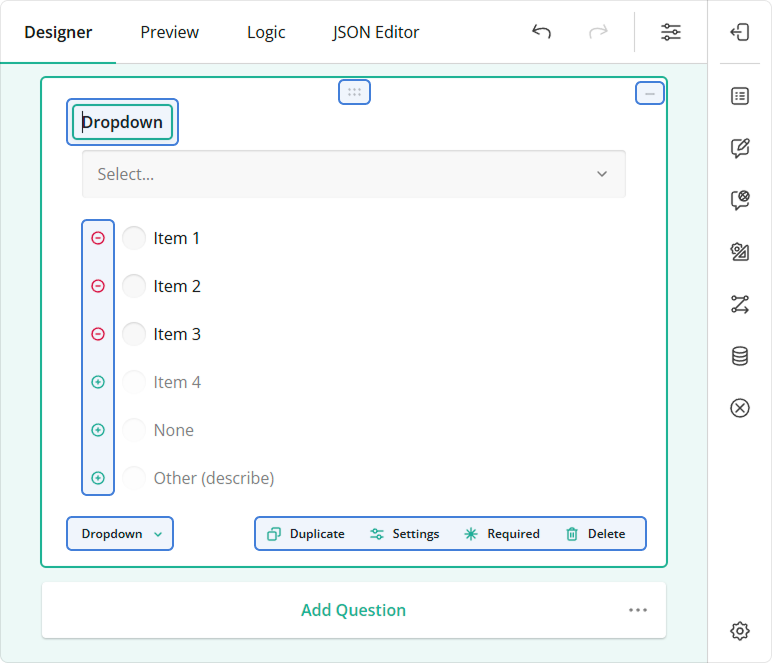

# Survey Customization

This help topic describes how you can customize the following aspects of Survey Creator functionality:

- [Specify Adorner Availability](#specify-adorner-availability)
- [Customize Survey Elements on Creation](#customize-survey-elements-on-creation)
- [Access Survey Instances Within Survey Creator](#access-survey-instances-within-survey-creator)
  - [Design Mode Survey Instance](#design-mode-survey-instance)
  - [Preview Mode Survey Instance](#preview-mode-survey-instance)

## Specify Adorner Availability

Adorners are design-surface controls that allow Survey Creator users to manipulate survey elements. Each element type has an associated set of default adorners. The following image highlights adorners on a Dropdown question:



You can control the visibility of adorners using the `onElementAllowOperations` event. As the second parameter, the event handler accepts an object that exposes the following Boolean properties:

| Property              | Description                                                                                                                                                                                             |
| --------------------- | ------------------------------------------------------------------------------------------------------------------------------------------------------------------------------------------------------- |
| `allowAddToToolbox`   | Shows or hides the adorner that saves the current survey element configuration in the Toolbox.                                                                                                          |
| `allowChangeRequired` | Shows or hides the adorner that makes the question required.                                                                                                                                            |
| `allowChangeType`     | Shows or hides the adorner that changes the survey element type.                                                                                                                                        |
| `allowCopy`           | Shows or hides the adorner that duplicates the survey element.                                                                                                                                          |
| `allowDelete`         | Shows or hides the adorner that deletes the survey element.                                                                                                                                             |
| `allowDragging`       | Shows or hides the adorner that allows users to drag and drop survey elements.                                                                                                                          |
| `allowEdit`           | Shows or hides the adorners that allow users to edit survey element properties on the design surface. If you disable this property, users can edit survey element properties only in the Property Grid. |

The following code hides the "Change Type" adorner for Dropdown questions:

```js
creator.onElementAllowOperations.add(function (_, options) {
  if (options.obj?.getType() === "dropdown") {
    options.allowChangeType = false;
  }
});
```
<!--
DEPENDS ON THE FOLLOWING ISSUE: https://github.com/surveyjs/survey-creator/issues/2843

You may register your own adorner or remove an existing adorner or remove all of them.

```js
//Register a new adorner
SurveyCreator.registerAdorner("adornerName", adornerInstance);
//Remove two existing adorners
SurveyCreator.removeAdorners(["adornerName1", "adornerName2"]);
//The removeAdorners function without parameters, will remove all adorners
SurveyCreator.removeAdorners();
```
-->

[View Demo](https://surveyjs.io/survey-creator/examples/customadorner/ (linkStyle))

## Customize Survey Elements on Creation

Survey Creator raises events when users add new elements to a survey. You can handle these events to customize the elements.

| Event name                                                                                                    | Raised when                                                                                                                                                                                                                              |
| ------------------------------------------------------------------------------------------------------------- | ---------------------------------------------------------------------------------------------------------------------------------------------------------------------------------------------------------------------------------------- |
| [onQuestionAdded](https://surveyjs.io/Documentation/Survey-Creator/?id=surveycreator#onQuestionAdded)         | Raised when users add a question to the survey.                                                                                                                                                                                          |
| [onPanelAdded](https://surveyjs.io/Documentation/Survey-Creator/?id=surveycreator#onPanelAdded)               | Raised when users add a panel to the survey.                                                                                                                                                                                             |
| [onPageAdded](https://surveyjs.io/Documentation/Survey-Creator/?id=surveycreator#onPageAdded)                 | Raised when users add a page to the survey.                                                                                                                                                                                              |
| [onMatrixColumnAdded](https://surveyjs.io/Documentation/Survey-Creator/?id=surveycreator#onMatrixColumnAdded) | Raised when users add a column to the [Matrix Dropdown](https://surveyjs.io/Documentation/Library?id=questionmatrixdropdownmodel) or [Matrix Dynamic](https://surveyjs.io/Documentation/Library?id=questionmatrixdynamicmodel) question. |
| [onItemValueAdded](https://surveyjs.io/Documentation/Survey-Creator?id=surveycreator#onItemValueAdded)        | Raised when users add a new item value (column, row, choice).                                                                                                                                                                            |

The code below shows how you can handle the `onQuestionAdded` event to customize the default question name:

```js
let questionNumbers = {};
creator.onQuestionAdded.add(function (_, options) {
  const question = options.question;
  const type = question.getType();
  if (!questionNumbers[type]) {
    questionNumbers[type] = 1;
  }
  const number = questionNumbers[type];
  // Set `name` in the following format: DropdownQuestion1, CheckboxQuestion6, etc.
  question.name = type[0].toUpperCase() + type.substring(1) + "Question" + number;
  questionNumbers[type] = number + 1;
});
```

[View Demo](https://surveyjs.io/survey-creator/examples/oncreatequestion/ (linkStyle))

## Access Survey Instances Within Survey Creator

[View Demo](https://surveyjs.io/survey-creator/examples/modifysurveys/reactjs#content-js (linkStyle))

Survey Creator contains different survey instances for design and preview modes. In design mode, survey elements have [adorners](#specify-adorner-availability). In preview mode, the survey is displayed as respondents will see it.

### Design Mode Survey Instance

To access the design mode survey instance, use the Survey Creator's [survey](https://surveyjs.io/Documentation/Survey-Creator?id=surveycreator#survey) property. You can do this at any point in your application. Use the [Survey API](https://surveyjs.io/Documentation/Library?id=surveymodel) to manipulate the survey instance. For example, the following code changes the survey [`title`](https://surveyjs.io/Documentation/Library?id=surveymodel#title):

```js
creator.survey.title = "My Survey";
```

Survey Creator may create a new design mode survey instance during the design process (for example, when a user switches from the JSON Editor tab back to the Designer). To handle the survey recreation, use the [onDesignerSurveyCreated](https://surveyjs.io/Documentation/Survey-Creator/?id=surveyeditor#onDesignerSurveyCreated) event.

```js
creator.onDesignerSurveyCreated.add(function (_, options) {
  // The recreated survey instance is stored in the `options.survey` property.
  console.log(options.survey);
})
```

### Preview Mode Survey Instance

The preview mode survey instance is recreated each time a user opens the Preview tab. To access this instance, handle the [onPreviewSurveyCreated](https://surveyjs.io/Documentation/Survey-Creator?id=surveyeditor#onPreviewSurveyCreated) event:

```js
creator.onPreviewSurveyCreated.add(function (_, options) {
  options.survey.title = "You started previewing the survey at: " + new Date().toLocaleTimeString();
});
```