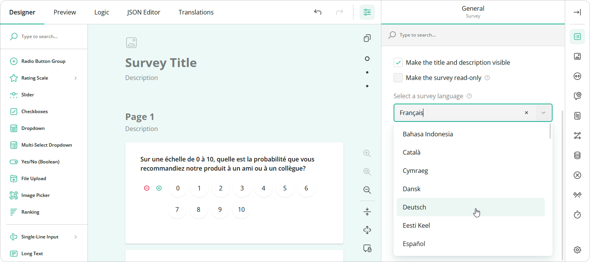

# Localization & Globalization

This article describes how to localize the Survey Creator UI and give users the ability to localize their surveys.

- [Localize Survey Creator UI](#localize-survey-creator-ui)
  - [Available Languages](#available-languages)
  - [Enable Localization and Switch Between Locales](#enable-localization-and-switch-between-locales)
  - [Override Individual Translations](#override-individual-translations)
  - [Create a Custom Locale](#create-a-custom-locale)
- [Localize Survey Contents](#localize-survey-contents)

## Localize Survey Creator UI

### Available Languages

Survey Creator UI is translated into over 30 languages. We ship translated strings as [dictionary files](https://github.com/surveyjs/survey-creator/tree/90de47d2c9da49b06a7f97414026d70f7acf05c6/packages/survey-creator-core/src/localization). They are supported by the community and may contain untranslated strings. To fill the gap, these strings are translated by <a href="https://learn.microsoft.com/en-us/azure/ai-services/translator/" target="_blank">Azure AI Translator by Microsoft</a>. Each dictionary file contains a log of machine translations at the end. You can use it to find individual machine-translated strings and revise them if required. Delete revised strings from the log to exclude them from machine translation. You can also [create new dictionaries](https://github.com/surveyjs/survey-creator/tree/90de47d2c9da49b06a7f97414026d70f7acf05c6/packages/survey-creator-core/src/localization#add-a-new-dictionary) for unsupported languages.

### Enable Localization and Switch Between Locales

The localization engine that works with dictionaries is available as a separate script/module. This script/module imports dictionaries for all languages. Reference this script in the `<head>` tag of your page or import this module into the component that renders Survey Creator:

```html
<script src="https://unpkg.com/survey-creator-core/survey-creator-core.i18n.min.js"></script>
```

```js
import "survey-creator-core/survey-creator-core.i18n";
```

Since Survey Creator v1.9.112, you may reference or import only the languages you need, as shown below:

```html
<script src="https://unpkg.com/survey-creator-core/i18n/french.js"></script>
<script src="https://unpkg.com/survey-creator-core/i18n/german.js"></script>
<script src="https://unpkg.com/survey-creator-core/i18n/italian.js"></script>
```

```js
import "survey-creator-core/i18n/french";
import "survey-creator-core/i18n/german";
import "survey-creator-core/i18n/italian";
```

The default language for UI elements is English. To select another language, set the `currentLocale` property or Survey Creator's [`locale`](https://surveyjs.io/survey-creator/documentation/api-reference/survey-creator#locale) property. For example, the following code translates the Survey Creator UI to French:

```js
SurveyCreator.editorLocalization.currentLocale = "fr";

// In modular applications:
import { editorLocalization } from "survey-creator-core";
import "survey-creator-core/i18n/french";
editorLocalization.currentLocale = "fr";
// ----- or -----
creator.locale = "fr";
```

### Override Individual Translations

You can modify individual translation strings. Call the `getLocale(locale)` method to get an object with locale translations. Refer to any [dictionary file](https://github.com/surveyjs/survey-creator/tree/90de47d2c9da49b06a7f97414026d70f7acf05c6/packages/survey-creator-core/src/localization) for information about the structure of this object. To modify a translation string, change the corresponding object property:

```js
// Get English translations
const translations = SurveyCreatorCore.getLocaleStrings("en");
// In modular applications
import { getLocaleStrings } from "survey-creator-core";
const translations = getLocaleStrings("en");

// Change text for the `visible` property in Property Grid
translations.p.visible = "Is visible";
// Change text for the `visible` property in Modal Editor
translations.pe.visible = "Is element visible?";
// Change the JSON Editor tab name
translations.ed.jsonEditor = "Edit As Text";
```

[View Demo](https://surveyjs.io/Examples/Survey-Creator/?id=localization (linkStyle))

### Create a Custom Locale

A custom locale allows you to change multiple translations in a batch or translate the Survey Creator UI to a new language. To create a custom locale, use the following instructions: [Add a New Dictionary](https://github.com/surveyjs/survey-creator/tree/90de47d2c9da49b06a7f97414026d70f7acf05c6/packages/survey-creator-core/src/localization#add-a-new-dictionary).

To apply a custom locale, assign the locale's ID to the `currentLocale` property or Survey Creator's [`locale`](https://surveyjs.io/survey-creator/documentation/api-reference/survey-creator#locale) property:

```js
import { editorLocalization } from "survey-creator-core";
// ...
// Activate the custom locale
editorLocalization.currentLocale = "customlocale";
// ----- or -----
creator.locale = "customlocale";
```

If any translation strings are missing in your custom locale, they will be taken from the default English locale. You can specify the `defaultLocale` property to use another locale as default:

```js
editorLocalization.defaultLocale = "fr";
```

## Localize Survey Contents

If you want your users to create multi-language surveys, enable survey-level localization as described in the following help topic: [Enable Localization and Switch Between Locales](/form-library/documentation/survey-localization#enable-localization-and-switch-between-locales). Survey-level localization allows Survey Creator users to select a default language different from English:



If you want to restrict the list of available languages, specify the `supportedLocales` array:

```js
Survey.surveyLocalization.supportedLocales = ["en", "de", "es", "fr"];

// In modular applications
import { surveyLocalization } from 'survey-core';
surveyLocalization.supportedLocales = ["en", "de", "es", "fr"];
```

Predefined survey texts are translated into the selected language automatically. SurveyJS Form Library takes translation strings from [community-supported dictionaries](https://github.com/surveyjs/survey-library/tree/01bd8abd0c574719956d4d579d48c8010cd389d4/packages/survey-core/src/localization). Custom texts (questions, choices, page titles, error messages) should be translated by Survey Creator users in the Translation tab. To display it, enable the [`showTranslationTab`](https://surveyjs.io/survey-creator/documentation/api-reference/icreatoroptions#showTranslationTab) property as shown below. Note that users can specify translation strings only for the languages that you list in the `supportedLocales` array.

```js
const creatorOptions = {
  showTranslationTab: true
};

const creator = new SurveyCreator.SurveyCreator(creatorOptions);

// In React:
import { SurveyCreator } from "survey-creator-react";
const creator = new SurveyCreator(creatorOptions);
// In other modular applications:
import { SurveyCreatorModel } from "survey-creator-core";
const creator = new SurveyCreatorModel(creatorOptions);
```

[View Demo](https://surveyjs.io/Examples/Survey-Creator/?id=multiplelanguages (linkStyle))