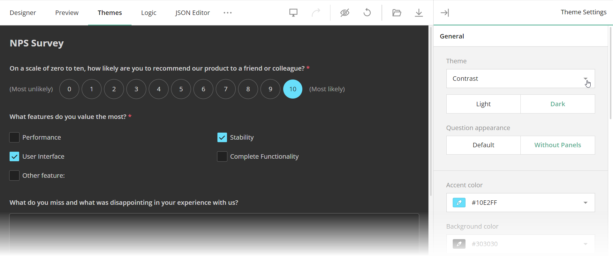

# Theme Editor

When you create a survey, you want it to look harmonious and consistent with other parts of your application. You can achieve this with Theme Editor, a tool that enables you to create and customize survey UI themes.



Theme Editor is available online in our [all-in-one demo](/create-free-survey) or as part of Survey Creator. This article describes how to enable Theme Editor in Survey Creator, apply a custom theme to your survey, and set up communication with a server to enable your users to create, apply, and switch themes in your application.

## Enable Theme Editor in Survey Creator

Theme Editor is integrated into Survey Creator as a separate tab. To display the tab, set the [`showThemeTab`](https://surveyjs.io/survey-creator/documentation/api-reference/survey-creator#showThemeTab) property to `true`:

```js
import { SurveyCreatorModel } from "survey-creator-core";
const creatorOptions = {
  // ...
  showThemeTab: true
};
const creator = new SurveyCreatorModel(creatorOptions);
```

## Apply a Custom Theme

Theme Editor produces a JSON object with CSS variables and other theme settings. For information on how to obtain this object and apply it to a survey, refer to the following help topic in Form Library documentation: [Create a Custom Theme](/form-library/documentation/manage-default-themes-and-styles#create-a-custom-theme).

If you want to apply a custom theme to a survey being configured in Survey Creator, assign the theme JSON object to `SurveyCreatorModel`'s [`theme`](/survey-creator/documentation/api-reference/survey-creator#theme) property:

```js
import { SurveyCreatorModel } from "survey-creator-core";
const creatorOptions = {
  // ...
  showThemeTab: true
};
const creator = new SurveyCreatorModel(creatorOptions);

const themeJson = { ... };
creator.theme = themeJson;
```

## Save and Load Custom Themes

Theme JSON objects can be stored on your server to let users save, share, and restore custom themes or switch between them. To save a theme JSON object, implement the `saveThemeFunc` function. It accepts two arguments:

- `saveNo`      
An incremental number of the current change. Since web services are asynchronous, you cannot guarantee that the service receives the changes in the same order as the client sends them. For example, change #11 may arrive to the server faster than change #10. In your web service code, update the storage only if you receive changes with a higher `saveNo`.

- `callback`        
A callback function. Call it and pass `saveNo` as the first argument. Set the second argument to `true` or `false` based on whether the server applied or rejected the change.

The following code shows how to use the `saveThemeFunc` function to save a survey model schema in a <a href="https://developer.mozilla.org/en-US/docs/Web/API/Window/localStorage" target="_blank">`localStorage`</a> or in your web service:

```js
import { SurveyCreatorModel } from "survey-creator-core";
const creatorOptions = {
  // ...
  showThemeTab: true
};
const creator = new SurveyCreatorModel(creatorOptions);

creator.saveThemeFunc = (saveNo, callback) => { 
  // If you use localStorage:
  window.localStorage.setItem("survey-theme-json", creator.theme);
  callback(saveNo, true);

  // If you use a web service:
  saveThemeJson(
      "https://your-web-service.com/",
      creator.theme,
      saveNo,
      callback
  );
};

// If you use a web service:
function saveThemeJson(url, json, saveNo, callback) {
  fetch(url, {
    method: 'POST',
    headers: {
      'Content-Type': 'application/json;charset=UTF-8'
    },
    body: JSON.stringify(json)
  })
  .then(response => {
    if (response.ok) {
      callback(saveNo, true);
    } else {
      callback(saveNo, false);
    }
  })
  .catch(error => {
    callback(saveNo, false);
  });
}
```

To load a theme JSON object into Theme Editor, assign the object to Survey Creator's [`theme`](https://surveyjs.io/survey-creator/documentation/api-reference/survey-creator#theme) property. The following code takes a theme JSON object from `localStorage`:

```js
creator.theme = window.localStorage.getItem("survey-theme-json");
```

You can also add UI elements that allow users to save, apply, and reuse custom themes. To implement this advanced functionality, refer to the following demo:

[View "Add Reusable Themes" Demo](https://surveyjs.io/survey-creator/examples/save-custom-theme/ (linkStyle))

## See Also

- [Themes & Styles](/form-library/documentation/manage-default-themes-and-styles)
- Save and Load Survey Model Schemas: [Angular](https://surveyjs.io/survey-creator/documentation/get-started-angular#save-and-load-survey-model-schemas) | [Vue](https://surveyjs.io/survey-creator/documentation/get-started-vue#save-and-load-survey-model-schemas) | [React](https://surveyjs.io/survey-creator/documentation/get-started-react#save-and-load-survey-model-schemas) | [Knockout / jQuery](https://surveyjs.io/survey-creator/documentation/get-started-knockout-jquery)