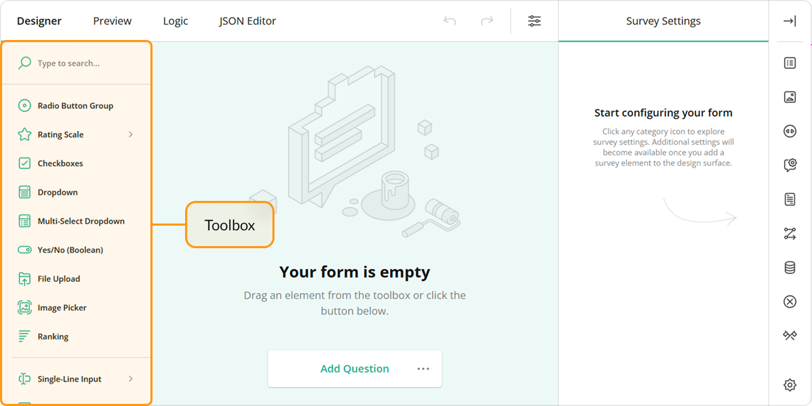

# Toolbox Customization

The Toolbox contains available question and panel types. Users can click questions and panels or drag and drop them onto the design surface to add them to the survey. This help topic describes how you can customize the Toolbox.



- [Full and Compact Modes](#full-and-compact-modes)
- [Limit Available Question and Panel Types](#limit-available-question-and-panel-types)
- [Group Toolbox Items by Categories](#group-toolbox-items-by-categories)
- [Customize Predefined Toolbox Items](#customize-predefined-toolbox-items)
- [Manage Toolbox Subitems](#manage-toolbox-subitems)
- [Add a Custom Toolbox Item](#add-a-custom-toolbox-item)

## Full and Compact Modes

The Toolbox supports full mode (illustrated above) and compact mode. In compact mode, element names are hidden. To see an individual element name, a user should move the mouse pointer over the element icon.


The Toolbox switches between the modes automatically based on available width. Specify the [`forceCompact`](https://surveyjs.io/Documentation/Survey-Creator?id=questiontoolbox#forceCompact) property if you want the Toolbox to always use a specific mode:

```js
// Compact mode
creator.toolbox.forceCompact = true;
// Full mode
creator.toolbox.forceCompact = false;
```

You can also use the [`isCompact`](https://surveyjs.io/Documentation/Survey-Creator?id=questiontoolbox#isCompact) property to find out whether the Toolbox is currently in compact mode:

```js
console.log(creator.toolbox.isCompact);
```

[View Demo](https://surveyjs.io/Examples/Survey-Creator?id=toolboxcustomization (linkStyle))

## Limit Available Question and Panel Types

All available question and panel types are listed in the [`getType()`](https://surveyjs.io/Documentation/Library?id=Question#getType) method description. If you need to show only a part of these types, specify them in the Survey Creator's [`questionTypes`](https://surveyjs.io/survey-creator/documentation/api-reference/icreatoroptions#questionTypes) array:

```js
const creatorOptions = {
    questionTypes: ["text", "checkbox", "radiogroup", "dropdown"]
};

const creator = new SurveyCreator.SurveyCreator(creatorOptions);

// In React:
import { SurveyCreator } from "survey-creator-react";
const creator = new SurveyCreator(creatorOptions);
// In other modular applications:
import { SurveyCreatorModel } from "survey-creator-core";
const creator = new SurveyCreatorModel(creatorOptions);
```

[View Demo](https://surveyjs.io/Examples/Survey-Creator?id=toolboxcustomization (linkStyle))

## Group Toolbox Items by Categories

> The compact Toolbox does not display categories.

To group Toolbox items, call the [`changeCategories()`](https://surveyjs.io/Documentation/Survey-Creator?id=questiontoolbox#changeCategories) method. It accepts an array of objects with the following fields:

- `name`        
The name of the item that should be grouped. Refer to the [`getType()`](https://surveyjs.io/Documentation/Library?id=Question#getType) method description for a list of accepted values.

- `category`      
A category for this item.

The following code places the [Panel](https://surveyjs.io/Documentation/Library?id=panelmodel) and [Panel Dynamic](https://surveyjs.io/Documentation/Library?id=questionpaneldynamicmodel) types into the Panels category and the [Matrix](https://surveyjs.io/Documentation/Library?id=questionmatrixmodel), [Matrix Dropdown](https://surveyjs.io/Documentation/Library?id=questionmatrixdropdownmodel), and [Matrix Dynamic](https://surveyjs.io/Documentation/Library?id=questionmatrixdynamicmodel) types into the Matrixes category:

```js
creator.toolbox.changeCategories([
    { name: "panel", category: "Panels" }, 
    { name: "paneldynamic", category: "Panels" }, 
    { name: "matrix", category: "Matrixes" },
    { name: "matrixdropdown", category: "Matrixes" },
    { name: "matrixdynamic", category: "Matrixes" }
]);
```

[View Demo](https://surveyjs.io/Examples/Survey-Creator?id=toolboxcategories (linkStyle))

Ungrouped items fall into the General category. You can use [localization capabilities](https://surveyjs.io/Documentation/Survey-Creator?id=localization#localize-survey-creator-ui) to change its caption. If your application does not employ modules, use the following code:

```html
<script src="https://unpkg.com/survey-creator-core/survey-creator-core.i18n.min.js"></script>
```

```js
const translations = SurveyCreatorCore.getLocaleStrings("en");
translations.toolboxCategories["general"] = "Common";
```

In modular applications, use the code below:

```js
import "survey-creator-core/survey-creator-core.i18n";
import { getLocaleStrings } from "survey-creator-core";
const translations = getLocaleStrings("en");
translations.toolboxCategories["general"] = "Common";
```

The following properties control the behavior of categories:

- [`allowExpandMultipleCategories`](https://surveyjs.io/Documentation/Survey-Creator?id=questiontoolbox#allowExpandMultipleCategories)     
Allows more than one category to be in an expanded state. If this property is `false`, when a user expands a category, other categories collapse.

- [`keepAllCategoriesExpanded`](https://surveyjs.io/Documentation/Survey-Creator?id=questiontoolbox#keepAllCategoriesExpanded)       
Expands all categories. Users cannot collapse them.

```js
creator.toolbox.allowExpandMultipleCategories = true;
creator.toolbox.keepAllCategoriesExpanded = false;
```

## Customize Predefined Toolbox Items

To customize a predefined Toolbox item, pass its [type](https://surveyjs.io/Documentation/Library?id=Question#getType) as an argument to the [`getItemByName(itemName)`](https://surveyjs.io/Documentation/Survey-Creator?id=questiontoolbox#getItemByName) method. This method returns the item's configuration object. Change the [properties of this object](https://surveyjs.io/Documentation/Survey-Creator?id=iquestiontoolboxitem) to customize the Toolbox item. For example, the following code uses the [`json`](https://surveyjs.io/Documentation/Survey-Creator?id=iquestiontoolboxitem#json) property to override predefined [choices](https://surveyjs.io/Documentation/Library?id=questiondropdownmodel#choices) for a [Dropdown](https://surveyjs.io/Documentation/Library?id=questiondropdownmodel) question:

```js
creator.toolbox
  .getItemByName("dropdown")
  .json
  .choices = [
    { text: "Option 1", value: 1 },
    { text: "Option 2", value: 2 },
    { text: "Option 3", value: 3 }
  ];
```

[View Demo](https://surveyjs.io/Examples/Survey-Creator?id=toolboxcustomization (linkStyle))

## Manage Toolbox Subitems

Toolbox items can have nested items, or "subitems". They appear when users hover over a toolbox item. Subitems help you create more specific configurations of a broader survey element type and group them. For example, the Single-Line Input toolbox item includes a number of subitems that create [Single-Line Input](https://surveyjs.io/form-library/documentation/api-reference/text-entry-question-model) questions with different [`inputType`](https://surveyjs.io/form-library/documentation/api-reference/text-entry-question-model#inputType) property values.


### Create Subitems

To create a custom subitem, pass its [configuration object](/survey-creator/documentation/api-reference/iquestiontoolboxitem) to the [`addSubitem(subitem, index)`](/survey-creator/documentation/api-reference/questiontoolboxitem#addSubitem) method. Call this method on a toolbox item instance to which you want to add the subitem. For instance, the following code adds a "Limited to 280 characters" subitem to the Long Text toolbox item:

```js
import { SurveyCreatorModel } from "survey-creator-core";
const creatorOptions = { ... };
const creator = new SurveyCreatorModel(creatorOptions);

const longTextItem = creator.toolbox.getItemByName("comment");
longTextItem.addSubitem({
    name: "limitedLongText",
    title: "Limited to 280 characters",
    json: {
        type: "comment",
        maxLength: 280
    }
});
```

[View Demo](/survey-creator/examples/manage-toolbox-subitems/ (linkStyle))

### Customize Subitems

To customize a subitem, access it by calling the [`getSubitem(name)`](/survey-creator/documentation/api-reference/questiontoolboxitem#getSubitem) method on a parent toolbox item instance. After that, you can change the subitem properties listed in the [`QuestionToolboxItem`](/survey-creator/documentation/api-reference/questiontoolboxitem) API Reference section. For example, the following code shows how to add an input mask to the Phone Number subitem that belongs to the Single-Line Input toolbox item:

```js
const singleTextInputItem = creator.toolbox.getItemByName("text");
const telSubitem = singleTextInputItem.getSubitem("tel");
telSubitem.json["maskType"] = "pattern";
telSubitem.json["maskSettings"] = { "pattern": "+1(999)999-99-99" };
```

### Remove Subitems

If you want to remove a specific subitem, call the [`removeSubitem(subitem)`](/survey-creator/documentation/api-reference/questiontoolboxitem#removeSubitem) method on a toolbox item instance. You can also remove all subitems of a toolbox item by calling the [`clearSubitems()`](/survey-creator/documentation/api-reference/questiontoolboxitem#clearSubitems) method:

```js
// Remove the Labels subitem of the Rating Scale toolbox item
const ratingScaleItem = creator.toolbox.getItemByName("rating");
ratingScaleItem.removeSubitem("labels");

// Remove all subitems of the Single-Line Input toolbox item
const singleLineInputItem = creator.toolbox.getItemByName("text");
singleLineInputItem.clearSubitems();
```

If you want to completely deactivate the subitems feature, disable the Toolbox's [`showSubitems`](/survey-creator/documentation/api-reference/questiontoolbox#showSubitems) property:

```js
creator.toolbox.showSubitems = false;
```

## Add a Custom Toolbox Item

Since the Toolbox is meant to contain question and panel types, to add a new element, you need to create a custom question or panel type. Refer to the following help topics for detailed instructions:

- [Create Specialized Question Types](https://surveyjs.io/form-library/documentation/customize-question-types/create-specialized-question-types)
- [Create Composite Question Types](https://surveyjs.io/form-library/documentation/customize-question-types/create-composite-question-types)
- [Integrate Third-Party Angular Components](https://surveyjs.io/form-library/documentation/customize-question-types/third-party-component-integration-angular)
- [Integrate Third-Party React Components](https://surveyjs.io/form-library/documentation/customize-question-types/third-party-component-integration-react)
- [Integrate Third-Party Vue 3 Components](/form-library/documentation/customize-question-types/third-party-component-integration-vue)

<!--

WE HAVEN'T COME UP WITH A VERSION FOR REACT YET

    ### Integrate Third-Party Components as Question Editors

    Survey Creator supports integration with the following third-party components out of the box:

    %LIST%

    To enable the integration with one of these components, reference or import the [surveyjs-widgets](https://github.com/surveyjs/custom-widgets) library next to the third-party component sources:

    ```html
    <script src="https://unpkg.com/surveyjs-widgets/surveyjs-widgets.min.js"></script>
    ```

    ```js
    import "survey-creator-core/survey-creator-core.i18n";
    ```

    If you did not find the desired component in the list above, refer to the following help topic for instructions on how to integrate any third-party component into Survey Creator: [Create Custom Widget](https://surveyjs.io/Documentation/Survey-Creator?id=Create-Custom-Widget).
-->

<!--  

NEW SURVEY CREATOR DOESN'T HAVE THE ADD TO TOOLBOX ADORNER YET 

    ### Save User-Defined Elements in the Toolbox

    By default, there is a “Add to Toolbox” button on an element (question/panel) in the designer. Your end-user may customize question/panel as he/she wants, add it into toolbox and then drop it on another page.

    You may go even further and persist the current Toolbox state, so the user may use these custom toolbox items for building other surveys.

    Let’s talk here about available options that you have.

    By default, a user may add only 3 elements from the designer. If there are already 3 custom/copied elements on the Toolbox, then on adding a new one, the first added element will be removed. To change the number of copied elements your user may have, you must set this property to the value you need:
    ```js
    creator.toolbox.copiedItemMaxCount = 10;
    ```
    To disable the ability of adding an element from designer into toolbox you will have to use **onElementAllowOperations** event. Here is the example:

    ```js
    creator.onElementAllowOperations.add(function(sender, options){
        options.allowAddToToolbox = false;
    });
    ```
    If you want to persist the copied items on the Toolbox for your end-user for another session or another survey, then you must use the copiedJsonText properties:

    ```js
    var savedItems = creator.toolbox.copiedJsonText; //save into localstorage or your database
    //....
    //Restored savedItems from localstorage or your database.
    creator.toolbox.copiedJsonText = savedItems;
    ```
-->
