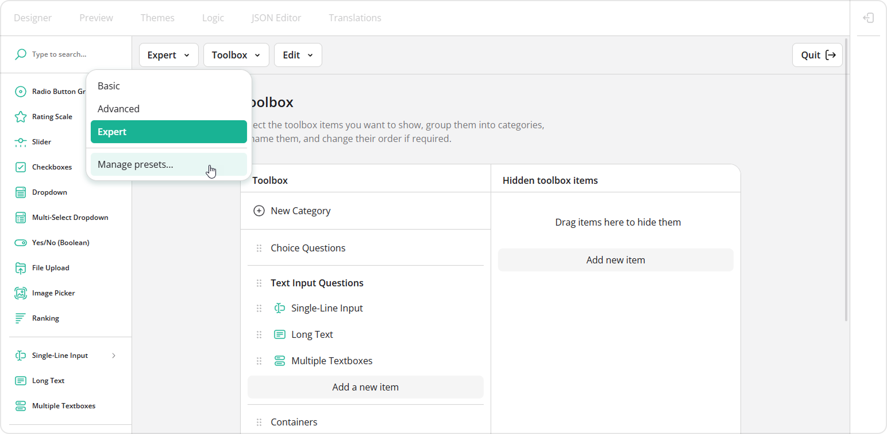
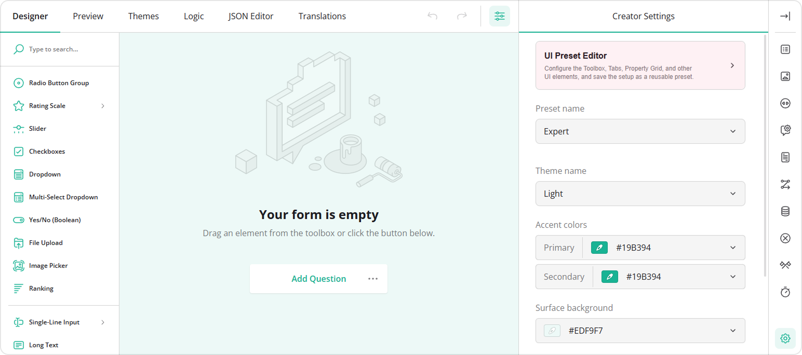
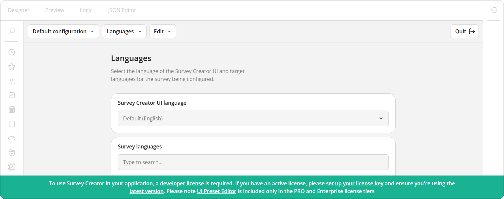
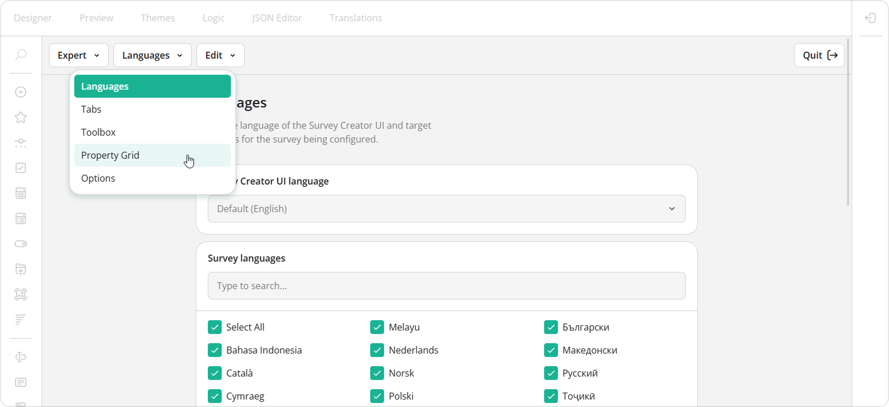

# UI Preset Editor

The **UI Preset Editor** is a configuration tool that allows you to customize the Survey Creator interface and package those changes as reusable UI presets. Presets are defined as JSON objects and can be applied when embedding Survey Creator into your application.



This help topic explains how to enable the UI Preset Editor, work with predefined presets, create and apply custom presets, and persist them in storage.

[View UI Preset Editor Demo](/survey-creator/examples/ui-preset-editor/ (linkStyle))

## Predefined UI Presets

SurveyJS provides three predefined presets&mdash;**Basic**, **Advanced**, and **Expert**&mdash;which you can use as they are or as a starting point for your own configurations.

### Basic

A streamlined preset for simple surveys and forms. It includes only the most commonly used question types and simplifies the Property Grid to reduce complexity.

[View Basic Preset Demo](/survey-creator/examples/basic-ui-preset/ (linkStyle))

### Advanced

A balanced preset suitable for most use cases. Compared to Basic, it includes additional question types and features, a moderately detailed Property Grid, and extra tabs such as Logic, Themes, and Translations.

[View Advanced Preset Demo](/survey-creator/examples/advanced-ui-preset/ (linkStyle))

### Expert

A full-featured preset that exposes all available configuration options. It includes the JSON Editor tab and provides complete control over the Property Grid and Survey Creator behavior at the cost of increased UI complexity.

[View Expert Preset Demo](/survey-creator/examples/expert-ui-preset/ (linkStyle))

## Enable the UI Preset Editor

To use the UI Preset Editor, import its module or reference its script:

```js
// Modular applications
import { UIPresetEditor } from "survey-creator-core/ui-preset-editor";
```

```html
<!-- Classic script applications -->
<head>
  <script src="https://unpkg.com/survey-creator-core/ui-preset-editor.min.js"></script>
</head>
```

To attach the editor to Survey Creator, instantiate [`UIPresetEditor`](/survey-creator/documentation/api-reference/uipreseteditor) and pass a [`SurveyCreatorModel`](/survey-creator/documentation/api-reference/survey-creator) to its constructor:

```js
// ...
// Omitted: `SurveyCreatorModel` initialization
// ...
new UIPresetEditor(creator);
```

Once initialized, the UI Preset Editor becomes available from the Creator Settings panel.



## Activate a SurveyJS License

The UI Preset Editor requires an active [commercial developer license](https://surveyjs.io/pricing). This feature is available in the **PRO** and **Enterprise** license tiers. If you are using a Basic license, you need to [upgrade](https://surveyjs.io/manage#renewals-and-upgrades) to enable and use the UI Preset Editor.

If you use the UI Preset Editor without a valid license, an alert banner appears at the bottom of the Survey Creator interface:



To remove the banner, activate your license:

1. [Log in](https://surveyjs.io/login) to the SurveyJS website using your email address and password. If you've forgotten your password, [request a reset](https://surveyjs.io/reset-password) and check your inbox for the reset link.
2. Open the following page: [How to Remove the Alert Banner](https://surveyjs.io/remove-alert-banner). You can also access it by clicking **Set up your license key** in the alert banner itself.
3. Follow the instructions on that page.

Once you've completed the setup correctly, the alert banner will no longer appear.

## Register Predefined Presets

Before using predefined presets in the editor, register them:

```js
// Modular applications
import SurveyCreatorUIPreset from "survey-creator-core/ui-presets";
import { registerUIPreset } from "survey-creator-core";

registerUIPreset(SurveyCreatorUIPreset);
```

```html
<!-- Classic script applications -->
<script src="https://unpkg.com/survey-creator-core/ui-presets/index.min.js"></script>
<script>
  SurveyCreatorCore.registerUIPreset(SurveyCreatorUIPreset);
</script>
```

Once registered, these presets can serve as a starting point for customization.

## Create a Custom Preset

A UI preset is composed of configuration across the following categories:

- Languages         
Define the Survey Creator UI language and supported survey languages.

- Tabs      
Control which tabs are visible (Designer, Preview, Logic, Themes, Translations, JSON Editor) as well as their order, titles, icons, and default active tab.

- Toolbox           
Show, hide, rename, reorder, and group toolbox items.

- Property Grid         
Configure property visibility, grouping, order, and display names.

- Options           
Adjust additional settings that affect overall behavior and appearance.



You can modify these settings visually in the editor and export the resulting configuration as a JSON object.

## Apply a UI Preset

To apply a preset (predefined or custom), create a [`UIPreset`](/survey-creator/documentation/api-reference/uipreset) instance with a JSON configuration and call [`applyTo()`](/survey-creator/documentation/api-reference/uipreset#applyTo):

```js
// Modular applications
import { UIPreset } from "survey-creator-core";

// ...
// Omitted: `SurveyCreatorModel` initialization
// ...
const presetJson = { /* Preset configuration */ };

const preset = new UIPreset(presetJson);
preset.applyTo(creator);
```

```html
<!-- Classic script applications -->
<script>
  // ...
  // Omitted: `SurveyCreatorModel` initialization
  // ...
  const presetJson = { /* Preset configuration */ };

  const preset = new SurveyCreatorCore.UIPreset(presetJson);
  preset.applyTo(creator);
</script>
```

> The UI Preset Editor is not required to apply presets. It is only needed if you want to create or edit them visually.

## Configure Themes and Translations

The **Advanced** and **Expert** presets enable the [Themes](/survey-creator/documentation/end-user-guide/user-interface#themes-tab) and [Translations](/survey-creator/documentation/end-user-guide/user-interface#translation-tab) tabs. These features require additional setup.

### Themes Tab

To make predefined themes available for customization, register them:

```js
// Modular applications
import SurveyTheme from "survey-core/themes";
import { registerSurveyTheme } from "survey-creator-core";

registerSurveyTheme(SurveyTheme);
```

```html
<!-- Classic script applications -->
<script src="https://unpkg.com/survey-core/themes/index.min.js"></script>
<script>
  SurveyCreatorCore.registerSurveyTheme(SurveyTheme);
</script>
```

This allows users to create, import, and export custom themes as JSON. To enable saving custom themes to a database or another storage, refer to the following topic:

[Save and Load Custom Themes](/survey-creator/documentation/theme-editor#save-and-load-custom-themes (linkStyle))

### Translations Tab

To enable localization, load localization dictionaries:

```js
// Modular applications
// Option 1: All languages
import "survey-core/survey.i18n";

// Option 2: Individual languages
import "survey-core/i18n/french";
import "survey-core/i18n/german";
import "survey-core/i18n/italian";
```

```html
<!-- Classic script applications -->
<!-- Option 1: All languages -->
<script src="https://unpkg.com/survey-core/survey.i18n.min.js"></script>

<!-- Option 2: Individual languages -->
<script src="https://unpkg.com/survey-core/i18n/french.min.js"></script>
<script src="https://unpkg.com/survey-core/i18n/german.min.js"></script>
<script src="https://unpkg.com/survey-core/i18n/italian.min.js"></script>
```

[Localization and Globalization](/survey-creator/documentation/survey-localization-translate-surveys-to-different-languages (linkStyle))

## Save and Load Custom Presets

Preset configurations are plain JSON objects and can be persisted in storage (for example, a database or browser storage).

To enable saving, implement the [`savePresetFunc`](/survey-creator/documentation/api-reference/uipreseteditor#savePresetFunc) function, which accepts two arguments:

- `saveNo`      
An incremental change identifier. Use it to prevent out-of-order updates in asynchronous environments.

- `callback`        
Invoke this function after saving. Pass `saveNo` as the first argument. Pass `true` as the second argument if the operation succeeds; otherwise, pass `false`.

### Example: Save to `localStorage`

```js
import { UIPresetEditor } from "survey-creator-core/ui-preset-editor";
// ...
// Omitted: `SurveyCreatorModel` initialization
// ...

const presetEditor = new UIPresetEditor(creator);
const localStorageKey = "survey-creator-presets";

// Load existing presets
const savedPresets = JSON.parse(localStorage.getItem(localStorageKey)) || [];
savedPresets.forEach(p => presetEditor.addPreset(p));

// Save handler
presetEditor.savePresetFunc = (saveNo, callback) => {
  const newPreset = presetEditor.preset;
  const presets = JSON.parse(localStorage.getItem(localStorageKey)) || [];

  const index = presets.findIndex(p => p.name === newPreset.name);
  if (index > -1) {
    presets[index] = newPreset;
  } else {
    presets.push(newPreset);
  }
  localStorage.setItem(localStorageKey, JSON.stringify(presets));
  callback(saveNo, true);
};
```

### Example: Save to a Web Service

```js
import { UIPresetEditor } from "survey-creator-core/ui-preset-editor";
// ...
// Omitted: `SurveyCreatorModel` initialization
// ...

const presetEditor = new UIPresetEditor(creator);

// Load existing presets
async function loadPresets(url) {
  try {
    const response = await fetch(url);
    const data = await response.json();
    return data;
  } catch {
    console.log("Could not load presets");
    return [];
  }
}

loadPresets("https://your-web-service.com/")
  .then(presets => {
    presets.forEach(p => presetEditor.addPreset(p));
  });

// Save handler
function savePresetJson(url, json, saveNo, callback) {
  fetch(url, {
    method: "POST",
    headers: {
      "Content-Type": "application/json;charset=UTF-8"
    },
    body: JSON.stringify(json)
  })
    .then(response => callback(saveNo, response.ok))
    .catch(() => callback(saveNo, false));
}

presetEditor.savePresetFunc = (saveNo, callback) => {
  savePresetJson(
    "https://your-web-service.com/",
    presetEditor.preset,
    saveNo,
    callback
  );
};
```

[View UI Preset Editor Demo](/survey-creator/examples/ui-preset-editor/ (linkStyle))